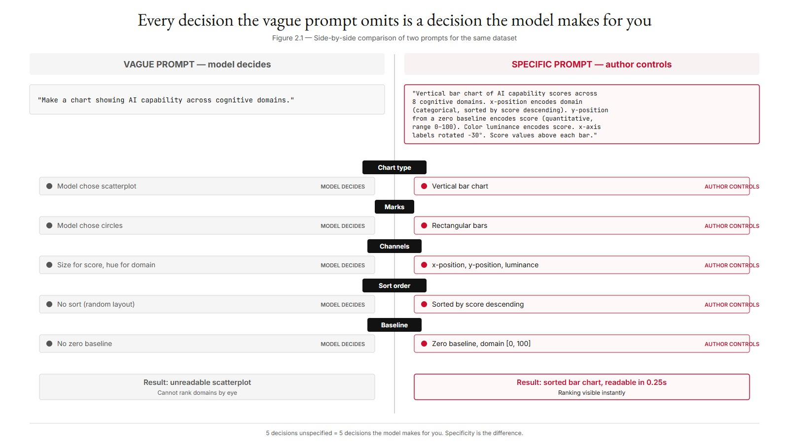
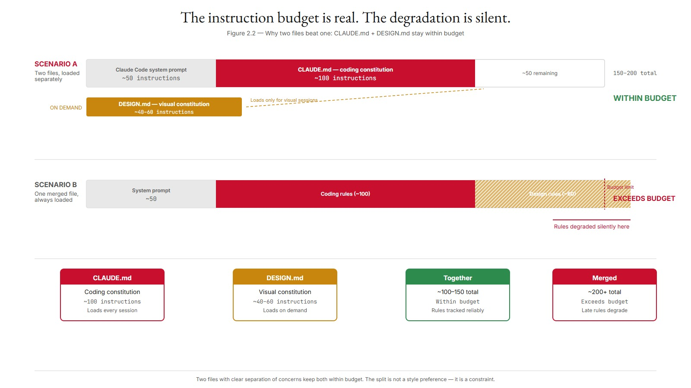
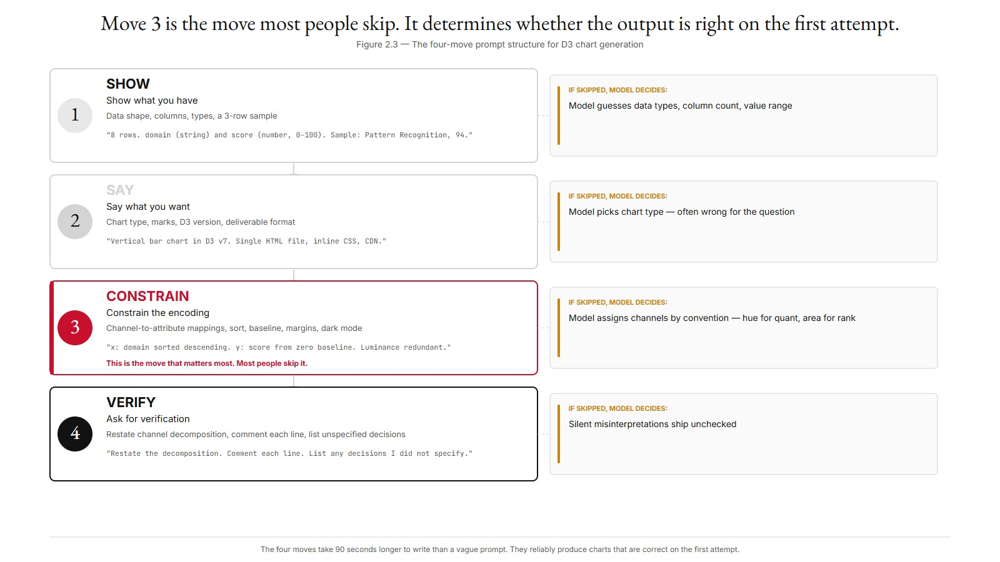
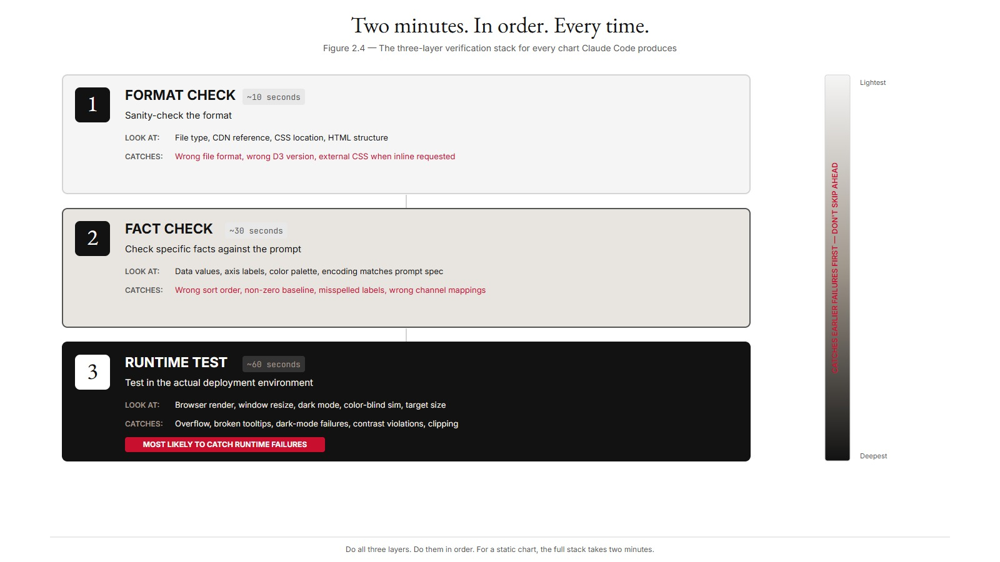
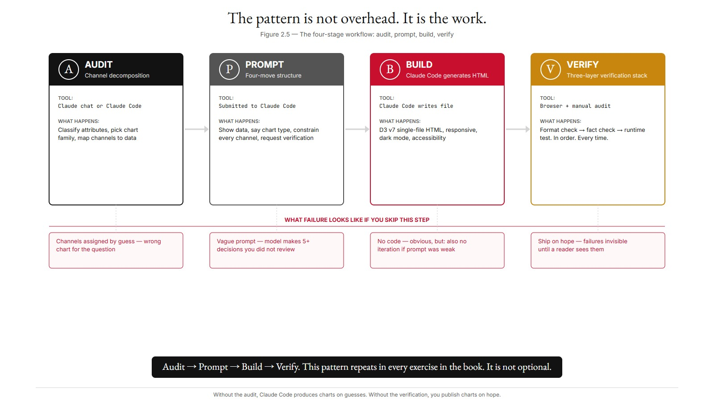
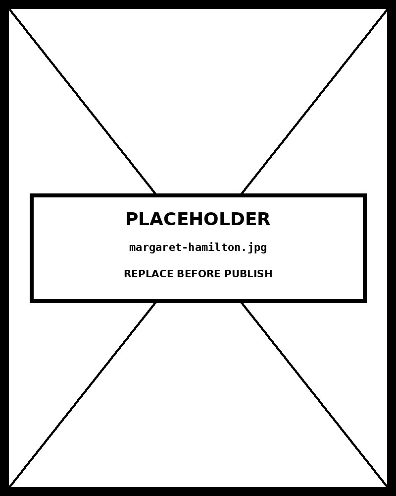

# Chapter 02 — Claude Basics for D3 Visualization

*The gap between "make a chart" and "make the chart" is the whole problem.*

---

It is 2:14 PM. You have eight numbers — cognitive domain scores, 0 to 100. Your colleague needs a chart by 3:30. You open Claude Code and type:

> "Make a chart showing AI capability across cognitive domains."

Claude Code returns a working D3 visualization in about four seconds. It is a scatterplot. Each cognitive domain is a colored circle floating in a square frame. The scores are encoded by circle size. The domains are distinguished by hue. The chart is technically a chart. You cannot read it.

You try to rank the domains by eye. You can't. Size is a terrible channel for ranking — the human visual system handles position well and area badly. The colors require staring at a legend. The spatial layout communicates nothing at all. You have a chart. You do not have information.

You write a different prompt:

> "Vertical bar chart of AI capability scores across 8 cognitive domains. x-position encodes domain (categorical, sorted by score descending). y-position from a zero baseline encodes score (quantitative, range 0–100). Color luminance encodes score as a redundant sequential encoding. x-axis labels rotated -30°. Score values shown above each bar. D3 v7, single HTML file, responsive."

Claude Code returns a working bar chart, sorted, annotated, on a zero baseline, with redundant luminance, in 60 lines of D3. You read the ranking in a quarter-second. You send it to your colleague at 2:18.

<!-- → [INFOGRAPHIC: side-by-side comparison of the two prompts — left column is the vague prompt with annotations flagging each decision Claude Code had to make on its own (chart type, marks, channels, sort order, baseline); right column is the specific prompt with the same decision points labeled as author-controlled. Caption: "Every decision the vague prompt omits is a decision the model makes for you."] -->



The difference between those two prompts is not length, and it is not politeness. It is **specificity**. The first prompt told Claude Code to make a chart. The second told Claude Code *which* chart, *which* marks, *which* channels, *which* constraints. The model did not decide these things. You did.

That gap — between letting the model decide and deciding yourself — is the entire subject of this chapter. The rest of the book gives you the vocabulary to close it for every chart type, every dataset, every communication goal. This chapter teaches you the machinery that makes the vocabulary useful.

---

## Where Claude lives

Claude runs in several products. They all use the same underlying model, but they differ in what they can see and what they can do. For D3 work, the distinctions matter.

**Claude Code** is a command-line interface where Claude can read files in your project directory, write new ones, execute shell commands, and iterate. This is the right tool for building charts. D3 produces files — HTML, JS, CSS — and Claude Code can read your project's reference examples, write new chart files, and revise them without you copying and pasting anything. Most exercises in this book assume Claude Code.

**Claude.ai chat** (web or desktop) is the universal interface. It has no file-system access. Everything you want Claude to see, you paste. For a one-off question — "does a Sankey diagram make sense for this dataset?" — that is fine. For a workflow that produces a dozen charts across multiple sessions, it becomes friction fast.

**Claude Projects** is a feature inside Claude.ai that gives you a persistent context — reference files you attach once stay in scope for every conversation in that project. Useful if you are working in chat and want your channel framework, your design constitution, or your worked examples available without pasting them every time.

**Cowork** is a Claude desktop feature with supervised access to your file system. It handles multi-step file workflows well: read data from a CSV, generate a chart HTML, save the result. For single-file D3 chart generation, Claude Code is faster.

The general rule is simple: if the task produces a file, use Claude Code. If the task produces a conversation, use Claude chat. If the task spans files across many sessions, use a Project.

| Product | File-system access | Persistent context | Best for | Typical D3 use case |
|---|---|---|---|---|
| Claude Code | Yes | Yes (in project memory) | Building, iterating, and shipping chart code | Generating `chart.html` from a CSV, watching it render, asking for the next revision |
| Claude.ai (web) | No | No (per conversation) | Sketching prompts and explaining concepts | Drafting a four-move prompt before pasting it into Claude Code |
| Claude in Chrome | Page DOM only | No | Inspecting an existing chart on the web | Asking "what's wrong with this chart?" while looking at it |
| Claude API | Whatever you wire up | Whatever you persist | Programmatic pipelines — batch chart generation, build scripts | Generating 50 small multiples from a script |
---

## The instruction budget, and why two files beat one

Here is something most people don't know when they first start working with Claude Code: every session begins with a hidden cost you don't control.

Claude Code loads its own system prompt at the start of every session — Anthropic's instructions about how to behave as a coding agent. That system prompt consumes approximately 50 of the roughly 150–200 behavioral rules the model can reliably track at once. Think of it as a budget. You don't see the first 50 line items. You only get to spend the rest.

This has a direct consequence for how you design your session context.

A `CLAUDE.md` that runs to 400 lines — D3 version rules, naming conventions, a 20-color palette with hex values, spacing scale, dark-mode behavior, voice and tone guidance, typography stack, responsive breakpoints, component rules for cards and shadows — is a file that exceeds the remaining budget. The later rules don't vanish. But they degrade. Claude Code holds the first hundred instructions clearly; the ones that appear later are tracked with decreasing reliability. The degradation is silent. You won't get an error. You'll get a chart that almost follows the rules.

The solution is not to write a shorter `CLAUDE.md`. It is to recognize that not everything belongs in `CLAUDE.md` in the first place.

**`CLAUDE.md` is your coding constitution.** It contains everything that governs how code gets written: D3 version policy, naming conventions for SVG IDs and CSS classes, what Claude Code must not do without explicit instruction, the prompt structure you use for every chart, accessibility standards, transition vocabulary. These rules apply to every session. Load them every session.

**`DESIGN.md` is your visual constitution.** It contains everything the designer needs and the coder doesn't: the color palette with hex values and semantic roles, the typography stack, the spacing scale, dark-mode palette behavior, responsive breakpoints, component rules. For most chart-building sessions — the ones about scales, data joins, axis ticks, transitions — these rules are irrelevant. Loading them wastes 40–60 instruction slots on constraints that don't apply to the work at hand.

`DESIGN.md` loads on demand. When a session involves visual design decisions — picking a palette for a new series, specifying dark-mode behavior for a dashboard, reviewing whether a chart's type treatment matches the site's typography — you load it explicitly. When a session is about whether `.join()` is the right pattern for this data update, you don't.

```
CLAUDE.md     → loads every session
DESIGN.md     → loads when visual decisions are in scope

Together:  ~100–150 instructions, within budget.
Merged:    ~200+ instructions, budget exceeded, later rules degraded.
```

<!-- → [INFOGRAPHIC: horizontal budget bar — total bar represents 150–200 instructions; first segment (~50) labeled "Claude Code system prompt (not yours)"; second segment (~100) labeled "CLAUDE.md — coding constitution"; third segment shown in a separate bar representing DESIGN.md loading on demand. A second version of the bar shows the merged-file scenario where the bar overflows, with the overflow zone hatched and labeled "rules degraded silently here." Caption: "The instruction budget is real. The degradation is silent."] -->



Two files with clear separation of concerns keep both within budget. That is the reason for the split. It is not a style preference.

---

## The four-move prompt

The single highest-leverage thing this chapter teaches is a prompt structure with four parts. They do not have to be separate paragraphs. But every good D3 prompt hits all four.

**Move 1: Show what you have.**

Paste the data structure. Name the columns and their types. If you have a sample, paste a few rows. If the data is in a file Claude Code can read, name the file.

> "Eight rows. Each row has `domain` (string, 12–17 characters) and `score` (number, 0–100). Sample: Pattern Recognition, 94 / Language, 87 / Memory Retrieval, 96."

**Move 2: Say what you want.**

Name the chart type. Name the marks. Specify the D3 version. Specify the deliverable format — single HTML file, ES module, React component, Observable cell.

> "Vertical bar chart in D3 v7. Single HTML file with inline CSS and inline D3 loaded via CDN. Responsive to window resize."

**Move 3: Constrain it.**

This is the move most people skip, and it is the one that determines whether the output is right on the first attempt. Name the channel-to-attribute mappings. Name the design constraints. Name the layout. Name the accessibility decisions.

> - x-position: domain (categorical, sorted by score descending).
> - y-position from zero baseline: score (quantitative, range 0–100). Zero baseline non-negotiable.
> - Color luminance redundantly encoding score, sequential pale-to-dark.
> - y-axis ticks at 0, 25, 50, 75, 100.
> - x-axis labels rotated -30°.
> - Score value text above each bar.
> - Margins: top 60, right 40, bottom 80, left 60.
> - Dark mode support via `prefers-color-scheme` media query.

**Move 4: Ask for verification.**

Request reasoning. Ask Claude Code to restate what it understood before writing any code. Ask for the channel decomposition to be commented in the output. Ask for any unspecified decisions to be flagged so you can confirm or override them.

> "Before writing the code, restate the channel decomposition in your own words to confirm. Then write the D3 v7 code with comments showing which line implements which channel. After the code, list any decisions you made that are not specified above so I can confirm or override them."

The four moves take perhaps 90 seconds longer to write than a vague prompt. They reliably produce charts that are correct on the first attempt. The 90 seconds is not overhead. It is the work.

<!-- → [INFOGRAPHIC: four-panel vertical flow diagram — one panel per move, each labeled with the move name (Show / Say / Constrain / Verify), a one-line description of what it contributes, and a short example line pulled from the cognitive domain prompt. Arrows connecting panels downward. A "what Claude decides without this move" callout on the right side of each panel showing what gets left to the model if the move is skipped. Caption: "Move 3 is the move most people skip. It is also the one that determines whether the output is right on the first attempt."] -->



### Three notes specific to D3

**Always specify the D3 version.** D3 v3 (2013), v4 (2016), v5 (2018), v6 (2020), and v7 (2021) have substantial syntactic differences. Left ambiguous, Claude Code produces code that mixes versions. The result runs in neither environment cleanly. Default to v7. If you are in a project with a pinned older version, name it: "D3 v6 syntax, no v7-only methods."

**Specify the rendering target.** A self-contained HTML file, an ES module that exports a render function, a React component, an Observable cell — each requires different surrounding structure. The D3 itself may be identical; the boilerplate is not. Name the target.

**Name the data-loading method.** Inline data, CSV from a URL, JSON from a file — each requires different boilerplate. If the dataset is small (the cognitive domain example fits in three lines), inline is simplest. If the data is large or live, specify the method.

---

## Three failure modes

Generic AI failure modes apply to D3 work as they do to any domain. Three failure modes are specific enough to D3 that they deserve names.

### API hallucination

Claude Code occasionally produces D3 syntax that does not exist in the version you are targeting.

Common forms: mixing v6 and v7 syntax in the same file; invoking a method like `d3.interpolateMagical` that is not an exported function; using pre-v6 enter-update-exit patterns alongside the v6+ `.join()` shorthand. The code looks plausible. The error appears at runtime: `d3.interpolateMagical is not a function`.

The fix is to specify the D3 version explicitly, read the generated code's CDN reference to confirm it, and run the output before accepting it. When errors appear, paste the error back to Claude Code with the version reminder.

### Chart-type mismatch

Claude Code chooses a chart that is technically valid for the data but does not answer the communication question.

The communication question implies a ranking; Claude Code returns a scatterplot. The data is part-to-whole; Claude Code returns a grouped bar chart that loses the proportion. The data is hierarchical with irregular depth; Claude Code returns a treemap that assumes regular depth.

The fix is to name the chart type in Move 2. Do not let Claude Code choose. The selection framework in this book gives you the vocabulary to commit to a type before the prompt runs. Once the type is named, the model becomes much more reliable.

### Channel mismatch

Claude Code encodes a quantitative attribute on an identity channel, or an identity attribute on a channel that implies order.

A scatterplot where hue encodes a third quantitative variable. The reader cannot rank by hue; comparison is only categorical. A bar chart where sequential color gradient is applied to category labels that have no inherent order. A choropleth where hue (rather than luminance) encodes a sequential variable. Hue has no inherent ordering; the reader cannot rank states by hue alone.

The fix is to specify the channel-to-attribute mapping explicitly in Move 3. When Claude Code produces the chart, audit it: is the mapping what the prompt specified? If not, the follow-up prompt names the channel-theory violation directly.

| Failure mode | What it looks like in the output | The prompt move that prevents it | Example of the fix |
|---|---|---|---|
| API hallucination | Code calls `d3.scale.linear()` (v3 syntax) or invents methods that don't exist | Pin the version explicitly in Move 3 (Constrain it) | "Use D3 v7 syntax only — no v3 or v4 API calls." |
| Chart-type mismatch | Pie chart for 14 categories, line chart for unordered groups | Name the chart type explicitly in Move 2 (Say what you want), not the category | "A horizontal bar chart, sorted descending — not 'a comparison chart.'" |
| Channel mismatch | Hue encoding a quantitative variable, area encoding when length would work | Specify channel-to-attribute mappings as bullets in Move 3 | "Map: x = sector, y = funding amount (position, not area). Color: single hue, no scale." |
---

## Multi-LLM comparison

One specific use case is worth naming: comparing responses across different models.

The major systems you likely have access to are Claude (Anthropic), ChatGPT (OpenAI), and Gemini (Google). On most chart-generation tasks, their outputs converge — same channels, similar D3, comparable accessibility decisions. They differ in characteristic ways:

Claude tends toward more cautious framings and more explicit acknowledgment of uncertainty. Asked "what chart should I use here," Claude often offers two candidates and the criteria for choosing between them.

ChatGPT tends toward more confident framings, sometimes recommending a chart type without naming the trade-offs.

These tendencies shift as the systems are updated. The point is not to identify the best model — the best one is the one that produces the chart you want for your task — but to use the differences strategically.

The productive use of multi-LLM comparison is **targeted**. When a model gives you a response that seems suspiciously confident, or that skips considerations you expected, ask another model the same question. Where they agree, the answer is more likely well-grounded. Where they disagree, you have identified a question worth investigating yourself.

Two cases where this is high-leverage for D3 work specifically:

**Chart selection.** Models sometimes anchor on the most familiar form rather than the best one. Asking two or three models reveals when one anchored differently. The variation flags genuine choice points the single-model answer would have hidden.

**Accessibility decisions.** Color palette choices, ARIA labeling, focus states, color-blind safety — different models prioritize these differently. Comparing outputs surfaces decisions you might not have considered.

For routine chart-building, single-model use is fine. Save the comparison for moments when the choice is genuinely contestable.

---

## The verification stack

Every chart Claude Code produces gets three checks before you ship it.

**Layer 1: Sanity-check the format.** You asked for a single HTML file. Did you get one? You asked for D3 v7. Does the CDN reference say v7? You asked for inline CSS. Is the CSS inline? Format check takes ten seconds and catches the obvious mistakes.

**Layer 2: Check specific facts.** The data values in the chart match the data values you provided. The axis labels are spelled correctly. The color palette uses the colors you specified. The encoding matches what the prompt specified — sort descending, zero baseline, luminance for score rather than hue. Layer 2 is reading the chart against the prompt.

**Layer 3: Test the work.** Open the HTML in a browser. Resize the window. Switch to dark mode. Run the chart through a color-blind simulator. Read it at the size it will actually be deployed — dashboard tile, full-screen presentation, mobile. Layer 3 catches the failures the prompt didn't anticipate.

Do all three layers. Do them in order. For a static chart, the full stack takes two minutes. It prevents you from publishing the chart that looked fine in the terminal and broke at the size your reader actually saw it.

<!-- → [INFOGRAPHIC: three-layer vertical stack diagram — Layer 1 at top (lightest shade), Layer 2 middle, Layer 3 at bottom (darkest shade, labeled "most likely to catch runtime failures"). Each layer shows: the check name, what you look at, what it catches, and approximate time. An arrow on the right side reads "catches earlier failures first; don't skip ahead." Caption: "Two minutes. In order. Every time."] -->



The opening example from this chapter is the failure mode in miniature. The scatterplot with circle-size encoding would have passed Layer 1 — you asked for a chart and got a chart. Layer 2 would have caught it if the prompt had specified the channels — the mapping (size for score, hue for domain) would not have matched what a correct prompt specified. Layer 3 would have confirmed it — opening the chart in a browser and trying to read the ranking makes the failure obvious in two seconds.

---

## A worked example

Take the LLM Exercise in this chapter as a reference workflow. It asks you to produce two session-context files and a worked example of your default process. Here is how to move through it.

**Step 1: Open Claude Code in your project directory.** The deliverables are files. File-system access is the right tool.

**Step 2: Submit the audit prompt for the cognitive domain dataset.**

```
I have a dataset of 8 cognitive domains and a quantitative AI capability
score per domain (0–100). The communication goal is: which cognitive
domains have the largest AI capability gaps?

Walk me through the marks-and-channels analysis using the
Bertin / Cleveland & McGill / Munzner framework:

1. Identify each data attribute and classify as categorical, ordered,
   or quantitative.
2. Identify the most important attribute given the communication goal.
3. Recommend a chart type by applying Munzner's expressiveness and
   effectiveness principles.
4. Specify the marks and channel-to-attribute mappings precisely enough
   that the chart could be built from the specification alone.
5. Flag any channel used redundantly. Justify the redundancy.

Then write a single Claude Code prompt for the chart following the
four-move structure.
```

**Step 3: Read the audit.** Claude Code returns a channel decomposition. Confirm it matches what Chapter 1 established: score is quantitative and belongs on position; domain is categorical and x-position is appropriate; color luminance can redundantly encode score; hue should not encode score. If anything is wrong, push back directly: "The audit recommends color hue for score. Score is quantitative; hue is an identity channel. Revise."

**Step 4: Take the four-move prompt the audit produces and submit it.** Claude Code returns an HTML file with the chart.

**Step 5: Run the verification stack.** Format check. Fact check. Browser test. If all three pass, save the chart. If anything fails, write the follow-up prompt naming the specific failure — which failure mode, which channel-theory principle it violates, what the correction is.

This pattern — audit, prompt, build, verify — repeats in every exercise in the book. It is not optional. It is the discipline that makes the model reliably useful for chart work. Without the audit, Claude Code produces charts on guesses. Without the verification, you publish charts on hope.

<!-- → [INFOGRAPHIC: horizontal workflow diagram — four boxes connected by arrows: Audit (channel decomposition in Claude chat) → Prompt (four-move structure, submitted to Claude Code) → Build (Claude Code generates HTML) → Verify (three-layer stack). Below each box, a one-line note on what failure looks like if you skip that step. Caption: "The pattern is not overhead. It is the work."] -->



---

## What you can now do

You know which Claude product to reach for when: Claude Code when the task produces a file, chat when the task produces a conversation, a Project when the context spans many sessions.

You know why two session-context files beat one — the instruction budget is real, and coding decisions and design decisions belong in separate documents that load separately.

You know the four-move prompt structure and why Move 3 (the channel-to-attribute constraint) is the move that determines whether the output is right on the first attempt.

You know the three failure modes specific to D3 generation — API hallucination, chart-type mismatch, channel mismatch — and the specific follow-up prompt pattern that fixes each.

You know how to use multi-LLM comparison strategically: targeted, at moments of genuine contestability, not as a default workflow.

And you know the three-layer verification stack: format, facts, test. In that order. Every time.

The thing to watch for, going forward, is the temptation to skip the verification. Claude Code produces fluent, confident-looking output. The output is sometimes wrong in ways that are invisible until the chart is in front of a reader. The stack is what closes the gap between "Claude Code generated something" and "I am confident in shipping this."

The book's remaining chapters give you the vocabulary to write Move 3 with precision — one chart type at a time, one channel decision at a time. The machinery for using that vocabulary is what you just learned.

---

## Exercises

### Warm-up

**Exercise 2.1 — Tool choice.** *(Tests: choosing the right Claude product)*
For each task below, name the right Claude product and justify the choice in one sentence:
- You want to ask whether a Sankey diagram is appropriate for a dataset you describe in words.
- You are building 15 charts across a semester-long project, each in its own HTML file.
- You need Claude to read a published chart on a webpage and critique its encoding decisions.
- You want to generate a single bar chart from data you can describe in three lines.

**Exercise 2.2 — Vague to specific.** *(Tests: four-move prompt structure)*
Take this vague prompt: "Make a line chart of monthly sales over two years." Rewrite it using the four-move structure. Your revision must specify: chart type and orientation, channel-to-attribute mappings for at least two attributes, sort or time ordering, axis tick density, a zero-baseline decision with justification, and a verification request. Aim for 150–200 words.

**Exercise 2.3 — Failure mode identification.** *(Tests: diagnosing channel mismatch)*
Claude Code produces a choropleth map where US states are colored using hue (red through violet) to encode median household income. Name the failure mode. Explain why it is a failure using channel theory. Specify the corrected encoding and the exact sentence you would add to Move 3 to prevent it.

### Application

**Exercise 2.4 — Build with the four-move structure.** *(Tests: four-move prompt structure + verification stack)*
Take a real dataset you work with. Write a four-move Claude Code prompt for a chart of it. Submit it to Claude Code. Run the three-layer verification stack. Hand in: the prompt, the output HTML, and a verification log noting what each layer found.

**Exercise 2.5 — Diagnose a failure.** *(Tests: API hallucination + verification)*
Ask Claude Code to generate a D3 v7 bar chart, then inspect the output without running it. List every method call that touches the D3 API. For each, confirm whether it exists in D3 v7 (the reference is the d3js.org API docs). Flag any that are hallucinated or version-mismatched. Write the follow-up prompt that fixes the issues you found.

**Exercise 2.6 — CLAUDE.md budget audit.** *(Tests: instruction budget reasoning)*
Obtain or draft a `CLAUDE.md` that is longer than 150 lines — either by finding one online or by merging coding and design rules into a single file. Identify which rules appear after line 100. Classify each as belonging in `CLAUDE.md` (coding decision) or `DESIGN.md` (visual decision). Produce the trimmed `CLAUDE.md` and the separated `DESIGN.md`.

### Synthesis

**Exercise 2.7 — Multi-LLM comparison on chart selection.** *(Tests: targeted multi-LLM comparison)*
Pick a dataset where the right chart type is genuinely contestable — part-to-whole data that could be a pie chart, a stacked bar, or a treemap, for instance. Submit the chart-selection question to Claude, ChatGPT, and Gemini. Document: which type each recommends, the reasoning each offers, and where they disagree. Write a one-paragraph conclusion: given the disagreement, which type do you choose and why?

**Exercise 2.8 — Iterate to convergence.** *(Tests: failure mode diagnosis + follow-up prompting)*
Take any Claude Code output for a D3 chart that has at least one failure — API hallucination, chart-type mismatch, or channel mismatch. Write the follow-up prompt that names the specific failure mode, cites the channel-theory principle it violates, and specifies the correction. Iterate until the verification stack passes all three layers. Hand in the full prompt sequence and the final chart.

### Challenge

**Exercise 2.9 — Build your two-file session context.** *(Tests: CLAUDE.md + DESIGN.md design, instruction budget)*
Use the LLM Exercise prompts in this chapter to produce your own `CLAUDE.md` and `DESIGN.md`. Then stress-test the budget claim: load the merged version of both files into a Claude Code session and ask it to generate a chart with a rule from the second half of the merged file. Then load them separately and repeat the same request. Document any difference in how reliably the late-file rule was followed. Explain what you observed in terms of the instruction budget.

**Exercise 2.10 — Write the audit for someone else's chart.** *(Tests: all five concepts)*
Find a chart published in a recent data journalism piece, dashboard, or research paper. Apply the full workflow: channel decomposition, failure mode diagnosis (name any present), and a four-move Claude Code prompt that would reproduce it correctly. Then run the prompt and compare the output to the original. What did Claude Code get right without being told? What did it get wrong? What does the difference reveal about the gap between letting the model decide and deciding yourself?

---

## A note about AI

The basics chapter teaches the foundational moves of working with Claude on D3. The note examines what the basics make harder to notice.

Where the model genuinely helps: producing working D3 boilerplate for a target chart type and explaining the choices it made. The explanation is useful even when the boilerplate is generic.

Where the model does damage: producing code that looks correct and is subtly wrong — wrong scale, wrong axis orientation, wrong data join. The subtlety is what makes the failure mode dangerous.

The rule: read every line of model-generated D3 code before you trust the chart it produces.

---

## LLM Exercise — Chapter 02: Building your prompting practice

**What you're building:** Two files — your `CLAUDE.md` (coding constitution) and your `DESIGN.md` (visual constitution) — that travel with you across every chapter of this book and every D3 project beyond it. Plus a worked example showing your default workflow.

**Tool:** Claude Code (recommended) or Claude chat with a Claude Project for the persistent context.

### Why two files, not one

`CLAUDE.md` loads every session. `DESIGN.md` loads when visual decisions are in scope. They are separate because the LLM instruction budget is real: Claude Code's own system prompt consumes roughly 50 of the ~150–200 instructions available per session. A single merged file containing both coding rules and design system specifications will exceed the remaining budget, and the rules that appear after the first ~100 lines will be tracked less reliably. Two focused files keep each within budget. For most chart-building sessions (scales, joins, transitions), the design system is irrelevant; loading it wastes instructions on rules that don't apply.

### Part 1 — The prompt for `CLAUDE.md`

```
I am working through the Brutalist d3 x Claude book. Help me draft
my CLAUDE.md — the coding constitution I will reference at the start
of every Claude Code D3 session.

CLAUDE.md governs coding decisions only. Design decisions (palette,
typography, spacing, dark-mode, responsive behavior) belong in a
separate DESIGN.md and should NOT appear here.

Walk me through the sections it should contain:

1. D3 version policy (default; legacy projects).
2. Naming conventions for SVG IDs and CSS classes (chart-{type}-{n}
   pattern, or whatever I prefer, with justification).
3. Easing and transition vocabulary: which D3 curve names map to which
   visual behaviors.
4. Accessibility standards: ARIA labels, focus states, color-blind
   safety, minimum contrast ratios.
5. What Claude Code must NOT do without explicit instruction (no
   modifying existing charts; no encoding decisions without the
   specification; no chart-type substitutions).
6. The four-move prompt template I will use for every chart.

For each section, recommend defaults appropriate to the kind of work
described in the book. Where I should make a personal choice, name
the choice and the trade-offs. Keep the file under 150 lines total —
if a decision belongs in DESIGN.md, flag it rather than include it.

Save the document as CLAUDE.md.
```

### Part 2 — The prompt for `DESIGN.md`

```
Now help me draft my DESIGN.md — the visual constitution I will
reference when a Claude Code session involves design decisions:
palette, type, spacing, dark-mode behavior, responsive layout,
component rules.

DESIGN.md is loaded on demand, not every session. It governs how
charts and the surfaces around them look. Coding decisions (D3
version, naming conventions, accessibility implementation, the
four-move template) belong in CLAUDE.md and should NOT appear here.

Walk me through the sections it should contain:

1. Color palette: 6–10 named colors with hex values and semantic
   roles (primary, accent, sequential scale endpoints, error,
   disabled). Note color-blind safety for each.
2. Typography stack: display face, body face, mono face. Size and
   line-height for each context (chart title, axis label, annotation,
   caption).
3. Spacing scale: base unit and the 8-step scale derived from it.
4. Dark-mode behavior: how the palette inverts, which colors stay
   near-identical, which shift.
5. Responsive breakpoints: which viewport widths trigger layout
   changes and what changes at each.
6. Component rules: cards (background, border, radius, shadow,
   padding), axis treatment (tick density, gridline style),
   annotation style (leader lines, callout boxes).

For each section, recommend defaults that are practical for
data visualization work. Where I should make a personal choice,
name the choice and the trade-offs.

Save the document as DESIGN.md.
```

**What this produces:** Two markdown files that serve as your persistent session context for the rest of this book. `CLAUDE.md` loads every session. `DESIGN.md` loads when visual decisions are in scope. Save both. Reference both. Update both as you discover what works and what breaks.

**How to adapt these prompts:**

- *For your team:* Replace "I" with "we"; the files become shared coding and design standards for all D3 work in your organization.
- *For ChatGPT or Gemini:* Works as-is. The output documents are model-agnostic.
- *For a Claude Project:* Save `CLAUDE.md` as a reference file attached to the Project. Add `DESIGN.md` to sessions where visual decisions are in scope.

**Connection to previous chapters:** None — this is the first chapter that produces deliverables. Both files will be referenced in every subsequent chapter's LLM Exercise.

**Preview of next chapter:** Chapter 03 introduces marks and channels — the perceptual vocabulary that grounds every encoding decision in the rest of the book. The `CLAUDE.md` you drafted here does not yet have channel-decomposition rules; Chapter 03 supplies the vocabulary to add them. The `DESIGN.md` you drafted here does not yet reference a chart-specific color palette; Chapter 03's discussion of color channels will give you a principled basis for the choices you made.

---

## Further reading

- **Anthropic.** (2024–present). *Claude Code documentation.* The canonical reference for the CLI tool. Read the introduction and the prompt-engineering section.
- **Anthropic.** (2024–present). *Prompt engineering documentation* at docs.claude.com. The "Be clear and direct" guidance is the same advice this chapter gives, extended across all use cases.
- **The Brutalist system documentation** at [brutalist.art](https://www.brutalist.art/). The architectural framework this book inherits — phase model, labor separation, supervisory capacities, the two governing files.
- **The book's pantry** at `pantry/00-claude-prompting-tips.md`. A workplace-focused treatment of Claude prompting that overlaps with this chapter and develops the four-move structure for non-D3 contexts.

---

*Tags: Claude-Code, prompting, four-move-structure, verification, multi-LLM-comparison, D3, API-hallucination, channel-mismatch, chart-type-mismatch, CLAUDE.md, DESIGN.md, instruction-budget, specification-skill*

---

## AI Wayback Machine

The ideas in this chapter didn't appear from nowhere. **Margaret Hamilton** led the team that wrote the Apollo Guidance Computer software in the 1960s — coining the term "software engineering" along the way. Her stack of program listings stood taller than she did. The discipline of "talk to your software carefully and you will get something you didn't expect" was hers.


*Margaret Hamilton, circa 1969. AI-generated portrait based on a public domain photograph (Wikimedia Commons).*

**Run this:**

```
Who was Margaret Hamilton, and how does her work on the Apollo Guidance Computer software connect to the practice of working with code-generating tools like Claude? Keep it to three paragraphs. End with the single most surprising thing about her career or ideas.
```

→ Search **"Margaret Hamilton (software engineer)"** on Wikipedia. See what the model got right, got wrong, or left out.

**Now make the prompt better.** Try one of these:

- Ask it to compare Hamilton's priority-display approach for handling Apollo's alarm system with the way Claude reports errors and warnings while writing D3 code.
- Add a constraint: "Answer as Hamilton's 1969 internal memo on why robust error handling matters in life-critical software."

What changes? What gets better? What gets worse?
