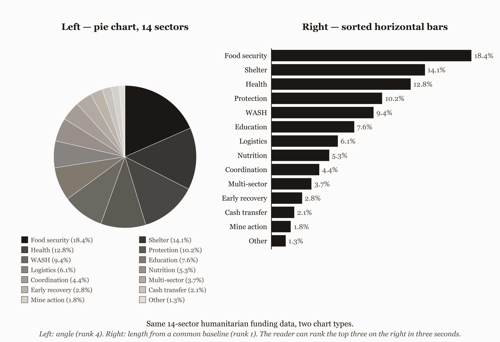
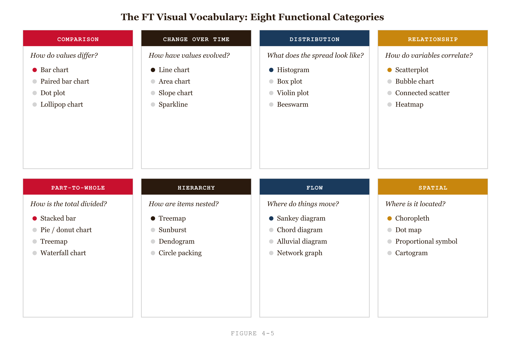
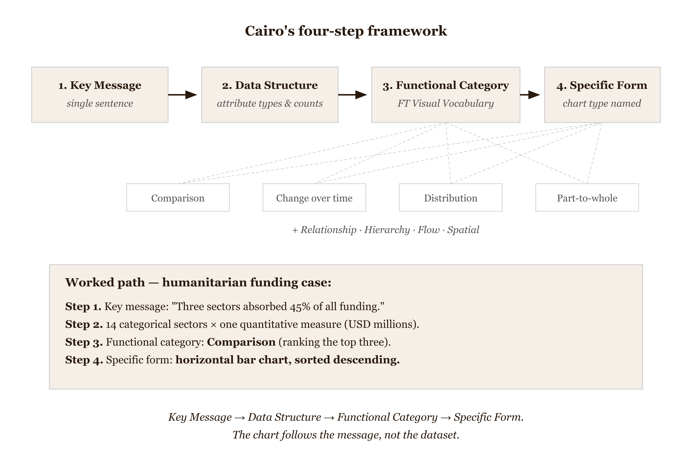
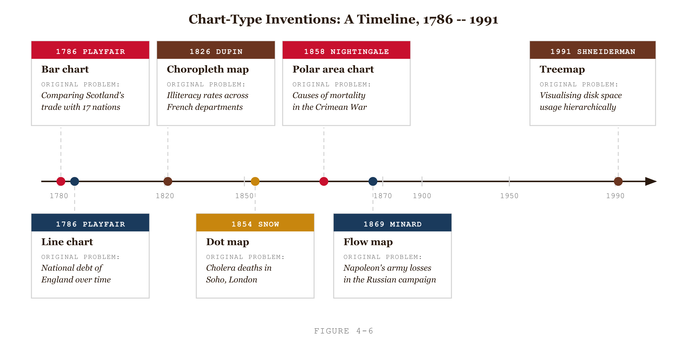
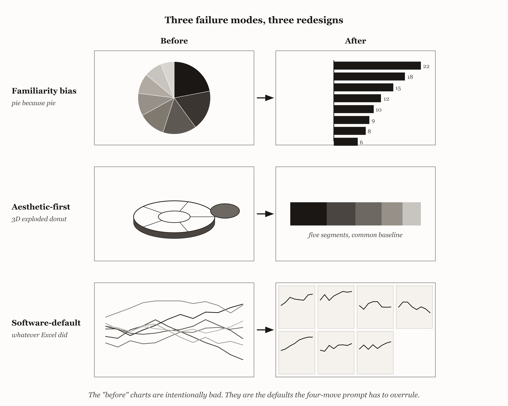
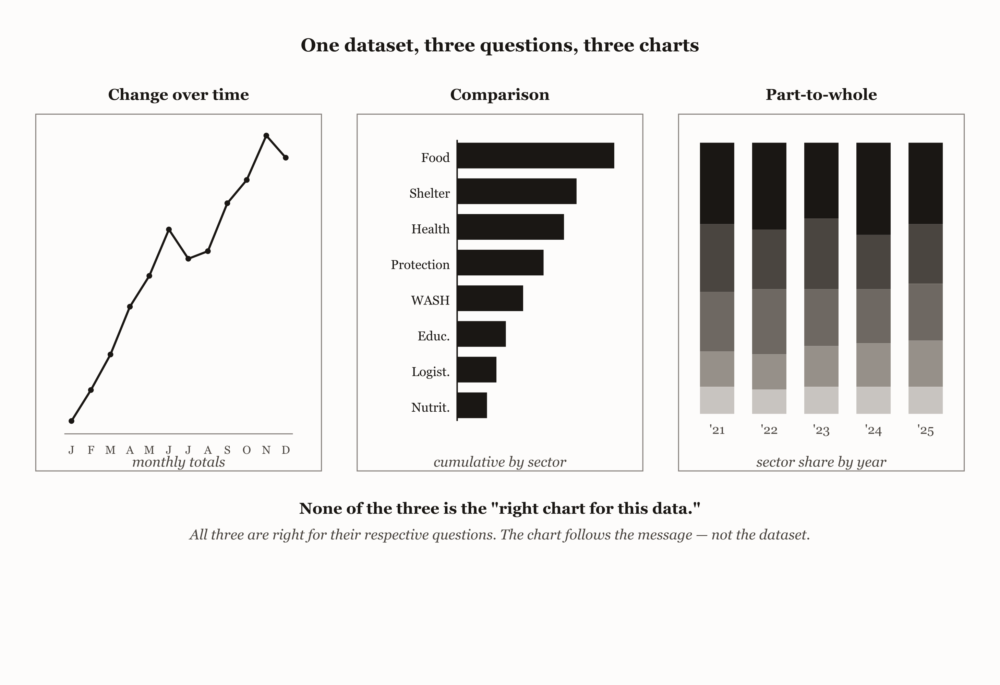
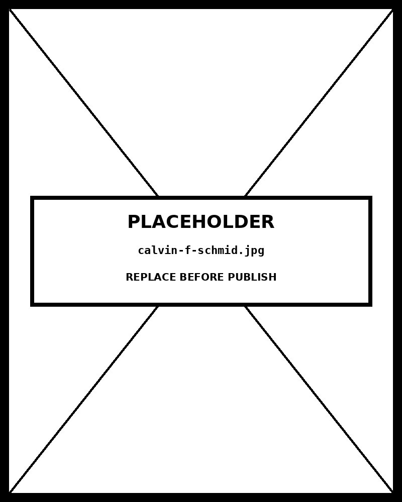

# Chapter 4 — Chart Selection as Design Decision
*The Wrong Chart Feels Familiar; the Right One Takes Work.*

---

Here is a chart that was published in a humanitarian report by a competent, experienced organization. It had a title: "Allocation of Emergency Response Funds, FY2021." It had fourteen slices. Each slice represented one funding category — food security, water and sanitation, shelter, health, protection, education, livelihoods, logistics, coordination, security, communications, transport, monitoring, and a residual "other." The slices ranged from 21% down to under 1%.

I want you to imagine trying to answer one question from that chart: *which three categories received the most funding?*

You cannot do it in under thirty seconds. The five smallest slices compress into indistinguishable slivers along one edge. Two slices at around 4–5% look identical. Three middle slices at 8–12% are also impossible to rank. The chart shows the data. It does not let you read it.

Now imagine the same fourteen categories as a horizontal bar chart, sorted by funding amount, largest at the top. You answer my question in three seconds. Food security is more than twice the next bar. The ranking is unambiguous.

The data is identical. The chart is not. This chapter is about what went wrong in the first version and how you make sure it does not happen in yours.


*Figure 4.1 — Pie chart vs. sorted bar chart, 14-sector dataset*

---

## Why the Pie Chart Was Chosen Anyway

The fourteen-slice pie chart was not an accident. It was not the product of incompetence or indifference. It was produced by someone who looked at a budget allocation — parts of a whole, summing to 100% — and reached for the chart that *feels* appropriate for parts of a whole. Pie charts. Everyone knows pie charts. Pie charts are what you use when you have percentages.

This is familiarity bias. It is the most common failure mode in chart selection, and it is invisible to the person committing it because the choice *feels* justified. Parts of a whole — that's a pie chart, right?

Not necessarily. What matters is not what the data *looks like* structurally. What matters is what the reader needs to *do* with it. The reader of the humanitarian report needed to rank. Which categories got the most? Which got the least? Where did most of the money go? Every one of those is a comparison task. And pie charts encode magnitude as **angle** — the fourth-ranked channel on Cleveland and McGill's accuracy hierarchy, behind position, position-on-non-aligned-scales, and length. For a ranking task, angle is a bad channel. Past five or six slices, the angle differences become too small to perceive reliably. At fourteen slices, you have stopped making a chart and started making a catalog.

The bar chart encodes magnitude as **length from a common baseline** — the highest-accuracy channel available for quantitative comparison. Same data, different channel, reader can now rank in seconds.

The chart type is not a cosmetic choice. It is a channel choice. And channel choices, as Chapter 3 established, have perceptual consequences that are not a matter of opinion.

---

## The Eight Categories That Contain Every Chart

Before you can choose the right chart, you need to know what territory you are choosing from. The Financial Times Visual Vocabulary — a taxonomy the FT's data journalism team developed and has made publicly available — organizes every chart type into eight functional categories. The categories are defined not by what the chart looks like but by what it is trying to *show*.

**Comparison.** How do independent values or categories differ in magnitude? Bar charts, column charts, slope graphs, dot plots. The question is "how do these compare?"

**Change over time.** How does a value evolve across a continuous temporal dimension? Line charts, area charts, stream graphs, candlesticks. Time on the x-axis; the quantity on the y-axis. The question is "how is this changing?"

**Distribution.** How are values spread? What is the shape of the distribution — its center, its spread, its skew, its outliers? Histograms, density plots, box plots, violin plots. The question is "what does the full spread of this variable look like?"

**Relationship.** How do two or more variables relate? Scatterplots, bubble charts, heatmaps, parallel coordinates. The question is "are these variables connected, and how?"

**Part-to-whole.** How do components contribute to a single total? Pie charts, donut charts, waffle charts, treemaps, stacked bars. The question is "what makes up this total?"

**Hierarchy.** How is something organized into nested levels? Treemaps, sunburst diagrams, circle packing, dendrograms. The question is "how is this structured?"

**Flow.** How does something move or transform between states? Sankey diagrams, alluvial diagrams, chord diagrams. The question is "how does this get from A to B?"

**Spatial.** Where is something happening? Choropleth maps, dot maps, bubble maps, cartograms. The question is "where?"

Eight categories. Sixty-plus chart types distributed across them. The categories are the navigation tool. They take the chart-type space from "any of 60+" to "any of 5–10 within this category."

<!-- → [INFOGRAPHIC: 8-panel grid, one panel per FT Visual Vocabulary functional category. Each panel: category name (large, uppercase), the defining reader question in italics, and 3–4 canonical chart types listed. Layout 4×2 or 2×4. This is the navigation reference the reader will return to throughout the book; it should be clean enough to screenshot or print. Warm monochrome, JetBrains Mono for labels.] -->


*Figure 4.5 — The FT Visual Vocabulary: eight questions that contain every chart*

Notice that the categories are defined by the *reader's question*, not by the data's structure. A budget allocation is data with a part-to-whole structure. But if the reader's question is "which category got the most?" — that is a comparison question. The message dominates the structure. This is the error the humanitarian report made: the data *looks* like parts of a whole, so the designer went to part-to-whole, selected pie chart, and called it done. The message was a comparison question. The message should have won.

---

## Cairo's Four Steps

Alberto Cairo is a data journalist and visualization researcher whose books — *The Truthful Art* (2016) and *How Charts Lie* (2019) — are the best available treatments of chart selection as an ethical practice. His four-step decision framework is the explicit version of the thinking the FT Visual Vocabulary assumes.

**Step 1: Write the key message.** In one sentence: what does the reader need to understand in five seconds? Not "here is the data." A claim. "Food security received more than twice the funding of the next-largest category." "Refugee flows shifted from eastern to western corridors between 2020 and 2023." "Hospital admissions cluster in two age groups, not the smooth distribution the national average implies."

If you cannot write this sentence, you do not yet have a chart. You have a dataset and a hope.

This is the load-bearing step. Every subsequent step follows from it. The reason most chart-selection failures happen is that step 1 was skipped — the designer moved from "I have data" to "I need a chart" without passing through "here is what the chart is for."

**Step 2: Describe the data structure.** What kind of data do you have? How many variables? How many observations per category? Is there a temporal dimension? A geographic dimension? A hierarchy? A before-and-after structure? The data description is not the chart; it is the input to the chart decision.

**Step 3: Locate the category.** Given the message and the structure, which of the eight functional categories does this belong to? If the message is about ranking — comparison. If the message is about change through time — change over time. If the message is about the shape of a distribution — distribution. The FT Visual Vocabulary is the lookup table.

**Step 4: Choose the specific form.** Within the category, which chart? Comparison gives you bar, column, multiset, slope graph, dot plot, radial bar. Part-to-whole gives you pie, donut, waffle, treemap, Marimekko, stacked bar. The specific form depends on the perceptual considerations the rest of this book walks, but the reasonable defaults are:

- Comparison → horizontal bar (long labels) or column chart (short labels), sorted by value.
- Change over time → line chart (multi-series) or area chart (single cumulative measure).
- Distribution → histogram (n > 50, single variable) or box plot (cross-group comparison).
- Relationship → scatterplot (two quantitative variables) or heatmap (two categorical variables and an intensity).
- Part-to-whole → stacked bar or waffle chart before pie chart, unless the number of segments is two or three.
- Hierarchy → treemap (regular depth) or circle packing (irregular depth).
- Flow → Sankey (proportional) or chord (inter-entity).
- Spatial → choropleth (rate or ratio data) or bubble map (absolute values).

These defaults are not laws. Part II of this book applies the framework to each chart family in detail. The point of step 4 here is to *name a candidate* — something to build and test. Named candidates are revisable. "I don't know, just make something" produces whatever the software defaults to, which is often wrong for reasons that take a chapter to undo.


*Figure 4.2 — Cairo's four-step chart-selection framework*

---

## The Mechanism Behind Each Chart Type

Every chart type in the standard taxonomy has an origin story. The bar chart was invented by William Playfair in 1786 to argue about British trade deficits with specific countries. The line chart was Playfair too — he needed to show how trade values *changed over time*, which required a different form than cross-sectional comparison. Florence Nightingale invented the polar area chart in 1858 to argue about preventable deaths in the Crimean War; she needed the seasonal pattern to be preattentively obvious, and she accepted a perceptual distortion to make the argument visible. John Snow invented the dot map in 1854 to find the source of London's cholera outbreak. Benjamin Shneiderman invented the treemap in 1991 to visualize nested directory structures on a constrained screen.

Each chart type is a solution to a specific communication problem. Knowing the original problem clarifies when the chart works and — more important — when it does not.

<!-- → [INFOGRAPHIC: Horizontal timeline of chart-type inventions, 1786 to 1991. Entries: Playfair bar chart (1786, "trade deficits by country"), Playfair line chart (1786, "trade values over time"), Dupin choropleth (1826, "illiteracy rate per department"), Snow dot map (1854, "cholera deaths by address"), Nightingale polar area (1858, "preventable deaths by month"), Minard flow map (1869, "army depletion on the march"), Shneiderman treemap (1991, "disk usage in nested directories"). Each entry: chart name, inventor, year, and one-phrase original problem. Caption: "Every chart type is an answer to a question. The question clarifies when the chart works."] -->


*Figure 4.6 — Every chart type is an answer to a question.*

The choropleth was invented to show *rates* per bounded geographic unit. Charles Dupin's 1826 map of French illiteracy used shading per department to show the *rate* of illiteracy, not the absolute count. Use the choropleth for absolute counts and you produce the area-size distortion: large geographic units look dark even when their rates are low, because they contain more area, not more incidence. Chapter 12 names this failure explicitly. The mechanism is already latent in the origin: the chart was designed for rates.

The bar chart was designed for comparison of independent categories. Use it for parts of an unrelated whole and you import a comparison frame the data does not support. Use a bar chart to show quarterly budget allocation across departments and the reader will compare departments to each other — which may or may not be what the chart is for. The question "compared with what?" applies: is the comparison departments-to-each-other, or departments-to-their-own-target, or departments-to-last-year? Each is a different chart.

Cairo calls "compared with what?" a mandatory check before any chart is finalized. The phrase is borrowed from social science — Stanley Lieberson used it to argue that causal claims without counterfactuals are incomplete — and applied to visual design. Every quantitative claim a chart makes must be set against a reference that gives the claim meaning. "Food security received 21% of the total" compared with: the other thirteen categories (within-chart comparison), last year's allocation (temporal comparison), the international standard for emergency response (benchmark comparison). Each of these is a different message and, sometimes, a different chart.

The "compared with what?" check forces the designer to name the comparison the chart actually makes. A chart that fails the check makes a claim without a reference and produces a meaningless reading. The failure is invisible when you are building the chart because you know the context. It becomes visible the moment a reader who lacks your context looks at the chart and asks: "so what?"

---

## The Three Failure Modes

Three patterns produce most chart-selection failures. They are worth naming because naming them makes them recognizable.

**Familiarity bias.** The designer reaches for the chart they always use, or the chart that *feels* right for the data's structure. Pie charts for percentages. Bar charts for comparisons. Line charts for anything with time in it. The choice feels justified because the chart type is not wrong in a category sense — but the specific form within the category is not the best fit for the message.

The corrective is step 1. Write the key message. Then ask: is the chart I am reaching for the one that best communicates this message, or is it the one I would have used regardless of the message? If the answer is "regardless," step 3 has been skipped.

**Aesthetic-first selection.** The designer reaches for the chart that looks impressive. Radial bars instead of horizontal bars. A circular pack instead of a treemap. A 3D surface instead of a heatmap. Animated transitions where static would do. The aesthetic choice is made before the message is written, which means the chart will serve the designer's eye before it serves the reader's need.

The corrective is Tufte's principle: *show the data.* Any visual element that does not serve the communication goal is a candidate for removal. This is the strict reading; Few's resolution — that embellishments which genuinely support the message can earn their place — is the pragmatic version. The test is not "does this look good?" but "does this serve the message, or does it compete with it?"

**Software-default selection.** The designer accepts whatever the charting tool produces. PowerPoint's default chart. Excel's auto-suggestion. Tableau's recommended visualization. Each of these has implicit choices baked in: truncated y-axes for emphasis, gradient fills for visual interest, rainbow palettes for categorical encoding. None of these defaults was made for your specific message. They were made for the average request, which is probably not yours.

The corrective is to override the defaults consciously. The four-step framework is the discipline that produces overrides. Do the four steps before any code is written or any tool is opened; the chart will then differ from the default in ways you can defend.


*Figure 4.3 — Three failure modes, three redesigns*

---

## Cairo's Ethical Frame

Cairo's argument about these failures is stronger than the usual design-criticism vocabulary suggests. He does not say bad chart choices are mistakes or aesthetic misjudgments. He says that choosing an ineffective chart while a more appropriate one is available — choosing it because it is familiar, or beautiful, or the software's default — is morally wrong.

This sounds like overclaiming. It is not. Cairo's argument is careful and specific: the designer has a professional responsibility to the reader. A chart that impedes the reader's understanding — that asks them to rank fourteen categories by angle when length is available; that shows a rate as an absolute count, inflating the appearance of large geographic areas; that hides a bimodal distribution behind a mean — has failed that responsibility. When the failure results from the designer's preference rather than from unavoidable trade-offs, the failure is a moral choice.

The frame is not moralistic in the sense of finding sin everywhere. It is rule-utilitarian: a designer who consistently makes chart choices that maximize the reader's understanding is fulfilling their professional function. A designer who makes chart choices that serve their preferences at the reader's expense is not. The practical difference is in what question the designer asks before finalizing the chart. "Does this look right?" is an aesthetic question. "Does this let the reader answer the question I wrote in step 1?" is a moral one.

The frame applies throughout this book. It is introduced here because chart selection is the earliest and largest leverage point. A poorly executed chart of the right form can be fixed in iteration. A well-executed chart of the wrong form has communicated something other than what the data supports — and fixing it means going back to the chart-type decision, not the implementation.

---

## The Same Dataset, Three Different Charts

Here is the application. A dataset: monthly humanitarian funding amounts across five sectors — food, shelter, water, health, protection — for one country, across three years (2022–2024). The data is a table with 180 rows.

Three communication questions. Three different steps-1 through steps-4. Three different charts.

**"How has total monthly funding changed across the three years?"** The message is temporal — a trend, a peak, a decline. Step 3 locates this in change over time. Step 4 produces a line chart: months on the x-axis, total funding on the y-axis, a single line. The five sectors disappear; this is the aggregate story.

**"Which sector received the most funding cumulatively?"** The message is comparative — a ranking across sectors. Step 3 locates this in comparison. Step 4 produces a horizontal bar chart sorted descending: sectors on the y-axis, cumulative funding on the x-axis from a zero baseline. The temporal dimension disappears; this is the cumulative story.

**"How does each year's allocation split across sectors, and has the split changed?"** The message is compositional with a temporal sub-message — how the parts move year to year. Step 3 locates this in part-to-whole with a temporal dimension. Step 4 produces a 100% stacked column chart: one column per year, each segmented by sector. The proportions are directly comparable across years; the absolute amounts disappear.

Three charts, none of them the "right chart for this data." All three are right for their respective questions. None is right for the others. The dataset is the same. The charts are answers to different questions. The chart type follows the question, not the table.

This is the thing the fourteen-slice pie chart got wrong. Its designers had the data and a chart type that *fit the data's structure*. They did not have a message. If they had written step 1 — "food security received more than twice the funding of the next-largest category, and this is what the reader needs to know" — they would have arrived at comparison as the functional category and horizontal bar as the specific form. The pie chart's inadequacy would have been visible before it was built.

Write the message first. The chart follows.


*Figure 4.4 — One dataset, three questions, three charts*

---

## How This Changes the Claude Code Prompt

The four-step framework is not only a design discipline. It is a prompt-writing discipline. When you specify a chart in a Claude Code prompt without having done the four steps, you are asking the model to guess at your message and your functional category. It will produce something that looks like a chart. Whether it answers the right question is uncertain.

When you have done the four steps, the Claude Code prompt becomes a specification:

```
Show what I have:
5 sectors (categorical). Cumulative funding per sector (quantitative,
USD millions). 5 rows.

Say what I want:
Horizontal bar chart in D3 v7. Single HTML file, inline D3 via CDN.
Responsive to window resize.

Constrain it:
- Mark: rectangle per sector.
- y-position: sector, sorted by cumulative_funding descending.
- x-length from zero baseline: cumulative_funding.
- Color luminance: redundant encoding of cumulative_funding,
  sequential pale-to-dark.
- Bar labels: value in USD millions at the right of each bar.
- Zero baseline: non-negotiable.

Verify:
Before writing code, restate the channel decomposition. Flag any
decisions not specified above.
```

The specification is tight because the four steps were done first. Step 1 produced the message (ranking sectors by cumulative funding). Step 3 produced the category (comparison). Step 4 produced the form (horizontal bar, sorted, zero baseline). The Claude Code prompt is the implementation of a decision already made.

Without the four steps, the prompt is: "show this funding data as a chart." Claude Code will choose. Often it will choose a pie chart, because the data sums to a total and pie charts are the familiar default for totals. And you will be back at the fourteen-slice problem.

---

## The Feynman Test

Here is the chapter's test. The next chart you produce — open a blank document and write one sentence before you touch any software. The sentence is: "After looking at this chart, the reader will be able to [specific action — rank, compare, identify, track] [specific thing] in five seconds."

If you cannot write the sentence, do not build the chart. If you can write it, check whether the chart type you were about to reach for serves the action you named. If it serves it, proceed. If it does not — if you were about to build a pie chart for a ranking task, a 3D chart for a magnitude comparison, a default Excel output for a distribution question — stop, do steps 1 through 4, and build the chart the message demands.

The key message sentence is the test. Everything else in this chapter is the machinery that supports it.

---

## Exercises

### Warm-up

**Exercise 4.1 — Functional category lookup.** For each of the following datasets, name the FT Visual Vocabulary category that the stated communication question places it in. Where two categories could apply, name the question that resolves the choice.

- Monthly website visitors over two years. Question: "How has traffic changed since the redesign?"
- Household income distribution for one ZIP code. Question: "Is income in this neighborhood concentrated in one bracket or spread across many?"
- Budget allocation across nine city departments. Question: "Which department receives the largest share?"
- Refugee arrivals from five origin countries to three host countries. Question: "Which corridor carries the most movement?"

**Exercise 4.2 — Step 1 stress test.** For each of the following, decide whether it is a key message (Cairo's step 1) or merely a data description. For each that is only a description, rewrite it as a key message.

- "This chart shows quarterly revenue by region for FY2023."
- "The eastern region outperformed every other region in Q3, accounting for 41% of total revenue."
- "Here are the five countries with the highest life expectancy."
- "Switzerland, Japan, and Singapore have each sustained life expectancy above 83 years for the past decade, while the global average has risen by only 2.1 years."

**Exercise 4.3 — "Compared with what?" applied.** Find a chart in a recent report or dashboard that passes the familiarity-bias test (the chart type fits the functional category) but fails the "compared with what?" check — the comparison is implicit rather than explicit. Name the missing reference. Specify the redesign that makes the comparison visible in the chart itself.

### Application

**Exercise 4.4 — Walk the four steps.** Take a dataset from your own work or a public repository. Write Cairo's four steps explicitly as a markdown document: (1) key message in one sentence, (2) data structure described, (3) functional category named with justification, (4) specific form named with perceptual justification. Submit the document; the chart specification follows from it.

**Exercise 4.5 — Three questions, three charts.** Take a single dataset with at least two categorical variables and one quantitative variable measured over time. Identify three different communication questions the dataset can answer. Walk each through the four steps. Produce three different chart specifications. Build all three with Claude Code. Compare the results: do they look like they came from the same data?

**Exercise 4.6 — The familiarity-bias rewrite.** Find a pie chart with more than five slices in a published report (corporate annual report, NGO accountability document, government statistical release). Apply the four-step framework. Rewrite it as the chart the key message demands. Build both with Claude Code. Test reading speed on two or three colleagues for the specific task "rank the top three categories."

### Synthesis

**Exercise 4.7 — Cairo's ethics audit.** Take a chart from a published report whose chart-type choice you suspect is wrong. Apply the four steps to identify what the correct form would have been. Write a one-page audit: which failure mode drove the incorrect choice (familiarity bias, aesthetic-first, software-default)? What did the choice cost the reader specifically — which task became harder or impossible? Apply Cairo's ethical frame: was this a defensible trade-off or an abdication of professional responsibility?

**Exercise 4.8 — When familiarity is right.** Make the affirmative case for familiarity as a legitimate design criterion. Identify three scenarios where choosing the familiar chart type is the correct decision — audience graphicacy constraints, time pressure, established convention. For each, name the perceptual cost the familiarity choice accepts and argue that the cost is worth paying. Then name the line: at what point does the same argument fail?

### Challenge

**Exercise 4.9 — Multi-LLM chart selection.** Submit the four-step framework prompt for a contestable dataset to Claude, ChatGPT, and Gemini. Use the same dataset and the same communication goal for all three. Compare the chart-type recommendations. Where do they agree? Where do they disagree, and what does the disagreement reveal about which design decisions are genuinely ambiguous versus which represent one model defaulting to familiarity bias?

**Exercise 4.10 — Friendly's history applied.** Pick a chart type you use frequently. Research its origin: when was it invented, by whom, for what specific communication problem? Compare your typical use to the original use case. Where are you using the chart against its original intent? Where does the origin clarify why your chart sometimes fails to communicate what you intend? Write up the analysis as a one-page note to your future self.

---

## Key Terms

**Functional category.** One of eight (FT Visual Vocabulary): comparison, change over time, distribution, relationship, part-to-whole, hierarchy, flow, spatial. The first navigation move in chart selection.

**Cairo's four-step framework.** Key message → data structure → functional category → specific form. The decision path that makes chart choice defensible, not habitual.

**Cairo's ethical frame.** Choosing an ineffective chart while a more appropriate one is available — choosing it for familiarity, aesthetics, or software default — is a moral choice with consequences for the reader's understanding, not merely an aesthetic one.

**"Compared with what?"** Cairo's mandatory check. Every quantitative claim a chart makes must be set against an explicit reference. Charts that fail this check make claims without meaning.

**Familiarity bias.** Reaching for the chart type that feels right for the data's structure, independent of the message. The most common chart-selection failure.

**FT Visual Vocabulary.** The Financial Times' chart taxonomy. Available in the book's pantry as `Visual-vocabulary.txt`. The navigation tool for step 3.

**Tufte's "show the data" principle.** Any visual element that does not serve the data's communication goal is a candidate for removal. The precondition for any chart-selection question.

---

## A note about AI

Chart selection is the design decision that the model is most prone to oversimplifying. The model will produce a chart on request without naming the trade-offs of the chart it picked.

Where the model genuinely helps: producing three candidate chart types for the same data and naming what each emphasizes and what each hides.

Where the model does damage: defaulting to a bar chart or a line chart because both are common in its training distribution. The default is not the design.

The rule: ask the model for alternatives; choose from among them yourself.

---

## LLM Exercise — Chapter 4: Chart Selection

**Project:** [TBD — selected after Chapter 00]

**What you're building this chapter:** A chart-selection audit document that walks a real dataset through Cairo's four-step framework and produces a defensible chart-type recommendation. Plus the Claude Code prompt for the recommended chart.

**Tool:** Claude chat (for the audit) + Claude Code (for the build)

---

**The Prompt:**

```
I have a dataset of [DESCRIBE: rows, columns, types]. The communication
goal is [DESCRIBE: what the reader needs to understand in 5 seconds].

Walk me through Cairo's four-step chart-selection framework:

1. Key message: write the message as a single sentence. If I cannot
   write it, push back and ask for it before proceeding.

2. Data structure: name the data types, the number of variables and
   observations, any hierarchy, any temporal dimension.

3. Functional category: locate the dataset in the FT Visual Vocabulary's
   eight functional categories (comparison, change over time, distribution,
   relationship, part-to-whole, hierarchy, flow, spatial). Where multiple
   categories could apply, name the question that resolves the choice.

4. Specific form: recommend a specific chart type within the category.
   Cite the perceptual reasoning (Cleveland & McGill ranking from
   Chapter 3) and any chart-family-specific design considerations.

Then apply the "compared with what?" check: name the comparison the
chart will make explicit. If the comparison is missing, name it.

Then identify whether the recommendation is at risk of any of the three
failure modes — familiarity bias, aesthetic-first choice, software-default
choice. Audit yourself: am I recommending this chart because the message
demands it, or because it's familiar?

Save the audit as chapter-04-selection-audit.md. Then write a four-move
Claude Code prompt for the recommended chart, following the Chapter 00
prompt structure.
```

---

**What this produces:** A markdown audit document with Cairo's four steps walked through, the "compared with what?" check applied, and a four-move Claude Code prompt ready to run. Save as `chapter-04-selection-audit.md`.

**How to adapt this prompt:**
- *For your own domain:* Replace the dataset and communication goal.
- *For ChatGPT / Gemini:* Works as-is. Both will accept the four-step structure.
- *For a Claude Project:* Save Cairo's four-step framework and the FT Visual Vocabulary as system-prompt context; the per-chart audit becomes the user message.
- *For Cowork:* Use Cowork to read the dataset file directly, then run the audit; saves a paste step.

**Connection to previous chapters:** Builds on Chapter 3's channel ranking — the perceptual reasoning at step 4 is the Cleveland & McGill hierarchy applied to the candidate chart's encoding. Chapter 00's four-move prompt structure is what the audit's final output produces. Future chapters' LLM Exercises assume this audit has happened first.

**Preview of next chapter:** Chapter 5 zooms in on one functional category — comparison — and works the bar chart family in depth. The zero-baseline rule, the sort-by-value convention, and the failure modes specific to bar charts (truncated axes, multiset encoding clutter) are the subject.

---

## Further Reading

- **Cairo, Alberto. (2016).** *The Truthful Art: Data, Charts, and Maps for Communication.* New Riders. Chapters 1–3 for the ethical frame; Chapter 5 for chart selection.
- **Cairo, Alberto. (2019).** *How Charts Lie: Getting Smarter About Visual Information.* W. W. Norton. Chapter 2 ("Charts That Lie by Showing Too Little") is the most relevant.
- **The Financial Times Visual Vocabulary.** In the book's pantry as `Visual-vocabulary.txt`. Print it.
- **Friendly, Michael. (2008).** "A Brief History of Data Visualization." In *Handbook of Data Visualization*, edited by C. Chen, W. Härdle, and A. Unwin. Springer. The origin stories that ground chart-type choice.
- **Tufte, Edward R. (1983, 2nd ed. 2001).** *The Visual Display of Quantitative Information.* Chapter 1 establishes "show the data."
- **Few, Stephen.** *Show Me the Numbers: Designing Tables and Graphs to Enlighten.* The most rigorous practical chart-selection reference; Few's chapter on selecting the right chart is the deepest treatment of the four-step decision in book form.

---

## Prompts

Use these prompts with Claude to generate interactive D3 v7 versions of the
figures in this chapter. Each produces a standalone HTML file you can open
in a browser and modify freely.

**Prerequisites:** Load `brutalist/CLAUDE.md` and `brutalist/DESIGN.md` into
your Claude project context before using these prompts. They define the stack,
naming conventions, color system, and typography the figures use.

---

### Figure 4.1 — Pie chart vs sorted bar chart

*Hand-authored SVG (converted to PNG at 300 dpi)*

Two panels with the same 14-sector humanitarian funding data. Left: cramped 14-slice pie chart with legend. Right: sorted horizontal bar chart, largest at top. The reader answers "which three categories received the most funding?" in 3 seconds with bars, 30+ seconds with slices.

---

### Figure 4.2 — Cairo's four-step framework

*Hand-authored SVG (converted to PNG at 300 dpi)*

Left-to-right flow diagram — Key Message → Data Structure → Functional Category → Specific Form — with a worked example showing the path for the humanitarian funding case.

---

### Figure 4.3 — Three failure modes, three redesigns

*Hand-authored SVG (converted to PNG at 300 dpi)*

Three rows of before/after redesigns: familiarity bias (pie → sorted bar), aesthetic-first (3D exploded donut → flat stacked bar), software-default (tangled rainbow lines → small multiples).

---

### Figure 4.4 — One dataset, three questions, three charts

*Hand-authored SVG (converted to PNG at 300 dpi)*

Three panels using the same humanitarian funding dataset — line chart (change over time), horizontal bar chart (comparison), 100% stacked column chart (part-to-whole with temporal sub-message).

---

### Figure 4.5 — The FT Visual Vocabulary

Eight-panel grid (4×2), one panel per FT Visual Vocabulary functional category. Each panel: category name (uppercase), the defining reader question in italics, and 3–4 canonical chart types listed. Categories: Comparison, Change over time, Distribution, Relationship, Part-to-whole, Hierarchy, Flow, Spatial. Clean reference layout suitable for screenshot or print. D3 v7 single HTML file, 1600×900.

> Reference implementation: `d3/04-chart-selection-as-design-decision-fig-05.html`

---

### Figure 4.6 — Chart-type invention timeline

Horizontal timeline from 1786 to 1991 with 7 entries: Playfair bar chart (1786, "trade deficits by country"), Playfair line chart (1786, "trade values over time"), Dupin choropleth (1826, "illiteracy rate per department"), Snow dot map (1854, "cholera deaths by address"), Nightingale polar area (1858, "preventable deaths by month"), Minard flow map (1869, "army depletion on the march"), Shneiderman treemap (1991, "disk usage in nested directories"). Each entry: chart name, inventor, year, one-phrase problem. D3 v7 single HTML file, 1600×900.

> Reference implementation: `d3/04-chart-selection-as-design-decision-fig-06.html`

---

## AI Wayback Machine

The ideas in this chapter didn't appear from nowhere. **Calvin F. Schmid** was an American sociologist and statistician who wrote *Handbook of Graphic Presentation* (1954) — the first practical manual that walked the reader through *which chart to use for which question*. Before Schmid's book, chart selection was mostly inherited from whatever the previous author had done. After it, the question "key message → data structure → functional category → specific form" had a textbook answer.


*Calvin F. Schmid, circa 1955. AI-generated portrait based on a public domain photograph (Wikimedia Commons).*

**Run this:**

```
Who was Calvin F. Schmid, and how does his chart-selection framework connect to the four-step Cairo workflow we covered in this chapter? Keep it to three paragraphs. End with the single most surprising thing about his career or ideas.
```

→ Search **"Calvin F. Schmid statistician"** on Wikipedia. See what the model got right, got wrong, or left out.

**Now make the prompt better.** Try one of these:

- Ask it to walk through how Schmid's 1954 chart-selection rules would handle the 14-category humanitarian funding dataset from the opening case.
- Ask it to compare Schmid's pre-computer chart-selection guide with Andy Kirk's *Data Visualisation* (2016) — what changed, what didn't.

What changes? What gets better? What gets worse?
