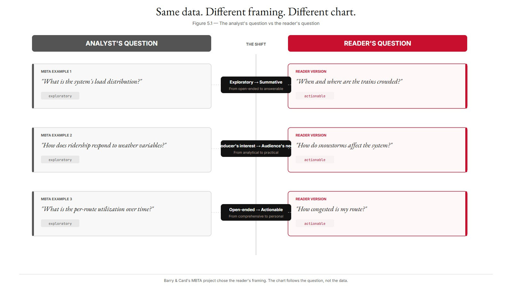
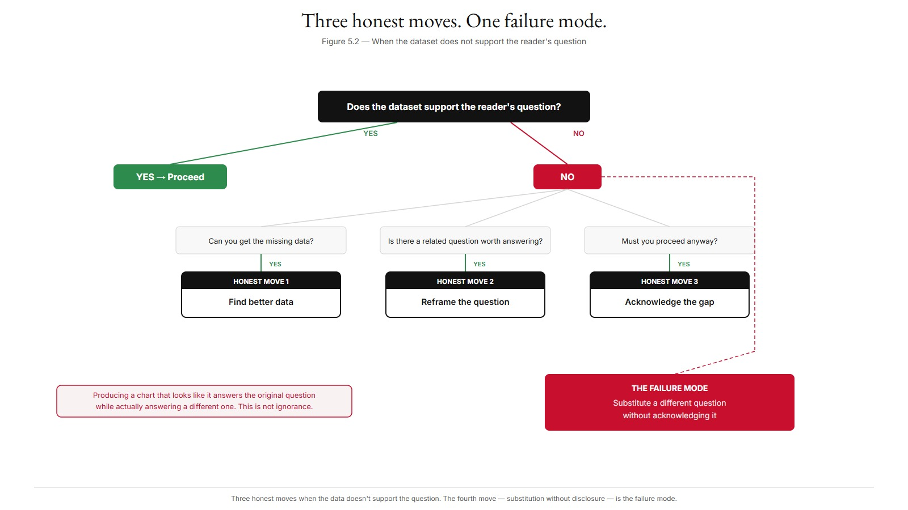
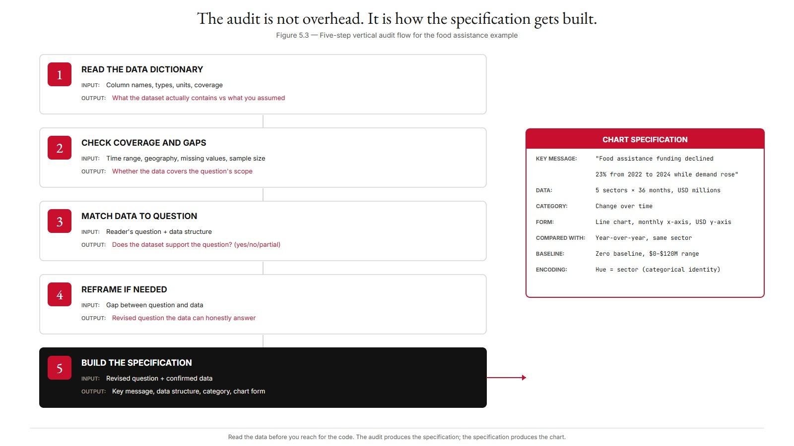
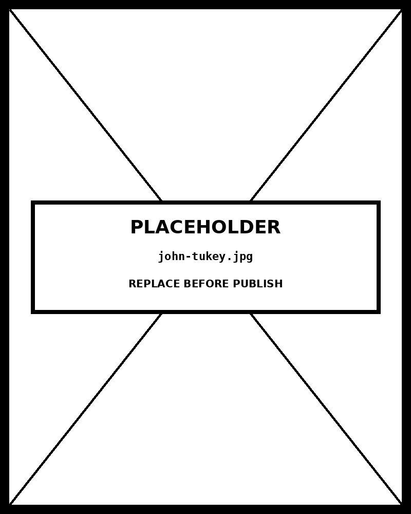

# Chapter 05 — Reading a Dataset

*Read the Data Before You Reach for the Code.*

---

A research team asks you to "visualize refugee flows."

The phrase sounds like a chart request. It is not. It contains a referent and a verb. It contains no question. *Refugee flows* could mean the count of refugees by origin country in a single year, the change in refugee counts by destination country across five years, the proportion of refugees relative to host-country population, the path of individual refugees from origin to first reception to final settlement, the rate of new arrivals per month, or a dozen other things. Each of these is a different chart. Each requires a different dataset. Each answers a different question.

If you accept "visualize refugee flows" as a sufficient brief and walk to Claude Code, you will produce a chart. The chart will be technically correct. It will probably not answer any specific question, because no specific question was asked. It will be the chart the dataset most naturally invited — which may or may not be what the team needed.

This is the work before the work. Before you reach for marks and channels, before you locate your dataset in a chart typology, before you write a four-move prompt, you read the dataset and you formulate the question. This chapter teaches you how.

---

## What a dataset contains

The first move when a dataset arrives is to identify what kinds of things it contains. Not "what does this data mean" — that comes later. Just: what *type* is each variable?

There are five primary types, and they matter because they constrain what charts are even possible.

**Categorical variables** are discrete labels with no inherent order. Country names, sector classifications, product categories. The encoding constraint is fundamental: because these labels have no order, you cannot put them on a magnitude channel without lying. If you sort countries by GDP, you have created an *ordered* list — but that's your ordering of them, not a property of country names themselves.

**Ordinal variables** are discrete labels with order, but without uniform spacing between values. Education levels (high school / bachelor's / master's / PhD). Survey responses (strongly disagree / disagree / neutral / agree / strongly agree). The order matters. The *distances* do not. High school to bachelor's is not the same gap as master's to PhD, even if they sit one position apart on the scale. This distinction has teeth: you can encode ordinal variables on a magnitude channel to show rank, but you cannot meaningfully average them, because the distances between values are undefined.

**Quantitative variables** are numbers with meaningful magnitudes and uniform distances. Height, weight, dollars, counts, rates. They subdivide into continuous (real-valued, like temperature) and discrete (integer-valued, like a count of events); and into ratio (with a true zero, so ratios make sense) and interval (no true zero — a year of 2020 is not "twice" anything). All quantitative variables can be averaged, summed, ranked, and encoded on any magnitude channel.

**Temporal variables** are dates, times, durations. Technically a special case of quantitative — but visualization treats them separately because of conventions. Time runs left to right in Western reading order. The temporal axis shows ticks at meaningful intervals (years, months, days) rather than arbitrary numeric divisions. Time has cyclical structure — months of the year, hours of the day — that linear variables don't. These conventions affect chart design in ways that a generic quantitative treatment misses.

**Geographic variables** are locations or regions. Three sub-types: point geographies (specific locations, GPS coordinates), polygon geographies (administrative units like states and countries), and connection geographies (origin-destination pairs, migration corridors, trade routes). The sub-type matters because each opens a different chart family.

Most real datasets contain several types at once. The Boston transit dataset that Mike Barry and Brian Card worked with for their MBTA visualization project contains temporal (timestamp), geographic (station location), categorical (line color), quantitative (passenger count), and ordinal (peak/off-peak/late-night) variables all in one table. You don't build one chart from all of them. You build a chart that uses the subset the question requires.

| Type | Definition | Encoding constraint | Common misclassification failure | Chart it opens up |
|---|---|---|---|---|
| Categorical | Discrete labels with no inherent order. | Hue and shape work; sequential luminance lies (implies order). | Treating sectors or country names as ordinal because the source file is sorted. | Horizontal bar chart, sorted by the value column. |
| Ordinal | Discrete labels with an inherent order but unspecified gaps. | Position and sequential luminance work; quantitative scales lie (implies known gaps). | Encoding a 5-point Likert scale as if it were an interval. | Diverging stacked bar, dot plot. |
| Quantitative | Numeric values where differences and ratios are meaningful. | Position (rank 1) and length (rank 3) work; area and hue degrade accuracy. | Treating ZIP codes or year-as-int as quantitative when they're nominal. | Scatterplot, line chart, histogram. |
| Temporal | Ordered points or intervals in time. | Position on an x-axis works; categorical encodings lose continuity. | Plotting dates as evenly spaced categories when calendar gaps matter (missing months). | Line chart, area chart, spiral plot. |
| Geographic | Locations on a coordinate surface. | Map projections work; non-spatial encoding loses the relational information. | Encoding country names as a bar chart when the geographic adjacency is the point. | Choropleth, dot map, flow map. |
Which brings us to the question.

---

## Whose question is the chart answering?

There are two people involved in almost every chart that gets made: the analyst and the reader. They have different questions. The chart can only answer one at a time. Which one it answers is not an accident — it is a design decision, often an unconscious one.

**The analyst** is the person who lives with the data. You, if you are the one building the chart. The researcher who collected it. The data owner. The analyst has questions that emerged from the data over time — patterns noticed, anomalies flagged, comparisons found interesting:

"Notice that this metric spiked in October."
"There's an unusual cluster in the northwest region."
"The distribution has a long right tail the mean hides."

These questions are interesting to the analyst because the analyst already understands the context. They arise from weeks or months of contact with the dataset. They are often exploratory — the analyst is still figuring things out.

**The reader** is the audience for the chart. They want to make a decision, understand a phenomenon, evaluate a claim, or get oriented in unfamiliar territory. Their questions are usually summative, not exploratory. They want an answer, not a tour of the analyst's thinking. They do not have the analyst's context. They are busy. They are reading a chart, not analyzing data.

The chart must answer the reader's question.

This is harder than it sounds, because the analyst is the one designing the chart. The analyst's questions are the ones visible first. The analyst has a genuine interest in the spike in October, the northwest cluster, the hidden right tail. It is natural — nearly inevitable — to build a chart that shows those things, and to believe you are communicating when you are actually displaying.

Alberto Cairo names this directly: a chart that answers the analyst's question when a more appropriate chart for the reader existed is, in Cairo's strong reading, a failure of purpose. The designer prioritized their own intellectual interest over the reader's understanding. This is not a stylistic critique. It is a claim about what charts are for.

The reconciliation is to start with the reader's question and work backward. What does the audience need to know? What decision are they making? What context do they bring? Once the reader's question is named, the analyst's question can be checked against it. Does the data support what the reader needs, or does it support a different question the analyst found more compelling?

The MBTA project's three guiding questions make this concrete: "When and where are the trains crowded or delayed? How do snowstorms affect the system? How congested is my route?" These are reader-focused. Each is specific enough that a chart can be evaluated against whether it answers it. The analyst's version of these questions might have been "what is the system's load distribution" or "how does ridership respond to weather variables" — same data, different framing. Barry and Card's contribution was choosing the reader's framing, not the analyst's.

<!-- → [INFOGRAPHIC: two-column contrast diagram — left column labeled "Analyst's question," right column labeled "Reader's question." Three paired examples, one per row, using the MBTA questions: analyst version on the left (e.g., "What is the system's load distribution?"), reader version on the right (e.g., "When and where are the trains crowded?"). A center column labels the difference in each pair: "exploratory vs. summative," "producer's interest vs. audience's need," "open-ended vs. actionable." Caption: "Same data. Different framing. Different chart."] -->



---

## Compared with what?

Once you have the reader's question, Cairo's second move applies: *compared with what?*

Every quantitative claim a chart makes requires a reference. Without a reference, the claim is meaningless. A chart that shows "Q4 revenue by region" is asserting something about each region's revenue. Compared with what? The other regions in Q4 (within-period comparison). The same regions in Q3 (quarter-over-quarter). The same regions in Q4 last year (year-over-year). The annual target (target comparison). Each is a different chart because each answers a different version of the question.

"Compared with what?" is not a rhetorical question. It is a required specification. When the answer is missing from the chart's message, the reader invents one — usually the most obvious reference, which may not be the right one. This is how charts mislead without lying: not by presenting false data, but by leaving the comparison implicit and letting the reader's assumption fill the gap.

Four failure patterns are worth naming because they appear everywhere.

**Absolute counts where ratios are needed.** A choropleth showing absolute cancer diagnoses by U.S. state looks informative until you notice that California (population 39 million) and Wyoming (population 600,000) cannot be meaningfully compared on raw counts. The "compared with what?" answer that makes the claim honest is *rate per population*: diagnoses per 100,000 residents. The chart needs rates, not counts.

**Time series without a baseline.** A line chart of the S&P 500 over five years shows the index going up 60%. Compared with what? Inflation over the same period (up 20%)? The FTSE (up 40%)? A 5% target return? Each comparison reveals different information. The chart that shows only the absolute price line is making the comparison "compared with the starting price" — which is sometimes the right comparison and often is not.

**Cross-sectional comparison without controls.** A bar chart of average income by region compares regions on income. Compared with what? The cost of living (which varies). The age distribution (regions with more retirees look poorer). The industry composition (mining regions versus service regions). Without controls, the chart shows differences that may be artifacts of the missing variables. The claim outruns the evidence.

**Single-value claims.** A chart showing "65% support" for a policy is making an unanchored claim. Compared with what? If support was 60% last year, the current 65% is a meaningful increase. If a peer country shows 95% support, the 65% is low. The single number means nothing without a reference, and the chart that presents it alone is presenting less than it appears to.

The check applied: every chart's key message should answer "compared with what?" explicitly. "Funding for food security is highest" fails the check. "Funding for food security is highest — more than twice the next-largest category" makes the comparison explicit. If the answer cannot be put in the message, it is probably not in the chart either.

| Failure pattern | What the chart shows | What reference is missing | Redesign that passes the check |
|---|---|---|---|
| Absolute counts where ratios are needed | Raw case counts by country | Population denominator | Per-capita rate, or two panels (counts + rates) |
| Time series without baseline | A rising line | Pre-period, comparison group, or expected trajectory | Add a before-period, an index point, or a counterfactual line |
| Cross-sectional comparison without controls | Two groups, one taller | The third variable that differs between them | Stratify, or report the comparison conditional on the confounder |
| Single-value claim | "Funding rose 40%" with no chart at all | The reference the 40% is measured against | Replace the claim with a chart that shows both endpoints and the baseline |
---

## What relationships does your data actually support?

The final move of the pre-chart audit is identifying which relationships the data can honestly bear.

Eight functional categories map to the eight kinds of relationships data can express: comparison (independent values on a single dimension), change over time (values across a temporal axis), distribution (the spread of a single variable), correlation (how two variables co-vary), part-to-whole (components summing to a defined total), hierarchy (nested or layered structure), flow (movement between states), spatial (patterns tied to geographic location).

Reading a dataset includes identifying which of these the data actually supports. Sometimes several; sometimes only one; sometimes the relationship the question implies is not present in the data at all.

Take a concrete case. A dataset contains monthly humanitarian funding amounts for five sectors in one country across three years. The variables are sector (categorical), month (temporal), and funding amount (quantitative).

What relationships does this data support?

*Comparison*: funding by sector, for a given period. Yes — categorical sector plus quantitative funding gives this directly.

*Change over time*: funding across 36 months. Yes — the temporal axis plus the quantitative funding gives this.

*Distribution*: the spread of monthly funding amounts. Yes, weakly — 36 observations per sector is a short series; a histogram won't show much.

*Correlation*: between two quantitative variables. *No.* The dataset has only one quantitative variable. To support correlation, you would need a second — emergency severity, displaced population, or similar.

*Part-to-whole*: sectors summing to total funding. Yes — the sectors are mutually exclusive components of total funding in any given period.

*Hierarchy*: nested structure. *Not directly*, unless the sectors have sub-sectors not shown.

*Flow*: transitions between states. *Not really*, unless the data shows fund reallocation events, which the basic dataset does not.

*Spatial*: geographic patterns. *No* — the country is constant.

Four relationships natively supported. Four not. Different questions, different charts, all from the same dataset. The chart you build depends on which of these the reader's question targets.

| Relationship type | Supported by this dataset? | Variables involved (if yes) | Additional data needed (if no) |
|---|---|---|---|
| Comparison | Yes | sector × funding amount | — |
| Change over time | Yes | month × funding amount | — |
| Distribution | Weakly | funding amount across countries | More observations per cell to see the shape |
| Correlation | No | — | A second quantitative variable per country (e.g., need score) |
| Part-to-whole | Yes | sector share of total funding | — |
| Hierarchy | No | — | Sector-to-subsector parent links |
| Flow | No | — | Donor → recipient pairs with magnitudes |
| Spatial | Weakly | country (point only, no boundaries) | Geographic boundaries or coordinates |

*The relationships the data does not support are as important as the ones it does.*
The relationships the data does *not* support are as important as the ones it does. If the reader's question is "how does sector funding compare with sector funding in a neighboring country," this dataset cannot answer it. Country is constant. The right move is to acknowledge the gap, not to build a chart that pretends to answer by substituting a different question for the one that was asked.

This is Cairo's deepest point about chart honesty. The FiveThirtyEight Nigeria case — a chart titled "kidnappings in Nigeria" that actually showed news *stories* about kidnappings, not kidnappings themselves — is exactly this failure. The analyst had data about media attention. The reader's question was about violence. The chart substituted one for the other without acknowledging the substitution. The visual claim exceeded what the data could bear.

---

## The three honest moves

When the dataset does not support the reader's question, there are three moves, and only three.

**Find better data.** Add the missing variable. Add the missing geographic dimension. Extend the time series. This is the most expensive move and the most honest one: the question stays intact; the data improves to match it.

**Reframe the question.** The dataset supports a related question that is actually worth answering. "How does funding compare across sectors?" works with the single-country dataset. "How does funding compare across countries?" does not. A reframed question is not a failure — it is the recognition that the available data has something genuine to say, just not quite what was originally asked.

**Acknowledge the gap.** If you must proceed with the available data, name explicitly what the chart does and does not show. A chart of single-country funding does not support claims about cross-country differences; the title, caption, or annotation should say so. This move is available whenever the other two are not. It is always honest. It is sometimes overlooked because it requires admitting, in public, that the chart's claims are narrower than its visual prominence suggests.

The move to avoid is the fourth one, which is not honest: producing a chart that *looks like* it answers the original question while actually answering a different one because the data only supported the different one. This is not ignorance. It is the failure to read the data before reaching for the code.

<!-- → [INFOGRAPHIC: decision tree — starting node "Does the dataset support the reader's question?" branching to yes (proceed) and no; the no branch splits into three: "Can you get the missing data?" (yes → find better data), "Is there a related question worth answering?" (yes → reframe), "Must you proceed anyway?" (yes → acknowledge the gap). A fourth branch labeled "Substitute a different question without acknowledging it" leads off the diagram to a node labeled "This is the failure mode." Caption: "Three honest moves. One failure mode."] -->



---

## The audit in practice

Work through a concrete application. The same humanitarian dataset, now treated as the basis for a geographic chart.

**Step 1 — identify data types.** State (categorical, with geographic structure — each state has a polygon), total food assistance dollars (quantitative, ratio scale), population (quantitative, for normalization).

**Step 2 — whose question?** The analyst's question is probably exploratory: "Where is assistance flowing? Are there clusters? Outliers?" The reader's question depends on the audience. A policymaker asks: "Where is the program reaching the most people, and where is it under-reaching given need?" A peer NGO asks: "How does our footprint compare with the federal program?" A general-public reader asks: "Which states get the most help, and is it where need is highest?"

Three audiences. Three questions. Three different charts.

**Step 3 — compared with what?** For the policymaker: the comparison is *assistance per capita* versus *food insecurity rate*. The chart needs both variables; a single-variable choropleth (just dollars per state) doesn't make this comparison. For the peer NGO: the comparison is *between two programs*. A single-program choropleth doesn't make this either. For the general reader: same data requirement as the policymaker version.

In all three cases, a single-variable choropleth fails the check.

**Step 4 — what does the dataset actually support?** If the dataset contains only state, total assistance, and population, then: it supports a chart of *assistance per capita* (which answers "is assistance proportional to population?"). It does *not* support a chart of *assistance per food-insecure household* (which requires food-insecurity data the dataset doesn't have). The honest move is to build the chart the data supports, and to say clearly in the annotation what the chart does not show.

**Step 5 — the chart specification follows from the audit.** Key message: "Food assistance dollars per capita vary by a factor of 10 across U.S. states, with the highest per-capita rates in the rural Southwest." Data structure: geographic (state polygons) plus derived quantitative (assistance per capita). Functional category: spatial. Specific form: choropleth, color luminance encoding assistance per capita, with annotation noting the chart shows program reach, not need.

This chart honestly answers the question the data supports. The "compared with what?" is explicit. The chart's claims do not exceed its data. This is the chart the audit produces — and it is a different chart than the one you would have built by walking directly to Claude Code with the original brief.

<!-- → [INFOGRAPHIC: five-step vertical audit flow for the food assistance example — one box per step, labeled Step 1 through Step 5. Each box shows: the step name, the input (what you look at), and the output (what it tells you). Arrows connecting downward. The final box (Step 5) shows the chart specification that emerges from the audit, with key message, data structure, functional category, and chart form all filled in. Caption: "The audit is not overhead. It is how the specification gets built."] -->



---

## What you can now do

You can identify data types in any dataset — categorical, ordinal, quantitative, temporal, geographic — and recognize the failure modes of misclassification: treating ordinal as categorical (losing the order), treating Likert as quantitative (implying uniform distances that don't exist), treating discrete as continuous (implying values that don't occur), missing geographic structure embedded in text fields.

You can distinguish the analyst's question from the reader's question. The chart must answer the reader's question. The analyst's question is where you start; the reader's question is where the chart ends up. The discipline is surfacing the reader's question before building, not after.

You can apply Cairo's "compared with what?" check to any chart specification. Every quantitative claim requires an explicit reference. The four common failures — absolute counts where ratios are needed, time series without baseline, cross-sectional comparison without controls, single-value claims — each has a redesign that names the comparison the original chart left implicit.

You can identify which of the eight relationships your dataset actually supports, and recognize when the data does not support the question being asked. You know the three honest moves: find better data, reframe the question, acknowledge the gap.

The temptation to skip this chapter's work is real. The dataset is right there. Claude Code is fast. Most charts that fail in production fail because someone skipped the audit: data types weren't checked, the reader's question wasn't named, the comparison wasn't made explicit, the data didn't actually support the chart. Once the audit is done, the rest of the book's machinery — channel selection, chart-type recommendation, Claude Code prompting — operates with precision. Without the audit, it operates on assumption. The audit is not overhead. It is the foundation.

---

## Exercises

### Warm-up

**Exercise 5.1 — Type identification.** *(Tests: data type classification)*
For each column below, identify the primary data type (categorical, ordinal, quantitative, temporal, geographic) and the most important sub-type detail:
- ZIP code, stored as a five-digit integer.
- Customer satisfaction, recorded as: Very Dissatisfied / Dissatisfied / Neutral / Satisfied / Very Satisfied.
- Number of children per household.
- Country name.
- Latitude in decimal degrees.
- Month and year of first purchase (stored as "2023-04").

For each, name one chart that the type opens up and one chart the type rules out.

**Exercise 5.2 — Question reframing.** *(Tests: analyst vs. reader distinction)*
An analyst says: "I want to show what's interesting about our program's funding trajectory over the past three years." Rewrite this as three distinct reader-focused questions, each targeting a different audience: a program director making resource decisions, an external donor evaluating impact, and a government regulator reviewing compliance. For each, identify what "compared with what?" baseline the question implies.

**Exercise 5.3 — "Compared with what?" diagnosis.** *(Tests: Cairo's check)*
For each of the following chart headlines, identify the missing reference and state what the chart would need to add to pass Cairo's check:
- "Our app had 2.3 million active users last month."
- "The Northeast region leads in sales."
- "78% of respondents reported satisfaction with the service."
- "Infant mortality has declined in the target province."

### Application

**Exercise 5.4 — Full pre-chart audit.** *(Tests: all four audit moves)*
Take a real dataset you work with. Write a one-page audit: identify every column's data type, name the analyst's question and at least two reader questions for different audiences, apply "compared with what?" to the primary reader question, and list which of the eight relationships the data supports and which it does not. End with a recommendation: proceed, reframe, find better data, or acknowledge the gap.

**Exercise 5.5 — Relationship mapping.** *(Tests: what relationships the data supports)*
A dataset contains: employee ID (categorical), department (categorical), hire date (temporal), salary (quantitative), performance rating (ordinal: 1–5), and office location (geographic, city-level). For each of the eight relationships (comparison, change over time, distribution, correlation, part-to-whole, hierarchy, flow, spatial), state whether the dataset supports it and what variables would be used. For any relationship the question implies but the data does not support, name what additional variable would be needed.

**Exercise 5.6 — Gap identification.** *(Tests: honest moves when data is insufficient)*
A team wants to make a chart showing "which neighborhoods most need investment." Their dataset contains: neighborhood name, median household income, number of businesses, and square footage of park space. Walk through the audit. Identify the gap between what the question requires and what the data contains. Choose the most appropriate honest move (find better data, reframe, or acknowledge the gap) and justify the choice.

### Synthesis

**Exercise 5.7 — The FiveThirtyEight pattern in your domain.** *(Tests: visual claims vs. data support)*
Find a chart in your professional field where the title or headline implies a claim the underlying data does not fully support — where the analyst's data answered a related but different question than the one the chart appears to address. Specify the gap precisely (what the chart appears to claim, what the data actually supports). Propose the redesign: either a different chart from the same data or the additional data needed to support the original claim.

**Exercise 5.8 — Audit a published dashboard.** *(Tests: all four audit moves applied at scale)*
Take any public-facing dashboard with at least four charts. For each chart, apply the analyst-vs-reader check (whose question does this answer?) and the "compared with what?" check (is the reference explicit?). Categorize each chart: passes both checks, fails one, fails both. Write a one-paragraph summary of the dashboard's overall reader-orientation discipline.

### Challenge

**Exercise 5.9 — Build the audit habit.** *(Tests: systematic application before every chart)*
Draft a one-page pre-chart worksheet you will complete before building any new chart: data type inventory, analyst question, reader question(s) for at least two audiences, "compared with what?" answer, relationship map, gap assessment, and recommended move. Apply the worksheet to the next three charts you build. After completing all three, write one paragraph on what the worksheet caught that you would have missed without it.

**Exercise 5.10 — Multi-LLM audit comparison.** *(Tests: surfacing contestable audit decisions)*
Take a real dataset and an ambiguous chart brief (something like "visualize program outcomes"). Submit it to Claude, ChatGPT, and Gemini with the same audit prompt from this chapter's LLM Exercise. Compare: what reader questions does each model identify? What "compared with what?" baselines does each propose? Where do they agree and where do they diverge? Write a one-paragraph conclusion: what does the disagreement reveal about which audit decisions are genuinely contestable vs. which have a defensible correct answer?

---

## A note about AI

Reading a dataset is the first move and the most easily skipped. The model will summarize a dataset on request and the summary will look like reading. It is not.

Where the model genuinely helps: producing the five-number summary, the value-count distributions, and the missingness pattern for each column. The summary is a starting map.

Where the model does damage: declaring what the dataset is about. What it is about is a function of why you are looking at it, and the model does not know.

The rule: structure from the model; meaning from you.

---

## LLM Exercise — Chapter 05: Reading a Dataset

**What you're building:** A pre-chart audit document for a real dataset — type identification, analyst-vs-reader question framing, "compared with what?" check, gap audit. The audit feeds directly into the chart-selection step and the four-move Claude Code prompt.

**Tool:** Claude chat or Claude Code (for the audit document).

### The prompt

```
I have a dataset of [DESCRIBE: rows, columns, types, source, what it
contains]. I want to build a chart from it. Walk me through the
pre-chart audit:

1. Identify each column's data type (categorical, ordinal, quantitative,
   temporal, geographic) and any sub-type details.

2. Identify the analyst's question(s) the data raises — what is
   interesting about it from a producer's perspective.

3. Identify the reader's question(s) — what would [DESCRIBE: my audience
   — e.g., a policymaker, a peer researcher, a general reader] need to
   know? Where do the analyst's question and the reader's question
   diverge?

4. Apply Cairo's "compared with what?" check. For the reader's primary
   question, name the comparison the chart must make explicit. If the
   comparison is missing, name it.

5. Identify which of the eight relationships (comparison, change over
   time, distribution, correlation, part-to-whole, hierarchy, flow,
   spatial) the data supports. Flag any relationship the question implies
   but the data does not support.

6. Recommend whether to proceed (data supports the question), reframe
   (data supports a different question worth answering), find better
   data (data is genuinely insufficient), or acknowledge the gap (proceed
   with explicit annotation of what the chart does and does not show).

Save the audit as chapter-05-data-audit.md. The audit becomes the input
to the chart-selection step and the Claude Code prompt.
```

**What this produces:** A markdown audit document with six sections. Save as `chapter-05-data-audit.md`. Reference it for chart selection and for writing the four-move Claude Code prompt.

**How to adapt this prompt:**
- *For your own dataset:* Replace the description with your actual columns, types, and source.
- *For ChatGPT or Gemini:* Works as-is. The output is model-agnostic.
- *For a Claude Project:* Save the audit framework as a reference file attached to the Project; the per-dataset audit becomes the user message for each new chart.

**Connection to previous chapters:** Builds on the channel-ranking framework (Chapter 01) at step 5 (relationship identification). Feeds the chart-selection step (Chapter 02) directly. The "compared with what?" check operationalizes Cairo's frame introduced in Chapter 02.

**Preview of next chapter:** Chapter 06 covers the Claude Code workflow itself — how to turn the audit and the chart-type recommendation into a working D3 chart, how to evaluate and iterate on Claude Code output, and what "iterate on working code" means in practice.

---

## Further reading

- **Cairo, Alberto. (2016).** *The Truthful Art.* The analyst-vs-reader distinction and the "compared with what?" check both develop here; Chapter 2 and Chapter 3 are the relevant sections.
- **Cairo, Alberto. (2019).** *How Charts Lie.* The FiveThirtyEight Nigeria case is examined in detail in Chapter 1. It is the clearest single illustration of what happens when a chart's visual claims exceed what its data can support.
- **Barry, Mike, and Brian Card. (2014).** "Visualizing MBTA Data." Available online. The process model — start with the reader's question, iterate on working code — is the model this chapter applies.
- **Tukey, John W. (1977).** *Exploratory Data Analysis.* Tukey's method for reading a dataset before formal analysis is the methodological grandfather of the audit this chapter describes.
- **Wickham, Hadley. (2014).** "Tidy Data." *Journal of Statistical Software* 59(10). The structural audit Wickham describes — one observation per row, one variable per column — is the data-engineering complement to the reading audit here.

---

*Tags: reading-data, data-types, categorical, ordinal, quantitative, temporal, geographic, analyst-question, reader-question, Cairo, compared-with-what, FT-visual-vocabulary, MBTA-project, FiveThirtyEight-Nigeria, gap-audit, pre-chart-audit*

---

## AI Wayback Machine

The ideas in this chapter didn't appear from nowhere. **John Tukey** invented exploratory data analysis (EDA) in the 1960s and 70s — arguing that the right first move with a dataset is to *look* at it, not test it. He also coined the words "bit" and "software."


*John Tukey, circa 1970. AI-generated portrait based on a public domain photograph (Wikimedia Commons).*

**Run this:**

```
Who was John Tukey, and how does his exploratory data analysis approach connect to the way we read a dataset in this chapter? Keep it to three paragraphs. End with the single most surprising thing about his career or ideas.
```

→ Search **"John Tukey"** on Wikipedia. See what the model got right, got wrong, or left out.

**Now make the prompt better.** Try one of these:

- Ask it to walk through Tukey's "five-number summary" on one specific small dataset — what does it reveal that mean and standard deviation hide?
- Ask it to compare Tukey's pencil-and-paper EDA with the modern dataframe-and-plotting workflow you'd use with Claude.

What changes? What gets better? What gets worse?
