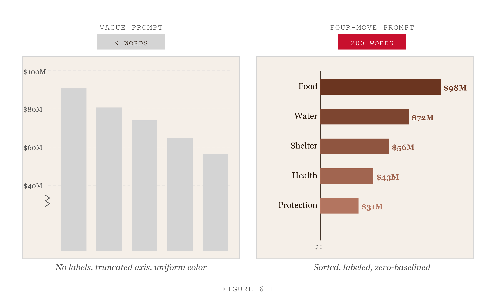
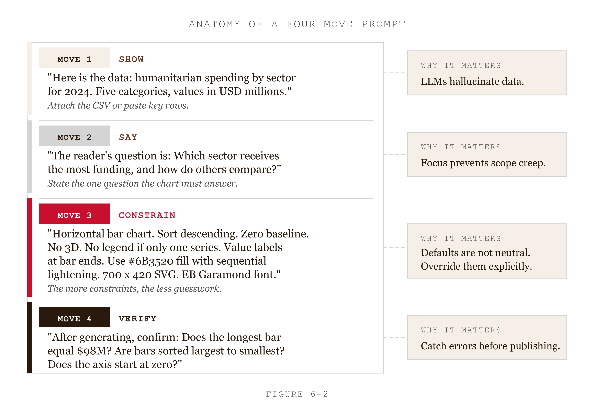
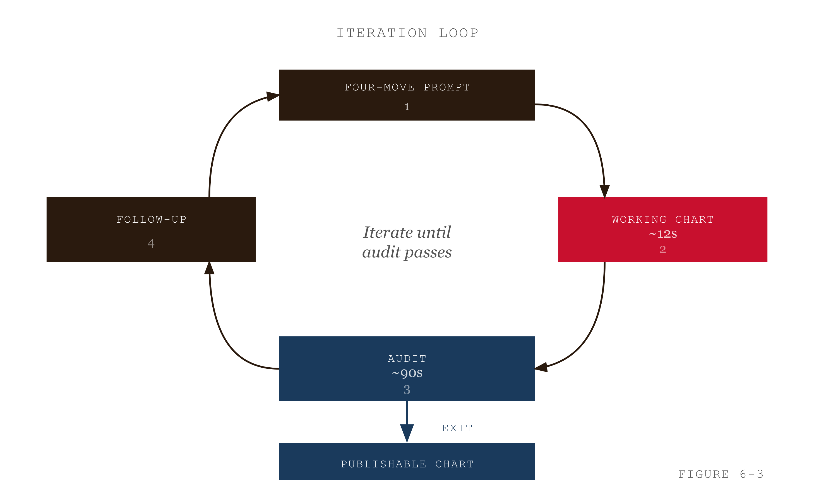
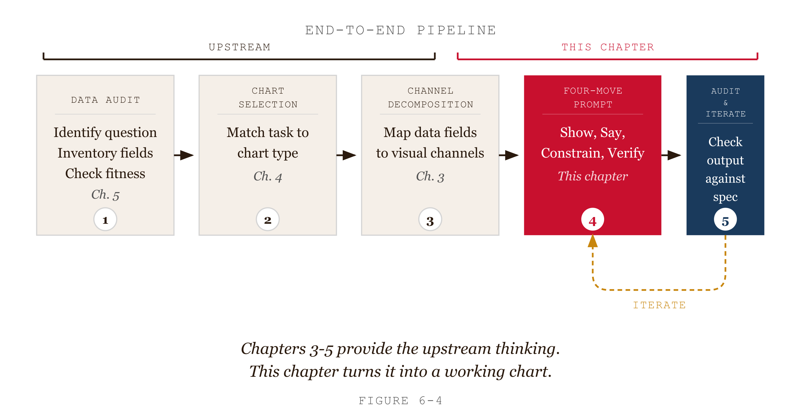
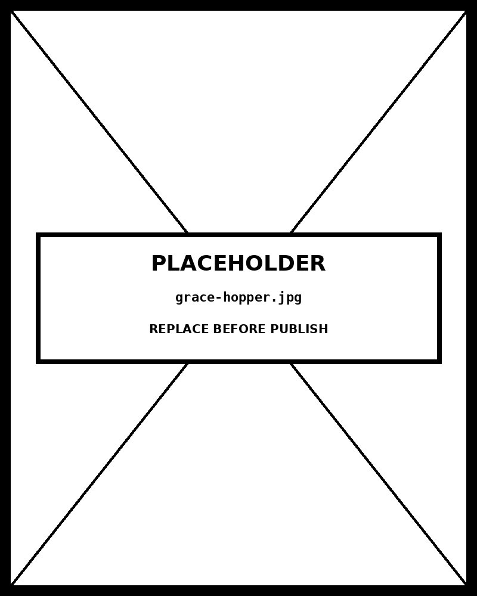

# Chapter 6 — Working with Claude Code
*You Decide, the Machine Renders, You Review.*

---

Here is an experiment. Same dataset, two prompts, twelve seconds each.

The dataset: humanitarian funding by sector for one country in fiscal year 2024. Five sectors. One number per sector. Communication goal: which sectors received the most?

**Prompt one:** "Make a bar chart of humanitarian funding by sector."

The chart that comes back is technically correct. Five bars. The right heights. The y-axis starts at $40 million, not zero — auto-fit to the data range. The bars are the same color. Three of the sector names are twelve to seventeen characters long and they crowd the x-axis unrotated. There are no value labels, so reading the exact amounts requires counting tick marks.

**Prompt two:**

```
Show what I have:
5 rows. Columns: sector (string, 8-17 chars), funding_usd_millions
(number). Sample: Food Security 380.2 / Shelter 142.7 /
Water and Sanitation 98.4 / Health 87.3 / Protection 64.1.

Say what I want:
Horizontal bar chart in D3 v7. Single HTML file, inline D3 via CDN.
Responsive.

Constrain it:
- Marks: rectangles, one per sector.
- y-position: sector, sorted by funding descending.
- x-position from zero baseline: funding. Zero baseline non-negotiable.
- Color luminance redundantly encoding funding, sequential pale-to-dark.
- x-axis ticks at $0, $100M, $200M, $300M, $400M.
- Value labels at the right end of each bar.
- Margins: top 60, right 80, bottom 40, left 160.
- Dark mode via prefers-color-scheme.

Verify:
Restate the channel decomposition first. Then write D3 v7 with comments
showing which line implements which channel. List any unspecified
decisions.
```

The chart that comes back is right on the first attempt. Five horizontal bars sorted by funding, on a zero baseline, pale-to-dark encoding reinforcing the ranking, direct value labels, sector names on the left with room to breathe. The reader ranks the sectors in three seconds.

<!-- → [FIGURE: Two side-by-side bar charts, same dataset. Left: vague-prompt output — column chart, auto-fit y-axis starting at $40M, uniform steelblue bars, crowded x-axis labels unrotated, no value labels. Right: four-move-prompt output — horizontal bars sorted descending, zero baseline, sequential pale-to-dark luminance, direct value labels, left-aligned sector names with generous margin. Caption labels each panel with the prompt that produced it (truncated to one line each). The reader should see, at a glance, what 9 words vs. 200 words buys.] -->


*Figure 6.1 — What 9 words vs 200 words buys*

The difference between the two prompts is not intelligence applied. It is discipline applied. The second prompt is 200 words; the first is 9. But the second encodes the outputs of the previous three chapters — the channel decomposition from Chapter 3, the chart-type selection from Chapter 4, the data structure description that Chapter 3 teaches. Without that upstream work in the prompt, Claude Code is guessing. With it, Claude Code is executing.

This chapter is about the four-move structure, the iteration model, and the audit discipline that takes "working chart" to "publishable chart." The pipeline is the subject.

---

## What the Pipeline Actually Is

The pipeline has five stages. Each one is the output of a chapter.

Chapter 3 read the dataset. You now know the attribute types, the number of observations, the analyst's question versus the reader's question, and the comparison the chart needs to make explicit.

Chapter 4 selected the chart. You now have Cairo's key message in one sentence, the functional category from the FT Visual Vocabulary, and the specific form — horizontal bar, line chart, scatterplot, whatever the message demands.

Chapter 3 decomposed the channels. You now have the marks named, every channel-to-attribute mapping specified, and every design constraint that flows from Chapters 3 and 4.

This chapter writes the prompt, runs it, audits the output, and iterates to publishable. That is the whole job.

Nothing in this chapter produces knowledge that overrides Chapters 3, 4, or 3. If the channel decomposition is wrong, the prompt will be wrong. If the chart type is wrong, the best iteration discipline in the world will not save you — you will iterate to a beautifully executed wrong chart. The upstream work is not optional. This chapter assumes it has been done.

---

## The Four-Move Structure

Every D3 prompt Claude Code receives has the same four moves. The moves come from Chapter 00. They are not a style; they are a protocol.

**Move 1: Show what you have.** The dataset. Number of rows, column names, types, a sample of three to five rows. If the data is in a file Claude Code can read, name the path. If you have a pantry reference chart whose visual conventions match what you want, name that too — "see `pantry/visualization/bar-chart.html` for the design pattern" gives Claude Code a concrete reference and delegates all the visual decisions the prompt does not override.

**Move 2: Say what you want.** The chart type, named explicitly. "Horizontal bar chart." Not "comparison chart" — that is a category, not a form. The output format: "Single HTML file with inline CSS and inline D3 v7 loaded via CDN, responsive to window resize." D3 version number. That is the whole move.

**Move 3: Constrain it.** This is where the work goes. Every mark, every channel-to-attribute mapping, every design constraint from the channel decomposition. Sort order if it matters. Axis tick locations and label format. Color scale — the function, the palette endpoints, the domain. Annotations — value labels, subtitle. Margins. Accessibility metadata. Dark-mode behavior. None of this can be left to defaults if you want a chart that matches the specification you derived in the prior chapters. A two-line "Constrain it" produces a chart on Claude Code's defaults. A twenty-line "Constrain it" produces the chart you specified.

**Move 4: Ask for verification.** A specific form: "Restate the channel decomposition in your own words first. Then write D3 v7 with comments showing which line implements which channel. After the code, list any decisions you made that are not specified above." The restatement catches misinterpretation before code is written. The line-level comments make the channel mapping auditable in the code. The unspecified-decisions list shows you where Claude Code chose for you — and therefore where defaults may not match intent.

The second prompt in this chapter's opening case follows this structure exactly. The four moves are labeled. The "Constrain it" block is the longest. The "Verify" move is the last. This is not a coincidence.

<!-- → [FIGURE: The second prompt from the opening case rendered as an annotated code block. Each of the four moves is highlighted in a different muted color with a label bracket on the left margin: Move 1 (Show what you have), Move 2 (Say what you want), Move 3 (Constrain it — the largest block), Move 4 (Verify). Annotations point out: "data sample goes here," "chart type named explicitly, not categorically," "every channel-to-attribute mapping is a bullet," "verification request is always the last move." This is the template the reader will copy for every chart in the book.] -->


*Figure 6.2 — The template the reader will copy for every chart*

---

## What Claude Code Does and Does Not Do Well

The labor in this pipeline is divided: Claude Code handles syntax and computation; you handle decisions and judgment. Understanding where the line is keeps the pipeline working.

Claude Code is reliable for valid D3 v7 syntax. It is reliable for layout computation — Sankey flows, treemap nesting, force-directed simulations — via D3's layout primitives. It handles responsive resize via window event listeners. It generates accessibility metadata when asked. It implements color scales using D3's interpolators. It produces correct tick formatting.

Claude Code is unreliable for chart selection when the prompt is vague. It reaches for familiar defaults — pie charts for anything with percentages, line charts for anything with dates — the same familiarity bias that Chapter 4 diagnosed in human designers. If the chart-type decision is not in the prompt, Claude Code will make it, and not necessarily well.

Claude Code is unreliable for domain-specific defaults. Financial chart conventions, scientific publication norms, humanitarian-data display standards — these are not in the prompt. Claude Code cannot apply them unless you name them or reference a pantry file that embodies them.

Claude Code is unreliable for performance at scale. Charts with tens of thousands of points, real-time updates, server-side rendering — these require implementation choices (canvas instead of SVG, virtual scrolling, WebGL) that the straightforward D3 approach does not produce. Claude Code can produce a starting point; a developer is often needed to finish.

The division of labor is clean: Claude Code executes; you decide. The four-move structure is how you communicate the decisions to the executor.

| Claude Code handles reliably | You must specify (Claude Code guesses badly) |
|---|---|
| D3 v7 syntax — `d3.scaleLinear()`, `d3.select()`, joins | Chart type — defaults to whatever is most familiar (pie, line) |
| Layout computation — Sankey, treemap, force-directed | Channel-to-attribute mappings — which variable goes on which channel |
| Responsive resize — `<svg viewBox>` with width 100% | Sort order — defaults to source-file order |
| Color scale implementation — sequential, diverging, categorical | Zero baseline — only added when explicitly requested |
| Tick formatting — `d3.timeFormat`, `d3.format` | Domain-specific conventions (financial: green up / red down) |
| Accessibility metadata — when asked | Performance optimizations at scale (>10k marks) |

*The division of labor. Everything in the right column belongs in your "Constrain it" block.*
---

## The MBTA Lesson

Mike Barry and Brian Card built a complete D3-based visualization of Boston's MBTA transit system as a master's thesis project in 2014. Their published reflection includes a sentence that has become the canonical statement of the iteration-on-working-code principle: *"Mockups and prototypes helped us formulate ideas, but nothing beat iterating on working code."*

The sentence is from 2014. It was about D3 development before LLMs. It applies more strongly now because the barrier to producing working code has dropped from hours to seconds. When it took a day to produce the first working chart, iteration cycles were long and expensive. When it takes twelve seconds, the right workflow is to produce something that runs and immediately improve it.

The MBTA lesson has four practical consequences.

**Get a working chart fast.** The first prompt should produce something that opens in a browser and shows the data. Not a perfect chart — a working one. The 200-word prompt from the opening case is the model: specific enough to land near the target, not so exhaustive that the prompt-writing takes longer than the iteration would.

**Iterate on the artifact, not the specification.** Once a chart exists, the iteration target is the chart, not the prompt. You read the chart against the audit, identify the specific failure, and write a follow-up prompt that names it. A good follow-up is small and targeted:

> "The y-axis starts at $40M instead of $0. Reset to a zero baseline. The proportional ink principle requires this for bar charts — bar length encodes magnitude, and a non-zero baseline distorts the channel. Regenerate."

A bad follow-up re-specifies everything from the beginning. The bad version produces a wholesale regeneration that may introduce new failures. The good version produces a small change.

**One concern per iteration.** When multiple things are wrong, fix them in sequence. Two simultaneous changes introduce ambiguity about which fix produced which effect. Debugging becomes harder. The order matters: fix structural failures (wrong channel, wrong baseline, wrong chart type) before stylistic ones (color palette, font size, label position). A chart with the wrong channel mapping cannot be saved by changing colors.

**The rendered chart is the truth.** A working chart shows things that specifications do not. Data clusters in unexpected ways. Labels overlap at small browser widths. A color that looks fine in light mode looks wrong in dark mode. None of this is visible in a written specification. Open the chart in a browser. Resize it. Switch to dark mode. Run a color-blind simulator. The artifact is the truth; the prompt was a hypothesis.

<!-- → [FIGURE: The MBTA iteration loop as a circular flow diagram. Four nodes: (1) Four-move prompt → (2) Working chart (12 seconds) → (3) Audit (Evergreen/Emery subset, 90 seconds) → (4) Targeted follow-up prompt. Arrow from (4) back to (2). A fifth node breaks out of the loop: "Audit passes → Publishable chart." Annotation on the loop: "One concern per iteration. Structural before stylistic." Annotation on the exit arrow: "Typically 1–3 iterations." The MBTA quote appears as a caption: "Nothing beat iterating on working code. — Barry & Card, 2014."] -->


*Figure 6.3 — Nothing beat iterating on working code.*

---

## The Audit

Between the first chart and the publishable chart is the audit. The audit is not intuition — "this doesn't feel right." It is a checklist applied systematically.

Stephanie Evergreen and Ann Emery's 22-point data visualization checklist, which lives in the pantry as `EvergreenDataVizChecklist.txt`, organizes the audit into five categories. Chapter 14 walks the full checklist for project-level design review. This chapter uses the per-chart subset — the items most likely to fail on a Claude Code first output and most straightforward to fix.

**Text.** Is the title clear and informative? Do axis labels name the attribute and its units? If annotations are present, do they support the message rather than restate the obvious?

**Arrangement.** Is the sort order meaningful? For categorical charts: sorted by value, not alphabetically or in source order unless the source order is the point. Is the layout using space efficiently, or are there large empty regions? Does visual flow match reading order?

**Color.** Is every color doing work? Sequential, categorical, or diverging — does the scale type match the data type? Is the palette color-blind safe? Test with a simulator; do not assume.

**Lines.** Do gridlines aid reading without distracting? Stroke widths consistent. No 3D effects, no perspective, no shadow.

**Overall.** No chartjunk that does not support the message. Zero baseline where bar charts require it — this is the proportional ink principle from Chapter 5, grounded in Stevens' power law from Chapter 3. Data shown without distortion. ARIA labels and `<title>` elements present for screen-reader access.

The audit takes ninety seconds for a static chart. It is the difference between "Claude Code produced a chart for me" and "I produced a publishable chart using Claude Code." The distinction matters because it is the difference between executing the tool and owning the output.

---

## Common Failures and the Follow-Ups That Fix Them

Five failures recur across chart types. Each has a standard follow-up form.

**Y-axis auto-fit instead of zero baseline.** Claude Code defaults to `d3.extent(data)` for the quantitative axis, which starts the axis at the minimum value in the dataset. For bar charts this violates proportional ink. The follow-up:

> "Reset the y-axis (or x-axis for horizontal bars) to start at 0. The proportional ink principle: bar length is the magnitude channel. A non-zero baseline compresses the channel. Regenerate the scale and the gridline positions."

**Wrong channel for the data type.** Claude Code sometimes encodes a quantitative variable with color hue — an identity channel — rather than luminance or saturation. Hue cannot be ranked. The follow-up:

> "The chart uses hue to encode [quantitative attribute]. Hue is an identity channel; it distinguishes categories, not magnitudes. Replace with sequential luminance using d3.scaleSequential with d3.interpolateRgb from [pale] to [dark]. Keep y-position as the primary channel; luminance is the redundant encoding."

**Sort order missing or wrong.** The default is often source-file order, which may be alphabetical or arbitrary. The follow-up:

> "Sort the categories by [attribute] descending so the highest value appears first. The categorical axis has no inherent order; the sort gives the reader a ranking."

**Labels overcrowded or rotated unnecessarily.** Rotated x-axis labels on a column chart are sometimes the right call; on a horizontal bar chart they never are. The follow-up:

> "Remove the -30° rotation on the y-axis labels. For horizontal bars, the labels go on the left axis and are read normally. Set rotation to 0 and right-align."

**No accessibility metadata.** Claude Code does not add ARIA labels unless asked. The follow-up:

> "Add ARIA: SVG gets `role='img'` and `aria-label` describing the chart in one sentence. Each bar gets a `<title>` element with the category name and value."

The pattern across all five: name the specific failure, name the rule it violates (from this book's framework), and tell Claude Code what to do differently. No re-specification of the entire chart. One targeted change.

| Failure | What Claude Code does by default | Rule violated | Follow-up prompt template |
|---|---|---|---|
| Auto-fit axis | `d3.extent` on quantitative scale | Proportional ink / zero baseline | "Reset y-axis to start at 0, not at the data minimum." |
| Wrong channel for data type | Hue ramp for quantitative variable | Expressiveness principle | "Replace hue with sequential luminance from `--cream` to `--ink`." |
| Wrong sort order | Source-file order on a categorical axis | Effectiveness principle | "Sort bars by value descending, not by source-file order." |
| Unnecessary label rotation | −30° rotation on horizontal-bar y-axis labels | Arrangement | "Remove rotation, set to 0°, right-align labels with 8px padding." |
| No accessibility metadata | No ARIA attributes on the SVG | Accessibility | "Add `role='img'`, aria-label on the SVG, and a `<title>` element per bar." |

*Keep this table next to your keyboard. These five failures account for most first-output problems.*
---

## A Constitution for Every Project

The four-move prompt works for a single chart. For a project with twenty charts, the four-move structure has an additional layer: the `CLAUDE.md` and `DESIGN.md` files from Chapter 00.

`CLAUDE.md` is the coding constitution. It holds project-wide standards that Claude Code should apply to every chart: D3 version, file-naming convention, accessibility defaults, the requirement to add `<title>` and ARIA labels. Anything you find yourself specifying in every "Constrain it" block is a candidate for `CLAUDE.md`. Reference it at the start of every Claude Code session: "follow the conventions in `CLAUDE.md`."

`DESIGN.md` is the visual constitution. It holds the project's color palette with hex values, the typography rules, the responsive breakpoints, the dark-mode color inversions. Reference it only in sessions that involve visual decisions — loading it on a routine code session wastes instruction space on rules that do not apply to the task.

The split matters because of what Chapter 00 called the instruction budget. The Claude Code context window has a practical limit on how much specification it can hold at once while still producing coherent output. Loading both constitutions plus a twenty-line "Constrain it" block is manageable. Loading them plus the full documentation for a third-party library plus the entire data file in CSV form is not. Use both files judiciously.

After ten charts, review your "Constrain it" blocks. What did you specify in every one? Move it to `CLAUDE.md`. What design decision did you make the same way every time? Move it to `DESIGN.md`. The constitutions improve through use; a blank `CLAUDE.md` on chart twenty is a sign the iteration model was not applied.

---

## The Full Pipeline, Once

Here is the five-stage pipeline walked once through, with the humanitarian funding dataset from the chapter's opening.

**Stage 1 — Chapter 3 audit.** Five rows. Sector: categorical, five values, no inherent order. Funding: quantitative, ratio scale, USD millions. One observation per category. Analyst's question: how are funds distributed? Reader's question: which sectors get the most and least? "Compared with what?" — sectors compared to each other, within-period. Relationship type: comparison.

**Stage 2 — Chapter 4 selection.** Cairo step 1: "Food security received 56% of total funding, more than the next four sectors combined." Step 2: five categorical values, one quantitative attribute. Step 3: comparison. Step 4: horizontal bar chart, sorted descending, long labels suggest horizontal orientation.

**Stage 3 — Chapter 3 channel decomposition.** Marks: rectangles. y-position: sector, sorted descending. x-position from zero: funding, range 0 to 400M. Color luminance: funding, redundant. Annotations: value labels at bar ends, subtitle naming period and units.

**Stage 4 — This chapter's four-move prompt.** The prompt from the opening case. Run it. Twelve seconds. First output.

**Stage 5 — Audit and iterate.** Open in browser. Resize. Dark mode. Color-blind simulator. Apply the five-category checklist. In this case, all items pass. Chart is publishable.

When an item fails, the follow-up is small, targeted, and grounded in the chapter's vocabulary. Typically one to three iterations after the first chart. The pipeline ends when the audit passes.

<!-- → [FIGURE: End-to-end pipeline as a horizontal five-stage flow. Boxes: (1) Chapter 3: Data audit — attribute types, analyst vs. reader question, "compared with what?" (2) Chapter 4: Chart selection — Cairo four steps, functional category, specific form. (3) Chapter 3: Channel decomposition — marks, mappings, constraints. (4) Chapter 5: Four-move prompt → Working chart. (5) Audit & iterate → Publishable chart. Arrows between all five. A "feedback loop" arrow from Stage 5 back to Stage 4 labeled "Structural failure → revise decomposition." Each box also names its deliverable file from the chapter-05-pipeline/ directory (01-data-audit.md, etc.). Caption: "The pipeline. Stages 1–3 are upstream. Stage 4 is this chapter. Stage 5 is the loop that closes the gap."] -->


*Figure 6.4 — The pipeline. Stages 1-3 are upstream. Stage 4 is this chapter.*

---

## What This Changes Going Forward

Every chapter in Part II follows this pipeline. Each chart family — comparison, distribution, relationship, flow, spatial — adds chart-family-specific design rules to the "Constrain it" block. Chapter 6 adds the zero-baseline rule and the sort-by-value convention for bar charts. Later chapters add the IQR whisker rule for box plots, the log-scale-for-skewed-data convention for scatterplots, the rate-not-absolute-count rule for choropleths. The rules are additions to the framework you now have. They do not replace it.

The pipeline is the constant. The channel decomposition belongs in the "Constrain it" block of every chart prompt, regardless of chart type. The "Verify" move belongs at the end of every prompt. The audit belongs after every first output. The iteration belongs between audit and publishable.

Feynman's lecture style had a specific rhythm: here is the phenomenon, here is the question it raises, here is the mechanism that answers it, here is how you would calculate it yourself. This pipeline has the same rhythm. Here is the data. Here is the question. Here is the specification. Here is the chart. The chart is what you calculate. The calculation is correct when the audit passes. The audit passes when the specification was right. The specification was right when the upstream chapters were done.

Do the upstream chapters first.

---

## Exercises

### Warm-up

**Exercise 5.1 — Move identification.** The opening case contains two prompts. For the second prompt, label each of the four moves explicitly. Identify which line or block constitutes Move 1, Move 2, Move 3, and Move 4. Then identify one thing the second prompt specifies that the first prompt leaves to Claude Code's default — and name what Claude Code's default would likely have been.

**Exercise 5.2 — Targeted follow-up writing.** Claude Code produces a chart with these three failures: (1) the y-axis starts at $40M instead of $0, (2) categories are sorted alphabetically instead of by value, (3) color hue encodes a quantitative variable. Write three separate targeted follow-up prompts, one per failure. Order them correctly (structural before stylistic). For each, name the rule the failure violates.

**Exercise 5.3 — Audit application.** Apply the Evergreen/Emery five-category subset (text, arrangement, color, lines, overall) to any chart in the book's pantry. For each category, state pass or fail with a one-sentence justification. For each failure, write the follow-up prompt that would fix it.

### Application

**Exercise 5.4 — Vague vs. four-move comparison.** Build the same chart twice using Claude Code. First attempt: a single-sentence vague prompt. Second attempt: a full four-move prompt derived from the channel decomposition and chart-type selection for the same dataset. Count the iterations each required to reach a publishable output. Compare total time. Report which failures the vague prompt introduced that the four-move prompt avoided.

**Exercise 5.5 — Full pipeline, one chart.** Take a real dataset you have or one from a public repository. Walk the complete five-stage pipeline: Chapter 3 data audit, Chapter 4 chart selection, Chapter 3 channel decomposition, four-move prompt, audit and iterate. Document each stage as a separate markdown file in a `chapter-05-pipeline/` directory. Submit the directory.

**Exercise 5.6 — CLAUDE.md from experience.** Build five charts on the same project using the four-move structure. After the fifth, review your "Constrain it" blocks. Identify every constraint you specified in all five. Write a `CLAUDE.md` that promotes those constraints to project-wide defaults. Test it on a sixth chart: does the "Constrain it" block shrink without losing output quality?

### Synthesis

**Exercise 5.7 — Iteration log analysis.** Build ten charts using the four-move structure and keep an iteration log for each (initial prompt, first output description, each follow-up and the failure it targeted, final result). After ten charts, analyze: which of the five Evergreen/Emery categories failed most often? Which prompt patterns consistently prevented failures? What belongs in your `CLAUDE.md` that is not there yet?

**Exercise 5.8 — When the pipeline breaks down.** Identify a chart request where the four-move pipeline would produce a worse outcome than a different approach — either because the data is too large for inline specification, because the chart requires domain knowledge Claude Code does not have, or because the required interaction pattern is beyond straightforward D3. Describe what breaks and what the right workflow is instead.

### Challenge

**Exercise 5.9 — Multi-LLM iteration comparison.** Take the same flawed Claude Code first output. Write a targeted follow-up prompt and submit it to Claude Code, ChatGPT, and Gemini. Compare how each handles the correction. Where do all three converge on the right fix? Where does each LLM produce a different correction, and what does the divergence reveal about each model's default behavior?

**Exercise 5.10 — Build a team prompt template.** If you work with a team, draft a shared four-move prompt template that captures the team's invariants: D3 version, output format, accessibility defaults, palette reference, dark-mode requirement. Test it on three charts across two team members. Identify where the template under-specifies (different team members fill in different defaults) and revise.

---

## Key Terms

**Four-move prompt.** Show what you have → say what you want → constrain it → ask for verification. The structure that makes Claude Code reliable.

**Working chart.** A chart that runs in a browser and shows the data. The target of the first prompt. Distinguished from a publishable chart.

**Publishable chart.** A working chart that has been audited and iterated to remove the failures the audit caught.

**MBTA iteration model.** Get a working chart fast; iterate on the artifact, not the specification; one concern per iteration; trust the rendered chart over the imagined one. From Barry and Card (2014).

**Targeted follow-up prompt.** A short prompt naming one specific failure and the rule it violates. Distinguished from re-specifying the original prompt.

**Evergreen/Emery checklist.** The audit instrument. Five categories: text, arrangement, color, lines, overall. Full version in `pantry/EvergreenDataVizChecklist.txt`. Chapter 14 walks the complete version.

**CLAUDE.md / DESIGN.md.** The coding and visual constitutions for a project. Constraints that recur in every chart belong in one of the two files.

---

## A note about AI

Claude Code is a specific way of working with the model — code-aware, file-aware, multi-step. The note examines what the integration changes about the failure modes.

Where the model genuinely helps: producing a long sequence of small correct edits faster than you could type them, when the edits are well-specified.

Where the model does damage: producing a long sequence of edits that drift from the original intent, when the intent was vague or incompletely communicated. The drift compounds.

The rule: specify tightly before the run; verify thoroughly after it.

---

## LLM Exercise — Chapter 5: The Full Pipeline

**Project:** [TBD — selected after Chapter 00]

**What you're building this chapter:** A complete D3 chart from raw dataset to publishable output, walked through the full pipeline with an iteration log documenting each failure and the follow-up that fixed it. The deliverable is the workflow that every subsequent chapter applies.

**Tool:** Claude Code (primary) + Claude chat or a Claude Project (for the audit step).

---

**The Prompt (full pipeline):**

```
I am working through Chapter 5 of Brutalist D3 × Claude. I want to
build a complete chart from a dataset, demonstrating the full
pipeline. Help me through the steps:

1. Read the dataset I'm providing: [DESCRIBE: rows, columns, types,
   source]. Communication goal: [DESCRIBE: what the reader needs to
   know in 5 seconds; who the audience is].

2. Apply Chapter 3's audit: data types, analyst's vs. reader's
   question, "compared with what?", relationship type.

3. Apply Chapter 4's selection: Cairo's four-step framework.
   Recommend a chart type with justification.

4. Apply Chapter 3's channel decomposition: marks, channel-to-
   attribute mappings, design constraints.

5. Write the four-move Claude Code prompt that integrates all the
   above. Run it. Read the first output.

6. Apply the Evergreen/Emery five-category subset (text, arrangement,
   color, lines, overall). Identify any failures.

7. For each failure, write a targeted follow-up prompt naming the
   specific failure and the rule it violates.

8. Iterate to publishable (typically 1–3 iterations). Document each
   iteration in a log.

Save outputs as a chapter-05-full-pipeline/ directory:
01-data-audit.md, 02-selection-audit.md, 03-channel-decomposition.md,
04-prompt.txt, 05-iteration-log.md, 06-final-chart.html.
```

---

**What this produces:** A directory containing the full audit-to-output trail for one chart. The directory is your reference template for Chapters 6–14.

**How to adapt this prompt:**
- *For your own dataset:* Replace the dataset description and communication goal.
- *For ChatGPT / Gemini:* Works as-is for the audit stages; the chart itself still gets built in Claude Code.
- *For a Claude Project:* Save the audit framework as system-prompt context; the per-chart pipeline becomes the user message.

**Connection to previous chapters:** This is the integration chapter for Part I. Chapters 3, 4, and 3 produce the inputs; Chapter 5 produces the output. Every subsequent chapter adds chart-family-specific design rules to the "Constrain it" block.

**Preview of next chapter:** Chapter 6 begins the chart-family chapters. The full pipeline applies; comparison-specific design rules (zero baseline, sort-by-value, the Tufte/proportional-ink argument) are the addition.

---

## Further Reading

- **Barry, Mike, and Brian Card. (2014).** "Visualizing MBTA Data." The full project report; read the section on iteration philosophy. Available online.
- **Evergreen, Stephanie. (2019).** *Effective Data Visualization: The Right Chart for the Right Data.* SAGE Publications. The Evergreen/Emery checklist with extensive examples.
- **Few, Stephen.** *Now You See It: Simple Visualization Techniques for Quantitative Analysis.* Chapters on iteration and audit are directly relevant.
- **The book's pantry** — `pantry/EvergreenDataVizChecklist.txt` for the full checklist; `pantry/00-claude-prompting-tips.md` for prompt-writing discipline applied to D3.

---

## Prompts

Use these prompts with Claude to generate interactive D3 v7 versions of the
figures in this chapter. Each produces a standalone HTML file you can open
in a browser and modify freely.

**Prerequisites:** Load `brutalist/CLAUDE.md` and `brutalist/DESIGN.md` into
your Claude project context before using these prompts. They define the stack,
naming conventions, color system, and typography the figures use.

---

### Figure 6.1 — Vague vs four-move prompt output

Two side-by-side bar charts from the same 5-sector humanitarian funding dataset ($98M–$31M). Left: vague-prompt output — vertical columns, y-axis starting at $40M (truncated), uniform steelblue fill, no value labels, crowded x-axis. Right: four-move-prompt output — horizontal bars sorted descending, zero baseline, sequential pale-to-dark luminance, direct value labels, left-aligned sector names. Annotate problems on left panel, virtues on right. D3 v7 single HTML file, 1600×900.

> Reference implementation: `d3/06-working-with-claude-code-fig-01.html`

---

### Figure 6.2 — The annotated four-move prompt

The four-move prompt rendered as an annotated code block. Four sections with colored left margin bars: Move 1 SHOW (lightest), Move 2 SAY, Move 3 CONSTRAIN (largest block, 6 bullet channel mappings), Move 4 VERIFY (darkest). Right-side annotation cards connected by dashed lines: "Data sample goes here", "Chart type named explicitly", "Every channel mapping is a bullet", "Verification is always last." Bottom stat: Moves 1+2+4 ≈ 60 words vs Move 3 alone ≈ 140 words. D3 v7 single HTML file, 1600×900.

> Reference implementation: `d3/06-working-with-claude-code-fig-02.html`

---

### Figure 6.3 — The iteration loop

Circular flow diagram. Four nodes arranged in a loop: (1) Four-move prompt → (2) Working chart (~12 seconds) → (3) Audit (Evergreen/Emery subset, ~90 seconds) → (4) Targeted follow-up prompt → back to (2). Exit path from Audit node: "Audit passes → Publishable chart." Annotation: "One concern per iteration. Structural before stylistic." Typically 1–3 iterations. D3 v7 single HTML file, 1600×900.

> Reference implementation: `d3/06-working-with-claude-code-fig-03.html`

---

### Figure 6.4 — The end-to-end pipeline

Horizontal five-stage flow. Boxes: (1) Data audit — attribute types, analyst vs reader question, "compared with what?" (2) Chart selection — Cairo four steps. (3) Channel decomposition — marks, mappings, constraints. (4) Four-move prompt → working chart. (5) Audit & iterate → publishable chart. Stages 1–3 bracketed "UPSTREAM." Stages 4–5 bracketed "THIS CHAPTER." Feedback loop from 5 → 4 labeled "Structural failure → revise decomposition." D3 v7 single HTML file, 1600×900.

> Reference implementation: `d3/06-working-with-claude-code-fig-04.html`

---

## AI Wayback Machine

The ideas in this chapter didn't appear from nowhere. **Grace Hopper** wrote the first compiler in 1952 — A-0 — arguing that programmers should not write in machine code if a machine could translate from something more human. The chain that runs from her work to "tell Claude what you want" is short.


*Grace Hopper, circa 1960. AI-generated portrait based on a public domain photograph (Wikimedia Commons).*

**Run this:**

```
Who was Grace Hopper, and how does her work on compilers and high-level languages connect to working with code-generating tools like Claude? Keep it to three paragraphs. End with the single most surprising thing about her career or ideas.
```

→ Search **"Grace Hopper"** on Wikipedia.

**Now make the prompt better.** Try one of these:

- Ask it to trace the lineage from A-0 to FLOW-MATIC to COBOL to natural-language prompting.
- Ask it about the actual moth Hopper taped into a logbook — was it really the origin of "debugging"?

What changes? What gets better? What gets worse?
