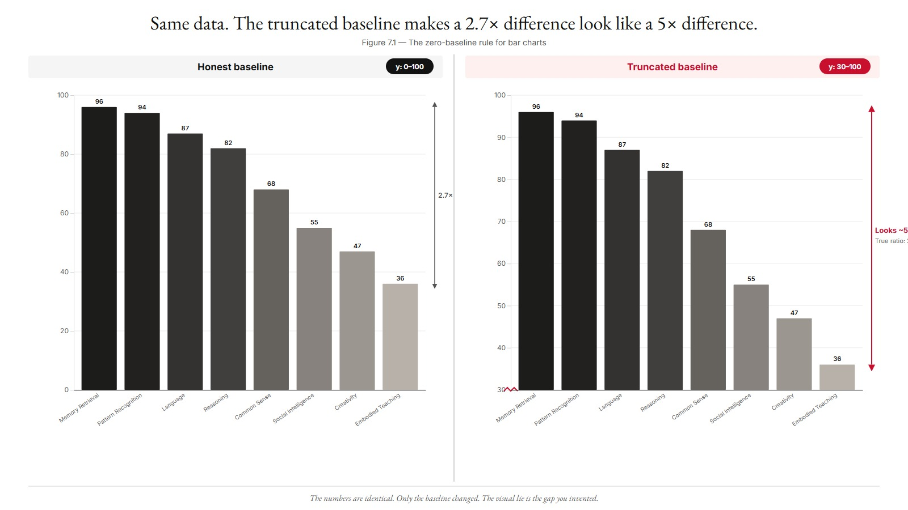
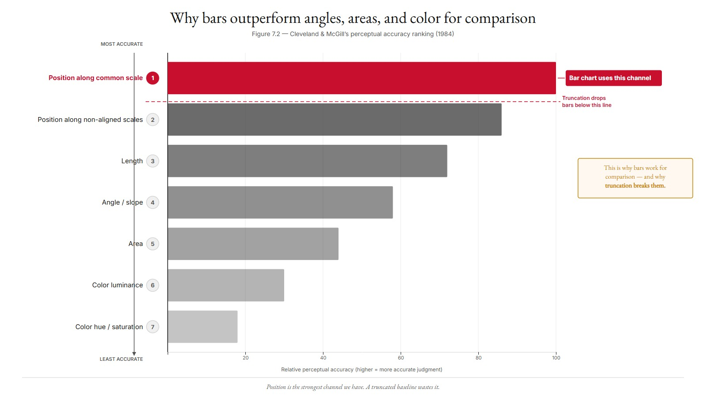
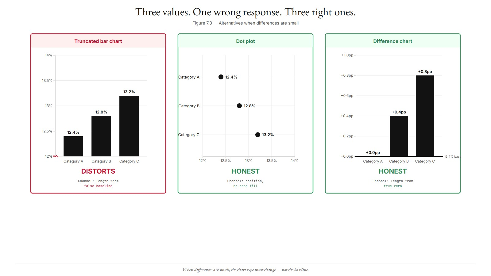
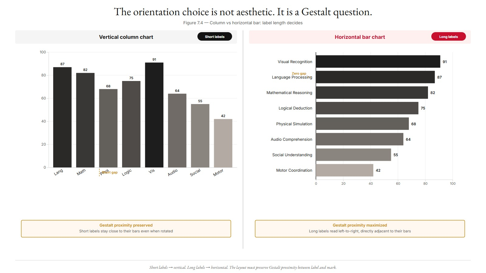
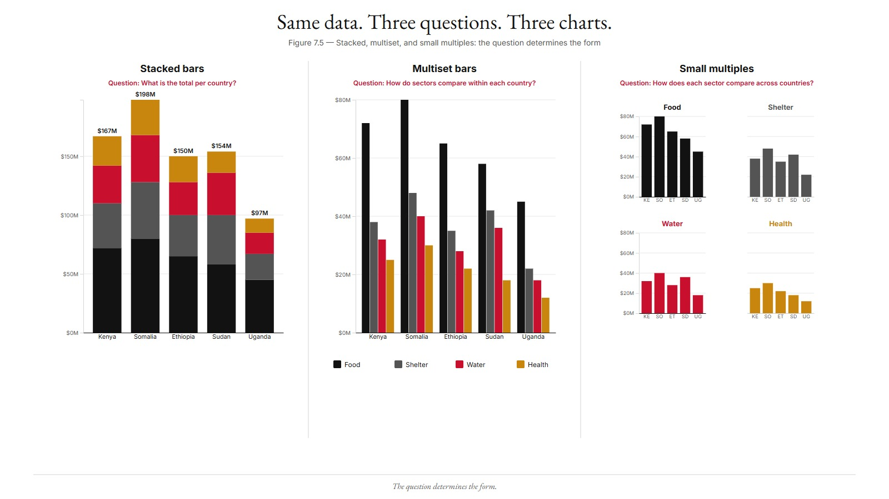
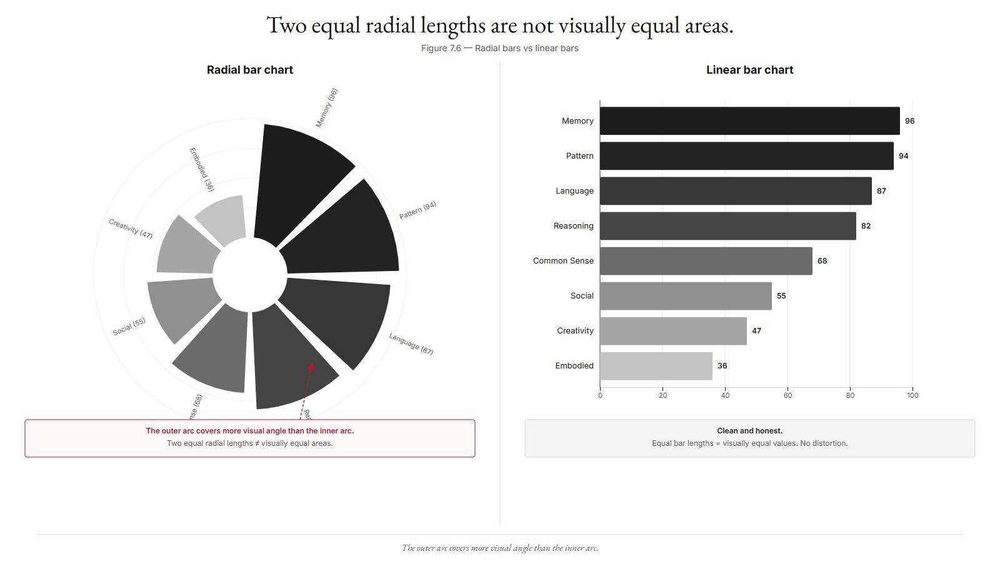
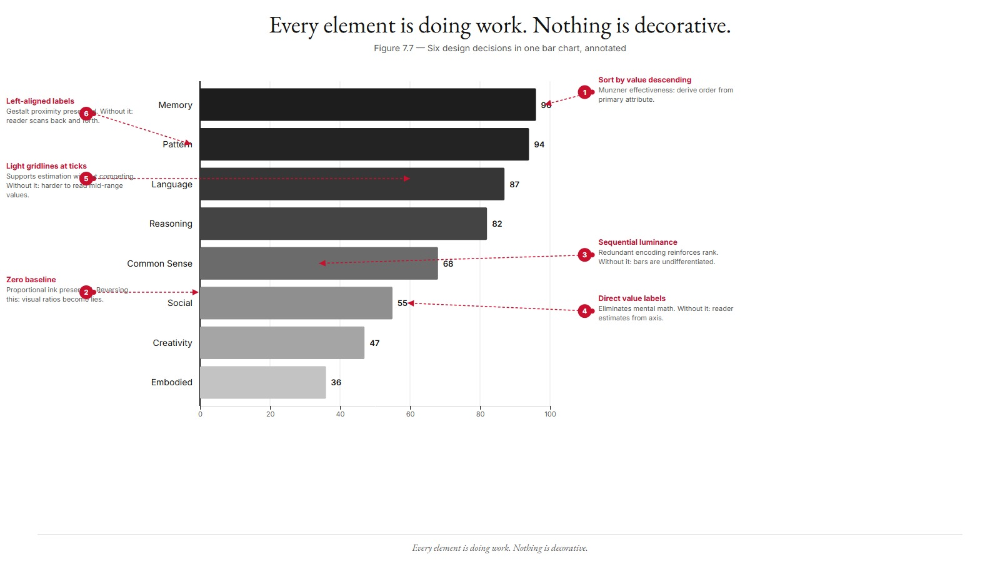
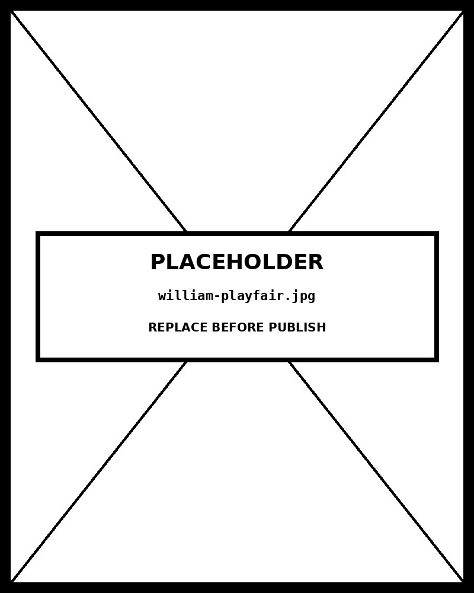

# Chapter 07 — Comparison Charts

*Length Along a Shared Baseline Is the Honest Channel.*

---

Open the pantry's `bar-chart.html` in a browser. Eight cognitive domains line up along the x-axis. Each has a column rising to its score on the y-axis, which runs from 0 to 100. Memory Retrieval at 96 is the tallest. Embodied Teaching at 35 is the shortest. The y-axis starts at zero. The bars are sorted by height, descending. Color gets lighter as scores drop.

You can read the entire ranking in less than a second. You can see that Memory Retrieval and Pattern Recognition are nearly tied. You can see that Moral Judgment and Empathy cluster at the low end. You can see the gap between the strongest domain and the weakest is nearly 60 points.

Now suppose someone hands you this same chart, but the y-axis starts at 30. Embodied Teaching now has almost no bar at all — just a sliver above the baseline. Memory Retrieval towers over it by a factor of four or five. The same data, the same eight numbers. The chart now says that Memory Retrieval is roughly five times Embodied Teaching, when the truth is Memory Retrieval is 96 and Embodied Teaching is 35 — a ratio of about 2.7.

That distortion is not a coincidence or an aesthetic preference. It is a predictable consequence of how the human visual system reads bars. The bar is an area mark. The reader's eye measures the bar's area swept from the baseline up and reads it as a magnitude. Truncate the baseline, and the proportionality breaks. The visual signal disagrees with the data. The reader believes the visual signal.

<!-- → [IMAGE: two side-by-side renderings of the same 8-bar cognitive-domain chart — left panel with y-axis from 0 to 100 (honest), right panel with y-axis from 30 to 100 (truncated). Annotations call out the visual ratio the truncated panel implies between Memory Retrieval and Embodied Teaching (~5×) vs. the true data ratio (~2.7×). Caption: "Same data. The truncated baseline makes a 2.7× difference look like a 5× difference."] -->



Everything in this chapter follows from that mechanism.

---

## What a bar chart actually does

A bar chart uses a specific channel: **position along a common scale**, measured from a shared baseline. In Cleveland and McGill's 1984 empirical ranking of perceptual channels — since replicated by Heer and Bostock in 2010 for the contemporary web era — position along a common scale is the highest-accuracy channel available for quantitative comparison. The reader judges position more accurately than length without a shared scale, far more accurately than angle or area, and vastly more accurately than color intensity or saturation alone.

This is why bar charts work. Not because they are familiar, not because they are minimal, but because they use the channel the human visual system is best at reading.

The empirical ranking also explains why bar charts fail when misused. The channel is position-from-baseline. The reader's perceptual machinery calibrates to that specific encoding. Truncate the baseline and you have not just moved the axis — you have broken the encoding. You are using an area-magnitude channel while pretending it starts where the data starts, not where zero is.

Tufte called this **proportional ink**: the visual area of any chart element must be proportional to the data value it represents. The name is a heuristic. The underlying mechanism is Stevens' power law applied to area perception — the eye reads area approximately linearly (exponent near 1.0 for length), and the calibration assumes zero is the origin.

Pandey and colleagues tested this experimentally in 2015. They showed subjects either honest charts or truncated versions and asked them to rate the magnitude of differences. Subjects shown truncated charts gave systematically higher ratings than subjects shown honest charts — not by a small amount, but by large margins. The distortion is not subtle. It is the dominant signal.

Weissgerber and colleagues (2015) analyzed over 700 biology research articles. More than 88% contained at least one bar graph error. The errors were not confined to corporate slide decks or journalism. They appeared in peer-reviewed science. Researchers using bar charts to support claims like "the experimental group had higher levels of X" produced charts that visually exaggerated those differences. The published conclusion and the visual signal disagreed, and readers believed the visual signal.

This is why the zero-baseline rule is not a Tufte preference or a minimalism position. It is a rule grounded in the mechanism of the channel itself. Violating it produces measurable perceptual distortion.

<!-- → [CHART: horizontal ranking diagram of Cleveland & McGill's perceptual channel accuracy — channels listed from most accurate (position along common scale) to least accurate (color hue/saturation), with the bar chart's channel highlighted and a callout noting where truncation breaks the encoding. Based on the 1984 paper; student should see at a glance why bars outperform angles, areas, and color intensity for comparison tasks.] -->



---

## The argument defenders make, and why it fails

The defense usually goes like this: "The data only varies between 12.4% and 13.2%. If I start the axis at zero, the bars look identical and the reader can't see the difference. I need to truncate to make the variation visible."

Notice what is actually being argued. The data truly is nearly identical — the real difference between 12.4% and 13.2% is 0.8 percentage points, a 6% relative difference. The defense is: because the data is nearly identical, I will use the chart to make it look like it isn't. The solution to a small true difference is to produce a chart that implies a large one.

Cairo's frame applies here with force. The designer's professional obligation is to the reader's understanding. A chart that produces a distorted reading is not just aesthetically imperfect — it is an impediment to understanding. A truncated bar chart in a corporate slide deck is a bad design choice. A truncated bar chart in a research paper that supports a published claim is something stronger than a bad design choice.

There are legitimate responses to small true differences. Three of them:

**Use a different chart type.** A dot plot or point-estimate chart encodes position without using area-from-baseline. The channel is point position, not bar length. You can zoom the y-axis without lying about magnitude because the encoding does not depend on the baseline. If the true difference between 12.4% and 13.2% is worth showing, show it as points with the axis range that makes the difference visible.

**Use a difference chart.** Plot the *change* from a reference rather than the absolute values. A chart of "percentage point change from Q3" has a zero baseline that is meaningful — zero means no change — while still centering the reader's attention on variation.

**Annotate with the numbers.** If the bars serve primarily as a ranking device and precision matters, write the values on the bars. The reader does not need stretched visual distance to see that 13.2% differs from 12.4%. They can read.

The truncated baseline is never the right answer. There is always a legitimate alternative. The defense that the zero baseline "hides the variation" confesses that the variation is small — and uses the chart to pretend otherwise.

<!-- → [INFOGRAPHIC: three-panel comparison using the 12.4% / 12.8% / 13.2% example — left panel: truncated bar chart (y-axis 12–14, distorted), center panel: dot plot with zoomed y-axis (honest, shows variation without distortion), right panel: difference chart showing percentage point change from baseline. Each panel labeled with the channel it uses and a verdict (distorts / honest / honest). Caption: "Three values. One wrong response. Three right ones."] -->



---

## The choice between horizontal and vertical

A bar chart can orient its bars horizontally (categories on the y-axis, values on the x-axis) or vertically (categories on the x-axis, values on the y-axis). The choice is structural, not stylistic.

Two variables determine it: **label length** and **category count**.

When category names are long, use horizontal bars. The horizontal bar chart places its labels along the y-axis. Each label sits directly to the left of its bar. Gestalt proximity puts the label and its value in the same reading path; Gestalt continuity allows the eye to move horizontally from label to bar tip without changing direction. The reader extracts each category's value without rotating their head.

When category names are long and you use vertical columns, you have three bad options: truncate the labels (you lose information), rotate them at -30° to -45° (you slow the reader), or wrap them onto multiple lines (you compress the chart). The pantry's `bar-chart.html` accepts the rotation cost because the domain names — 12 to 17 characters — are short enough to remain readable when rotated and the vertical orientation matches the dashboard convention. If the names were 25 characters, horizontal bars would be the right choice.

The rough threshold: if the longest label exceeds 10 to 12 characters, default to horizontal bars.

Category count works the same way. For many categories — more than 15 or so — horizontal bars produce a tall chart that can scroll; vertical columns produce label crowding. Neither is ideal. At 25 or more categories, a single bar chart of any orientation usually fails the "read the ranking in five seconds" test, and one of the redesign options applies: show the top N with an "all other" summary, group categories into a higher-level taxonomy, or switch to a treemap.

Vertical columns are the cultural default for small datasets with short labels. Horizontal bars are the right choice for long labels and larger category counts. The choice costs nothing in perceptual accuracy — position is position.

<!-- → [INFOGRAPHIC: two-panel decision diagram — left panel shows a vertical column chart with 8 short labels (~6 characters each, readable at -30°); right panel shows a horizontal bar chart of the same data with longer labels (~20 characters, reading naturally left-to-right). Gestalt proximity arrows show the label-to-bar relationship in each orientation. Caption: "The orientation choice is not aesthetic. It is a question of which Gestalt principles the layout can preserve."] -->



---

## When one variable becomes two

A simple bar chart compares one quantitative attribute across categories. When you have two attributes per category — sales by region for 2023 and 2024, say — the design splits into three options. Each serves a different question.

**Multiset (grouped) bars.** Two bars per category, side by side, distinguished by color hue. Each sub-category bar has its own baseline, so the reader is making the highest-accuracy comparison available: position along a common scale, for each bar independently. The multiset form answers within-category questions cleanly: which year was higher in each region? The cost is that cross-category comparison of the same sub-category (how did 2023 perform across all regions?) is hard — the sub-category bars are not adjacent to each other.

**Stacked bars.** One bar per category, segmented into colored sub-regions. The total bar height represents the sum. Stacked bars answer the total question cleanly: which region had the most revenue overall? The cost is that any segment except the bottom one loses its baseline. The second segment in column A starts at a different y-position than the second segment in column B. The reader is now comparing position along *non-aligned* scales, which Cleveland and McGill rank well below the aligned case. Cross-category segment comparison becomes unreliable.

**Small multiples.** One panel per sub-category, with a shared y-axis scale. Each panel's bars use position along a common scale — the highest-accuracy channel — and comparison across panels uses position along aligned scales, the second-best option. Small multiples answers cross-sub-category questions cleanly: how did each product line perform across all regions?

The choice between these three forms is not aesthetic. It follows directly from which question the reader is answering.

Within-category comparison is the question → **multiset bars** (each bar on its own baseline, highest-accuracy channel for within-category).

Across-category total is the question → **stacked bars** (total bar uses position from zero; composition visible but not precisely comparable across categories).

Cross-sub-category comparison is the question → **small multiples** (each panel gets a zero baseline; comparison uses aligned scales across panels).

A concrete example. Five countries, four humanitarian funding sectors, one year. Three communication questions, three chart choices:

- "Which countries received the most total funding?" The question is about totals. Stacked bars: one bar per country, segmented by sector.
- "In which sectors did each country receive the most?" The question is within-country. Multiset bars: four adjacent bars per country, one per sector.
- "Which sector was funded most across all countries?" The question is cross-sector. Small multiples: one panel per sector, bars for each country, shared y-axis.

Same dataset. Different questions. Different charts. The chart is not "the one that looks best with this data." The chart is the answer to the question.

<!-- → [INFOGRAPHIC: three-panel side-by-side of the same 5-country × 4-sector humanitarian funding dataset rendered three ways — left: stacked bars (total is primary), center: multiset bars (within-country sector comparison), right: small multiples (cross-sector comparison across countries, shared y-axis). Each panel labeled with the question it answers and the channel-ranking justification. Caption: "Same data. Three questions. Three charts. The question determines the form."] -->



---

## Radial bars: when the curve earns its keep

A radial bar chart wraps bars around a central point. Bar length becomes radius. The bars fan out like spokes on a wheel.

Radial bars are visually striking. They are also perceptually worse than linear bars for almost every comparison task. Cleveland and McGill's ranking is clear: position along a common scale (linear bars) outranks length along a curve. The eye cannot judge length along a curve as accurately as length along a straight line — the curvature interrupts the eye's ability to extrapolate the baseline comparison that makes bar charts work. On top of this, the outer arcs of a radial chart cover more visual angle than inner arcs of the same "length," producing a second distortion: two bars of identical radial length sweep out different visual areas. The eye misreads this discrepancy in ways that no amount of attention corrects.

This is not minimalism. This is not a preference for simple charts over decorative ones. It is the channel-theory claim: radial bars use a worse channel than linear bars, and the perceptual cost is real.

Two cases earn the radial complexity. The first is **cyclic data** — months of the year, hours of the day, days of the week. The radial layout reinforces the cyclic structure. A bar chart of monthly precipitation arranged around a clock face encodes the cycle directly; the eye reads the pattern of wet months and dry months as a rotation rather than fighting the form. The perceptual cost is paid in service of a genuine rhetorical move: showing that the data is cyclic.

The second is **decorative or marketing contexts** where the chart's primary role is to draw attention rather than communicate precise values. The visual interest is the point. The audience's job is not precision.

For ordinary comparison of categories without an inherent cycle, radial bars are just bars made harder to read. The pantry's `radial-bar-chart.html` shows a working implementation. Compare it to `bar-chart.html`. The linear version is unambiguously easier to read — which is the finding, every time. "More modern" does not mean "more legible." The FT, the NYT, Reuters, and the Pudding use linear bars overwhelmingly. The radial form appears in magazines, marketing dashboards, and infographics where visual interest is the explicit goal.

<!-- → [IMAGE: side-by-side of radial bar chart and linear bar chart using the same 8-category cognitive domain data — left: radial bars fanned around a center point; right: linear horizontal bars. A callout on the radial panel marks two bars of similar "radial length" that sweep different visual areas due to their position (inner vs. outer arc). Caption: "The outer arc covers more visual angle than the inner arc. Two equal radial lengths are not visually equal areas."] -->



---

## When the bar chart stops working

Bar charts scale comfortably from 2 categories to roughly 15. Beyond 15, the form starts breaking down for converging reasons.

Label crowding appears first. Even with rotation, 20 or more labels compress into illegibility at any reasonable chart width. Ranking precision erodes next: when 25 bars cluster in a narrow range, the eye cannot order them at a glance — which is the bar chart's primary advantage over a data table.

The redesign options:

**Top N with a summary.** Show the highest 15 categories explicitly. Aggregate the remaining into "all other (N categories, total = X)." Add a callout if any excluded categories are notable. The reader gets the ranking signal the bar chart provides and a honest accounting of what is excluded.

**Hierarchical grouping.** If 30 sub-categories belong to 5 super-categories, show the super-category chart. Provide the sub-category breakdown as a supplement or drill-down.

**Treemap.** For the full set of 30 or more categories, a treemap often outperforms a bar chart on pixel efficiency. Bars have one magnitude channel (length). Treemaps also have one (area). Stevens' power law makes treemaps less precise than bars for rank-ordering — area perception is slightly nonlinear where length perception is nearly linear — but more practical when category count exceeds what a bar chart can legibly display.

**Lollipop chart.** A point at the value connected to the baseline by a thin line. Same channel as a bar (length from zero), lower visual weight. The lollipop scales to 30 or more categories without the wall-of-bars effect that makes dense bar charts feel like lists rather than comparisons. This is Few's "clarity over minimization" position made concrete: the lollipop is not chartjunk, it is a sensible refinement of the bar when bar density is the problem.

---

## The design decisions in the pantry chart, one by one

Return to the `bar-chart.html` example. Every decision it makes is doing visible work.

**Sorted by value descending.** The eight cognitive domains have no inherent order — they are not arranged on any natural scale. The chart imposes a ranking from the most important attribute. This is Munzner's effectiveness principle: when the data does not impose an order and an order is meaningful, derive one from the attribute the reader cares most about.

**Color luminance as redundant encoding.** The score is encoded twice — once on bar height (position from zero, the highest-accuracy channel) and once on color luminance (a magnitude channel ranked sixth by Cleveland and McGill). The redundancy is intentional. Position carries the information; luminance reinforces the ranking and supports color-blind readers and casual scanning. This is functional redundancy in Few's sense: an encoding that supports the message without distorting it. The Tufte purist would remove the color variation on the grounds that it adds no information. Few's response — supported by the Bateman et al. (2010) experimental study — is that the right criterion is "does this support the message," not "is this strictly data ink." The pantry chart's luminance encoding helps readers; it does not mislead them.

**Score values above each bar.** The bars serve as a ranking device; the numbers provide precision. The reader extracts both without effort. This is not annotation for its own sake — it is the honest acknowledgment that bar height conveys rank more accurately than it conveys exact value, and that the exact values matter for this data.

**Grid lines at axis ticks, opacity 0.07.** Light enough to be nearly invisible when scanning, present enough to support precise reading against the y-axis when the reader needs a value. The Tufte position would eliminate them. The Few-resolved position keeps them because they serve the reader without distorting the data.

None of these decisions is decorative. Each is the deliberate application of a perceptual principle to a specific design problem. The chart took roughly 70 lines of D3 to build. What makes it good is not the code — it is the channel decomposition the code implements. You can describe that decomposition in a hundred words. Claude Code can then write the seventy lines.

<!-- → [INFOGRAPHIC: annotated screenshot of bar-chart.html with six callout arrows, one per design decision — sort order, zero baseline, luminance redundancy, score annotations, grid lines, label rotation. Each callout names the decision, the perceptual principle it applies (e.g., "Munzner effectiveness: derive order from primary attribute"), and what would break if the decision were reversed. Caption: "Every element is doing work. Nothing is decorative."] -->



---

## What you can now do

You can apply the bar-versus-column choice structurally: label length and category count, with Gestalt proximity and continuity as the perceptual mechanism behind the rule.

You can defend the zero-baseline rule from its mechanism — Stevens' power law on area perception, codified by Tufte as proportional ink, confirmed experimentally by Pandey et al. — and recognize that the rule is non-negotiable because the violation distorts the magnitude channel itself, not merely the aesthetics of the chart.

You can choose between multiset, stacked, and small multiples by mapping the communication question to the channel ranking: within-category comparison to multiset, across-category total to stacked, cross-sub-category comparison to small multiples.

You can recognize when a radial bar chart earns its curve — cyclic data, decorative contexts — and when it is a decorative substitute for a more honest linear form.

You can specify a comparison chart precisely enough that Claude Code produces a perceptually honest output on the first attempt, and audit that output against the principles this chapter establishes.

The thing to watch for going forward is the temptation to use a comparison chart for a question it is not built for. A bar chart of values that change over a continuous time dimension wants a line chart. Bars representing parts of a whole want a stacked form — or, with many components, a redesign as a treemap. The bar chart is the workhorse of comparisons between distinct categories. Comparisons are not every question.

---

## Exercises

### Warm-up

**Exercise 7.1 — Orientation choice.** *(Tests: label-length and category-count rule)*
For each dataset below, decide between horizontal bars and vertical columns. Justify each choice using label length and category count, and name the Gestalt principle that drives the decision:
- 5 product categories: Electronics, Apparel, Home Goods, Sports, Beauty. Quantity: revenue.
- 22 country codes (ISO 3-letter). Quantity: GDP per capita.
- 8 cognitive domains as in the chapter's working example. Quantity: AI capability score.
- 4 regions: North America, EMEA, APAC, LATAM. Quantity: customer count, with labels also including the year "2024 North America," "2024 EMEA," etc.

**Exercise 7.2 — Zero-baseline audit.** *(Tests: proportional-ink principle and Stevens' power law)*
A bar chart of marketing campaign engagement rates shows a y-axis from 6.0 to 7.5. The bars range from 6.2 to 7.3. Identify the proportional-ink violation precisely — what ratio does the chart imply between the highest and lowest bars, and what ratio does the data actually support? Then specify all three legitimate alternatives to the truncated y-axis, and state which channel each alternative uses.

**Exercise 7.3 — Multiset vs. stacked vs. small multiples.** *(Tests: question-to-form mapping)*
You have quarterly revenue for 4 product lines across 3 fiscal years. For each question below, name the right form (multiset, stacked, or small multiples) and cite the channel-ranking reason:
- "Which product line had the highest Q4 2023 revenue?"
- "How has total revenue grown from 2022 to 2024?"
- "How has Product A's revenue trajectory compared to Product B's across all three years?"

### Application

**Exercise 7.4 — Build a bar chart with Claude Code.** *(Tests: four-move prompt structure + verification)*
Take a real dataset with 5–10 categories and one quantitative attribute. Write a four-move Claude Code prompt following the pattern from this chapter's LLM Exercise. Submit it. Then audit the output: zero baseline present? Sort order meaningful? Color used purposefully — no magnitude on hue? Labels readable? Color-blind safe? If any item fails, write the follow-up prompt that corrects it. Hand in the prompt, the output HTML, and the audit log.

**Exercise 7.5 — Multiset vs. small multiples comparison.** *(Tests: within-category vs. cross-sub-category question distinction)*
Take a dataset with 5 categories and 3 sub-categories per category (15 values). Build a multiset bar chart. Build the same data as small multiples with a shared y-axis. Now ask the question: "Which sub-category was largest across all categories?" Answer it using each chart. Which form answers the question more accurately, and why? Ground the answer in the Cleveland and McGill channel ranking.

**Exercise 7.6 — Legitimate truncation substitutes.** *(Tests: alternatives to the truncated baseline)*
Find a published bar chart with a truncated y-axis — corporate report, news graphic, or research paper. Confirm it is a bar chart (not a line chart). Implement all three legitimate alternatives: a dot plot of the same data with a zoomed y-axis, a difference chart showing change from a reference, and the original chart with value annotations added. Compare the three. Which best serves the reader's question? Justify with channel theory.

### Synthesis

**Exercise 7.7 — Truncated-axis audit in the wild.** *(Tests: proportional-ink violation identification + Cairo's ethical frame)*
Find three bar charts in published reports — corporate, governmental, or from a scientific journal — with truncated y-axes. For each: calculate the perceptual ratio the chart implies (tallest bar height divided by shortest bar height, visually), the true data ratio (largest value divided by smallest), and the distortion factor (perceptual ratio divided by true ratio). Rank the three by severity. Apply Cairo's ethical frame to each: which is a stylistic oversight, and which crosses into a professional failure?

**Exercise 7.8 — Cyclic data: radial vs. linear.** *(Tests: when radial form earns its complexity)*
Take a dataset with clear cyclic structure — monthly sales, hourly website traffic, or day-of-week activity counts. Build both a radial bar chart and a linear bar chart from the same data. For the question "which period has the highest value," which form answers more accurately? For the question "is there a cyclic pattern in the data," which form answers more clearly? Where exactly does the trade-off land, and what does that tell you about the cases where radial is the right choice?

### Challenge

**Exercise 7.9 — Production redesign.** *(Tests: full audit and channel-grounded redesign)*
Find a bar chart in a recent annual report or earnings deck. Audit it against the principles of this chapter: orientation choice (label length, category count), zero-baseline compliance, sub-category form (multiset/stacked/small multiples appropriateness), color encoding (no magnitude on hue), label legibility. Redesign with Claude Code, correcting every failure. Submit a side-by-side comparison of original and redesign with one paragraph per correction, naming the perceptual mechanism each fix serves.

**Exercise 7.10 — The 15+ category problem.** *(Tests: bar chart scaling limits and redesign options)*
Take a real dataset with 25 or more categories and one quantitative attribute. Build a bar chart. Document the label-crowding and ranking-precision failures that appear. Then implement two of the four redesign options from the chapter: top-N with summary, hierarchical grouping, treemap, or lollipop. For each redesign, identify which failure the original chart had that the redesign resolves, and what (if anything) the redesign gives up. Ground the comparison in channel theory.

---

## A note about AI

Comparison charts are the most overused category in the book. The model produces bar charts on request. Whether a bar chart is the right comparison is a different question.

Where the model genuinely helps: producing the alternative comparison forms — slope charts, dot plots, dumbbell charts — for the same data, so you can see what the default obscures.

Where the model does damage: defaulting to a grouped bar chart for any multi-category comparison. The default fails when categories are many, when ordering matters, or when the comparison is relative rather than absolute.

The rule: ask for alternatives before you accept the default.

---

## LLM Exercise — Chapter 07: Comparison Charts

**What you're building:** A complete, audited comparison chart for a real dataset, plus the channel-mapping audit document and the Claude Code prompt that produced it.

**Tool:** Claude Code (for the build) + Claude chat (for the audit and iteration).

### The prompt

```
I have a dataset of [DESCRIBE: your data — rows, columns, types]. The
communication goal is [DESCRIBE: what the reader needs to know in 5
seconds].

Walk me through the comparison-chart design for this dataset using the
Bertin/Cleveland/Munzner framework:

1. Confirm the chart family is comparison (vs. time-series, distribution,
   relationship, etc.). If it isn't, recommend the right family and stop.

2. Decide bar vs. column orientation based on label length and category
   count. Cite Gestalt proximity and continuity in the justification.

3. If there are sub-categories, decide multiset vs. stacked vs. small
   multiples based on the communication goal. Cite the channel ranking
   in the justification — within-category comparison wants multiset
   (each bar on its own baseline), across-category total wants stacked,
   cross-sub-category comparison wants small multiples.

4. Specify the channels:
   - x-position (or y-position): which attribute
   - bar height (or length): which attribute, with zero baseline
     (cite proportional ink and Stevens' power law)
   - color: which attribute, sequential / categorical / redundant
   - any other channels in use

5. Specify the layout: axis ticks, label rotation, annotations, sort
   order, margins, color scale endpoints, dark-mode behavior.

6. Write a single Claude Code prompt using the four-move structure
   (show, say, constrain, verify), precise enough that Claude Code
   produces a usable D3 v7 chart on the first attempt.

After Claude Code returns the chart, audit it:
- Zero baseline present?
- Sort order meaningful?
- Color used purposefully — no magnitude encoded on hue?
- Labels readable without rotation forcing errors?
- Color-blind safe?

Flag any audit failure and write the follow-up prompt that corrects it.
```

**What this produces:** A markdown audit document and an HTML file containing the working D3 chart. Save as `chapter-07-comparison-audit.md` and `chapter-07-comparison.html`.

**How to adapt this prompt:**
- *For your own domain:* Replace the dataset description.
- *For ChatGPT or Gemini:* Works as-is.
- *For a Claude Project:* Save the Chapter 01 channel framework as a reference file; the per-chapter audit prompt becomes the user message for each new chart.
- *For Cowork:* Use Cowork to execute the Claude Code prompt and save the resulting HTML file directly to your project directory.

**Connection to previous chapters:** Builds on Chapter 01 (channel ranking, Stevens' power law), Chapter 02 (chart selection — confirming you are in the comparison family), Chapter 05 (data type identification and the pre-chart audit). The audit step here applies the comparison-chart subset of the Evergreen/Emery checklist; the full checklist appears in Chapter 14.

**Preview of next chapter:** Chapter 08 extends comparison into data with a continuous time dimension. The static ranking becomes an evolving trajectory. The zero-baseline rule shifts: bar charts require it because length is the channel; line charts do not, because the channel is point position, not area from a baseline. The chapter shows where each rule applies and why.

---

## Further reading

- **Cleveland, William S., and Robert McGill. (1984).** "Graphical Perception: Theory, Experimentation, and Application to the Development of Graphical Methods." *Journal of the American Statistical Association* 79(387). The foundational empirical ranking of perceptual channels that grounds every "prefer bars for comparison" claim in this chapter.
- **Heer, Jeffrey, and Michael Bostock. (2010).** "Crowdsourcing Graphical Perception: Using Mechanical Turk to Assess Visualization Design." *CHI '10.* The replication that confirms the Cleveland & McGill ranking for the contemporary web era.
- **Tufte, Edward R. (1983, 2nd ed. 2001).** *The Visual Display of Quantitative Information.* Chapters 4–5 establish proportional ink and the data-ink ratio. Read the principles; apply them as Few-resolved heuristics, not commandments.
- **Few, Stephen. (2011).** "The Chartjunk Debate: A Close Examination of Recent Findings." *Visual Business Intelligence Newsletter.* The transcript is in the book's pantry. The clarity-over-minimization position this book adopts.
- **Weissgerber, Tracey L., Natasa M. Milic, Stacey J. Winham, and Vesna D. Garovic. (2015).** "Beyond Bar and Line Graphs: Time for a New Data Presentation Paradigm." *PLOS Biology* 13(4). The empirical analysis of bar-chart misuse in biological research.
- **Pandey, Anshul Vikram, et al. (2015).** "How Deceptive Are Deceptive Visualizations?" *CHI '15.* Controlled experiments on truncated y-axes confirming the perceptual distortion the proportional-ink principle predicts.
- **Cairo, Alberto.** *Ethical Infographics.* The designer's professional obligation to the reader's understanding. In the book's pantry as `Cairo Ethical Infographics.txt`.
- **Knaflic, Cole Nussbaumer. (2015).** *Storytelling with Data.* Chapter 4 is a particularly clear treatment of chart selection for comparison tasks, with worked examples.
- **Evergreen, Stephanie, and Ann K. Emery.** Data Visualization Checklist. The audit instrument used throughout this chapter. Available at stephanieevergreen.com and in the book's pantry.

---

*Tags: comparison-charts, bar-chart, column-chart, multiset, grouped-bars, stacked-bars, radial-bar, zero-baseline, proportional-ink, Tufte, Few, Cairo, Weissgerber, Pandey, label-length, small-multiples, Cleveland-McGill, Stevens-power-law, Gestalt-proximity, Gestalt-continuity, Evergreen-Emery, D3, Claude-Code, channel-specification*

---

## AI Wayback Machine

The ideas in this chapter didn't appear from nowhere. **William Playfair** invented the bar chart, line graph, and pie chart in his 1786 *Commercial and Political Atlas* — and used them to make political arguments about British trade. Most of the chart vocabulary you use today is his.


*William Playfair, circa 1800. AI-generated portrait based on a public domain engraving (Wikimedia Commons).*

**Run this:**

```
Who was William Playfair, and how do his 1786 chart inventions connect to the comparison charts we covered in this chapter? Keep it to three paragraphs. End with the single most surprising thing about his career or ideas.
```

→ Search **"William Playfair"** on Wikipedia.

**Now make the prompt better.** Try one of these:

- Ask it to redraw Playfair's bar chart of Scottish imports in modern D3 conventions — what changes about the message?
- Ask it about Playfair's side career as a banker, fraudster, and rumored spy.

What changes? What gets better? What gets worse?
