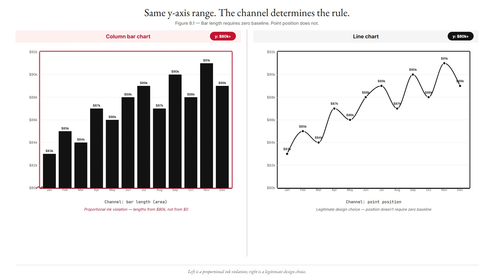
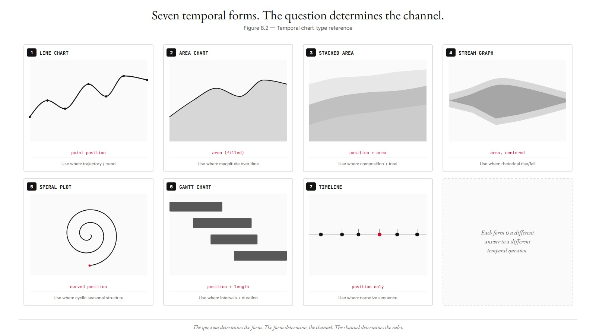
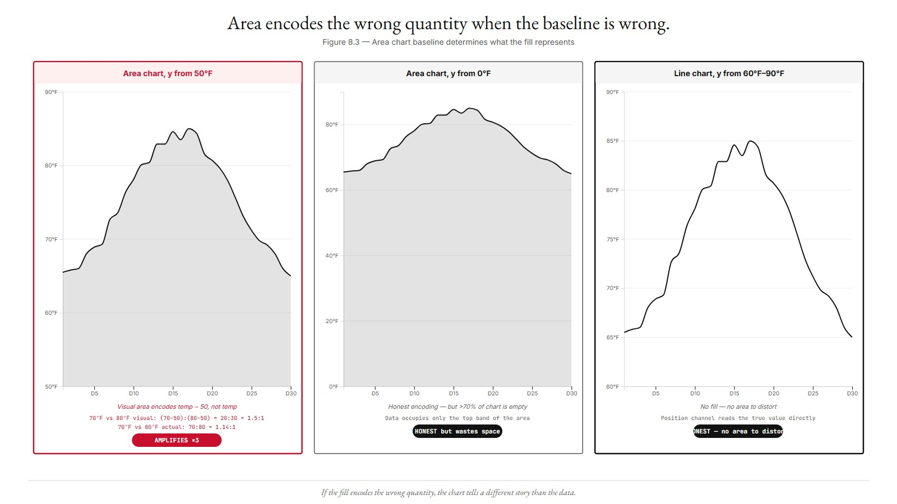
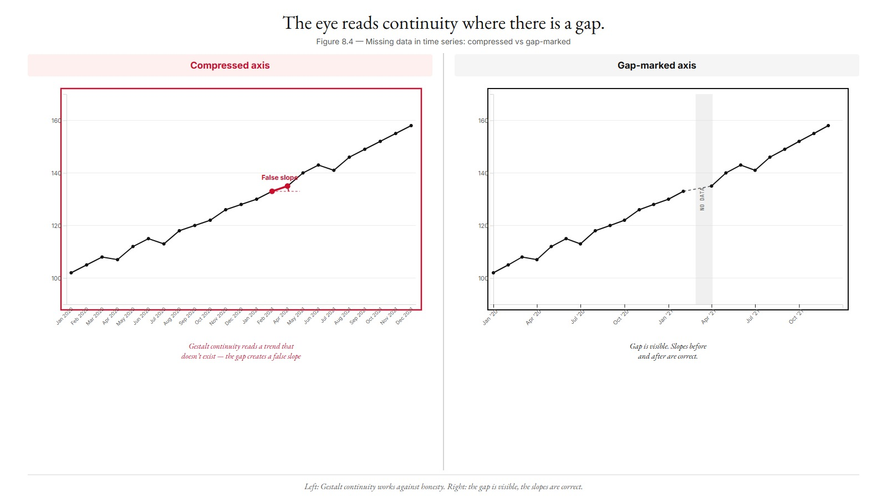
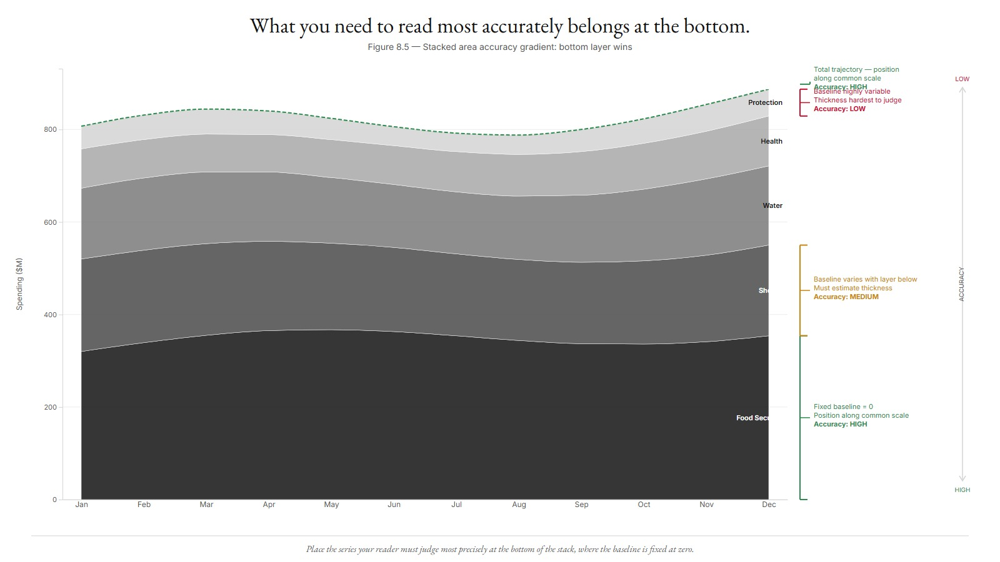
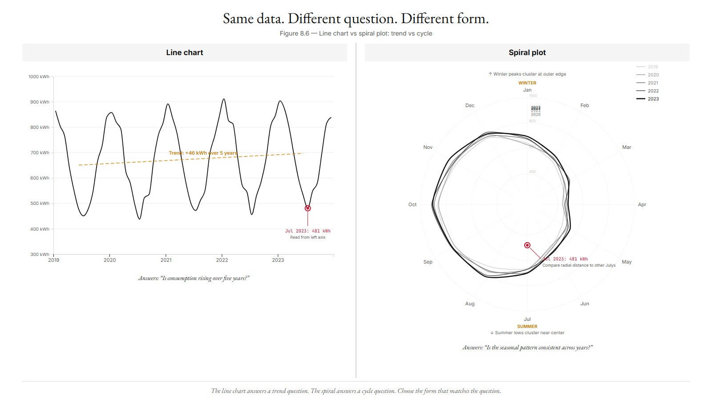

# Chapter 8 — Time Series and Temporal Charts
*What Changes, in What Direction, How Fast.*

---

Here is a question that looks simple until you try to answer it precisely: when does a bar chart lie, and a line chart with the same non-zero y-axis not?

Both charts can show monthly revenue. Both can start their y-axis at $80,000 instead of $0. In the bar chart, this is a proportional ink violation — the bar's length is the magnitude channel, and a truncated baseline makes a $90,000 month look ten times larger than an $85,000 month when it's actually only 6% larger. In the line chart, this is fine — the channel is *point position*, not bar length, and a tight y-axis range often shows the variation more clearly than a zero baseline that compresses everything into the top 10% of the chart.

Same visual trick. Different channel. Different verdict.

<!-- → [FIGURE: Two side-by-side charts, identical monthly revenue data (12 months, range $83k–$91k). Left: column bar chart, y-axis from $80k — the bars are dramatically different heights even though values differ by <10%. Right: line chart, same y-axis from $80k — this is now fine, because point position is the channel, not bar length. Caption: "Same y-axis range. Left is a proportional ink violation; right is a legitimate design choice. The channel determines the rule." Label each panel with its channel: "Channel: bar length (area)" vs. "Channel: point position."] -->



This is the central technical fact about temporal charts. The channel determines what the zero-baseline rule requires. Area charts use area as a channel. Line charts use point position. That distinction splits the temporal family into two regimes with different rules, and understanding the split is what separates a chart that reads honestly from one that is technically correct and perceptually misleading.

---

## The Temporal Family and What Each Member Is For

There are seven forms in the temporal chart family. Each one is the right answer to a different question.

**Line chart.** A path connecting time-stamped values. Channel: point position. The mark implies continuity — "between January and March, the value moved along this path." If there is no meaningful "between" (annual data where the chart would need to interpolate seven years to reach the next point), a bar chart is more honest. The line chart is the right form when trajectory — the shape of change, the slope, the inflection point — is what the reader needs to see.

**Area chart.** A line chart with the region below the line filled. The fill adds a channel: area. The reader now perceives both trajectory (the line) and magnitude (the area below). This addition triggers the zero-baseline rule absolutely. If the y-axis does not start at zero, the visual area does not correspond to the value. The area below the line encodes (value − y-axis minimum), not value. The perceptual claim the chart makes is wrong.

**Stacked area chart.** Multiple area series layered on top of each other. Two things become readable: the total trajectory (the upper edge of the topmost layer, which is position along a shared scale) and the composition (each layer's thickness, which is length without a fixed baseline for every layer above the bottom). The zero baseline is required at the bottom. The layer above has a variable baseline, which degrades precision — but the degradation is predictable and the reader can compensate mentally if the chart is labeled well.

**Stream graph.** A stacked area chart with a centered baseline — instead of the bottom sitting at zero, the entire stack is vertically centered so the layers flow outward in both directions from a shifting midpoint. Aesthetically distinctive. Perceptually expensive. The centered baseline means the area no longer encodes absolute magnitude, and layer heights are harder to compare. Stream graphs earn their complexity only when the flowing shape is the argument — when the rise and fall of categories is meant to feel organic rather than precise.

**Spiral plot.** Time wrapped around an Archimedean spiral, one rotation per cycle. The radial position encodes elapsed time; the angular position encodes where in the cycle the observation falls. Seasonal patterns become a clock-face pattern — summer is always at the same clock position regardless of year. The trade-off: Cleveland and McGill's ranking puts position along a curve lower than position along a straight axis. The spiral accepts a perceptual accuracy penalty in exchange for making cyclic structure immediately visible. Use it when the cycle is the question, not the trend.

**Gantt chart.** Tasks as horizontal bars across a time axis. Two channels carry data: x-position from start to end (when the task happens) and bar length (how long it takes). Both channels are position-along-a-common-scale or length — both near the top of the accuracy ranking. The Gantt chart is the right form when intervals, durations, and overlaps are the question.

**Timeline.** Discrete events at their positions on a horizontal axis. A single channel: x-position (when). Everything else is annotation. Timelines are closer to structured text than quantitative charts; the channel work is minimal, but the narrative can be rich.

Seven forms. The choice among them is a channel choice, and the channel choice follows from what the reader needs to perceive.

<!-- → [INFOGRAPHIC: Seven-panel reference grid, one panel per temporal form. Each panel: form name (uppercase, JetBrains Mono), a thumbnail sketch of the form's characteristic visual shape, primary channel listed, the one-line "use when" condition. Panels: Line chart (path, point position, "trajectory"), Area chart (filled region, area, "magnitude"), Stacked area (layered fills, position + area, "composition + total"), Stream graph (centered organic flow, area centered, "rhetorical rise/fall"), Spiral plot (Archimedean spiral, curved position, "cyclic structure"), Gantt chart (horizontal bars, position + length, "intervals + duration"), Timeline (events on a single axis, position only, "narrative sequence"). Warm monochrome. This is the navigation reference the reader returns to whenever they have temporal data.] -->



---

## Why the Zero-Baseline Rule Splits the Family

The proportional ink principle (Tufte) says that the size of visual elements representing data should be proportional to the quantities they represent. Stevens' power law explains the mechanism: area perception has an exponent of about 0.7, meaning a doubled area looks about 1.5 to 1.7 times larger, not twice as large. When the baseline is zero, the visual area at least starts from the right place — even if Stevens' exponent compresses the reader's perception, the distortion is systematic and predictable. When the baseline is not zero, the visual area encodes (value − baseline), a number with no intrinsic meaning, and the reader's perception of "how big is this?" is tracking a fiction.

Line charts escape this because their channel is point position, not area. The line itself carries no area. Tufte's proportional ink principle says nothing about the y-coordinate of a point — it applies to lengths and areas, not to positions. The y-axis range for a line chart is a question of what variation the reader needs to see, not a question of proportional ink. A tight y-axis that makes a 5% swing look large is showing the reader the 5% swing more clearly. That is legitimate — provided the axis is labeled and the scale is explicit.

This is the split:

- Area-as-channel (area chart, stacked area, the filled region of any chart) → zero baseline required.
- Position-as-channel (line chart, scatterplot, the point positions of any chart) → zero baseline a design choice, not an obligation.

Kelleher's worked example makes the failure concrete. An area chart of daily temperature, y-axis from 50°F to 90°F. The filled region below the temperature line looks visually substantial — a large warm-toned area that appears to represent the temperature. But the area represents (temperature − 50), not temperature. A day at 70°F has an area corresponding to 20; a day at 80°F has an area corresponding to 30. The visual ratio is 20:30, or 1.5:1. The actual temperature ratio is 70:80, or 1.14:1. The chart is amplifying the difference by a factor of three relative to the actual temperature values. The fix is either to zero-baseline the area (the area now corresponds to the temperature itself) or to drop the area encoding entirely and use a pure line chart where point position carries the value.

<!-- → [FIGURE: Three-panel comparison using a 30-day temperature dataset (range 65°F–85°F). Left panel: area chart, y-axis from 50°F — the "area" looks large and dramatic; label shows "Visual area encodes temp − 50, not temp." Center panel: same area chart, y-axis from 0°F — the filled area is now mostly blank space below 65°F, but the area encodes the actual temperature. Right panel: line chart, y-axis from 60°F to 90°F — tight range, no area, point position is the channel, zero baseline not required. Caption shows the calculation for two days: day at 70°F and day at 80°F — visual ratio in left panel (1.5:1) vs. actual temperature ratio (1.14:1) vs. line chart (position difference is honest).] -->



---

## What Lines Claim That Bars Do Not

The mark choice for time series is almost always lines, not bars — but the choice is not arbitrary. It is a claim about the data.

A line mark asserts that the temporal dimension is *continuous* — that there is a meaningful trajectory between plotted points, and that the reader can interpret the slope and shape between them. If a dataset has annual values from 2010 to 2020, a connecting line claims that the underlying phenomenon evolved continuously between those annual measurements. For GDP, employment, and most economic and social indicators, that claim is defensible. The values did move continuously; we just measured them annually.

The claim becomes indefensible when the categories have no continuous relation. Monthly revenue for January and February can be connected by a line; the revenue moved continuously between those months. Monthly revenue for January in the Chicago office and February in the Dallas office cannot be meaningfully connected by a line; there is no continuous trajectory "between" those categories. For that, bars.

The rule: use lines when the reader should see the trajectory between the plotted points. Use bars when the reader should see independent magnitudes without the implication of continuity.

For temporal data specifically: if the time resolution is fine enough that "between" is meaningful, use lines. If the data has gaps or the resolution is too coarse for continuity to be defensible, either mark the gaps explicitly or use bars.

---

## Gestalt Continuity and the Skipped-Interval Problem

The Gestalt principle of continuity says that elements arranged along a smooth curve are perceived as flowing together. Time naturally evokes this perception — one day flows into the next, one year into the next. Charts exploit it: the continuous x-axis with smooth connecting lines reads as continuous temporal flow.

The skipped-interval problem is when the axis violates this perception. Suppose the dataset has monthly data but is missing March 2021 — no data for that month. Two ways to handle it:

**Compress the axis.** Remove March 2021 from the time scale and place February 2021 adjacent to April 2021. The chart now shows a line that travels smoothly from February to April, implying a continuous trend. But February and April are two months apart, not one. The slope of the connecting line appears faster than the actual rate of change. The Gestalt principle is working against honesty: the reader perceives continuity where there is a gap.

**Mark the gap explicitly.** Keep March 2021 on the axis at its correct position. Break the line. Add a visual indicator (a dotted segment, a shaded missing-data region, a gap in the line). The reader now sees the absence. The chart is honest about what the data does not contain.

The skipped-interval problem appears not just with missing data but with purposeful elisions. A chart that shows 2010, 2015, and 2020 data on a continuous x-axis, with smooth connecting lines, is showing a chart that *looks like* continuous measurement when it is showing three data points separated by five-year gaps. Each connecting line has a slope that implies a continuous rate of change between two points five years apart. That rate is fictional.

The honest version: label the axis with the actual measurement years, draw connecting lines only if the intermediate trajectory is meaningful, and annotate if the gap introduces uncertainty. The channel should encode what the data shows, not what the eye wants to see.

<!-- → [FIGURE: Two panels, same monthly dataset (24 months) with one month missing (March 2021). Left: compressed axis — February and April sit adjacent, the connecting line implies a continuous trend with an artificially steep slope. Right: gap-marked axis — March 2021 held at its correct calendar position, the line is broken, a dotted segment or shaded region indicates missing data. Caption: "Left: the Gestalt principle works against honesty — the eye reads continuity where there is a gap. Right: the gap is visible, the slope of the line before and after is correct." Annotate the slope angles in both panels to show the distortion.] -->



---

## Stacked Area: What Moves Up as Accuracy Degrades

A stacked area chart layers multiple series so that the boundary between layers is the cumulative sum at each time point. The bottom layer sits on the zero baseline. The second layer sits on top of the first. The third on top of the second.

What this means for reading accuracy:

- The **bottom layer** has a fixed zero baseline. Its top boundary is position along a common scale. The reader can compare Food Security's monthly funding in January to its funding in June just by looking at the boundary position. Accuracy: high.
- The **second layer** has a variable baseline — the top of the bottom layer, which moves. The reader is comparing second-layer thicknesses across time, which requires mentally subtracting the variable baseline from the variable top. Accuracy: lower.
- The **top layer** has a highly variable baseline. Its thickness must be estimated against a background that is itself changing. Accuracy: lowest.

The design consequence: put the most important series and the most stable series at the bottom. If the reader needs to compare one sector's values across time, that sector should be the bottom layer, where it has a fixed baseline. If all sectors matter equally, the most stable (smallest variance over time) should be at the bottom, because its top boundary will vary least and will therefore produce the least noisy baseline for the layer above.

The total trajectory — the sum of all series — is the top boundary of the topmost layer. This is the most accurately read quantity in the chart: position along a common scale, shared with the y-axis. If the total is the primary question, the stacked area chart answers it well. If individual series values are the primary question, consider small multiples with one panel per series.

<!-- → [FIGURE: A stacked area chart with five layers, annotated to show the accuracy gradient. Bottom layer (Food Security): bracket on the right edge labeled "Fixed baseline = 0. Position-along-common-scale. Accuracy: high." Second layer (Shelter): bracket labeled "Baseline varies with Food Security top edge. Reader must estimate thickness. Accuracy: lower." Top layer (Protection): bracket labeled "Baseline highly variable. Thickness estimation hardest. Accuracy: lowest." The total top edge has its own bracket: "Total trajectory — position along common scale. Accuracy: high." This figure makes the layer-ordering rule self-evident: what you need to read most accurately belongs at the bottom.] -->



---

## The MBTA Marey Diagram: When Two Position Channels Combine

Mike Barry and Brian Card's 2014 MBTA visualization is the best example in the temporal-chart literature of what happens when both channels are quantitative-position.

A Marey diagram has time on the x-axis and space (station distance, mile post, stop sequence) on the y-axis. Each train is a line on this space-time canvas. Stations that are close together are close on the y-axis; time gaps between trains are visible as x-axis separations. Where many train lines cluster together, there is congestion. Where they splay apart, there is variance in scheduling.

The key perceptual property: both channels are position-along-a-common-scale (the highest-accuracy channel in the Cleveland & McGill ranking). The reader's eye can compare train positions in time and space simultaneously, with high accuracy. The Marey diagram shows patterns — a cascade of delays propagating through the schedule, a gap in service, a cluster of trains bunching — that would be invisible in a bar chart of average delays or a table of on-time percentages.

Barry and Card's phrase applies here: nothing beat iterating on working code. Their Marey diagram was not a first-attempt output. It was an iterated visualization that converged on the form because the form matched the question — not the other way around.

The lesson for temporal chart design: the question about trains is "where was each train, at each time?" The answer requires both spatial and temporal position encoded with high accuracy. Two position channels. That is the Marey diagram. Choose the form that matches the channel the question requires.

---

## Cyclic Data and the Spiral's Trade-off

Some temporal datasets have two structures at once: a long-term trend and a strong cyclic pattern. Monthly electricity consumption rises over years (long-term trend) but spikes every winter and dips every summer (seasonal cycle). A standard line chart over five years shows the trend clearly; it shows the cycle as a recurring sawtooth but does not make the cycle's structure immediately visible.

A spiral plot wraps the same data around an Archimedean spiral, with one rotation per year. Now January is always at the 12 o'clock position, July is always at the 6 o'clock position. The winter spikes form a consistent visual pattern at the top of the spiral; the summer dips form a consistent pattern at the bottom. The cycle becomes a *shape* that the eye perceives as a unit, rather than a repeating feature in a linear sequence.

The cost: Cleveland and McGill put position along a curved path lower in accuracy than position along a straight axis. Reading a value off a spiral plot requires the reader to estimate radial distance from the center, which is harder than reading a y-position against a straight axis. Precise comparison across years is harder. The spiral earns its complexity only when the cyclic pattern is the primary question and trend is secondary.

The honest test: if you showed a reader the spiral plot and the small-multiples version (one panel per year, all on the same linear y-axis), which one answers the question faster? If the question is "does the seasonal pattern hold across all five years?", the spiral wins — the pattern is visible as a single geometric shape. If the question is "did consumption in July 2022 differ from July 2023?", the small multiples win — both July positions are on comparable linear axes.

The spiral is an honest chart when the channel cost is worth the perceptual benefit. It is a dishonest one when it is chosen because it looks more interesting than a line chart.

<!-- → [FIGURE: Side-by-side comparison using five years of monthly electricity consumption data with a strong seasonal cycle. Left: standard line chart, 60 months on the x-axis — the trend is visible, the seasonal sawtooth repeats but its structure is harder to perceive as a single unit. Right: spiral plot, one rotation per year — January always at 12 o'clock, the winter spikes form a consistent cluster at the top of all five spirals, the summer dips cluster at the bottom. Caption: "Left answers: 'Is consumption rising over five years?' Right answers: 'Is the seasonal pattern consistent across years?' Same data. Different question. Different form." Annotate one specific data point (July 2023) on both charts and show how the reading task differs.] -->



---

## How This Changes the Prompt

Every design decision above becomes a specification in the "Constrain it" block of the four-move Claude Code prompt.

For a line chart, the critical constraints are: which smoothing curve (`d3.curveLinear` for most data; `d3.curveMonotoneX` when slight smoothing aids readability; never `d3.curveBasis` if the curve might pass visually outside the data range), whether to annotate inflection points, and whether the y-axis range should be zero-based (rarely) or data-range-based (usually). The zero-baseline decision is design, not obligation.

For an area chart, one constraint is non-negotiable and belongs in the prompt verbatim: "zero baseline non-negotiable — area is the magnitude channel." If Claude Code returns an area chart without a zero baseline, the follow-up prompt is one sentence:

> "The y-axis starts at [non-zero value]. Reset to zero. Area encodes magnitude, so the proportional ink principle requires the baseline at zero. Regenerate."

For a stacked area chart, the critical constraint is layer ordering: most stable or largest series at the bottom, most variable at the top. Claude Code defaults to alphabetical or source-file order. The follow-up if it comes back wrong:

> "Layer ordering should be [sector names in order, most stable first]. Reorder the stack keys. The bottom layer needs a fixed baseline for the reader to track its values accurately; putting the most stable series there minimizes baseline noise for the layers above."

For a spiral plot, the constraint is cycle length and tick placement: "one rotation per year, with month markers at angular positions." Without this, Claude Code may choose an arbitrary cycle length that does not match the data's natural structure.

The temporal channel decisions that belong in every prompt, regardless of form:

- Continuous x-axis with no skipped intervals (or an explicit gap marker if data is missing).
- Time running left to right.
- Axis tick labels at meaningful time boundaries (year starts, not arbitrary month offsets).
- For multi-series: either direct labels at line endpoints or a legend positioned so the reader's eye does not have to travel far from the relevant line to its label.

---

## The Feynman Test

The test for this chapter: take the next temporal dataset you encounter. Before choosing a form, answer two questions.

First: what is the primary channel the reader needs? If it is trajectory — slope, inflection, trend — the channel is point position, the form is a line chart, and the y-axis is a design choice. If it is magnitude — how much accumulated, how large the area — the channel is area, the form is an area chart, and the y-axis starts at zero, full stop.

Second: does the data have a cyclic structure that the long-term form will obscure? If yes, choose between a spiral plot and small multiples based on whether the cycle shape or the cross-period comparison is the question.

If you can answer both questions in thirty seconds, you know the chapter. The forms and their channels are small enough to hold in working memory. The split between position-as-channel and area-as-channel is the one fact that determines the zero-baseline rule across the whole temporal family.

Everything else follows from there.

---

## Exercises

### Warm-up

**Exercise 8.1 — Form selection.** For each of the following, name the right temporal form and justify the choice in one sentence using the channel-theory argument:

- Daily website visits over a year, single series, the question is trend.
- Monthly humanitarian funding across five sectors, the question is composition and total.
- Hourly energy consumption over a week, the question is the daily cycle.
- Project tasks with start dates, durations, and dependencies for a six-month initiative.
- Three data points (2010, 2015, 2020) for a social indicator, question is whether change was consistent.

**Exercise 8.2 — Zero-baseline diagnosis.** You are given an area chart of monthly rainfall with the y-axis running from 20mm to 110mm. (a) Identify the proportional ink violation: what does the visual area actually encode? (b) Specify two redesigns — one that keeps the area encoding and fixes the violation, one that removes the area encoding entirely — and name the channel each redesign uses.

**Exercise 8.3 — The continuity claim.** For each of the following, decide whether connecting the data points with a line makes a defensible continuity claim or a false one. Justify in one sentence each:

- Monthly unemployment rates, national level, 2015–2024.
- Annual GDP per capita for five countries with no measurements between years.
- Revenue for Q1 Chicago and Q2 Dallas plotted left-to-right on a time axis.
- Daily temperature measurements from a continuous weather station.

### Application

**Exercise 8.4 — Build a line chart with Claude Code.** Take a multi-series temporal dataset (2–5 series). Write the four-move prompt specifying: chart type, smoothing curve, y-axis range (zero-based or data-range, with justification), multi-series strategy (shared panel vs. small multiples), annotation for at least one inflection point. Run, audit, iterate to publishable.

**Exercise 8.5 — Stacked area with layer-ordering analysis.** Take a dataset with 3–5 sector-level values over time. Before writing the prompt: rank the sectors by stability (variance over time). Specify layer ordering in the "Constrain it" block with the most stable at the bottom. Build with Claude Code. If Claude Code returns alphabetical ordering, write the targeted follow-up. Document the iteration.

**Exercise 8.6 — Skipped-interval repair.** Find a published time-series chart with a missing data period that has been handled by compressing the axis (placing adjacent time points next to each other with no gap marker). Specify the redesign: what should appear in the gap, and how should the connecting line be modified? Write the Claude Code follow-up prompt that would implement the fix.

### Synthesis

**Exercise 8.7 — Spiral vs. small multiples.** Take a dataset with 3–5 years of monthly values showing a clear seasonal pattern. Build both: a spiral plot (one rotation per year) and a small-multiples line chart (one panel per year, shared y-axis). Test with two colleagues: give one the spiral-plot question ("does the seasonal pattern hold across all years?") and one the comparison question ("was July 2023 higher than July 2022?"). Report which form answered which question faster and what the difference reveals about the two channels.

**Exercise 8.8 — Stream graph audit.** Find a published stream graph. Apply Cairo's ethical frame: does the rhetorical force of the organic shape compensate for the precision loss, or would a stacked area chart with a zero baseline serve the reader better? Write a one-paragraph audit naming the specific precision loss and whether it matters for the chart's stated purpose.

### Challenge

**Exercise 8.9 — Marey diagram.** Following Barry and Card's MBTA model, build a Marey diagram for a transit or transportation dataset (real or simulated). Both axes should be quantitative position. Audit against the chapter's two-position-channel principle. Document where the form reveals patterns that a bar chart of aggregates would hide.

**Exercise 8.10 — Smoothing experiment.** Take a noisy monthly time series. Build it three times with Claude Code using `d3.curveLinear`, `d3.curveMonotoneX`, and `d3.curveBasis`. Compare what each reveals and obscures. Identify one specific data feature (a peak, a reversal, a plateau) that each smoothing level handles differently. Specify which smoothing is appropriate for which audience and question, citing the channel-theory argument for each.

---

## Key Terms

**Line chart.** Path connecting time-stamped values. Channel: point position. Zero baseline not required.

**Area chart.** Line chart with area below the line filled. Channel: area. Zero baseline required.

**Stacked area chart.** Multiple area series stacked. Total trajectory (top edge) and composition (layer thickness). Zero baseline required at the bottom. Layer-ordering rule: most stable at bottom.

**Stream graph.** Stacked area with a centered baseline. Sacrifices precision for organic-shape rhetorical force.

**Spiral plot.** Time wrapped around a spiral, one rotation per cycle. Emphasizes cyclic structure at the cost of trend visibility and precise comparison.

**Gantt chart.** Tasks as horizontal bars across a time axis. Channels: x-position start/end, bar length duration. Both near the top of the accuracy ranking.

**Marey diagram.** Time-distance chart (Barry & Card, MBTA, 2014). Both axes are quantitative position — the highest-accuracy combination.

**Gestalt continuity.** Elements arranged along a smooth curve are perceived as belonging together. Time on x-axis, no skipped intervals — maintain it. Violating it with compressed gaps produces a false claim of continuity.

**Don't-skip-intervals rule.** The temporal axis must maintain uniform spacing. If data is missing, mark the gap explicitly rather than compressing it.

**Layer-ordering rule (stacked area).** Most stable / largest series at the bottom; most variable / smallest at the top. The bottom layer has a fixed zero baseline; layers above have variable baselines and degrade in accuracy.

---

## A note about AI

Time-series visualization is where small choices change the story. The model produces line charts with default axes; the defaults sometimes lie.

Where the model genuinely helps: producing the same time series with linear and log scales, with absolute and indexed-to-100 axes, so you can see which framing serves the argument.

Where the model does damage: cropping the y-axis to emphasize change that is barely there, or starting the x-axis at zero when the data starts later. Both are common and both are misleading.

The rule: inspect every axis choice the model made; decide deliberately which to keep.

---

## LLM Exercise — Chapter 8: Temporal Charts

**Project:** [TBD — selected after Chapter 00]

**What you're building this chapter:** A temporal chart with explicit form selection (line / area / stacked area / spiral / Gantt) and an audit document explaining why this form is right for the data.

**Tool:** Claude Code (for the build) + Claude chat (for the audit and iteration).

---

**The Prompt (audit + build):**

```
I have a temporal dataset of [DESCRIBE: number of time points, frequency,
number of series, what each series represents, total range]. The
communication goal is [DESCRIBE: what the reader needs to know in 5
seconds].

Walk me through the temporal-chart design:

1. Confirm the family is temporal. If the data is event-based without
   meaningful duration, flag it (timeline rather than time-series).

2. Choose the form: line, area, stacked area, stream graph, spiral,
   Gantt, or small multiples. Justify the choice using:
   - The communication question (trajectory vs. composition vs. cycle
     vs. interval).
   - The number of series (1 to 5 for line/stacked area; 6+ pushes to
     small multiples).
   - The cyclic structure (if any) of the data.
   - The Cleveland & McGill ranking and Stevens' power law on area
     perception.

3. Apply the zero-baseline rule. If the form uses area as a channel
   (area chart, stacked area, stream graph), zero baseline is required.
   If the form uses point position (line chart), zero baseline is
   optional.

4. Specify channels using Chapter 3's framework.

5. Specify layer ordering (for stacked area), smoothing (for line
   charts), tick placement (for the temporal axis).

6. Write a four-move Claude Code prompt that produces the chart.

After Claude Code returns, audit using the Evergreen/Emery subset plus
the temporal-specific checks: zero baseline (where required), no
skipped intervals on x-axis, layer ordering correct, smoothing
appropriate.
```

---

**What this produces:** Audit document plus working temporal chart. Save as `chapter-08-temporal-audit.md` and `chapter-08-temporal.html`.

**How to adapt this prompt:**
- *For your own dataset:* Replace the description.
- *For ChatGPT / Gemini:* Works as-is.
- *For a Claude Project:* Save the temporal-chart framework as system context.
- *For Cowork:* Use Cowork to read the data file directly.

**Connection to previous chapters:** Builds on Chapter 3 (channel ranking; area-as-channel mechanism for the zero-baseline rule), Chapter 4 (chart selection — confirming the temporal family), Chapter 5 (the Claude Code four-move prompt applied to temporal specifics). The zero-baseline rule is introduced for bar charts in Chapter 6; this chapter applies the same perceptual argument to area charts and explains why line charts are exempt.

**Preview of next chapter:** Chapter 9 examines distribution charts — histograms, box plots, violins, KDE. The questions shift from "how is this changing over time" to "what does this variable's spread look like." The marks-and-channels framework applies with new design decisions: bin width, kernel choice, IQR encoding.

---

## Further Reading

- **Barry, Mike, and Brian Card. (2014).** "Visualizing MBTA Data." The Marey diagram and the iteration philosophy. Available online.
- **Kelleher, Curran.** Observable notebooks and YouTube tutorials. The area-chart non-zero-baseline lesson is the worked example most directly relevant to this chapter. Transcript in the book's pantry: `pantry/markchennls.txt`.
- **Tufte, Edward R. (1983, 2nd ed. 2001).** *The Visual Display of Quantitative Information.* The proportional ink principle; the Minard chart as the canonical multi-channel temporal visualization.
- **Wickham, Hadley. (2010).** "A Layered Grammar of Graphics." *Journal of Computational and Graphical Statistics* 19(1). Wickham's treatment of the time channel in the grammar framework.
- **The book's pantry** — `line-graph.html`, `area-graph.html`, `stacked-area.html`, `stream-graph.html`, `spiral-plot.html`, `gantt-chart.html` for working examples of each form.

---

## AI Wayback Machine

The ideas in this chapter didn't appear from nowhere. **Étienne-Jules Marey** was a 19th-century French physiologist who developed the "graphical method" — recording heartbeats, gait, and bird flight as continuous time-series traces on paper. He believed the trace was a more honest record than the human eye.


*Étienne-Jules Marey, circa 1885. AI-generated portrait based on a public domain photograph (Wikimedia Commons).*

**Run this:**

```
Who was Étienne-Jules Marey, and how does his graphical method connect to the time-series and temporal charts we covered in this chapter? Keep it to three paragraphs. End with the single most surprising thing about his career or ideas.
```

→ Search **"Étienne-Jules Marey"** on Wikipedia.

**Now make the prompt better.** Try one of these:

- Ask it to compare Marey's chronophotographs of horses in motion with the modern small-multiples approach to time-series.
- Ask it to describe Marey's sphygmograph — what physiological signal it captured, and how.

What changes? What gets better? What gets worse?
