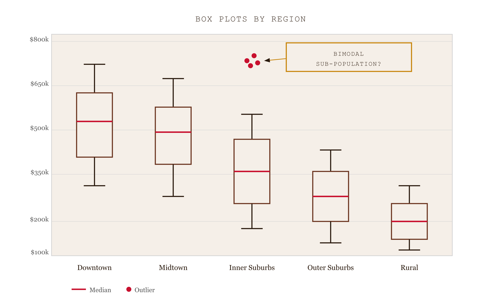
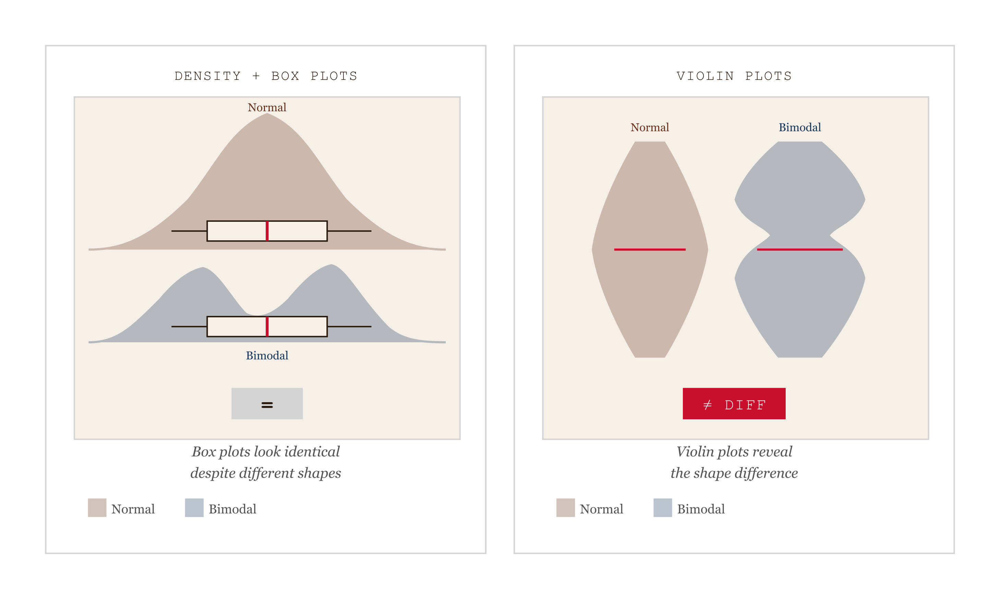
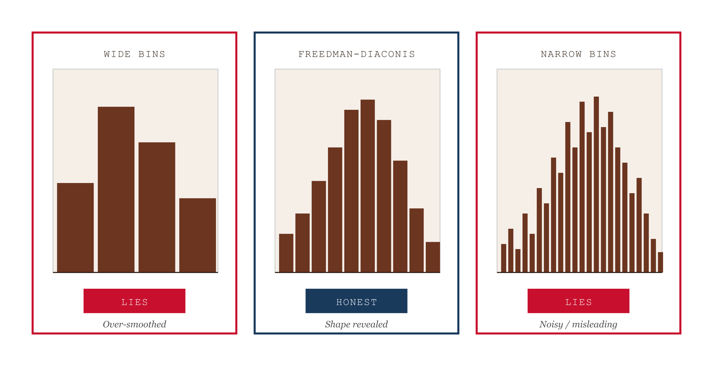
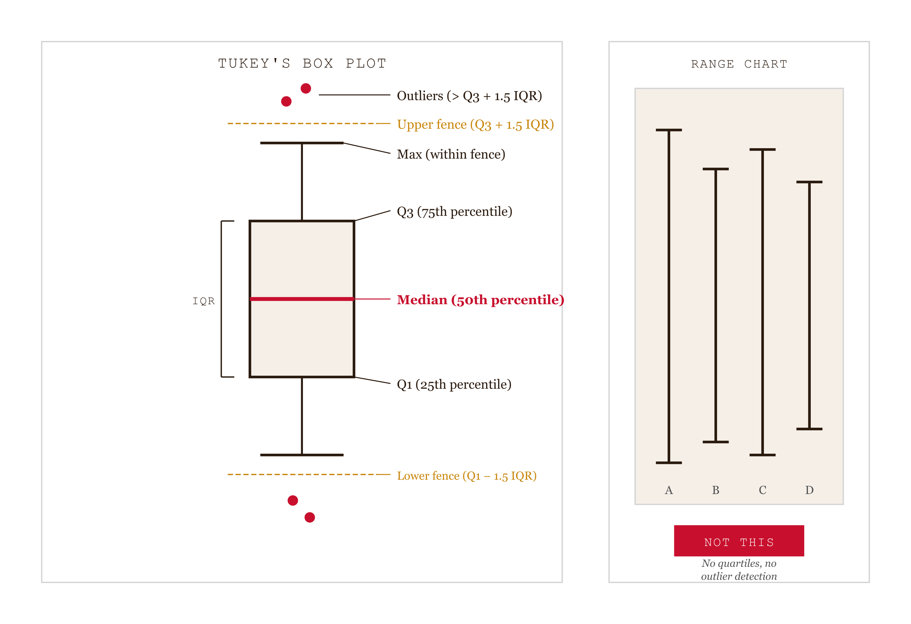
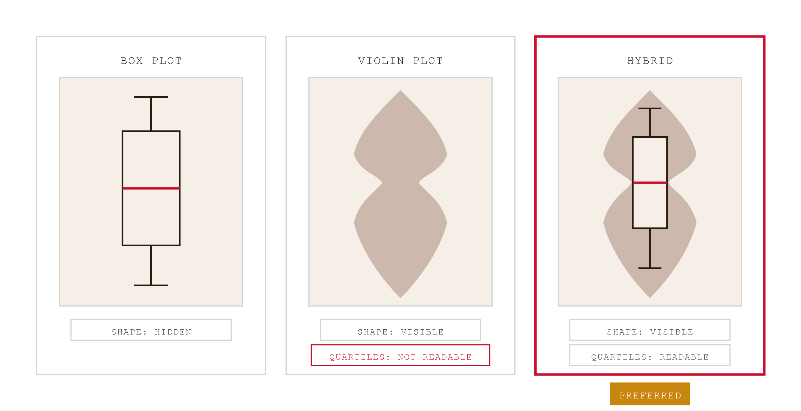
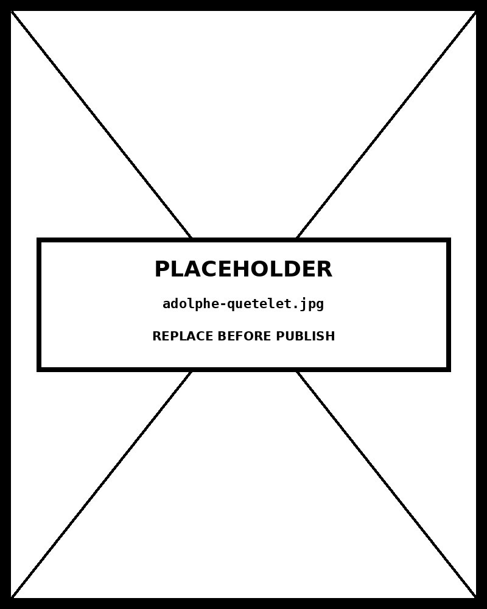

# Chapter 09 — Distribution Charts

*Shape, Spread, and Skew — Beyond the Mean.*

---

Open the pantry's `box-whisker.html`. Five box plots stand side by side, one per residential zone — Urban Core, Inner Suburbs, Outer Suburbs, Exurban, Rural. Each shows the household income distribution for that zone: a box from Q1 to Q3, a line at the median, whiskers extending to the most extreme value within one-and-a-half times the interquartile range, and scattered points beyond the whiskers for outliers.

Now look at the Inner Suburbs box. There is a cluster of points sitting well above the upper whisker — a group of high-income households that doesn't fit the rest of the distribution. The box plot reveals that the cluster exists. It does not tell you whether the cluster is a separate sub-population or just the upper end of a long tail. Two distributions — a normal one and a bimodal one — can have identical five-number summaries. The box plot cannot distinguish between them.

This is the central tension of the whole chapter. Every distribution chart is a compression. Some compressions preserve the shape. Others preserve the quartiles. Others preserve the raw values. No single form preserves everything, and the right choice depends on what the reader needs to see and what they are able to read.


*Figure 9.1 — The cluster is visible. What it means is not.*

---

## What the mean hides

When someone summarizes a distribution with a mean, they are making a specific choice about compression. The mean is a single number that describes the center of mass of the data. It is sensitive to every value — pull one observation to an extreme and the mean moves. It says nothing about spread, nothing about shape, nothing about whether the data is symmetric or skewed or bimodal.

This is not an abstract concern. Consider a hypothetical: ten households with incomes of $30,000, $32,000, $35,000, $36,000, $38,000, $39,000, $40,000, $41,000, $43,000, and $200,000. The mean is about $53,000. The median is $38,500. These are the same data; they tell different stories. The mean is dominated by the outlier. The median is indifferent to it.

Or consider a dataset of patient recovery times after a surgical procedure. The distribution is bimodal: most patients recover quickly (peak around day 5) and a second group recovers slowly (peak around day 20). The mean — somewhere around day 10 — corresponds to almost no actual patients. A researcher who reports only the mean is describing a phantom center of a distribution that has two real centers. The distribution chart is not a decoration on top of the summary statistic. It is the correction to the summary statistic.

John Tukey understood this when he designed the box plot in 1977. His goal was a form that could show distribution features — central tendency, spread, skewness, outliers — in a compact enough package to compare many distributions side by side. The five-number summary (minimum, Q1, median, Q3, maximum) was the compression he chose. It is robust to outliers because it uses rank-based statistics. Two box plots next to each other immediately show whether one distribution has a higher center, a wider spread, or more extreme outliers than the other.

What it cannot show is shape. This is the limitation the violin plot exists to address.


*Figure 9.2 — Same five-number summary. Different shapes. The box plot cannot tell them apart.*

---

## The histogram and the bin-width problem

Before the box plot and the violin, there is the histogram. It is the most commonly encountered distribution chart because it appears in every introductory statistics course. It bins continuous data into discrete intervals and shows the count per bin as a column.

The histogram's critical design decision is the bin width. The choice is more consequential than most people realize.

Take a dataset of household incomes in a mixed neighborhood — some working-class residents, some affluent ones, a genuine bimodal distribution with peaks around $40,000 and $120,000. Now build the histogram with very wide bins: one bin for $0–$50,000, one for $50,000–$100,000, one for $100,000–$150,000. The two peaks merge into a broad, roughly uniform shape. You cannot see the bimodality; the bin width has swallowed it.

Now build it with very narrow bins: $1,000 intervals. The sampling variation in each bin is large relative to the true density at that point. The histogram shows dozens of small wiggles — apparent peaks and valleys that are noise, not structure. The bimodality is hidden again, this time inside a forest of artifact.

At the right bin width, both peaks are visible, the noise is smoothed out, and the gap between the two income groups is legible. There is no universal formula for "right," though several rules of thumb provide defensible starting points. Freedman-Diaconis — bin width equals two times the interquartile range divided by the cube root of n — is robust to outliers and generally well-behaved. Sturges' rule (bins equal the ceiling of log₂(n) plus 1) is a simple conservative default. Scott's rule is optimized for normal distributions.

For Claude Code work, the implication is direct: specify the bin width or the selection rule explicitly. "Use Freedman-Diaconis binning" leaves no ambiguity. Leaving the choice to default will usually produce Sturges' rule, which is conservative and may miss fine structure.

The practical test for bimodality is to build three histograms at different bin widths — narrow, medium, wide — and ask whether the two peaks survive across all three. A bimodality that appears at narrow bins and vanishes at wider ones is sampling noise. A bimodality that persists across all three bin widths is real, and at that point the histogram form may be less informative than a density-based alternative.


*Figure 9.3 — Three bin widths. Two of them lie.*

---

## What the box plot shows and doesn't

The box plot's five-number summary has a specific design. Tukey's choices were deliberate.

The box spans Q1 to Q3 — the middle half of the data. This is the interquartile range (IQR). The box's height encodes the spread of the central mass of the distribution. A tall box means the middle fifty percent of values are spread widely. A short box means they are compressed.

The median line sits inside the box. When it sits near the center of the box, the distribution's middle is roughly symmetric. When it sits near one edge, the distribution is skewed in that direction — the median is being pulled toward the denser side.

The whiskers extend from the box edges to the most extreme value within 1.5 times the IQR of each edge. Tukey chose the 1.5 factor empirically: it reliably separates genuine outliers from the natural tail of common distributions. Values beyond the whiskers appear as individual points.

This design is robust to outliers in a specific sense: the box and whiskers are based on ranks (quartiles), not on distances from the mean. A single extreme value does not move Q1 or Q3. It may appear as an outlier point, but it does not distort the box itself.

What the box plot hides: distribution shape. Two distributions with the same Q1, median, Q3, and similar whisker extent can look completely different — one normal, one bimodal, one with a pronounced plateau, one skewed with a long tail. The box plot is indifferent to all of this variation because it is a five-number summary, not a shape summary. The cluster of outlier points visible in the Inner Suburbs box in the HAI example suggests a bimodal distribution — but only suggests. The box plot cannot confirm it.

Two additional things the standard box plot hides: sample size and within-quartile structure. Two box plots from samples of ten and ten thousand look identical. The reader cannot tell whether the summary is based on a handful of observations or a robust population. The variable-width box plot addresses this by encoding sample size as box width — wider boxes for larger samples — but the standard form does not.


*Figure 9.4 — Tukey's design is specific. The fence is what makes the outlier visible.*

---

## Violin plots: shape made visible

A violin plot draws a kernel density estimate symmetrically around a vertical axis. The width at any point represents the density of observations at that value.

Kernel density estimation is the machinery underneath the violin. Each observation in the dataset contributes a small smooth function — a kernel, typically Gaussian — centered at that value. Sum the contributions of all observations and you get a continuous density estimate. Where observations cluster densely, the sum is large and the violin is wide. Where they are sparse, the sum is small and the violin narrows.

The bandwidth parameter controls how smooth the kernel is. Too narrow a bandwidth and the estimate tracks every individual observation, producing a jagged shape that reflects noise rather than structure. Too wide a bandwidth and real features — peaks, gaps, multimodality — get smoothed away. Silverman's rule and Scott's rule provide principled starting points. Like the histogram's bin width, the bandwidth choice is a design decision, and specifying it explicitly to Claude Code produces more reliable results than accepting whatever default the library chooses.

The violin's strength is exactly what the box plot cannot do: it shows shape. A bimodal distribution produces a violin with two bulges, one at each peak. A skewed distribution produces an asymmetric shape — wider on one side than the other. A distribution with a plateau produces a wide flat region in the middle. The reader sees the entire envelope of the density at once.

The violin's weakness is that the reader cannot extract precise quartile values from it. The edge of the violin at a given height is the estimated density, not a quartile boundary. For audiences who need to know the exact Q1, median, and Q3, the violin alone is insufficient.

The standard resolution is the hybrid form: a thin box plot overlaid inside the violin. The box gives the precise quartiles; the violin gives the shape. The hybrid is denser but more informative. It is best suited to audiences with high graphicacy — readers who have encountered both forms and can decode each independently.


*Figure 9.5 — Each form reveals what the others hide. The hybrid pays a density cost for completeness.*

---

## Cairo's graphicacy constraint

Graphicacy is the capacity to read visual representations of data. Just as literacy varies — some readers handle complex prose, others need simpler text — graphicacy varies. Some readers handle violin plots fluently. Others need histograms with annotations. Others need the numbers in a table.

This is not a hierarchy. It is a constraint. A chart that exceeds the audience's graphicacy fails as communication, regardless of how technically informative it is. The distribution chart family spans a wide graphicacy range. Stem-and-leaf plots are accessible to nearly any numerate audience. Histograms are familiar to most college-educated readers. Box plots require statistical training to decode correctly — the reader must know what Q1, Q3, and the 1.5×IQR rule mean to interpret the whiskers honestly. Violin plots require both statistical training and visualization training; a general audience encountering a violin plot for the first time will often misread the width as frequency rather than density.

Cairo's argument is that the designer's professional obligation is to the reader's understanding. Choosing a violin plot for an audience that cannot decode it is not more informative than choosing a histogram — it is less informative, because the reader cannot use it.

The practical decision rule: match the chart form to the lowest reliable graphicacy level in your audience. If you are writing for statisticians in a peer-reviewed journal, violin plots are the right default for showing distribution shape. If you are presenting to a school board or a community meeting, histograms with annotations are more likely to produce genuine understanding. If the audience has no visualization training at all, a stem-and-leaf plot — which looks like a sorted list with structure — may be the most honest form available.

| Form | Required graphicacy | What it reveals | What it hides | Best professional context |
|---|---|---|---|---|
| Stem-and-leaf | College-educated | Every data value, plus rough shape | Population shape at scale (>200 values) | Teaching, small-sample inspection |
| Histogram | General public | Overall shape, mode, skew | Individual values; sensitive to bin width | Reports, public-facing dashboards |
| Box plot | Statistically trained | Quartiles, median, outliers — comparable across groups | Multi-modality, exact density | Side-by-side group comparisons |
| Violin plot | Visualization-trained | Full density shape, including bimodality | Precise quartile values | Research papers, exploratory analysis |
| Hybrid box-violin | Visualization-trained | Quartiles AND density shape | Compact display — wider per group than either alone | Cases where both reading tasks matter |
---

## Stem-and-leaf and density plots

Two less-common forms are worth naming because they fill specific niches neither the histogram nor the box plot nor the violin can fill.

A stem-and-leaf plot preserves the original data values while showing the distribution. The "stem" is the leading digit of each value; the "leaf" is the trailing digit. Each observation is represented as its leaf placed next to its stem. The result is a chart that doubles as a sorted list of the actual values — the reader can see both the distribution shape and every individual number.

Stem-and-leaf plots are right for small datasets where preserving raw values matters. For n below about 50, statistical inference is shaky; there is real value in letting the reader inspect the actual numbers rather than a smooth summary. They are also more readable by audiences with low graphicacy than histograms, because the textual structure is easier to trace than a column of bars.

A density plot — a KDE drawn as a line on a standard coordinate plane rather than as a violin shape — is the form most often used in scientific publications for comparing multiple distributions directly. Two or three distributions overlaid as density lines are more readable than two or three side-by-side histograms. The density line form assumes statistical literacy; it is the publication-standard alternative to the histogram when the audience can handle it.

When to use density lines over violin plots: when you need to overlay multiple distributions on the same axes, or when the comparison between specific distributions is the message and side-by-side shapes would be harder to read than overlaid lines.

---

## The form selection in practice

The choice between distribution charts reduces to three questions.

**What does the audience need to see?** Comparison across groups → box plot. Shape including multimodality → violin plot or KDE. Raw values preserved → stem-and-leaf. Overall shape for a general audience → histogram.

**What is the audience's graphicacy level?** General public → histogram or stem-and-leaf. College-educated non-specialists → histogram or box plot. Statistically trained → any form. Visualization-trained → violin or hybrid.

**What is the sample size?** Very small (n < 40) → KDE-based forms (violin, density) are unreliable; use histogram or stem-and-leaf. Moderate (40–200) → any form is reasonable. Large (200+) → all forms work well; choose by the communication question.

One failure mode deserves naming explicitly: the box plot misread as a range chart. Some audiences interpret the box not as the IQR but as the full data range, and the whiskers as "error bars" in the sense of confidence intervals around the mean. Both misreadings produce wrong conclusions. If there is any doubt about the audience's familiarity with Tukey's design, annotate the chart or include a brief legend explaining what the box and whiskers represent. The chart form is only as good as the reader's ability to decode it.

---

## The design decisions in the pantry chart

Return to `box-whisker.html`. Every decision Tukey's design makes is doing work.

The sort by median positions the best-performing domain on the left, giving the reader an immediate ranking alongside the distribution summary. The shared y-axis lets the reader compare distributions without rescaling — a box at the same height in two panels represents the same score value. The color hue distinguishes domains while remaining redundant with x-position, supporting color-blind readers and casual scanning. The whisker rule is Tukey's standard 1.5×IQR, not min-to-max, which would make every outlier invisible by absorbing it into the whisker extent.

The most common failure in box plots generated by default tool settings is this last one: whiskers extending to the actual data minimum and maximum. The chart looks like a box plot but is not one. The Tukey form is informative because the whisker boundary means something specific — it defines the fence beyond which a value is anomalous. A chart with min-to-max whiskers has no fence. Every value is inside the whiskers. No outliers exist by construction. The reader cannot see the cluster of unusual observations that makes the Inner Suburbs box interesting.

When auditing Claude Code output for box plots, the first check is always: do the whiskers stop at the most extreme value within 1.5×IQR, or do they extend to the data minimum and maximum? The distinction is the difference between a Tukey box plot and a range chart wearing a box plot's clothing.

The second check is that the box boundaries are Q1 and Q3, not some other percentiles. The third is that the median line is inside the box, not at an edge. These are the distribution-specific audit items that sit on top of the standard Evergreen/Emery checks.

---

## What you can now do

You can build a histogram, box plot, violin plot, density plot, or stem-and-leaf plot and choose the form based on the dataset's size, the audience's graphicacy, and the communication question.

You can apply the bin-width decision rules — Freedman-Diaconis, Scott, Sturges — and recognize when the choice substantially changes what the chart reveals. You can test for bimodality by comparing three bin widths, and you know that a bimodality that survives all three is real.

You can name what a violin plot reveals that a box plot hides — multi-modality, distribution shape — and what a box plot shows that a violin plot does not — precise quartile values, robust outlier flagging via Tukey's 1.5×IQR rule.

You can apply Cairo's graphicacy concept as a practical design constraint. The right distribution form depends on who the reader is. A chart that exceeds the audience's graphicacy fails as communication.

The thing to watch for going forward is the temptation to use the distribution chart most familiar to you regardless of the audience. A violin plot for a school board is not more informative than a histogram — it is less informative, because the reader cannot use it. The form follows the audience.

---

## Exercises

### Warm-up

**Exercise 9.1 — Form selection by audience and question.** *(Tests: Cairo's graphicacy constraint)*
For each scenario below, name the right distribution form and justify the choice using graphicacy level and communication question:
- Income distribution within a single ZIP code, presented at a community town hall to residents with no statistical training.
- Recovery time distribution for a clinical trial, reported in a peer-reviewed medical journal.
- Test score distributions across five schools, presented to a school board making resource decisions.
- Distribution of Likert-scale survey responses (1–5) from 300 employees, for an internal HR summary.

**Exercise 9.2 — Bin-width diagnosis.** *(Tests: histogram bin-width problem)*
You have a histogram of household incomes showing a single broad peak centered around $65,000. You suspect the distribution may actually be bimodal. Describe the three-bin-width test: what bin widths would you try, what would you look for in each, and what result would confirm the bimodality is real versus sampling noise? Name the bin-width rule you would use as your medium-width starting point and justify the choice.

**Exercise 9.3 — Tukey's rule application.** *(Tests: box plot mechanics)*
A dataset has Q1 = 42, Q3 = 78. Calculate the IQR, the upper and lower whisker fences (Tukey's 1.5×IQR rule), and the values at which individual points would be classified as outliers. Then explain what would be wrong with a box plot for this dataset where the upper whisker extends to the data maximum of 140.

### Application

**Exercise 9.4 — Box plot vs. violin plot, same data.** *(Tests: what each form reveals and hides)*
Take a real distribution dataset with at least one group structure (two or more groups, 50+ observations each). Build both a box plot and a violin plot with Claude Code. For each, identify: one feature of the distribution clearly visible in this form but not the other, and one question you can answer from this form that you cannot answer from the other. Conclude with which form is right for your professional context and audience, citing graphicacy.

**Exercise 9.5 — Bin-width experiment.** *(Tests: histogram sensitivity)*
Take a dataset that may be bimodal (income, test scores, response times, or similar). Build histograms using Sturges', Scott's, and Freedman-Diaconis rules. For each, note the number of bins, the resulting bin width, and what the chart reveals about the distribution's shape. Apply the bimodality test: does the second peak survive all three bin widths, some, or none? State what the result tells you about whether the bimodality is real.

**Exercise 9.6 — Audit a published distribution chart.** *(Tests: distribution-specific audit)*
Find a histogram, box plot, or violin plot in a recent publication — academic paper, corporate report, or journalism. Audit it for distribution-specific failures: for histograms, is the bin width appropriate? For box plots, do the whiskers follow Tukey's 1.5×IQR rule or do they extend to the data min/max? For violin plots, is the bandwidth specified, and does the shape appear over-smoothed? Identify any failures and write the follow-up prompt that would correct each.

### Synthesis

**Exercise 9.7 — Graphicacy redesign.** *(Tests: graphicacy constraint applied to existing work)*
Take a distribution chart you have produced or that your team uses regularly. Estimate the lowest reliable graphicacy level in your primary audience. Is your current form appropriate for that level? If the form exceeds your audience's graphicacy, redesign using a more accessible form that preserves the core message. If the form is below the audience's graphicacy (i.e., you are under-using the reader), identify what a more information-dense form would add. Build both versions with Claude Code if the redesign is non-trivial.

**Exercise 9.8 — Multi-form comparison.** *(Tests: form selection across communication questions)*
Take a single distribution dataset. Identify three different communication questions it could answer (e.g., "what is the distribution's central tendency and spread," "is the distribution bimodal," "how does this distribution compare to two others"). Build the best distribution form for each question. For each, explain why that form is the right choice for that specific question, citing the chapter's three-question decision framework (what to see, graphicacy level, sample size).

### Challenge

**Exercise 9.9 — Hybrid box-violin.** *(Tests: combining form strengths)*
Build a hybrid distribution chart that overlays a thin box plot inside a violin, using Claude Code. The box provides precise Q1, median, Q3 values; the violin provides distribution shape. Audit the result: is the box correctly drawn (Q1 to Q3, Tukey whiskers, outlier points)? Is the violin's bandwidth appropriate? Compare the hybrid to either form alone for the question "is this distribution bimodal, and if so where are the quartiles of the full distribution?" Write one paragraph on when the hybrid earns its added visual complexity.

**Exercise 9.10 — Bandwidth sensitivity from data.** *(Tests: KDE bandwidth decision)*
Take a dataset with a known or suspected bimodal shape. Build violin plots at three bandwidths: one using Silverman's rule, one twice as wide (over-smoothed), and one half as wide (under-smoothed). For each, identify what the plot reveals and what it obscures. Determine which bandwidth best represents the underlying distribution and justify the choice. If Silverman's rule produces an over-smoothed result that hides the bimodality, explain what the bandwidth-selection rule is optimizing for and why it fails for this specific data shape.

---

## A note about AI

Distribution charts are the family where the model is most prone to producing a histogram when a violin plot, an ECDF, or a strip plot would teach more.

Where the model genuinely helps: producing the distribution four ways — histogram, density, ECDF, beeswarm — and explaining what each reveals about the same data.

Where the model does damage: choosing bin width for histograms. The bin width is a design choice that shapes the story, and the model's defaults are not always the right defaults.

The rule: distribution forms from the model; bin width from you.

---

## LLM Exercise — Chapter 09: Distribution Charts

**What you're building:** A distribution chart selected for a specific audience and built with the bin/bandwidth decision documented.

**Tool:** Claude Code (for the build) + Claude chat (for the audit).

### The prompt

```
I have a distribution dataset of [DESCRIBE: rows, single quantitative
variable, sample size, any group structure]. The audience is [DESCRIBE:
graphicacy level, statistical training assumed].

Walk me through:

1. Confirm the chart family is distribution (vs. comparison, time-series,
   relationship, etc.). If it isn't, recommend the right family and stop.

2. Choose the form (histogram / box plot / violin plot / density plot /
   stem-and-leaf) based on audience graphicacy level and the
   communication question. Cite Cairo's graphicacy concept in the
   justification.

3. For histograms: name the bin-width rule (Freedman-Diaconis, Scott,
   or Sturges) and justify the choice. For KDE-based forms: name the
   bandwidth selection method (Silverman, Scott).

4. Specify the channels using the Chapter 01 framework:
   - x-position: which attribute
   - y-position (height of bar, width of violin, etc.): which statistic
   - color: which attribute, how encoded

5. For box plots: apply Tukey's 1.5×IQR rule explicitly. Confirm whiskers
   stop at most extreme value within the fence, not at min/max.

6. Write a single Claude Code prompt using the four-move structure
   (show, say, constrain, verify), precise enough that Claude Code
   produces a usable D3 v7 chart on the first attempt.

After Claude Code returns the chart, audit it for distribution-specific
failures:
- Histogram: are bin widths as specified? Is the y-axis frequency or
  density as intended?
- Box plot: is the box Q1 to Q3 (not min to max)? Do whiskers follow
  Tukey's 1.5×IQR rule? Are outliers shown as individual points?
- Violin: is the bandwidth specified? Does the shape reflect the
  underlying distribution or is it over-smoothed?

Flag any audit failure and write the follow-up prompt that corrects it.
```

**What this produces:** A markdown audit document and an HTML file containing the working D3 chart. Save as `chapter-09-distribution-audit.md` and `chapter-09-distribution.html`.

**How to adapt this prompt:**
- *For your own domain:* Replace the dataset description and audience specification.
- *For ChatGPT or Gemini:* Works as-is.
- *For a Claude Project:* Save the Chapter 01 channel framework and Cairo's graphicacy concept as reference files; the per-chapter audit prompt becomes the user message for each new chart.
- *For Cowork:* Use Cowork to execute the Claude Code prompt and save the resulting HTML file directly to your project directory.

**Connection to previous chapters:** Builds on Chapter 01 (channel ranking — distribution charts use position, length, area, and density as channels), Chapter 02 (chart selection — confirming you are in the distribution family), Chapter 05 (data type identification — distributions apply to quantitative variables). The audit step applies distribution-specific checks on top of the Evergreen/Emery checklist from Chapter 07.

**Preview of next chapter:** Chapter 10 introduces relationship and correlation charts — scatterplots, bubble charts, parallel coordinates, heatmaps. The question shifts from "what does this single variable's spread look like" to "how do two or more variables co-vary." The channel decisions change: x and y position now encode two quantitative variables, not one variable against a count.

---

## Further reading

- **Tukey, John W. (1977).** *Exploratory Data Analysis.* Addison-Wesley. The original box plot, the five-number summary, and the 1.5×IQR rule. Read Chapter 2 for the box plot; read it all eventually for the exploratory-analysis mindset the chapter inherits.
- **Silverman, B. W. (1986).** *Density Estimation for Statistics and Data Analysis.* Chapman & Hall. The bandwidth-selection theory underlying KDE and violin plots.
- **Wilke, Claus O. (2019).** *Fundamentals of Data Visualization.* O'Reilly. Chapter 7 is the most readable modern treatment of distribution chart selection; Wilke's graphicacy framing complements Cairo's.
- **Weissgerber, Tracey L., et al. (2015).** "Beyond Bar and Line Graphs: Time for a New Data Presentation Paradigm." *PLOS Biology* 13(4). The empirical argument that bar charts of means hide distribution structure in ways that affect scientific conclusions — the direct motivation for the distribution-chart family this chapter covers.
- **Heer, Jeffrey, and Michael Bostock. (2010).** "Crowdsourcing Graphical Perception." *CHI '10.* The bin-width sensitivity evidence, confirming that histogram perception is strongly affected by binning choices.
- **Cairo, Alberto.** *The Functional Art* and *The Truthful Art.* The graphicacy concept is developed across both books; *The Functional Art* introduces it, *The Truthful Art* extends it into the ethical-design frame.
- **The book's pantry** — `histogram.html`, `box-whisker.html`, `violin-plot.html`, `stem-leaf.html`. Each is the reference implementation for its form.

---

*Tags: distribution-charts, histogram, box-plot, violin-plot, KDE, kernel-density-estimation, stem-and-leaf, Tukey, bin-width, bandwidth, graphicacy, Cairo, Heer-Bostock, multimodality, D3, Claude-Code*

---

## Prompts

Use these prompts with Claude to generate interactive D3 v7 versions of the
figures in this chapter. Each produces a standalone HTML file you can open
in a browser and modify freely.

**Prerequisites:** Load `brutalist/CLAUDE.md` and `brutalist/DESIGN.md` into
your Claude project context before using these prompts. They define the stack,
naming conventions, color system, and typography the figures use.

---

### Figure 9.1 — Box plot limits

*Hand-authored SVG (converted to PNG at 300 dpi)*

Five box plots for residential zones (Downtown, Inner Suburbs, Outer Suburbs, Rural Edge, Exurban). Inner Suburbs has an outlier cluster above the upper whisker. Annotation: "Bimodal sub-population, or just a long tail? The box plot cannot answer."

> Reference implementation: `d3/09-distribution-charts-fig-01.html`

---

### Figure 9.2 — Box plot vs violin plot

*Hand-authored SVG (converted to PNG at 300 dpi)*

Left pair: normal and bimodal distributions with identical box plots (visually indistinguishable), with an "=" badge between them. Right pair: the same two distributions as violin plots (shapes differ clearly), with a "not-equal" badge between them.

> Reference implementation: `d3/09-distribution-charts-fig-02.html`

---

### Figure 9.3 — Bin width effect

*Hand-authored SVG (converted to PNG at 300 dpi)*

Three histograms of the same bimodal income distribution. Left: too-wide bins where bimodality is hidden (LIES). Center: Freedman-Diaconis binning where structure is visible (HONEST). Right: too-narrow bins where noise is amplified (LIES).

> Reference implementation: `d3/09-distribution-charts-fig-03.html`

---

### Figure 9.4 — Box plot anatomy

*Hand-authored SVG (converted to PNG at 300 dpi)*

Left: large annotated Tukey box plot with labeled callouts for Q1, Q2 (median), Q3, IQR, whiskers at 1.5 times IQR fences, and individual outlier points. Right: range chart with min-to-max whiskers and no outlier handling, labeled "NOT THIS."

> Reference implementation: `d3/09-distribution-charts-fig-04.html`

---

### Figure 9.5 — Box-violin hybrid

*Hand-authored SVG (converted to PNG at 300 dpi)*

Three panels showing the same bimodal distribution. Left: box plot alone — shape hidden, quartiles readable. Center: violin plot alone — shape visible, quartiles not readable. Right: hybrid box-violin — both shape and quartiles visible. Labels: HIDDEN / VISIBLE / VISIBLE+READABLE.

> Reference implementation: `d3/09-distribution-charts-fig-05.html`

---

## AI Wayback Machine

The ideas in this chapter didn't appear from nowhere. **Adolphe Quetelet** coined "the average man" in 1835 — proposing that human traits (height, chest circumference, criminal tendency) follow normal distributions. He gave statistics the conceptual tools to think about populations as distributions, not lists.


*Adolphe Quetelet, circa 1860. AI-generated portrait based on a public domain photograph (Wikimedia Commons).*

**Run this:**

```
Who was Adolphe Quetelet, and how does his "average man" framework connect to the distribution charts we covered in this chapter? Keep it to three paragraphs. End with the single most surprising thing about his career or ideas.
```

→ Search **"Adolphe Quetelet"** on Wikipedia.

**Now make the prompt better.** Try one of these:

- Ask it to walk through Quetelet's 1846 fit of Scottish soldier chest measurements to a normal curve — and what made it convincing at the time.
- Ask it about the eugenics-adjacent reception of Quetelet's ideas in the late 19th century — what survived and what was discarded.

What changes? What gets better? What gets worse?
