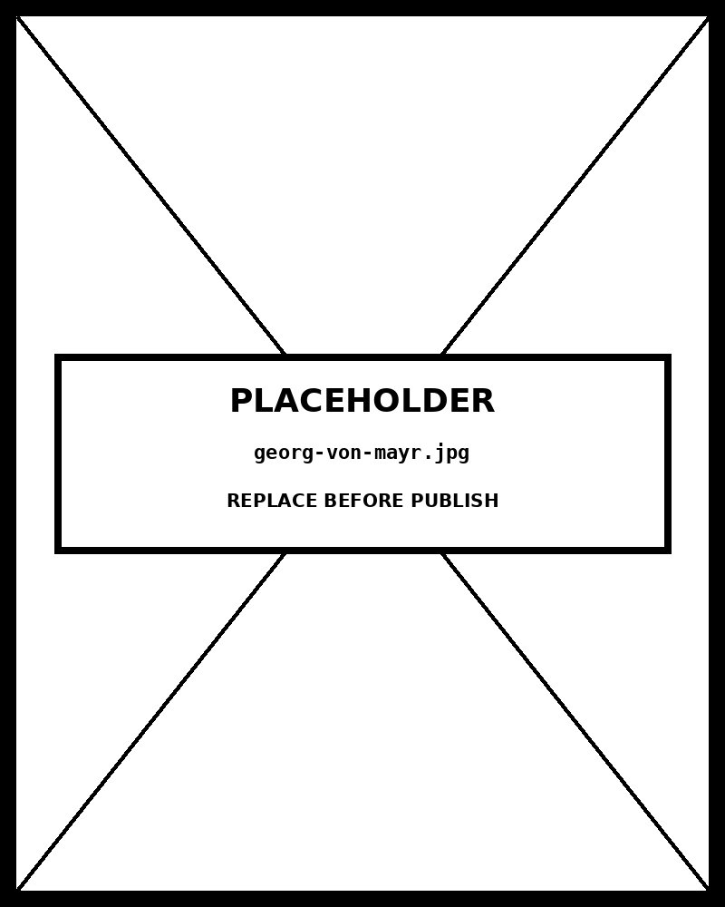

# Chapter 11 — Part-to-Whole Charts

*When the Pieces Have to Add Up to One.*

---

Open the pantry's five-slice pie chart. Five sectors. Each wedge is large enough to read its angle clearly — you can compare them, rank them, see that the largest is about half the circle and the smallest is a sliver near 3%. The chart works. You understand it.

Now find a pie chart in any annual report. There are probably twelve slices. Six of them are below 5%. They form a ring of nearly indistinguishable wedges at the bottom of the circle, each labeled with a tiny percentage you have to lean forward to read. You cannot rank the bottom half by looking at it. The chart is technically a part-to-whole visualization; it is practically useless as a comparison tool.

The difference between those two charts is not stylistic. It is perceptual. Humans judge angle with substantially less accuracy than they judge length. Past five or six slices, the angles are too small for reliable comparison. The twelve-slice pie chart asks the eye to do something it cannot do, and the eye fails.

This is the chapter. Part-to-whole charts encode proportions using channels — angle, area, count, length — that differ in how accurately the eye reads them. Understanding which channel a form uses, and where that channel falls in the accuracy hierarchy, is what turns the pie/bar/waffle choice from a matter of taste into a matter of mechanism.

---

## What the pie chart is actually asking the eye to do

A pie chart encodes proportion as angle. The wedge that represents 35% of the total subtends 126 degrees. The wedge representing 20% subtends 72 degrees. The reader's job is to compare those angles and reconstruct the proportions.

Cleveland and McGill established the accuracy hierarchy of perceptual channels in 1984 and replicated it in subsequent work. From most accurate to least: position along a common scale, length along a common baseline, angle, area, color luminance, color hue. Angle comes in third — better than area, worse than position and length. The pie chart's channel is not the worst available, but it is far from the best.

The degradation with slice count is not gradual — it is approximately threshold-based. The eye can compare angles between roughly 30 and 150 degrees with reasonable accuracy. Slices below about 30 degrees, which correspond to roughly 8% of the total, become difficult to distinguish from each other. A twelve-slice pie with slices averaging 8% has ten of its twelve wedges near or below that threshold. The chart is asking the reader to compare things the eye cannot reliably rank.

The five-slice rule follows directly from this threshold. Five slices, with the total distributed unevenly enough that most wedges exceed 10%, keeps most angles in the readable range. Six or more slices systematically pushes slices below the threshold. The rule is not arbitrary — it is the point at which the channel's accuracy degrades below useful.

The practical consequence: if your part-to-whole data has more than five categories, a bar chart almost always communicates more accurately. Position along a common baseline is the highest-accuracy channel available. A sorted horizontal bar chart of twelve funding categories shows the ranking unmistakably; the twelve-slice pie shows a wreath of wedges.

<!-- → [IMAGE: side-by-side of a five-slice pie (readable, each wedge above 30°) and a twelve-slice pie (same total, same data, roughly equal wedges below 30°). Annotations on the five-slice version label the readable angular range (~30°–150°). Annotations on the twelve-slice version mark the cluster of small wedges that fall below the 30° threshold. Caption: "The five-slice rule is the point at which the channel's accuracy degrades below useful."] -->

---

## When the pie chart works anyway

The honest answer is that the five-slice rule is a *perceptual* argument, not an absolute prohibition. There are conditions under which a pie chart serves the reader better than a bar chart.

When the audience expects part-to-whole framing — a budget breakdown, a market share split, a population composition — a pie chart signals "these are parts of a whole" in a way a bar chart does not. The bar chart is more accurate but may be read as a standalone comparison rather than a decomposition of something that sums to 100%.

When the message is dominance — "Food Security receives more than half the budget" — the pie chart makes a 56% slice visually unmistakable. The reader doesn't need precision; they need the overwhelming-majority signal, and a half-circle delivers it instantly.

When the audience has low statistical graphicacy and the form is familiar, a simple pie chart may produce more understanding than a waffle chart that is more accurate but requires explanation.

Stephen Few's position on these trade-offs is the book's: the question is "does this support the message for this audience?" not "which channel has the lowest error rate in a lab study?" Pie charts are not categorically wrong. They are wrong in specific conditions that are predictable. The five-slice rule names the most common of those conditions.

Donut charts extend the form by removing the center, creating space for a summary statistic — total funding, total population, a key annotation. The encoding is identical to the pie: angle. The donut adds utility in dashboard contexts where a single supporting number at the center earns its place. For analytical work, the donut inherits the pie's perceptual limitations.

| Form | Primary channel | Cleveland & McGill rank | Best condition | Failure condition |
|---|---|---|---|---|
| Pie | Angle | 4 | ≤ 5 categories, one slice dominates, general audience | More than 5 slices; need to rank middle categories |
| Donut | Angle (arc) | 4 | Same as pie, but center holds a summary number | Same as pie; the hole adds no information |
| Waffle | Position (cell count) | 1 | Audience that will count cells; precise percentages matter | Many small categories produce visually scattered cells |
| Single stacked bar | Length within total | 3 | 3–5 categories, fixed total, headline number | Many segments — middle segments become hard to compare |
| Marimekko | Position + area | 1 + 5 | Two-dimensional part-to-whole (category × sub-category) | Audience that mistakes area for one of the dimensions |
| Nightingale rose | Area (with angle illusion) | 5 | Cyclic / seasonal categories where the cycle matters | Linear categories — the cycle is meaningless and area is misread |
---

## Waffle charts and what they do differently

A waffle chart represents proportions as counts of equal-area cells, typically arranged in a 10×10 grid where each cell is 1%. The reader counts cells — or, for larger proportions, estimates the filled region as a fraction of the grid.

The perceptual channel is different from the pie's. Counting cells, or estimating a colored region against a known 10×10 grid, is effectively position-along-aligned-scales — the reader is tracking discrete positions across a regular matrix, not estimating continuous angles. This channel ranks second in the Cleveland and McGill hierarchy, substantially above angle.

The waffle chart's specific strength is that it makes percentages directly readable. A category covering 23 cells is 23%, without estimation. The 100-cell grid provides a fixed reference that lets the reader interpret proportions without needing to decode an angle or a segment length.

The weaknesses are real. The waffle chart requires a defined total — you cannot use it for open-ended distributions. The 10×10 convention is so strong that departing from it reads as confusing rather than creative. The form is unfamiliar to audiences without data-visualization experience; a general audience may not know how to read it without a brief explanation.

The choice between waffle and pie turns on accuracy versus familiarity. If the reader has the graphicacy to decode a waffle chart and precision matters, the waffle wins. If the reader expects a pie chart and the data is within the five-slice limit, the pie may communicate more effectively because it requires no explanation. Few's frame applies: clarity for this audience is the criterion.

<!-- → [IMAGE: same five-category proportional data rendered as a pie chart (left) and a waffle chart (right). The waffle's 10×10 grid has cells colored and counted per category; one category has 23 cells labeled "23%." An annotation on the waffle panel reads "Each cell = 1%. Count directly. No angle estimation." Caption: "The waffle chart trades familiarity for precision. The trade is worth making when the audience can decode it."] -->

---

## Stacked bars and what the single-bar form is good for

A single stacked bar — one bar, divided into colored segments — is another part-to-whole form. Its channel is segment length along the bar's total extent. The bottom segment has a proper baseline; segments above it do not. This means cross-segment comparison is limited (the segment starting at 40% has a different baseline than the segment starting at 60%), but the overall composition is legible and the total is encoded by a single bar's length.

The single stacked bar is most useful when the *total itself* is a defined, meaningful thing — a budget, a year's worth of events, a population count — and the composition of that total is the message. It reads as "here is the whole, and here is how it breaks down" in a compact form that a pie chart does not communicate as clearly (because pie charts don't emphasize the total) and a bar chart doesn't communicate at all (because bars represent independent values, not parts of a defined sum).

The limitation becomes a problem in multi-bar stacked comparisons — three years, five countries, whatever the second dimension is — where non-baseline segments can't be compared across bars. For single-bar use, the limitation is irrelevant.

---

## The Marimekko chart and two-dimensional composition

A Marimekko chart — also called a mosaic chart — extends the part-to-whole idea to two dimensions. The total area of the chart represents a total; each rectangle's width encodes one variable and its height encodes another. The result is a tiled surface where each tile's area encodes a joint proportion.

A classic use: market share by region by product category. The total width is divided into regions (each region's width proportional to its share of revenue). Within each region, the height is divided into product categories (each category's height proportional to that region's revenue share from that product). Each tile's area represents region × product share of total revenue.

The form works when the audience has the graphicacy to decode two-dimensional area simultaneously and when the "tiles" matter as joint market segments rather than as individual rankings. Business strategy presentations, corporate finance analysis, market sizing — these are the right contexts.

The form fails when either dimension has too many categories (the tiles become too small to read), when the distribution is highly skewed (one tile dominates; the rest vanish), or when the audience lacks business-context familiarity. For a general audience encountering the Marimekko for the first time, the layout looks like a bar chart with varying column widths — the two-dimensional encoding is invisible, and the reader misreads it.

The channel is area, which ranks fifth in the Cleveland and McGill hierarchy. Marimekko charts trade perceptual accuracy for the ability to show two-dimensional composition simultaneously. The trade is worth making when the two-dimensional structure is genuinely the message.

---

## Florence Nightingale and the honest distortion

Florence Nightingale's polar area chart from 1858 is one of the most famous charts in the history of data visualization. It showed British army deaths in the Crimean War, divided by cause — preventable disease, wounds from battle, other causes — across 24 months. Each month is a wedge of a circle; the radial length of each colored region encodes the count of deaths from that cause.

The chart's argument was that deaths from preventable disease vastly outnumbered deaths from battle, and that this pattern was so dramatic that sanitary reform could save thousands of lives. The argument was correct. The chart helped make the case.

It also contains a known distortion. In a polar area chart, area scales as the square of the radial length. A wedge twice as long has roughly four times the area. The reader's eye, perceiving area, reads the larger wedge as dramatically larger than the data alone supports. The outer ring amplifies the visual signal beyond its proportional claim.

Nightingale knew this. The choice to use the form anyway was a rhetorical decision: the chart was meant to persuade an audience that was resisting reform. The visual force was the point. The distortion served the argument.

Cairo's frame for evaluating this choice distinguishes two contexts. In an advocacy context — a humanitarian campaign, a public-health visualization meant to motivate action — the rhetorical force of a form can justify its perceptual cost, provided the designer understands what they are doing. Nightingale understood. Most contemporary designers using polar area charts do not; they choose the form because it looks striking, not because the distortion serves a deliberate rhetorical purpose.

In an analytical context — a research paper, a decision-support dashboard, a peer-reviewed publication — the known distortion is a failure unless explicitly disclosed. The reader in an analytical context is trying to extract accurate information, not to be persuaded. A form that systematically overstates differences is doing the opposite of what the context requires.

The practical rule for any polar area chart: if the form is used in advocacy, document the distortion in the chart's annotation or legend. "Wedge area encodes value (area scales as radial length squared)" is the disclosure. If the form is used in analysis, consider whether the distortion is acceptable or whether a standard linear chart would serve better. The Nightingale chart is a case study in how a designer can choose a form with a known error and be right to do so — but the conditions that make the choice defensible are specific and not always present.

<!-- → [IMAGE: Nightingale's original 1858 polar area chart (Diagram of the Causes of Mortality in the Army in the East) with two annotations: (1) an arrow showing a wedge in the "large deaths from preventable disease" section with the label "this wedge is twice as long as its neighbor → appears ~4× larger in area (area scales as r²)," and (2) a callout naming the context: "advocacy for sanitary reform — the distortion served the argument." Caption: "Nightingale knew about the distortion. She used it anyway. The conditions that made the choice defensible are named in this chapter."] -->

---

## When part-to-whole is the wrong question

Sometimes data that looks like part-to-whole actually calls for a comparison chart.

Take a funding dataset: Food Security 56%, Shelter 21%, Water 14%, Health 6%, Protection 3%. The total is 100%. The data is compositional. But the communication question might be "which sectors received the most?" — which is a ranking question. The reader wants to know where Food Security sits relative to Shelter, where Shelter sits relative to Water.

A pie chart answers "what fraction of the whole is each piece?" It does not efficiently answer "rank these pieces from largest to smallest." A sorted horizontal bar chart answers the ranking question directly, using the highest-accuracy channel. The same data produces a much more readable comparison as a bar chart because the channel — position along a common baseline — is better suited to the question being asked.

Cairo's four-step framework catches this at step one: naming the key message. "Food Security receives more than half" is a compositional message — pie or donut. "Food Security receives the most, followed by Shelter, then Water" is a comparative message — bar chart. The message determines the form, and the form determines which channel is being used, and the channel determines the perceptual accuracy the reader gets.

The audit before building the chart is what prevents the mismatch. The question to ask is: is the reader trying to understand how the pieces relate to the whole, or trying to rank the pieces? Composition wants part-to-whole. Ranking wants comparison.

<!-- → [INFOGRAPHIC: two-branch decision tree — root node: "Is the message compositional or comparative?" Left branch (compositional): "How many categories?" → ≤5 with significant differences → pie/donut; >5 → aggregate or switch to bar. Right branch (comparative / ranking): directly to "bar chart." A second branch off the left: "Is precision more important than familiarity?" → yes → waffle; no → pie. Caption: "The audit before the chart. The question determines the form."] -->

---

## The design decisions in the pantry chart

Return to the five-slice pie in the pantry. The chart works because of decisions made before the code was written.

Five slices. The five-slice rule was applied before the chart was built, which means the data was already aggregated to five categories. The bottom-left note documents this: "Categories beyond the top five aggregated into 'Other.'" The aggregation is a design decision, not a data-processing step — it was made to keep the chart readable, not because the underlying data was already at five categories.

Sort order clockwise from the largest. The largest slice starts at 12 o'clock and the slices decrease in size clockwise. This is not the only defensible sort order, but it is coherent: the reader's eye, which starts at the top of the circle, encounters the most important piece first.

Direct labels on each slice, not a detached legend. A legend forces the reader to match color to label and then back to the wedge — two extra steps. Direct labeling removes those steps. For a five-slice chart, there is room to label directly; for a fourteen-slice chart, there isn't, which is another reason the form degrades with slice count.

Color hue distinguishing sectors. Hue is the right channel for categorical identity — the sectors are categorically different, not ordered — and the hue choice avoids any implied ranking. A sequential luminance scale would imply an order the data doesn't have.

None of these decisions is stylistic. Each is the application of a perceptual principle to a specific constraint. The chart is good not because it looks clean but because the encoding choices match the data's structure and the reader's perceptual capabilities.

<!-- → [IMAGE: annotated five-slice pie chart from the pantry with five callout arrows — (1) "Five slices: data aggregated before building" pointing to the 'Other' note; (2) "Sort order: largest at 12 o'clock, clockwise descending" with an arc showing the reading direction; (3) "Direct labels: no legend lookup required" pointing to an inline percentage label; (4) "Color hue: categorical identity, no implied ranking" with a note that luminance would incorrectly imply order; (5) "Largest slice ~50%: dominance signal is unmistakable" pointing to the half-circle Food Security wedge. Caption: "Every decision is doing work. The chart is good because the encoding fits the data."] -->

---

## What you can now do

You can apply the five-slice rule to any pie chart request — five or fewer with significant differences works; six or more almost always redesigns as a bar chart. The rule traces to Cleveland and McGill's angle-perception findings, not to stylistic preference.

You can choose between pie, donut, waffle, single stacked bar, and Marimekko based on the channel each uses, the audience's graphicacy, and what the question is actually asking. Dominance and composition at low slice counts → pie or donut. Precision at percentages → waffle. Total-plus-composition → single stacked bar. Two-dimensional composition for business-context audiences → Marimekko.

You can recognize the Nightingale rose chart's known distortion and apply Cairo's frame: defensible in advocacy contexts where the rhetorical force is the point, requiring explicit disclosure in analytical contexts where accurate reading is the goal.

You can catch the comparison-disguised-as-part-to-whole failure: when the question is ranking rather than composition, a bar chart is the right form regardless of whether the data sums to 100%.

The thing to watch for, going forward, is the pie chart chosen by default. Most pie charts in published work were chosen because pie charts are the familiar form for proportional data, not because the data and question warranted it. Familiarity is not the same as appropriateness. The five-slice rule is the threshold; past it, the bar chart communicates more accurately, and that accuracy serves the reader.

---

## Exercises

### Warm-up

**Exercise 11.1 — Five-slice rule diagnosis.** *(Tests: the five-slice rule and its perceptual mechanism)*
For each dataset below, decide whether a pie chart works, requires aggregation, or should be redesigned as a bar chart. For each decision, cite the perceptual mechanism:
- 5 product lines with shares: 35%, 28%, 18%, 12%, 7%.
- 8 funding categories with shares ranging from 1% to 25%.
- 3 demographic groups with shares: 60%, 30%, 10%.
- 12 sub-regions with shares each between 4% and 12%.
- 5 equal categories at 20% each.

**Exercise 11.2 — Channel comparison for proportions.** *(Tests: Cleveland & McGill hierarchy applied to part-to-whole)*
List the five part-to-whole forms covered in this chapter (pie, waffle, single stacked bar, Marimekko, Nightingale rose). For each, name the primary encoding channel, where that channel ranks in the Cleveland & McGill hierarchy, and the one condition under which the form's accuracy trade-off is justified.

**Exercise 11.3 — Composition vs. ranking diagnosis.** *(Tests: identifying comparison-disguised-as-part-to-whole)*
For each of the following messages, decide whether the question is compositional (use a part-to-whole chart) or comparative (use a bar chart), and justify:
- "Food Security receives more than half the budget."
- "Education receives more than Health."
- "The Southwest region accounts for 12% of total sales."
- "The three smallest sectors together account for less than 10%."
- "Which sector has grown its share the most since last year?"

### Application

**Exercise 11.4 — Pie-to-bar redesign.** *(Tests: five-slice rule applied to a real chart)*
Find a published pie chart with eight or more slices — corporate annual reports, government statistical summaries, and NGO funding breakdowns are reliable sources. Build the bar chart redesign with Claude Code using the four-move prompt structure. Compare: can you rank all categories in the bar chart at a glance? Can you in the original pie? Document the comparison and cite the Cleveland & McGill channel ranking as the explanatory mechanism.

**Exercise 11.5 — Waffle chart build and audit.** *(Tests: waffle chart implementation)*
Take any five-category dataset that sums to 100%. Build a waffle chart with Claude Code. Audit: is the total exactly 100 cells? Do the cell counts match the percentages? Are cells arranged in a 10×10 grid? Would a general audience understand this chart without explanation? If not, what one-sentence annotation would make it readable?

**Exercise 11.6 — Nightingale rose with disclosure.** *(Tests: Cairo's rhetorical-vs-analytical frame)*
Build a polar area chart with Claude Code for a dataset with seasonal or cyclic structure. Then add an explicit disclosure annotation: "Wedge area encodes value (area scales as radial length squared — a doubled value produces approximately four times the visual area)." Evaluate whether the form is defensible for your specific dataset and audience using Cairo's advocacy/analysis distinction.

### Synthesis

**Exercise 11.7 — Familiarity vs. accuracy.** *(Tests: Few's clarity-first position applied to audience context)*
Take a part-to-whole context in your professional domain where the audience expects a pie chart but a waffle chart would be more accurate. Build both with Claude Code. Decide which to publish. Document the reasoning: what accuracy is gained by the waffle, what familiarity is lost, and which consideration wins for this specific audience. This is Few's trade-off made concrete.

**Exercise 11.8 — Single stacked bar vs. pie.** *(Tests: understanding when the stacked bar's total-emphasis wins)*
Take the same five-category proportional dataset. Build it as a pie chart and as a single stacked bar. For each, identify: what message does the form emphasize (the total, the composition, or the ranking)? Which form would you use if the key message is "this program's budget breaks down as follows"? Which if the key message is "food security dominates the allocation"? Justify each choice using the channel and the message alignment.

### Challenge

**Exercise 11.9 — Part-to-whole redesign portfolio.** *(Tests: form selection across multiple failure modes)*
Find five published pie charts with six or more slices — aim for variety in domain and audience. For each: apply the five-slice rule, identify what the communication question actually is (composition or ranking), choose the right form (bar chart, aggregated pie, waffle, or single stacked bar), and build the redesign with Claude Code. For each redesign, write one paragraph documenting the failure mode in the original and the perceptual mechanism the redesign fixes.

**Exercise 11.10 — Cairo audit on a dashboard.** *(Tests: rhetorical-vs-analytical frame applied to existing work)*
Find a public-facing dashboard or report that contains at least two part-to-whole charts. For each chart: identify the form used, apply the five-slice rule, check whether the question is compositional or comparative, and apply Cairo's rhetorical-vs-analytical frame if any form with a known distortion is present. Write a one-paragraph summary of the dashboard's part-to-whole discipline overall — which choices were defensible, which were familiarity bias, and which, if any, crossed into the territory Cairo would call a professional failure.

---

## A note about AI

Part-to-whole is the family most often defaulted to pie charts and most often poorly served by them. The model defaults to pie. The default is a problem.

Where the model genuinely helps: producing the alternative — stacked bar, 100% stacked area, treemap, waffle — for the same data, so the comparison is visible.

Where the model does damage: defaulting to a pie when there are more than five categories. Pies degrade fast past five.

The rule: ask for the alternatives explicitly.

---

## LLM Exercise — Chapter 11: Part-to-Whole Charts

**What you're building:** A part-to-whole chart selected for a specific audience and communication goal, with the five-slice rule applied and the channel choice documented.

**Tool:** Claude Code (for the build) + Claude chat (for the audit).

### The prompt

```
I have a part-to-whole dataset of [DESCRIBE: categories, percentages or
counts, total]. The audience is [DESCRIBE: graphicacy level, context].
The communication goal is [DESCRIBE: composition, dominance, ranking,
two-dimensional composition].

Walk me through:

1. Confirm the family is part-to-whole (vs. comparison disguised as
   part-to-whole). If the question is ranking, recommend a bar chart
   and stop.

2. Apply the five-slice rule: how many categories? If more than five,
   either aggregate to five with an "Other" category or recommend the
   bar chart redesign.

3. Choose the form (pie / donut / waffle / single stacked bar /
   Marimekko) based on:
   - Audience graphicacy (pie and stacked bar are accessible; waffle
     requires explanation; Marimekko requires business context)
   - Communication goal (dominance/composition → pie; precision →
     waffle; total-plus-composition → single stacked bar; 2D →
     Marimekko)
   - Channel accuracy (cite Cleveland & McGill ranking)

4. If the form has a known distortion (Nightingale rose, Marimekko in
   some configurations), apply Cairo's rhetorical-vs-analytical frame:
   is this advocacy or analysis? Is explicit disclosure needed?

5. Specify the channels using the Chapter 01 framework:
   - Primary channel: angle / count / length / area — which attribute
   - Color: categorical identity (hue) or sequential order (luminance)
   - Sort order: clockwise from largest, or by another meaningful order

6. Write a single Claude Code prompt using the four-move structure
   (show, say, constrain, verify), precise enough that Claude Code
   produces a usable D3 v7 chart on the first attempt.

After Claude Code returns the chart, audit it for part-to-whole-specific
failures:
- Pie: is the slice count within the five-slice rule? Are direct labels
  present or is a detached legend used when labels would fit?
- Waffle: is the total exactly 100 cells? Do the cell counts match the
  percentages?
- Stacked bar: does the bar total to 100%? Are segment boundaries clean?
- Marimekko: do row heights sum correctly within each column? Do column
  widths sum to the total width?

Flag any audit failure and write the follow-up prompt that corrects it.
```

**What this produces:** A markdown audit document and an HTML file containing the working D3 chart. Save as `chapter-11-part-to-whole-audit.md` and `chapter-11-part-to-whole.html`.

**How to adapt this prompt:**
- *For your own domain:* Replace the dataset description and communication goal.
- *For ChatGPT or Gemini:* Works as-is.
- *For a Claude Project:* Save the Chapter 01 channel framework and Cairo's rhetorical-vs-analytical frame as reference files; the per-chapter audit prompt becomes the user message for each new chart.
- *For Cowork:* Use Cowork to execute the Claude Code prompt and save the resulting HTML file directly to your project directory.

**Connection to previous chapters:** Builds on Chapter 01 (Cleveland & McGill channel ranking — angle is rank four, below length and position), Chapter 02 (chart selection — distinguishing part-to-whole from comparison), Chapter 05 (data audit — identifying when a question is actually a ranking question), Chapter 07 (the bar chart as the primary redesign target for over-sliced pies).

**Preview of next chapter:** Chapter 12 covers hierarchy charts — treemaps, sunbursts, circle packing. Hierarchy is part-to-whole with depth structure: the pieces themselves contain pieces. The chapter examines how the additional structural dimension changes form selection and what Cairo's graphicacy constraint means when the reader must navigate two levels of composition simultaneously.

---

## Further reading

- **Cleveland, William S., and Robert McGill. (1984).** "Graphical Perception: Theory, Experimentation, and Application to the Development of Graphical Methods." *Journal of the American Statistical Association* 79(387). The angle-perception findings that ground the five-slice rule and the argument for bar-chart redesign.
- **Cairo, Alberto. (2019).** *How Charts Lie.* Chapter 4 develops the Nightingale case and the rhetorical-vs-analytical distinction. Read this alongside the original Nightingale chart.
- **Few, Stephen. (2007).** "Save the Pies for Dessert." *Visual Business Intelligence Newsletter.* The definitive case against over-sliced pies; Few's resolution is the clarity-first position the chapter adopts.
- **Wilke, Claus O. (2019).** *Fundamentals of Data Visualization.* Chapter 10 on proportional representation is the clearest modern treatment of the waffle-vs-pie trade-off.
- **The book's pantry** — `Visualizing-Percentages-20-Ways-InfoNewt.txt` documents 20 part-to-whole forms; most outperform the pie chart on channel accuracy. Reading this file is the fastest way to expand your part-to-whole vocabulary beyond the canonical forms.

---

*Tags: part-to-whole, pie-chart, donut, waffle, stacked-bar, Marimekko, Nightingale-rose, five-slice-rule, Cleveland-McGill-angle, Bertin-area, Cairo-rhetorical-analytical, Few-clarity, D3, Claude-Code*

---

## AI Wayback Machine

The ideas in this chapter didn't appear from nowhere. **Georg von Mayr** was a 19th-century German statistician who built systematic part-to-whole charts (pie variants, stacked bars, area diagrams) to display the components of state and demographic data — and helped move statistics from text tables to visual reasoning.


*Georg von Mayr, circa 1900. AI-generated portrait based on a public domain photograph (Wikimedia Commons).*

**Run this:**

```
Who was Georg von Mayr, and how does his early statistical graphics work connect to the part-to-whole charts we covered in this chapter? Keep it to three paragraphs. End with the single most surprising thing about his career or ideas.
```

→ Search **"Georg von Mayr"** on Wikipedia.

**Now make the prompt better.** Try one of these:

- Ask it to recreate one of von Mayr's 1870s demographic part-to-whole charts in modern D3 — what changes about the message?
- Ask it to compare his approach with Playfair's a century earlier — what did each contribute?

What changes? What gets better? What gets worse?
