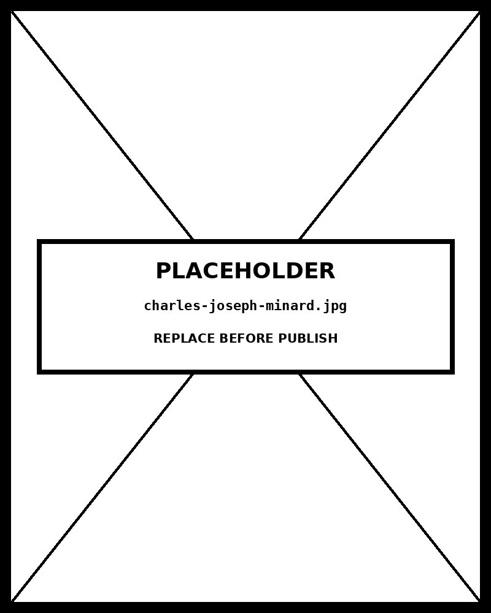

# Chapter 13 — Flow and Network Charts

*What Flows Where — and How Much.*

---

Open the pantry's `sankey-diagram.html`. Energy sources on the left — oil, coal, natural gas, nuclear, renewables. Intermediate transformations in the middle — electricity, transportation fuel, heating. End uses on the right — industrial, residential, commercial. Between them run bands of varying width.

That variation in width is the entire claim. Oil to transportation fuel is a thick band — most oil becomes transportation fuel. Coal to electricity is another thick band. Nuclear and renewable contributions to electricity are thinner bands. Some renewable-to-end-use paths are thin slivers. The thickest band in the diagram tells you more about energy policy than most prose summaries: the dominant path for oil is the transportation sector, not electricity generation. You see this in a second.

Now suppose someone made the same diagram with every band the same width. It would still show the paths — oil connects to transportation fuel, coal connects to electricity. But you would learn nothing about magnitude. The chart would have become a topology diagram: does this connection exist? The original chart answers a different question: how much flows along it?

That distinction — *does this connection exist* versus *how much flows along it* — is the organizing principle of this entire chapter. Every choice between a Sankey diagram and a force-directed graph, between a ribbon chord diagram and an arc diagram, reduces to it. Get the distinction clear and the form selection almost selects itself.

<!-- → [IMAGE: two versions of the same three-column flow data — left: Sankey with proportional band widths (oil-to-transportation-fuel band visibly dominant, thin bands for smaller flows); right: the same topology drawn with uniform-width bands. Annotations on the left version: "Width = quantity (Bertin's magnitude channel)." Annotations on the right: "Uniform width = topology only. Cannot answer 'how much?'" Caption: "The same connections. Different questions. Different charts."] -->

---

## Width as a channel

Jacques Bertin's framework for visual encoding includes width — or thickness — as a magnitude channel. A line of uniform width carries no quantitative information. A line whose width varies encodes magnitude at each point. Sankey diagrams are built entirely on this principle: the flow band's width at any cross-section is proportional to the quantity flowing there. If the band narrows, less is flowing; if it widens, more is flowing. The reader's eye tracks the width and reads it as quantity.

Width ranks roughly third in the Cleveland and McGill accuracy hierarchy — below position and length, but above area and color intensity. The ranking tells you that a Sankey diagram is less accurate than a bar chart for the same data, but more accurate than a color-encoded map. Sankey diagrams earn their complexity when the flow *structure* — the path from source through transformation to destination — is the question, not just the magnitudes themselves. A bar chart of total aid by donor shows the magnitudes; a Sankey shows where the aid went after leaving each donor.

Tufte's proportional ink principle applies directly. The visual area of a Sankey band must be proportional to the quantity it represents. If the band from oil to transportation fuel represents 40 exajoules and the band from coal to electricity represents 20 exajoules, the first band must look twice as wide. A designer who makes the oil band only 1.3 times as wide as the coal band because "it looks better" has broken the encoding. The chart now makes a claim the data doesn't support.

When auditing Claude Code output for Sankey diagrams, the first check is always proportionality: measure the width of the two largest flows and confirm the ratio matches the data ratio. It is the most common failure in AI-generated flow charts — the algorithm places nodes correctly but the scaling is off.

<!-- → [INFOGRAPHIC: Sankey proportionality audit diagram — three flows shown: Flow A (400 units, correct width ~40px), Flow B (200 units, correct width ~20px), Flow C (80 units, correct width ~8px). Below, a "common failure" version where Flow A is 30px, Flow B is 20px, Flow C is 12px — the proportions are wrong. Annotations show the correct ratios (A:B = 2:1, A:C = 5:1) and the failure ratios (A:B = 1.5:1, A:C = 2.5:1). Caption: "Tufte's proportional ink applies: band area must be proportional to value. Verify the ratio, not just the order."] -->

---

## The three flow-magnitude forms

Three chart families use width as a magnitude channel.

**Sankey diagrams** show flows from a source set through optional intermediate stages to a destination set. The canonical use is the energy flow diagram that gave the form its name — Captain Sankey used it in 1898 to visualize where steam energy was being lost in industrial processes. The original problem clarifies what the form is for: substances or quantities moving from sources through transformations to destinations, with the magnitude of each path visible.

The form works best with two to four columns of nodes. More columns and the chart sprawls horizontally; the reader loses track of the flow across too much visual distance. Within each column, nodes are ordered to minimize crossing flows. D3's `d3.sankey()` layout handles this automatically using the Sankey justify algorithm, which produces reasonable orderings; manual adjustment is sometimes necessary for particular datasets.

Color is a secondary channel. The typical convention assigns a hue to each source node and carries that hue downstream through the flows it generates. The result is that the reader can trace a specific source's contribution through the system by following its color. An alternative assigns hue to destination nodes, which emphasizes where things end up rather than where they came from. The choice depends on the communication question.

**Alluvial diagrams** extend Sankey to track categorical transitions over multiple time points. Voters in 2016 → voters in 2018 → voters in 2020. Students who entered as freshmen → students at the end of sophomore year → students who graduated. Customer segments at onboarding → customer segments at six months → customer segments at one year. The flows show who shifted to where at each transition, with band width encoding the count of entities making that shift.

The form is Sankey generalized to longitudinal categorical data. Where Sankey asks "how much moves from A to B through C?", alluvial asks "across these time points, how did the population redistribute?" The use cases are more specific but consequential — electoral analysis, cohort studies, customer journey mapping.

**Ribbon chord diagrams** place entities on a circle and draw ribbons between them, with ribbon width encoding the magnitude of the flow or relationship. Trade flows between countries are a common application: each country occupies an arc on the circle; the ribbon from France to Germany encodes the bilateral trade volume; the ribbon is thicker where the volume is larger.

The circular layout distributes attention evenly across all entities, which is appropriate when there is no natural left-to-right directionality (trade is mutual; energy flow is directional). The trade-off is that circular layouts are harder for many audiences to read than the left-to-right flow of a Sankey. Past about fifteen to twenty entities, the ribbons fill the circle and the chart becomes unreadable.

<!-- → [INFOGRAPHIC: three-panel comparison of the magnitude family — left: Sankey (three columns, left-to-right flow, bands proportional to quantity); center: alluvial (same structure but showing three time points with categorical transitions); right: ribbon chord (same entities arranged on a circle, ribbons of varying width). Each panel labeled with the question it answers: "How much flows A→B→C?" / "How did categories shift across time?" / "How much flows between any pair?" Caption: "Three forms, one channel (width), three layouts for three question structures."] -->

---

## The three connection-existence forms

A different set of questions produces a different set of forms. When the question is *does A connect to B* rather than *how much flows from A to B*, the magnitude channel is no longer needed. The line's presence encodes the connection; its width is irrelevant or decorative.

**Non-ribbon chord diagrams** use the same circular layout as ribbon chord diagrams, but draw lines rather than ribbons. The line's width is uniform; only its presence encodes the connection. The form answers topology questions — who is connected to whom in this network? — for datasets where no meaningful magnitude is attached to the relationships.

**Arc diagrams** lay entities along a horizontal axis and draw arcs above the line between connected entities. The arc height is typically uniform. The form makes one thing easy that the circular chord layout does not: linear ordering. Entities can be sorted alphabetically, by a property value, or by connection count, and that ordering is directly visible. The reader can scan the arc diagram and see that the most highly-connected entities are clustered in one region of the axis.

Arc diagrams fail when the network is dense. Many arcs stacked above the line overlap and the structure becomes illegible — a different version of the hairball problem.

**Force-directed graphs** are the most common network visualization. Each entity is a node; each connection is an edge. A physics simulation places the nodes — connected nodes attract each other, all nodes repel each other — and the layout settles into a configuration where related nodes cluster. The reader sees the clusters as visual groups, which is what makes the form work. The Gestalt law of connection is the mechanism: connected elements are perceived as belonging together. When nodes cluster with their neighbors, the eye reads the cluster as a meaningful group.

Force-directed graphs answer structural questions: which entities are central to the network? which are peripheral? are there tightly connected communities? They cannot answer magnitude questions, because the edges have no width. A dataset with quantitative edge weights can be visualized as a force-directed graph, but the weights are used only to adjust the spring strength in the simulation — they do not appear visually in the output.

---

## The hairball

Dense networks produce hairballs. When every node connects to many others, the edges fill the interior of the visualization and no structure is visible. The nodes float in a tangle of crossing lines. The chart proves that a network exists; it reveals nothing about its structure.

The hairball is not a design failure — it is a structural failure. The chart is trying to show something it cannot show, because the data is too dense for any single-level visualization to reveal. The fix is not to improve the chart; it is to change what the chart is trying to show.

Four mitigations:

**Filter by threshold.** Show only edges above a certain weight, or only the highest-degree nodes. The remaining network is sparser and its structure becomes visible. The cost is that filtered edges and nodes are invisible; the reader cannot know what they are missing unless the chart annotates the filter.

**Cluster.** Apply a community-detection algorithm to the network and aggregate nodes into clusters. Visualize the cluster network (five to ten super-nodes) with a force-directed layout. Provide the within-cluster structure on request, as a secondary visualization or a drill-down.

**Aggregate.** If the network has a natural higher-level structure (research collaborations organized by department, trade organized by continent), show the aggregated network rather than the individual-node network.

**Switch to a matrix view.** An adjacency matrix — a heatmap where rows and columns are nodes and cells are shaded if the corresponding pair is connected — shows every connection in a dense network without any lines crossing. Structure emerges from the row and column ordering. The matrix view requires the reader to decode a grid rather than a spatial layout, which has its own graphicacy requirements, but it scales to hundreds of nodes where force-directed graphs cannot.

The choice of mitigation depends on what the question is. Filtering preserves the network structure at the cost of completeness. Clustering answers a different question (what are the communities?) rather than the original one (what is the full connection structure?). Matrix views answer the full connection question but require a different reading strategy.

<!-- → [IMAGE: four-panel hairball mitigation comparison — all four panels use the same 200-node high-density network. Panel 1: unmitigated force-directed layout (hairball, no structure visible). Panel 2: filtered to top-30 nodes by degree (sparse, structure visible). Panel 3: clustered to 8 super-nodes (community structure visible; individual nodes invisible). Panel 4: adjacency matrix sorted by degree (all connections visible; spatial clustering invisible). Caption under each panel names what the mitigation reveals and what it gives up."] -->

---

## Choosing between the families

The channel-theory question comes first: is the magnitude of the flow part of the message, or only the existence of the connection?

If magnitude matters → Sankey (directional, multi-level), alluvial (longitudinal categorical), or ribbon chord (circular, symmetric).

If existence is all that matters → non-ribbon chord, arc, or force-directed.

Within each family, the secondary question is layout: does the flow have a natural direction (left-to-right Sankey), a natural circular structure (chord), a natural linear order (arc), or no imposed structure (force-directed)?

The entity and connection count determines which forms remain feasible. Sankey diagrams support 5–30 nodes across 2–4 columns. Chord diagrams support 5–20 entities around the circle. Arc diagrams support 10–100 entities on the axis, depending on density. Force-directed graphs support 5–50 nodes before the hairball risk becomes severe.

There is a common mismatch worth naming: using a force-directed graph for data that has quantitative flow magnitudes. The force-directed graph cannot show the magnitudes — it shows topology. A designer with a Sankey-appropriate dataset who reaches for a force-directed graph is making the same error as a designer with a comparison question who reaches for a pie chart. The form doesn't fit the question.

| Form | Primary question | Layout type | Entity count range | Typical use case | Failure condition |
|---|---|---|---|---|---|
| Sankey | Magnitude — how much flows between groups | Left-to-right, two or more node columns | 5–30 nodes per column | Energy budgets, customer-journey funnels | Cycles in the data (a node feeds itself) |
| Alluvial | Magnitude across ordered categorical states | Vertical bands per time step | 4–20 entities | Survey response shifts over time | Too many steps — bands cross illegibly |
| Ribbon chord | Magnitude — symmetric pairs | Circular, ribbons inside a ring | 6–20 nodes | Trade flows, migration matrices | More than ~20 nodes — ribbons overlap into a hairball |
| Non-ribbon chord | Existence — which pairs are connected | Circular, straight chords | 10–40 nodes | Social network adjacency, citation links | Audience expects magnitude (chord thickness misleads) |
| Arc | Connection topology along a one-dimensional ordering | Horizontal axis, arcs above | 10–60 nodes | Network adjacency where node order has meaning | More than ~60 — arcs become a wash |
| Force-directed | Cluster structure — who groups with whom | Algorithmic, positions emerge | 20–500 nodes | Exploratory social or citation networks | Print reproduction (positions shift each render) |
---

## The design decisions in the pantry Sankey

Return to `sankey-diagram.html`. The chart works because specific decisions were made before the code was written.

**Proportional flow widths.** The bands are sized proportionally to the quantities they represent. This is not the default behavior of all Sankey layout libraries — some normalize flows in ways that distort the proportionality. The chart must be checked: the largest flow should be visually the widest, and the ratio of widths should match the ratio of values.

**Node ordering minimizes crossings.** Within each column, nodes are sequenced to reduce the number of flow bands that cross each other. This is a layout optimization that D3's `d3.sankey()` performs automatically, but the result should be verified. Crossing flows make the chart significantly harder to read; a few small crossings are acceptable but many large ones suggest the node ordering needs adjustment.

**Color follows source.** The hue assigned to each source node (oil, coal, gas, nuclear, renewables) cascades through the flows it generates. The reader can trace nuclear energy through to its end uses by following the nuclear hue. This is a design choice — color-follows-destination would make end-use composition more legible instead — and it is the right choice when the question is "where does this source go?" rather than "what composes this end use?"

**Quantitative labels on the largest flows.** The thickest bands carry text annotations. Smaller flows carry their values via tooltips. This is the standard trade-off: direct annotation supports quick reading of the dominant flows; tooltip interaction supports detailed reading of the smaller ones.

None of these is decoration. Each is a channel decision made explicit before the code was written. Claude Code can implement them precisely when the specification names them precisely. A prompt that says "make a Sankey diagram" leaves these decisions to the model's defaults, which may or may not match the data's structure. A prompt that says "proportional widths, color follows source, labels on flows above $50M, tooltip on smaller flows" leaves nothing to chance.

<!-- → [IMAGE: annotated screenshot of the pantry's sankey-diagram.html with four callout arrows — (1) "Proportional widths: oil-to-transportation band ~2× coal-to-electricity band, matching data ratio" pointing to the two dominant flows; (2) "Node ordering: columns sorted to minimize crossing bands" pointing to the middle column; (3) "Color follows source: nuclear hue traceable through all downstream flows" following the nuclear color; (4) "Labels on dominant flows; tooltip on smaller flows" pointing to an annotated band and a thin band. Caption: "Every decision is a channel specification. None is a default."] -->

---

## What you can now do

You can identify the primary question in any flow or network dataset — flow magnitude or connection existence — and choose the right form family based on that distinction alone.

You can build Sankey diagrams with proportional flow widths, correct node ordering, and the color-follows-source or color-follows-destination decision made deliberately. You can verify the proportionality by checking the width ratio against the value ratio.

You can build alluvial diagrams for longitudinal categorical transitions, ribbon and non-ribbon chord diagrams for circular network data, arc diagrams for linearly-ordered networks, and force-directed graphs for exploratory network topology.

You can recognize the hairball failure mode and apply the right mitigation: filter, cluster, aggregate, or switch to a matrix view, depending on what the question is.

You can specify any of these charts for Claude Code with the right D3 layout algorithm — `d3.sankey()`, `d3.chord()`, `d3.forceSimulation()` — and the encoding decisions that make the output honest.

The thing to watch for, going forward, is the force-directed graph applied to quantitative flow data. Force-directed graphs show topology; Sankey diagrams show flow. The question determines the form. When the question is "how much flows from A to B through C," the force-directed graph is the wrong answer, regardless of how many examples you have seen of it used for that purpose.

---

## Exercises

### Warm-up

**Exercise 13.1 — Form selection: magnitude vs. existence.** *(Tests: the primary distinction)*
For each dataset below, identify whether the primary question is flow magnitude or connection existence, and name the right form:
- Aid flows from 5 donor countries through 3 implementing organizations to 8 recipient countries, with USD amounts for each flow.
- Voter shifts between 4 political parties across 3 consecutive elections, tracked as proportions of each prior-election cohort.
- Co-authorship connections between 200 academic researchers, with no associated magnitude.
- Trade flows between 12 countries, bilateral and asymmetric, with USD volume for each pair.
- Twitter follows between 50 accounts in a professional community, with no edge weights.

**Exercise 13.2 — Width proportionality check.** *(Tests: Tufte's proportional ink applied to Sankey)*
A Sankey diagram has three flows: Flow A (400 units), Flow B (200 units), Flow C (80 units). What should the width ratio between Flow A and Flow B be? Between Flow A and Flow C? You measure the rendered chart and find Flow A is 3 times the width of Flow B. What is the proportional-ink violation? Write the follow-up prompt that corrects it.

**Exercise 13.3 — Hairball diagnosis.** *(Tests: recognizing the hairball and selecting the right mitigation)*
You have a force-directed graph of 300 nodes with average degree 18 (each node connects to 18 others on average). Predict whether the chart will produce a hairball. For each of the four mitigations (filter, cluster, aggregate, matrix view), state what question the mitigation answers and what question it gives up.

### Application

**Exercise 13.4 — Build a Sankey with Claude Code.** *(Tests: four-move prompt structure + proportionality audit)*
Take a real flow dataset with directional, multi-level structure (donor → program → recipient, or supply chain source → processing → end use). Write a four-move Claude Code prompt specifying `d3.sankey()`, proportional flow widths, node ordering to minimize crossings, and color-follows-source. Submit it. Audit the output: check width proportionality for the two largest flows (measure the rendered widths and compare to the data ratio). If proportionality fails, write the correction prompt.

**Exercise 13.5 — Build a force-directed graph with interaction.** *(Tests: existence-form build and hairball mitigation)*
Take a network dataset with 20–50 nodes. Build a force-directed graph using `d3.forceSimulation()` with `forceLink`, `forceManyBody`, and `forceCenter`. Add hover-to-highlight (mousing over a node highlights its neighbors and fades all others). Is the hairball present? If yes, implement one mitigation — threshold filter, degree-based node filter, or community clustering — and document what the mitigation gives up.

**Exercise 13.6 — Chord ribbon vs. Sankey for the same data.** *(Tests: layout trade-offs within the magnitude family)*
Take a bilateral flow dataset with a defined set of entities (trade between 8 countries, message flows between 6 departments). Build it as a Sankey (linear, directional) and as a ribbon chord (circular, symmetric). For the question "which pair has the largest flow?", which form answers it more accurately? For the question "how does each entity's outflow compare to its inflow?", which form makes this more visible? Document the trade-offs.

### Synthesis

**Exercise 13.7 — Alluvial cohort diagram.** *(Tests: alluvial form for longitudinal categorical data)*
Take a longitudinal categorical dataset with 3–5 time points — student cohort outcomes (enrolled, continuing, graduated, dropped out), customer state transitions (trial, active, churned, renewed), or voter registration by party across 3 elections. Build an alluvial diagram. Verify that band widths are proportional to the counts making each transition. Identify: which transition is the most common? Which cohort has the highest retention?

**Exercise 13.8 — Magnitude vs. existence mismatch.** *(Tests: identifying and correcting form-question mismatch)*
Find a published network visualization that uses a force-directed graph but where the underlying data has quantitative edge weights that matter to the question (the edge weights are mentioned in the caption or surrounding text). Identify the mismatch: what question is the force-directed graph answering vs. what question the data could support? Build the correct form (ribbon chord or Sankey depending on the data's directionality). Document what the corrected chart reveals that the force-directed graph hid.

### Challenge

**Exercise 13.9 — Sankey with four levels.** *(Tests: multi-level Sankey readability)*
Build a Sankey diagram with four levels of nodes — for example: donor country → fund mechanism → program type → recipient region. Verify width proportionality at each level (the total width entering any node must equal the total width leaving it). At what point does the chart become difficult to read? If readability degrades at level 4, identify the design adjustment that restores it (aggregation, filtering, or a tooltip-on-hover for the deepest level).

**Exercise 13.10 — Matrix view as alternative to hairball.** *(Tests: matrix view for dense networks)*
Take a dense network dataset with 40–80 nodes and high average degree that would produce a hairball in force-directed layout. Build the adjacency matrix (heatmap: rows and columns are nodes, cells shaded for connections). Sort rows and columns by node degree (most connected first). Compare the matrix view to the force-directed graph: what structural feature is visible in the matrix that was invisible in the hairball? What feature of the force-directed layout (cluster proximity, community grouping) is lost in the matrix? Write one paragraph on when each form is appropriate for dense networks.

---

## A note about AI

Flow and network charts are where the model is most likely to produce a hairball — a graph so dense that nothing is visible.

Where the model genuinely helps: producing the same graph with three layouts (force-directed, hierarchical, circular) so the layout's effect on readability is visible.

Where the model does damage: defaulting to force-directed for graphs of any size. Force-directed becomes a hairball past a few dozen nodes.

The rule: layout from the model; the size-appropriate choice from you.

---

## LLM Exercise — Chapter 13: Flow and Network Charts

**What you're building:** A flow or network chart selected for a specific question, built with the magnitude-vs-existence distinction applied and the encoding decisions documented.

**Tool:** Claude Code (for the build) + Claude chat (for the audit).

### The prompt

```
I have flow or network data of [DESCRIBE: entities, connections,
magnitudes if applicable, directionality]. The communication goal
is [DESCRIBE: flow magnitude, connection existence, community
structure, temporal transitions].

Walk me through:

1. Confirm the family is flow/network (vs. comparison, distribution,
   part-to-whole). If it isn't, recommend the right family and stop.

2. Identify the primary question: flow magnitude (how much flows from
   A to B?) or connection existence (does A connect to B?). This
   distinction determines the form family.

3. Choose the specific form based on:
   - Flow magnitude → Sankey (directional multi-level), alluvial
     (longitudinal categorical), or ribbon chord (circular symmetric)
   - Connection existence → non-ribbon chord, arc (linear order
     meaningful), or force-directed (cluster structure is question)
   - Entity and connection count (Sankey: 5–30 nodes / 2–4 columns;
     chord: 5–20 entities; arc: 10–100 nodes; force-directed: 5–50
     nodes before hairball risk)

4. If the network is dense enough to risk a hairball, specify the
   mitigation: filter by threshold, cluster to super-nodes, aggregate
   to higher level, or switch to matrix view.

5. Specify the channels:
   - For magnitude forms: flow-band width = quantity (cite Bertin
     width-as-channel and Tufte's proportional ink)
   - For existence forms: edge presence = connection
   - Color hue: source-following or destination-following or
     categorical by node attribute
   - Node size (if used): which attribute, what encoding

6. Write a single Claude Code prompt using the four-move structure
   (show, say, constrain, verify), specifying the correct D3 layout:
   d3.sankey() for Sankey, d3.chord() for chord, d3.forceSimulation()
   with forceLink/forceManyBody/forceCenter for force-directed.

After Claude Code returns the chart, audit it for flow-specific failures:
- Sankey: are flow widths proportional to values (check ratio of
  widest to second-widest)?
- Chord ribbon: do ribbon widths encode the correct magnitudes at
  both ends?
- Force-directed: is the hairball present? If yes, apply mitigation.
- All forms: is node ordering sensible (Sankey: minimizes crossings;
  arc: meaningful sort; chord: sorted by value)?

Flag any audit failure and write the follow-up prompt that corrects it.
```

**What this produces:** A markdown audit document and an HTML file containing the working D3 chart. Save as `chapter-13-flow-audit.md` and `chapter-13-flow.html`.

**How to adapt this prompt:**
- *For your own domain:* Replace the dataset description, directionality, and communication goal.
- *For ChatGPT or Gemini:* Works as-is.
- *For a Claude Project:* Save the Chapter 01 channel framework and Bertin's width-as-channel concept as reference files; the per-chapter audit prompt becomes the user message for each new chart.
- *For Cowork:* Use Cowork to execute the Claude Code prompt and save the resulting HTML file directly to your project directory.

**Connection to previous chapters:** Builds on Chapter 01 (Bertin's width-as-channel, Gestalt law of connection, Stevens' power law on area perception), Chapter 02 (chart selection — confirming you are in the flow/network family), Chapter 05 (data audit — identifying whether the question is flow magnitude or connection existence), Chapter 11 (part-to-whole — chord and Sankey are sometimes confused with stacked forms).

**Preview of next chapter:** Chapter 14 covers geographic and spatial charts — choropleths, cartograms, flow maps, dot density maps. Where Chapter 13 was about flow between abstract entities, Chapter 14 is about flow and pattern across physical geography. The channel decisions change: x and y position now encode latitude and longitude rather than abstract network position, and the projection choice becomes a design constraint that affects every encoding in the chart.

---

## Further reading

- **Sankey, Captain M. H. P. R. (1898).** "The Thermal Efficiency of Steam Engines." *Minutes of the Proceedings of the Institution of Civil Engineers* 134. The original Sankey diagram, with the use case that defines what the form is for.
- **Munzner, Tamara. (2014).** *Visualization Analysis and Design.* Chapters 9 and 14 on network and tree visualization. The most rigorous treatment of when force-directed graphs succeed and fail.
- **Bertin, Jacques. (1983).** *Semiology of Graphics.* The width-as-channel framework that grounds every proportional flow diagram in this chapter.
- **Cairo, Alberto. (2016).** *The Truthful Art.* Chapter 9 on flow and network visualization; the Sankey origins discussion is developed here.
- **Munzner, Tamara. (2014).** *Visualization Analysis and Design.* Section 9.3 on the hairball problem and its mitigations.
- **The book's pantry** — `sankey-diagram.html`, `arc-diagram.html`. Each is the reference implementation for its form; compare the width-encoding of the Sankey against the uniform edges of the arc diagram.

---

*Tags: flow-charts, network-charts, Sankey, alluvial, chord-diagram, ribbon-chord, arc-diagram, force-directed, hairball, Bertin-width, Gestalt-connection, d3-sankey, d3-force, D3, Claude-Code*

---

## AI Wayback Machine

The ideas in this chapter didn't appear from nowhere. **Charles Joseph Minard** drew the 1869 flow map of Napoleon's Russian campaign — combining six variables (army size, location, direction, temperature, distance, time) in a single image. Tufte called it possibly "the best statistical graphic ever drawn."


*Charles Joseph Minard, circa 1860. AI-generated portrait based on a public domain engraving (Wikimedia Commons).*

**Run this:**

```
Who was Charles Joseph Minard, and how does his Napoleon's-march flow map connect to the flow and network charts we covered in this chapter? Keep it to three paragraphs. End with the single most surprising thing about his career or ideas.
```

→ Search **"Charles Joseph Minard"** on Wikipedia.

**Now make the prompt better.** Try one of these:

- Ask it to enumerate the six variables in Minard's map and explain how each was visually encoded.
- Ask it to compare Minard's flow map with the modern Sankey diagram (Chapter 62) — what's shared, what's different?

What changes? What gets better? What gets worse?
