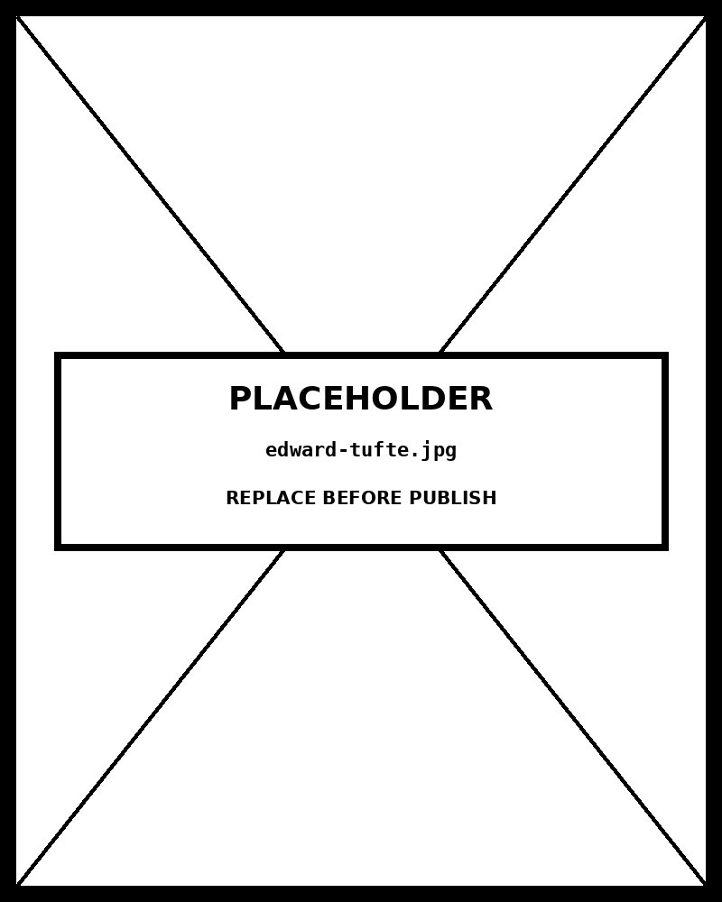

# Chapter 16 — Design Principles in Practice

*From Principle to Audit Checklist.*

---

A published quarterly report has a bar chart of Q4 sales by region. The y-axis starts at $400,000. The bars are three-dimensional rectangles with perspective shading. Five regions are colored in five different gradients — red, orange, yellow, green, blue. Heavy gridlines run at every dollar increment. The x-axis labels are rotated 45 degrees and set in 8-point italic. The title, also in 8-point italic at the top, reads: "Q4 Performance Highlights."

Take that chart apart one failure at a time.

The y-axis starts at $400,000 instead of zero. A region at $480,000 and a region at $440,000 look like a four-to-one difference. The actual data shows a nine percent difference. The visual claim exceeds the empirical reality — not by a little, but by a factor of four. This is Stevens' power law misapplied: the reader's eye reads bar area as magnitude, and the truncated baseline has broken the proportionality between area and value.

The three-dimensional perspective adds shading that makes the front face of each bar look shorter than the bar's actual height. A visual element whose purpose is to make bars look three-dimensional has the effect of making them look the wrong height. That is not a trade-off. That is pure distortion.

The five gradient colors encode nothing. The five regions are not ordered. There is no sequence the reader should see in the progression from red to blue. The color variation is saying something — the eye always tries to read meaning from color variation — but the thing it is saying is invented by the reader, not supported by the data.

The heavy gridlines crowd the chart. The rotated labels slow the reader by a measurable amount (about 200 milliseconds per label). The title "Q4 Performance Highlights" does not tell the reader what the chart shows — it names the occasion, not the finding. There is no comparison reference: Q4 compared to what?

Fourteen of the twenty-two items on the Evergreen/Emery design checklist fail. The chart is more failure than success.

<!-- → [IMAGE: the flawed chart described in the opening, annotated with numbered failure callouts — (1) y-axis starts at $400K, not zero; (2) 3D perspective on bar tops; (3) five gradient rainbow colors encoding nothing; (4) heavy gridlines at every dollar increment; (5) 45° rotated labels in 8pt italic; (6) title names the occasion, not the finding; (7) no comparison reference. Caption: "Seven visible failures. Fourteen of twenty-two checklist items fail. The chart is more failure than success."] -->

The redesign is a horizontal bar chart, sorted by Q4 sales descending, zero baseline, no three-dimensional effects, single muted color, light gridlines at axis ticks only, 16-point sans-serif title, value annotations on the bars, and a subtitle that makes the comparison explicit. Every change traces to a specific principle. The chapter is about those principles — four of them, synthesized into a single audit framework.

---

## The four sources, and what each contributes

The design-principle literature has four major contributors that matter for this book. They are not interchangeable; they contribute differently.

**Tufte's contribution** is the two heuristics that ground the entire audit tradition. First: data-ink ratio — the proportion of total ink devoted to encoding data should be as high as possible. Remove ink that doesn't encode anything. Second: proportional ink — the visual area of a chart element must be proportional to the data value it represents. These are heuristics, not laws. They require judgment to apply. But they name real problems: the bar chart that is half chartjunk, the area chart whose non-zero baseline has made the data meaningless.

**Few's contribution** is a refinement of Tufte that resolves the heuristic into a working criterion. Tufte's strict reading says: minimize non-data ink. Few's refinement says: the question is "does this visual element support the message?" not "is it strictly data ink?" The Bateman et al. (2010) experimental study showed that embellishments supporting the message do not reduce comprehension and may improve recall. Tufte's strict minimalism was too strict; it removed elements that were doing genuine work for the reader.

The book's adopted position is Few's: clarity over minimization. Functional redundancy — color luminance reinforcing a position-encoded ranking, light gridlines helping precise reading, value annotations above bars — stays, because it supports the message. Decoration that serves no reader function — three-dimensional bar effects, gradient backgrounds, rainbow-colored bars encoding no information — goes.

**Cairo's contribution** is the ethical frame: chart choice is morally significant. When a more appropriate alternative is available, choosing an ineffective encoding is not just a stylistic error — it impedes understanding. Cairo's specific contributions to the audit framework: the "compared with what?" check (every quantitative claim requires an explicit reference), graphicacy as the audience constraint (the form must match what the reader can decode), and the responsibility argument (the designer has an obligation to the reader's comprehension, not just to technical accuracy).

**Gestalt's contribution** is the perceptual mechanism that makes the other principles intelligible. Design rules about grouping, separation, and visual flow are not arbitrary — they describe how the visual system processes images. Proximity (related elements perceived as grouped), similarity (similar visual properties perceived as categories), enclosure (bordered regions perceived as units), continuity (smooth paths perceived as connected), figure-ground (foreground distinguished from background). Charts that violate these principles create cognitive friction for reasons that are now predictable: the reader's visual system is doing work the design should have done.

The four sources are not alternatives. They are complementary. Tufte names the heuristics. Few resolves them into a working criterion. Cairo frames the responsibility. Gestalt provides the mechanism. Together they produce a single synthesis that an audit checklist can operationalize.

<!-- → [INFOGRAPHIC: four-quadrant diagram showing the complementary contributions — top-left: Tufte (heuristics: data-ink ratio, proportional ink); top-right: Few (working criterion: "does this support the message?"); bottom-left: Cairo (ethical frame: responsibility to the reader, "compared with what?", graphicacy); bottom-right: Gestalt (perceptual mechanism: proximity, similarity, continuity, figure-ground). A center node labeled "Evergreen/Emery 22-point checklist" with arrows from all four quadrants pointing to it. Caption: "Each source contributes a different kind of knowledge. The checklist operationalizes all four."] -->

---

## Proportional ink: the foundation

Proportional ink is the most concrete of Tufte's principles, and the one with the clearest empirical grounding. Stevens' power law gives the mechanism: the eye perceives area sublinearly. When the visual area of a chart element doesn't match the data value — because the baseline is truncated, or radius rather than area is encoded, or three-dimensional perspective distorts the geometry — the reader's perception diverges from the underlying value in ways the math predicts.

The violations are consistent across chart types. Bar chart with a truncated y-axis: the bar's length encodes (value minus baseline), not value. The visual proportion misrepresents the actual magnitude. Area chart with a non-zero baseline: the shaded region encodes the area above the baseline, not the cumulative total. Bubble chart scaled by radius: doubled value produces doubled radius produces four times the area, but the reader perceives only about 2.5 times. Radial bars and polar area charts: outer-ring arcs cover more visual angle than inner-ring arcs of the same radial extent, introducing a distortion that compounds the basic area-perception error. Three-dimensional bar effects: perspective foreshortening makes bars at the same height look different heights depending on their position in the frame.

The fix is always the same in principle: encode the data value as the visual area, from a zero baseline where the channel is position-from-baseline, using `d3.scaleSqrt` for radius encoding where area is the channel.

The exception is real and important: line charts use point position as the magnitude channel, not area. The y-axis on a line chart can be non-zero without violating proportional ink. The channel is point position, not bar length. The rule is contingent on the channel the form uses.

This is why the principle must be understood from its mechanism, not memorized as a rule. "Zero baseline always" is wrong. "Proportional ink required for area-encoding charts, not for position-encoding charts" is right, and it is right because of Stevens' power law applied to the specific perceptual channel in use.

---

## Data-ink ratio: the heuristic and its resolution

Tufte's data-ink ratio — the proportion of total ink that encodes data — is a heuristic, not a formula. No one computes it literally. Its value is as a *direction*: when you look at a chart and there is a lot of ink, ask which of it is doing work and which is decorative.

The strict Tufte reading: minimize non-data ink. The implication: remove gridlines, decorative borders, heavy axis lines, and any graphic element that doesn't directly encode a data value.

Few's refinement: the correct question is "does this support the message?" not "is this data ink?" Applied specifically:

Light gridlines at axis tick positions help readers read precise values from the chart. They do not encode data — they support the reading of data. A Tufte purist removes them. Few's criterion keeps them, because the reader who wants to know "is this bar above $200,000?" needs a reference line to check against, and the gridline provides it at no cost to the data signal.

Color luminance redundantly reinforcing position-encoded magnitude helps color-blind readers and supports casual scanning. It does not encode new information — the position already encodes the magnitude. A Tufte purist removes it. Few's criterion keeps it, because the functional redundancy aids the reader without misleading them.

Value annotations above bars let readers read precise values without estimating bar height. They add ink. A strict Tufte reading says: the bars themselves encode the values; the annotations are redundant. Few's criterion keeps them: the reader who needs to know the exact value can read it without visual estimation.

Three-dimensional bar effects, gradient backgrounds, rainbow colors encoding nothing, drop shadows, decorative borders — these fail Few's test. They do not support the message. They compete with the data for the reader's attention and sometimes distort the data in the process. They go.

The resolution is not "remove everything that isn't data ink." It is "keep everything that supports the reader's comprehension; remove everything that doesn't." The two criteria look similar but produce different charts at the margin.

| Visual element | Tufte (strict) | Few (functional) | Reason |
|---|---|---|---|
| Light gridlines at axis ticks | Remove | Keep | Few: aids reading long-distance comparisons; Tufte: reader can interpolate |
| Color luminance reinforcing position | Remove (redundant) | Keep | Few: redundancy aids accessibility; Tufte: redundant ink violates ratio |
| Value annotations above bars | Keep | Keep | Both: direct labeling replaces axis reading |
| 3D bar perspective | Remove | Remove | Both: perspective distorts the position-along-common-scale channel |
| Gradient background | Remove | Remove | Both: non-data ink, reduces contrast for the data marks |
| Rainbow palette encoding nothing | Remove | Remove | Both: decorative color competes with attentional encoding |
| Drop shadow | Remove | Remove | Both: non-data ink, no informational content |
---

## Color: the three vocabularies

Color encoding has three distinct uses in data visualization, and using the wrong one for a given data type is a Bertin-class error.

**Categorical color** uses distinct hues to encode categorical attributes — attributes with no inherent order. Five product lines, eight countries, four political parties. The hues should be visually distinct but similar in luminance, so no category reads as more important than the others by virtue of appearing darker or brighter. Five to seven colors is the reliable limit; past that, the eye cannot distinguish reliably. Color-blind safe palettes are required: the ColorBrewer qualitative palettes are designed for distinguishability under color-blindness simulation.

**Sequential color** uses luminance — a single hue, varying from light to dark, or a closely related hue gradient — to encode ordered or quantitative attributes. A chloropleth map of income by county. A heatmap of request frequency by hour and day. The pale end is conventionally low; the dark end is conventionally high. This convention is strong enough that reversing it creates confusion for readers without explanation. Sequential palettes (viridis, magma, blues, grays) are designed to maintain distinguishability under luminance variation and color-blindness simulation.

**Diverging color** uses two hues, one for negative direction and one for positive, pale around a meaningful midpoint, darker as values diverge. Temperature anomalies around the historical average. Budget deviations above and below target. Political polling above and below fifty percent. The midpoint must be genuinely meaningful for a diverging palette to be honest. For data without a meaningful midpoint — all values positive, no reference zero — a diverging palette implies a center that doesn't exist. Use sequential instead.

Cairo's responsibility frame applies to color accessibility. A palette that fails color-blind simulation is excluding about eight percent of male readers from full comprehension. That is not a stylistic oversight — it is a failure of the designer's obligation to the audience.

For Claude Code work, specify the palette type and endpoints explicitly. "Sequential palette from #F5F0E8 to #8B0000, color-blind safe, consistent with dark-mode inversion via prefers-color-scheme" is a complete color specification. "Use nice colors" is not.

<!-- → [IMAGE: three-panel color vocabulary reference — left: categorical (five distinct hues, similar luminance, for five unordered product categories); center: sequential (single hue from pale to dark, for a quantitative income scale); right: diverging (two hues, blue for negative, red for positive, white at zero, for budget variance). Each panel labeled with data type (unordered categorical / ordered/quantitative / centered with meaningful midpoint) and a one-sentence use-case description. Caption: "Three data types. Three color vocabularies. Using the wrong one introduces false order or hides true structure."] -->

---

## Annotation strategy

Annotations are text or graphical elements that make specific parts of a chart legible. The correct strategy for annotations follows directly from Cairo's "the chart must answer the question" principle: every annotation should answer a question the reader might have. An annotation that answers no question is chartjunk.

The questions to anticipate:

"What does this chart show?" The title and subtitle answer this. A title that says "Q4 Performance Highlights" does not answer the question — it names an occasion. A title that says "Food Security Funding Exceeds Every Other Sector" answers it.

"What unit is this?" Axis labels with units answer this. An axis labeled "0 to 600" with no currency symbol leaves the reader guessing.

"What is the comparison?" Cairo's "compared with what?" check. If the chart shows Q4 sales, the subtitle should say "compared with Q3 2024" or "compared with Q4 2023 target." The comparison must be named. A chart without a comparison is a chart making a claim without a reference.

"Why is this bar so much higher?" A callout annotation on the outlier answers this. Without it, the reader either invents a reason or stops trusting the chart.

"Where does this data come from?" A source citation answers this. Without it, the chart makes claims with no attributed provenance.

Each question gets an annotation. Each annotation answers a question. An annotation that isn't answering a question from this list is probably decorating rather than communicating.

Direct labeling versus legends is a specific trade-off within annotation strategy. Direct labels — names on bars, values above columns, lines labeled at their endpoints — reduce the number of lookup steps: the reader sees the bar and the label in the same eye position. Legends require two eye movements: look at element, look at legend, look back at element. For seven or fewer categories, direct labels are almost always better. For more, a legend may be unavoidable.

---

## The Evergreen/Emery checklist as the synthesis instrument

Stephanie Evergreen and Ann Emery's twenty-two-point checklist operationalizes the four-source synthesis into a workable audit instrument. Five categories, twenty-two items.

**Text** (five items). Is the title clear and informative — naming the finding, not the occasion? Are axes labeled with units? Are data labels visible at the chart's intended deployment size? Do annotations answer real questions? Is body text legible at deployment size?

**Arrangement** (four items). Is sort order meaningful — by value when comparison is the goal, by category when identity is the goal? Does the layout use space efficiently? Are related elements grouped by proximity? Does visual flow match reading order?

**Color** (five items). Is color used purposefully — encoding a specific data attribute rather than decorating? Is the palette type matched to the data type — categorical for categories, sequential for ordered or quantitative, diverging for centered data? Does the palette survive color-blindness simulation? Is contrast sufficient for the deployment context? Is dark-mode behavior specified?

**Lines** (four items). Do gridlines support reading without competing with the data? Are axis lines visible but unobtrusive? Are stroke widths consistent? Are there no three-dimensional effects or perspective distortions?

**Overall** (four items). Is every visual element passing Few's "does this support the message?" test? Is proportional ink maintained — zero baselines where bars are the channel, area encoding where area is the channel? Is data shown without distortion? Is accessibility metadata present — ARIA labels, color-blind safety, sufficient contrast?

Every failed item is a prompt to Claude Code. Not a prompt to revise the concept — a prompt to fix the specific encoding decision that the failed item names. The twenty-two items are not abstract principles; they are concrete checks, each with a concrete fix.

### Text (5 items)

| Item | Principle | Claude Code prompt phrase |
|---|---|---|
| Chart has a title in plain language | Cairo: key message | "Title the chart with the headline finding in 6–10 words." |
| Subtitle gives context or units | Few: data context | "Add a subtitle with units and time period." |
| Text size ≥ 9pt at final display size | Few: legibility | "Set body text to 11pt, axis labels to 10pt minimum." |
| Type sans-serif or appropriate serif, no novelty | Tufte: visual quietude | "Use a single typeface family throughout — no display fonts." |
| Numerical labels rounded to meaningful precision | Tufte: ratio | "Round axis labels to 2 significant digits unless precision matters." |

### Arrangement (4 items)

| Item | Principle | Claude Code prompt phrase |
|---|---|---|
| Vertical orientation only when categories are short | Cleveland & McGill | "Use horizontal bars when category labels exceed 12 characters." |
| No diagonal or rotated labels under 90° | Gestalt: continuity | "Keep all labels horizontal; if too long, switch to horizontal bars." |
| Bars / categories sorted by value, not source order | Cleveland: effectiveness | "Sort the bars by value descending." |
| Adequate white space between chart elements | Tufte: ratio | "Add 16px of padding between the axis and the first bar." |

### Color (5 items)

| Item | Principle | Claude Code prompt phrase |
|---|---|---|
| Color is used purposefully, not decoratively | Tufte: data-ink | "Use a single hue across all bars unless color encodes a variable." |
| Sequential luminance for quantitative | Cleveland: expressiveness | "Use a single-hue sequential luminance scale for the quantitative variable." |
| Categorical hue limited to ≤ 7 categories | Few: working memory | "Limit categorical color to 6 distinguishable hues." |
| Colorblind-safe palette | Few: accessibility | "Use a palette readable in deuteranopia simulation." |
| Adequate contrast against background | Cairo: legibility | "Ensure text-to-background contrast ratio ≥ 4.5:1." |

### Lines (4 items)

| Item | Principle | Claude Code prompt phrase |
|---|---|---|
| Gridlines light or removed | Tufte: data-ink | "Set gridlines to `#c8c4c0`, 0.75px, behind the marks." |
| Axis lines minimal | Tufte: data-ink | "Remove top and right axis spines; keep bottom and left only." |
| No 3D or shadow effects | Tufte: chartjunk | "Flat fills only — no shadows, no gradients, no 3D." |
| Marks have a defined stroke for clarity | Few: contrast | "Add a 0.5px `--ink` stroke around each bar." |

### Overall (4 items)

| Item | Principle | Claude Code prompt phrase |
|---|---|---|
| Zero baseline for length encodings | Cleveland: proportional ink | "Bar y-axis starts at 0 regardless of data minimum." |
| Annotations on the most important values | Cairo: focus | "Direct-label the top 3 bars with their values." |
| One chart, one message | Cairo: key message | "Drop the secondary metric — one chart, one finding." |
| Print-reproducible (no color-only encoding) | Few: redundancy | "Test in grayscale; encoding must survive the conversion." |

*The 22-point pre-flight checklist. Run it before publishing any chart.*
---

## The audit as design discipline, not just post-processing

The most common mistake is running the audit only after a chart is built. The checklist is most valuable *during* design: writing the four-move prompt with the twenty-two items in mind, so that the output requires minimal correction.

Consider what happens when the checklist is applied before the prompt:

**Text**: the title and subtitle are specified in the prompt. The comparison is named explicitly. Units are specified.

**Color**: the palette type and endpoints are specified. Color-blind safety is specified. Dark-mode behavior is specified.

**Lines**: "no three-dimensional effects" is in Move 3 (constrain). "Light gridlines at axis ticks only, opacity 0.07" is in Move 3.

**Arrangement**: sort order is specified. Margins are specified.

**Proportional ink**: zero baseline is specified with "non-negotiable" in Move 3.

Most of the checklist items become prompt specifications rather than post-production corrections. The audit catches whatever the prompt missed; the discipline catches most of it before Claude Code writes a line.

The chart that passes all twenty-two items is not necessarily the most visually striking chart. It is the chart that most reliably produces accurate comprehension in its intended audience. That is the goal the checklist serves. The Tufte heuristics, Few's refinement, Cairo's ethical frame, and Gestalt's perceptual mechanism are all in service of that goal — and the twenty-two items are how the service becomes checkable.

<!-- → [IMAGE: before/after side-by-side of the opening-case chart — left: the original flawed version with the seven annotated failures; right: the redesigned horizontal bar chart (sorted descending, zero baseline, single muted hue, light gridlines, 16pt sans-serif title, direct value labels, "compared with Q3" subtitle). A checklist overlay on the right panel shows all 22 items checked. Caption: "Same data. Different encoding decisions. The redesign passes all 22 items because every design decision traces to a specific principle."] -->

---

## What you can now do

You can audit any visualization using the Evergreen/Emery twenty-two-point checklist and produce a written critique with specific corrections. You know which category each item falls into, what principle it operationalizes, and what the follow-up prompt looks like for each failure.

You can apply Few's clarity-over-minimization resolution to any "decoration versus function" dispute. The criterion is "does this support the message?" not "is this strictly data ink?" Functional redundancy stays. Decoration goes.

You can specify the correct color vocabulary for a given data type: categorical hue for unordered attributes, sequential luminance for ordered or quantitative, diverging two-hue for centered data. You can verify the choice against color-blindness simulation before publishing.

You can apply the annotation strategy: every annotation answers a question the reader might have; every annotation that answers no question is chartjunk; Cairo's "compared with what?" check is one specific question that must always be answered.

The thing to watch for, going forward, is applying the audit only after charts are built. The checklist is most powerful as a design specification — each of its twenty-two items becoming a line in Move 3 of the four-move prompt — rather than as a list of corrections to apply after the fact.

---

## Exercises

### Warm-up

**Exercise 16.1 — 22-point checklist on a published chart.** *(Tests: applying the full checklist)*
Find a chart in a recent publication — corporate report, academic paper, journalism, or government dashboard. Walk through all twenty-two items, categorized by the five checklist groups (text, arrangement, color, lines, overall). For each item, state pass or fail. Count the failures. Is it more failure than success, or more success than failure? For the three most significant failures, name the principle each violates (Tufte proportional ink, Few's clarity criterion, Cairo's responsibility frame, or a specific Gestalt principle).

**Exercise 16.2 — Few's test on specific elements.** *(Tests: the chartjunk resolution)*
For each of the following visual elements, apply Few's criterion ("does this support the message?") and classify as data ink, functional redundancy, or chartjunk:
- Light gridlines at y-axis tick positions on a bar chart.
- A gradient background ranging from white at the top to light gray at the bottom.
- Color luminance on a sorted bar chart where the highest bar is darkest.
- A drop shadow under the chart area.
- Direct value labels above each bar in a comparison chart.
- A decorative border around the entire chart SVG.
- Three-dimensional perspective on bar tops.

**Exercise 16.3 — Color vocabulary matching.** *(Tests: categorical/sequential/diverging classification)*
For each dataset below, identify the correct color vocabulary (categorical, sequential, or diverging) and justify with the data type:
- Eight world regions, no inherent order, each with a funding total.
- Temperature anomalies by year, ranging from −2.5°C to +1.8°C relative to the 1990 baseline.
- Response time ratings from 1 (very slow) to 5 (very fast) across twelve agencies.
- Five product categories in a market share breakdown.
- Budget variance by department: some over budget (positive), some under (negative), several at target.

### Application

**Exercise 16.4 — Full audit and redesign.** *(Tests: complete 22-item audit + Claude Code redesign)*
Take a chart with multiple visible failures — a truncated bar chart, a rainbow-colored pie, or a three-dimensional column chart from any published source. Walk through all twenty-two checklist items. For each failure, name the principle violated and the specific correction. Write the four-move Claude Code prompt that implements all corrections simultaneously. Build the redesign. Re-run the twenty-two items and document how many now pass.

**Exercise 16.5 — Annotation audit.** *(Tests: Cairo's "answers a question" criterion)*
Take a chart you produced recently. List every annotation present: title, subtitle, axis labels, data labels, callouts, source citations, legends. For each annotation, identify which reader question it answers (what does this show? what unit? what comparison? why is this notable? where does this come from?). Remove any annotation that answers none of these questions. Add any annotation whose corresponding question is currently unanswered. Rebuild with Claude Code if the changes are substantial.

**Exercise 16.6 — Dark-mode checklist.** *(Tests: color specification for both modes)*
Take three charts you have built previously. Add dark-mode support to each using `prefers-color-scheme` media query. For each, verify: does the sequential palette invert correctly (light-is-low in both modes)? Does categorical hue remain distinguishable? Is contrast sufficient in dark mode for both text and chart elements? Document any color that required adjustment and the specific hex values used in each mode.

### Synthesis

**Exercise 16.7 — Pre-flight audit discipline.** *(Tests: applying the checklist before building, not after)*
Take the next chart you need to build for professional use. Before writing the four-move prompt, work through all twenty-two checklist items as design specifications — converting each into a specific constraint for Move 3. Write the full prompt. Build the chart. Run the post-build audit: how many items need correction compared to a chart you built without the pre-flight discipline? Document the difference.

**Exercise 16.8 — Cairo-class moral failure identification.** *(Tests: Cairo's ethical frame applied)*
Find a chart in published work that you would classify as a Cairo-class moral failure — a chart where a more appropriate alternative was clearly available, and the chosen form impedes the reader's understanding in a way that affected a consequential decision or claim. Identify: what was the more appropriate form? What was the specific audience impact of the failure? Would Few classify the failure as merely stylistic or as a responsibility failure? Write one paragraph making the ethical argument.

### Challenge

**Exercise 16.9 — Three-perspective redesign.** *(Tests: understanding the Tufte/Few distinction)*
Take a flawed chart — one with several checklist failures including at least one element that Tufte would remove but Few's criterion would keep. Redesign it three times: once applying Tufte's strict minimalism (data-ink only; remove everything that isn't strictly encoding data), once applying Few's clarity criterion (keep anything that supports the message), and once applying the book's Few-resolved synthesis. Produce all three versions with Claude Code. For the specific elements where Tufte and Few disagree, document which version you would publish and why, citing the experimental evidence (Bateman et al.) that grounds Few's position.

**Exercise 16.10 — Build your team's audit instrument.** *(Tests: adapting the framework to a specific professional context)*
The Evergreen/Emery checklist is a general instrument. Draft a customized version for your professional domain: are there domain-specific items to add (financial chart conventions, medical data labeling requirements, geographic projection standards)? Are there items from the standard checklist that are rarely relevant in your context and could be deprioritized? Test your customized checklist on five recent charts from your team's work. Revise based on what you find.

---

## A note about AI

The design principles chapter brings the book's accumulated rules into application. The model has read every design-principles book ever published.

Where the model genuinely helps: critiquing your draft chart against canonical principles — data-ink ratio, perceptual ordering, color choice — and surfacing where you violated them.

Where the model does damage: producing principle-compliant charts that fail at the actual job of communicating your specific argument. Principle compliance and argument-serving are not the same thing.

The rule: principles from the model; the argument-serving check from your reader.

---

## LLM Exercise — Chapter 16: Design Audit

**What you're building:** A complete audit and redesign of a flawed visualization, with each correction documented using the principle and perceptual mechanism it serves.

**Tool:** Claude Code (for the redesign) + Claude chat (for the audit).

### The prompt

```
I have a visualization to audit and redesign: [DESCRIBE: the chart's
current form, channels used, obvious failures you can see, or paste
the chart specification or image].

Walk me through the full design audit:

1. Apply the Evergreen/Emery 22-point checklist. For each of the five
   categories, state which items pass and which fail:
   - Text (5 items): title, axis labels, data label size, annotation
     quality, body text legibility
   - Arrangement (4 items): sort order, space efficiency, element
     grouping, reading order
   - Color (5 items): purposeful use, palette type match (categorical/
     sequential/diverging), color-blind safety, contrast, dark-mode
   - Lines (4 items): gridline role, axis line weight, stroke
     consistency, no 3D effects
   - Overall (4 items): Few's "supports the message?" test, proportional
     ink, no distortion, accessibility metadata

2. For each failed item, name the principle violated:
   - Tufte proportional ink (with Stevens' power law mechanism)
   - Few's clarity criterion (with "does this support the message?" test)
   - Cairo's ethical/responsibility frame (with specific audience impact)
   - Gestalt principles (naming the specific principle violated)

3. Specify the complete redesign as a four-move Claude Code prompt
   that addresses every failed item. For each design decision in
   Move 3, reference the checklist item it satisfies.

4. After Claude Code returns the redesign, re-run the 22-point
   checklist. Document: how many items now pass? For any remaining
   failures, write the follow-up correction prompt.
```

**What this produces:** A markdown audit document and an HTML file containing the redesigned chart. Save as `chapter-16-design-audit.md` and `chapter-16-redesign.html`.

**How to adapt this prompt:**
- *For your own chart:* Replace the description with your actual chart specification or a description of a published chart you want to audit.
- *For ChatGPT or Gemini:* Works as-is. The 22-point checklist is model-agnostic.
- *For a Claude Project:* Save the Evergreen/Emery checklist, Few's chartjunk-debate analysis, and Cairo's ethical frame as reference files; the per-chart audit becomes the user message for each new chart you review.
- *For team use:* The audit document becomes a shared artifact. Multiple team members can apply the same 22-point framework to a chart and compare results.

**Connection to previous chapters:** This is the synthesis chapter. It brings together Chapter 01 (Cleveland & McGill hierarchy, Stevens' power law, Bertin's channel framework), Chapter 05 (data audit — the pre-chart work that prevents building the wrong chart), Chapters 07–15 (the chart-family-specific design rules that each map to specific checklist items), and Chapter 11 (Cairo's proportional ink and the rhetorical-vs-analytical frame — now generalized to all charts). The audit framework is the instrument that operates across all of Part II.

**Preview of next chapter:** Chapter 17 builds a complete project from raw data to published output, walking the full pipeline: pre-chart audit (Chapter 05's framework), chart selection (Chapter 02's framework), channel specification (Chapter 01's framework), Claude Code build (the four-move prompt), and design audit (this chapter's 22-point checklist). The project is where all of the book's frameworks converge into a single practice.

---

## Further reading

- **Tufte, Edward R. (1983, 2nd ed. 2001).** *The Visual Display of Quantitative Information.* Chapters 4–5 establish the data-ink ratio, proportional ink, and the chartjunk critique. Read the principles; apply them as Few-resolved heuristics.
- **Few, Stephen. (2011).** "The Chartjunk Debate: A Close Examination of Recent Findings." *Visual Business Intelligence Newsletter.* The transcript is in the book's pantry. This is the definitive statement of the Few-resolved position the book adopts.
- **Cairo, Alberto. (2016).** *The Truthful Art.* Chapter 2 develops the ethical frame; Chapter 3 develops "compared with what?"; the graphicacy concept runs throughout.
- **Cairo, Alberto. (2019).** *How Charts Lie.* The accessible companion; particularly useful for understanding the audience-comprehension side of the responsibility argument.
- **Evergreen, Stephanie D. H. (2019).** *Effective Data Visualization.* The 22-point checklist with worked examples; the pantry's `EvergreenDataVizChecklist.txt` contains the instrument itself.
- **Wertheimer, Max. (1923).** The original Gestalt perception papers. Translated excerpts available online. Reading the original makes the proximity/similarity/enclosure principles feel less like rules and more like descriptions of how sight actually works.
- **The book's pantry** — `EvergreenDataVizChecklist.txt` for the full instrument; `the_chartjunk_debate.txt` for Few's analysis; `Cairo Ethical Infographics.txt` for the responsibility frame.

---

*Tags: design-principles, audit, Tufte, Few, Cairo, chartjunk-debate, data-ink-ratio, proportional-ink, Stevens-power-law, Gestalt, Evergreen-Emery, 22-point-checklist, accessibility, color-blind, dark-mode, annotation-strategy, D3, Claude-Code*

---

## AI Wayback Machine

The ideas in this chapter didn't appear from nowhere. **Edward Tufte** published *The Visual Display of Quantitative Information* in 1983 — and coined the terms "chartjunk," "data-ink ratio," and "sparklines." His insistence on stripping decoration from charts continues to shape how serious data graphics get made.


*Edward Tufte, circa 1983. AI-generated portrait based on a public domain photograph (Wikimedia Commons).*

**Run this:**

```
Who is Edward Tufte, and how do his design principles connect to the practical chart design work we covered in this chapter? Keep it to three paragraphs. End with the single most surprising thing about his career or ideas.
```

→ Search **"Edward Tufte"** on Wikipedia.

**Now make the prompt better.** Try one of these:

- Ask it to apply Tufte's data-ink-ratio principle to a bar chart you'd build in D3 — what gets stripped?
- Ask it to discuss criticisms of Tufte's "chartjunk" framing — when does decoration actually help comprehension?

What changes? What gets better? What gets worse?
