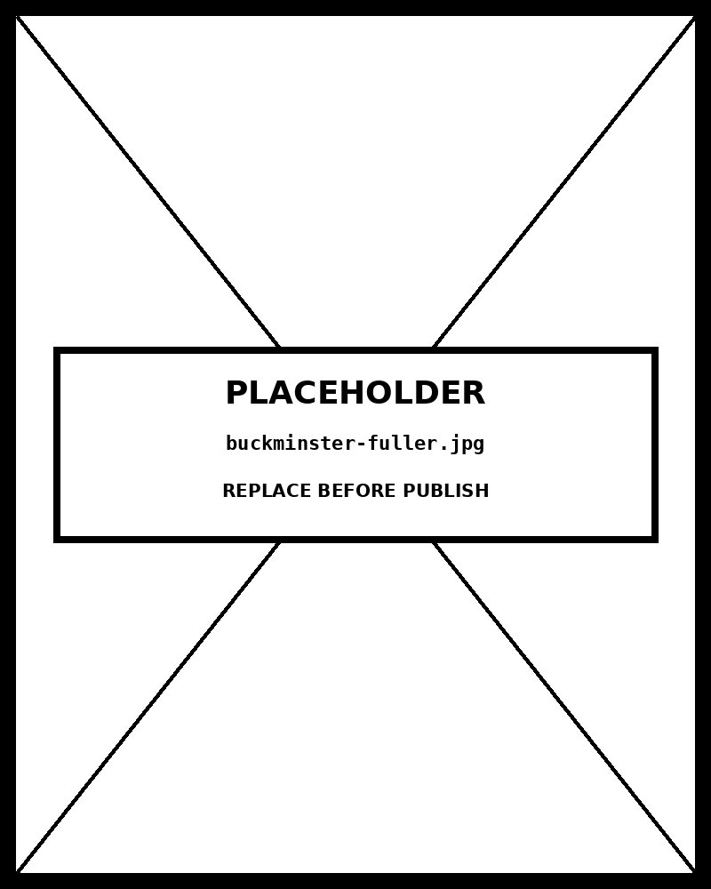

# Chapter 17 — Building a Complete Project
*From Raw Data to Published Chart in One Pipeline.*

---

Here is the thing Feynman said at the end of a course: if you have been paying attention, you should now be able to figure out things you were never explicitly taught. The test is not whether you can repeat back what was covered. The test is whether the framework has become part of how you think — whether you can pick up a new problem, identify what kind of problem it is, and work your way to a solution without consulting a recipe.

This chapter is that test.

Everything you need is already in the book. Chapter 3 taught you to read a dataset before you draw anything. Chapter 4 taught you that the chart follows the question, not the data. Chapter 3 taught you that the chart type is a channel choice and the channel choice has perceptual consequences. Chapter 5 taught you to use Claude Code as an executor, not a designer. Chapters 6 through 14 taught you the chart families and their specific failure modes. Chapter 15 taught you to audit the output before calling it publishable.

What this chapter does is run all of that together, in sequence, on a real project. Not a tutorial. Not a hypothetical. A complete pipeline: raw dataset, three communication questions, three charts, a published artifact. The pipeline has five phases. Each phase is the output of chapters you have already read.

The dataset is UNHCR forced displacement figures, 2020 to 2024. The audience is public-policy readers who make decisions about where to focus humanitarian aid. The question is: what does the data actually say, and how do you show it?

<!-- → [FIGURE: The five-phase pipeline as a horizontal flow diagram. Five labeled boxes: Phase A (Audit) → Phase B (Schema) → Phase C (Generate) → Phase D (Verify) → Phase E (Handoff). Each box contains two lines: what the phase produces (e.g., "Three framed questions + data audit") and what chapters it draws from (e.g., "Chapters 3 and 4"). Arrows between boxes. A sixth element at the end: "Published artifact." Above the flow, a label: "The MBTA model: start with the question; iterate on working code; publish with provenance." Caption: "Each phase is the output of chapters you have already read. This chapter runs them in sequence."] -->

---

## Why a Project Is Different From a Chart

A single chart has one question and one answer. A project has several related questions, a shared visual language, a publication context, and a paper trail of decisions that lets someone else — or future you — understand why each choice was made.

The difference is not scale. A project with three charts is still a project. The difference is that a project makes the relationship between the charts explicit. Chart 1 establishes context; Chart 2 answers the primary question; Chart 3 shows a dimension of the question Chart 2 couldn't. The charts are not independent; they are a sequence.

A project also requires the infrastructure that a single chart does not: the `CLAUDE.md` that holds the project's coding standards so you do not re-specify them in every prompt, the `DESIGN.md` that holds the visual language so every chart looks like it belongs to the same publication, the `PROJECT.md` that records every decision so the project is reproducible, legible to a collaborator, and auditable after the fact.

The MBTA project — the transit visualization Mike Barry and Brian Card built as their master's thesis — is the model because their reflection on it is the most candid account of how a real visualization project actually goes. Their three questions guided everything. Their lesson — nothing beat iterating on working code — names what changed when the implementation barrier fell.

The lesson applies more forcefully now than it did in 2014. When producing a working chart from a specification took a day, the decision about what to iterate first was expensive. When it takes twelve seconds, the iteration is nearly free. The right move is to get a working chart in front of you as fast as possible and let the artifact tell you what needs to change.

---

## Phase A: The Question Precedes the Data

The MBTA team began with three questions. This is not a workflow choice. It is the only sequence that produces a coherent project.

If you start with the data, you will produce charts that show whatever the data makes easy to show. The chart will be technically accurate and communicatively inert — a mirror of the data's structure, not an answer to a question anyone has. The reader will look at it and not know what to do with it.

For the forced displacement project, the three questions are:

1. Which countries of origin are producing the most refugees, and how has this changed across 2020 to 2024?
2. Which countries are receiving the most refugees?
3. What proportion of forced displacement is internal — within the same country — versus international?

These questions are reader-focused. They are specific enough to be answerable by a single chart or small set of charts. They build: Question 1 establishes the source-country picture, Question 2 adds the destination picture, Question 3 adds the compositional dimension. Together they give a public-policy reader what they need to decide where to focus attention.

The data audit follows from the questions, not the other way around. The UNHCR dataset has roughly 5,000 rows: country of origin, country of asylum or displacement, year, type of displacement (refugee, asylum-seeker, internally displaced person), count. The data types are categorical (country names), temporal (year), and quantitative (count). The relationships the data supports are comparison, change over time, part-to-whole, and spatial. Each question maps to one of these relationships.

The data audit also identifies limits. The dataset has origin-destination pair counts, which could support a flow map. But a flow map requires geographic coordinates, which means joining with a country-coordinates lookup that the raw UNHCR file doesn't contain. The honest move is to note this gap, scope the project to the three questions the data directly supports, and document the limitation in the project record.

This is Phase A. It produces: three framed questions, a data audit, and a list of what the data can and cannot support. Nothing is drawn yet.

<!-- → [FIGURE: The Phase A deliverable visualized as a structured document. Three panels: (1) "Three questions" — the three reader-focused questions listed as labeled cards, each with the audience named and the decision it informs. (2) "Data audit" — a column-type classification of the UNHCR dataset: country_of_origin (categorical), country_of_asylum (categorical), year (temporal), type (categorical), count (quantitative). Each column type mapped to a color-coded badge. (3) "Gaps identified" — one item: "Origin-destination flow map requires country coordinates not in the dataset." Caption: "Phase A produces documentation, not charts. The questions, the audit, and the gaps — in writing — before anything is drawn."] -->

---

## Phase B: The Schema Before the Chart

Phase B builds the infrastructure the project needs before any chart is generated. Three files: `CLAUDE.md`, `DESIGN.md`, and `PROJECT.md`.

### The split between CLAUDE.md and DESIGN.md

This split was introduced in Chapter 00 and matters more in a project than in a single-chart session. The reason is the instruction budget: Claude Code's context window can hold only so many constraints reliably. Loading everything into one file — D3 version, palette, typography, responsive breakpoints, naming conventions, accessibility requirements — produces a file long enough that Claude Code will begin silently dropping constraints from the bottom of the list.

The split disciplines this. `CLAUDE.md` holds coding rules that apply to every session regardless of what is being built: D3 version, file structure, naming conventions, encoding requirements (zero baseline for bars, `d3.scaleSqrt` for bubbles, equal-area projection for choropleths), accessibility implementation. These are the rules that Claude Code might violate if not reminded, and they apply to every chart in the project.

`DESIGN.md` holds visual rules that apply only when visual decisions are being made: the color palette with hex values, the typography, the spacing scale, the dark-mode inversion, the responsive breakpoints. These rules are not needed when the session is about joins, scales, or transitions. Loading them on every session wastes roughly fifty instruction slots on rules that have no effect on the session's output.

The practical rule: if the session involves any visual decision — "should this line be this color?" or "what margin should I use?" — load both files. If the session is purely about data processing, scale construction, or layout logic, load only `CLAUDE.md`.

<!-- → [FIGURE: A session-loading decision diagram. Two columns: left "Every session" (always load CLAUDE.md), right "Visual-decision sessions only" (additionally load DESIGN.md). The left column lists: D3 version, encoding rules (zero baseline, scaleSqrt, equal-area projection), naming conventions, accessibility defaults. The right column lists: color palette, typography, spacing scale, dark-mode rules, responsive breakpoints. A dotted boundary between columns labeled: "The instruction budget split — ~60 lines reliably retained per file; combined loading risks silent constraint-dropping at the bottom of a long file." Caption: "Split the files because Claude Code's instruction budget is finite. Load only what the session needs."] -->

### PROJECT.md: the decision record

`PROJECT.md` has two layers. The designer layer holds the project's intent: the three communication questions, the audience, the tone, the constraints, the publication context. This layer is written before any chart is built and should not change unless the project scope changes.

The technical layer is a living record. It grows through the project: one entry per chart, with the initial prompt, the first output's audit failures, each iteration's follow-up prompt, and the final accepted output. At the end of the project, anyone can read the technical layer and understand exactly what was built, why each choice was made, and what the iteration history looked like.

This documentation is not overhead. It is the thing that makes the project reproducible — by a colleague who inherits it, by a client who wants to extend it, by future you who needs to rebuild it on a new dataset.

---

## Phase C: Generating the Charts

With the three questions framed and the schema files written, Phase C produces the charts. One chart at a time. Each chart prompt follows the four-move structure. Each chart gets the channel decomposition that the question demands.

### Chart 1: Where Are Refugees Coming From?

Question 1 asks about both ranking (which countries) and change over time (how has this changed). A heatmap answers both simultaneously: countries on the y-axis, years on the x-axis, color luminance encoding the count. The reader can compare countries to each other (by scanning a row horizontally) and see change over time within one country (by reading across columns left to right).

Channel decomposition:
- Marks: rectangles (heatmap cells).
- y-position: country of origin, sorted by total 2020–2024 count descending.
- x-position: year (2020, 2021, 2022, 2023, 2024).
- Color luminance: refugee count, sequential pale-to-dark.

The color scale is sequential (single hue, varying luminance) because the data is unipolar — zero is the minimum, there are no negative refugee counts. The scale runs from the project's light palette value to the dark accent. The sort order is by total 2024 count, so the most urgent countries appear at the top.

The Claude Code prompt specifies `CLAUDE.md` and `DESIGN.md`, the heatmap type, the channel decomposition, and the verification request. The first output typically needs one or two iterations: the color domain may auto-fit to the data range instead of starting at zero, or the country labels on the y-axis may overlap when the country list is long. Both are fixable with targeted follow-up prompts.

### Chart 2: Where Are Refugees Going?

Question 2 is a comparison. The reader needs to rank destination countries by incoming refugee count. Horizontal bar chart, sorted descending. This is Chapter 6's canonical form: the highest-accuracy channel for comparison, zero baseline, sort by value, direct labels.

Channel decomposition:
- Marks: rectangles.
- y-position: destination country, sorted by count descending.
- x-position from zero baseline: refugee count.
- Color luminance: redundant encoding of count.

The prompt follows the bar-chart pattern from Chapter 6. Common first-output failures: alphabetical sort (override explicitly), non-zero baseline (prevent with the "zero baseline non-negotiable" specification), unlabeled bars (add direct value labels in the "Constrain it" block).

### Chart 3: Internal vs. International

Question 3 is a part-to-whole question with two categories. Two categories is the easiest part-to-whole: a single stacked bar, or two adjacent bars, or a large-number display. The cleanest form for a two-category proportion is a pair of bars or a normalized stacked bar where the proportions are labeled directly.

Channel decomposition:
- Marks: two rectangles in a single horizontal bar.
- Length: proportion of total (internal vs. international).
- Color hue: type identity (two distinct hues from the project palette).
- Direct labels: percentage values inside each segment.

This chart is the simplest of the three; Claude Code typically produces a good first output without iteration. Verify that the two segments sum to 100% and that the color hues match the `DESIGN.md` categorical palette.

<!-- → [FIGURE: Three panels showing the Phase C deliverables side by side. Panel 1: the heatmap of top refugee-origin countries by year (2020–2024), countries on y-axis sorted by total count, years on x-axis, sequential luminance encoding count. Panel 2: the horizontal bar chart of top destination countries, sorted descending, zero baseline, direct value labels. Panel 3: the stacked bar showing internal vs. international proportion with labeled percentage segments. Below each panel: the question it answers (Q1, Q2, Q3), the chart family (heatmap, comparison, part-to-whole), and the primary channel (color luminance, position-from-baseline, length). Caption: "Three questions, three charts, three chart families. The sequence establishes context (Q1), answers the primary question (Q2), and adds a compositional dimension (Q3)."] -->

---

## Phase D: The Audit

Every chart goes through the Evergreen/Emery 22-point checklist before it is called publishable. Chapter 15 walks the full checklist. For the three charts in this project, the checklist is applied in order, and every failure gets a targeted follow-up prompt.

The audit is not a formality. It is the mechanism that finds the things the prompt specification missed. The label that is too small at deployment width. The color that looks fine on a calibrated monitor but fails the color-blind simulation. The legend that is technically present but positioned so far from the chart that the reader has to scan back and forth. These failures are invisible in the specification; they become visible in the rendered chart.

The iteration discipline from Chapter 5 applies here too: one failure at a time, targeted follow-up, structural before stylistic. Fix the wrong color scale type before fixing the font size. Fix the missing sort order before adding the subtitle.

Document every iteration in `PROJECT.md`'s technical layer. Not because documentation is virtuous but because the log is the institutional memory of the project. When the client asks why the heatmap sorts by 2024 count and not by alphabetical order, the answer is in the log.

| Version | Date | Change | Audit failure addressed |
|---|---|---|---|
| v1 | 2026-04-12 | First output from four-move prompt. | (initial — see audit results below) |
| v2 | 2026-04-12 | Color domain explicitly set to `[0, max]`; left margin increased from 80px to 200px. | (1) Auto-fit color hides low-value cells; (2) y-axis labels overlap |
| v3 | 2026-04-13 | Added `<title>` per cell; sort rows by row-mean descending; gridlines reduced to `#c8c4c0` 0.75px. | (3) No accessibility metadata; (4) row order obscures pattern; (5) gridlines compete with marks |
| Final | 2026-04-13 | All 22 Evergreen/Emery items pass; approved for chapter inclusion. | — |

*The technical layer is not a story. It is a log. The version, the date, the change, and the audit item it fixed. When a colleague inherits the project, this is what they read.*
---

## Phase E: Handoff

A publishable chart is not a published chart. The handoff includes everything the reader needs to trust the chart and know where the data came from.

For each chart:

- **Source citation:** "Data: UNHCR Refugee Statistics, 2024. Available at: unhcr.org/refugee-statistics." The reader must be able to verify the data.
- **Methodology note:** "Counts are point-in-time totals as of December 31 of each year. Some counts include UNHCR estimates where national data is unavailable." The reader must know the data's limitations.
- **Data quality note:** "Data quality varies by country. Some figures are provisional." The reader must know where the data is uncertain.
- **Accessibility metadata:** ARIA role and label on every SVG, `<title>` and `<desc>` elements, keyboard accessibility for interactive elements, color-contrast verified against WCAG AA.

The project-level handoff includes the `PROJECT.md` with the full decision record, the `CLAUDE.md` for future iterations, and a README explaining how to re-run the prompts if the data is updated.

This last point is more important than it appears. A visualization that cannot be reproduced is a visualization that becomes stale without remedy. The README ensures that when the UNHCR releases 2025 figures, the project can be updated in a day — not rebuilt from scratch.

<!-- → [FIGURE: The Phase E deliverable as a publication-packaged chart. One of the three project charts (the horizontal bar of destination countries) shown inside a publication container: title above, subtitle below, the chart, then a row of three text elements: source citation ("Data: UNHCR Refugee Statistics 2024"), methodology note ("Counts are point-in-time totals as of December 31 of each year"), and accessibility statement ("Alt text and ARIA labels provided; WCAG AA contrast verified"). Below those: a small file-manifest panel showing the project's five deliverable files (chart-01.html, chart-02.html, chart-03.html, CLAUDE.md, PROJECT.md, README.md). Caption: "A published chart is not just the SVG. It is the chart plus the provenance that lets the reader trust it and the README that lets future-you update it."] -->

---

## Cairo's Final Test

The book has invoked Cairo's ethical frame throughout. This chapter is where it applies most directly to a completed project.

Cairo's criterion: the purpose of the graphic is to answer the question. A chart that is technically clean, perceptually accurate, well-annotated, and visually polished — but which does not answer the communication question it was supposed to answer — is a failed chart. The audit catches technical and perceptual failures. This test catches purpose failures.

For the forced displacement project, the test is concrete. After building all three charts, return to the three communication questions:

1. "Which countries of origin are producing the most refugees, and how has this changed across 2020 to 2024?" — Does the heatmap show a clear ranking and a clear temporal trend? Can a reader name the top three source countries after five seconds?
2. "Which countries are receiving the most refugees?" — Does the bar chart show a clear ranking with readable values?
3. "What proportion of forced displacement is internal versus international?" — Does the stacked bar show the split clearly, with labeled proportions?

If the answer to any question is no, the chart hasn't done its job. The audit may have passed. The chart still failed.

This test is the difference between a visualization project and a collection of charts. The charts serve the questions. The questions serve the audience. The audience is the reason the project exists. Cairo's criterion is not a philosophical position about visualization ethics — it is a practical standard for whether the work is done.

---

## What Completing This Project Teaches

The book's argument has been that D3 visualization was two problems. The first: implementation. Writing valid D3 code for a specific chart type on a specific dataset took hours; the barrier was technical. The second: design. Knowing what chart to build, which channel to use for which attribute, how to apply the relevant design rules, how to audit the output — these require judgment that cannot be automated.

Claude Code dissolved the first problem. A chart that took a day to implement now takes twelve seconds. The iteration cycle that was expensive is now free. Every design decision can be tested against a working chart rather than imagined against a mockup.

The second problem remains. Claude Code without design judgment produces charts that look like charts and communicate like noise. The familiarity bias that reaches for pie charts because percentages look like pie-chart data. The auto-fit y-axis that makes a 5% change look like a 50% change. The radius-encoded bubble chart that amplifies large values by a factor of four. The Mercator choropleth that makes Canada and Russia dominate regardless of their data values. None of these failures is a code error. They are design errors, and Claude Code cannot detect them without explicit instruction.

This book is the instruction. The channel decomposition from Chapter 3, the chart selection from Chapter 4, the audit from Chapter 15, the form-specific rules from Chapters 6 through 14 — these are the design judgment that Claude Code needs to receive as specification. The book taught you to produce that specification.

Feynman's test was whether you could figure out things you were never explicitly taught. The forced displacement project in this chapter was not taught explicitly — it was assembled from the parts the preceding chapters provided. The test is whether you can do the same with your own dataset, your own questions, your own audience.

Build the project. Document the decisions. Publish the result. That is the course.

---

## Exercises

### Warm-up

**Exercise 17.1 — Frame three questions.** Take a dataset you work with or have access to. Write three reader-focused communication questions following the MBTA model. Each question should name the audience, the specific thing they need to know, and the decision the answer informs. Test each question: can it be answered by a single chart or small set of charts? If not, narrow it.

**Exercise 17.2 — Build CLAUDE.md.** Draft a `CLAUDE.md` for a project in your domain. Include: D3 version, encoding requirements (list at least four: zero-baseline rule, scaleSqrt for bubbles, equal-area projection for choropleths, and at least one chart-family-specific rule from Chapters 6–14), naming conventions, accessibility defaults. Keep it under 60 lines — short enough that Claude Code retains it reliably.

**Exercise 17.3 — Phase A gap analysis.** Apply the data audit to the dataset from Exercise 17.1. For each of the three questions, name: the data types involved, the analyst's question vs. the reader's question, the "compared with what?" denominator, and the chart family the question maps to. Then identify at least one gap: a question you'd want to answer that the data cannot directly support, and name what additional data would close the gap.

### Application

**Exercise 17.4 — Phase B: schema files.** Write the full designer layer of `PROJECT.md` for the project from Exercise 17.1. Include: the three questions, the audience description (who they are and what decisions they make), the publication context (where this will appear and in what format), and at least two constraints (time, scope, audience graphicacy, etc.). Then write `DESIGN.md` with: a color palette (name the hex values), typography, and the session-loading rule (when do you load DESIGN.md vs. CLAUDE.md only?).

**Exercise 17.5 — Phase C: generate all three charts.** Walk the full Phase C for the project from Exercise 17.1. For each question: write the channel decomposition, write the four-move Claude Code prompt, run it, apply the Evergreen/Emery five-category subset, and document each iteration in `PROJECT.md`'s technical layer. Submit: three charts, three channel decompositions, one populated PROJECT.md technical layer.

**Exercise 17.6 — Cairo's purpose test.** After completing Exercise 17.5, return to the three questions from Exercise 17.1. For each chart, apply Cairo's purpose test: can a reader from your target audience answer the question the chart was supposed to answer after five seconds with the chart in front of them? If no, specify the gap between the chart and the question and write the redesign that closes it.

### Synthesis

**Exercise 17.7 — Full project: Phase A through E.** Complete all five phases for the project from Exercise 17.1. Phase A: questions and data audit. Phase B: `CLAUDE.md`, `DESIGN.md`, `PROJECT.md` designer layer. Phase C: three charts, each with prompt and iteration log. Phase D: 22-point audit per chart. Phase E: source citations, methodology notes, data quality notes, accessibility verification, and a README. Submit the full project directory.

**Exercise 17.8 — Handoff test.** Hand your completed project from Exercise 17.7 to a colleague who was not involved in building it. Ask them to: (a) read the three communication questions in `PROJECT.md`, (b) look at the three charts without any explanation from you, and (c) tell you whether each chart answers its question. Where it does not, diagnose whether the failure is a design failure (fixable by iteration) or a question-framing failure (fixable by reframing the question).

### Challenge

**Exercise 17.9 — Five-chart project.** Build a project with five related charts. The first two establish context; the third and fourth answer the primary questions; the fifth shows an unexpected dimension that the data revealed during the audit. Document in `PROJECT.md` how the fifth chart came to exist — it should be an emergent finding from Phase A or C, not something you planned before looking at the data.

**Exercise 17.10 — MBTA replication.** Following Barry and Card's structure, identify a transit or transportation system in your area (or any publicly available GTFS/transit dataset). Frame three reader-focused questions equivalent to the MBTA team's three. Build a project — at minimum two charts — that answers them. Compare your process to Barry and Card's published reflection. Where did your process resemble theirs? Where did having Claude Code change the workflow in ways they couldn't have anticipated in 2014?

---

## Key Terms

**MBTA process model.** Question → data audit → prototype → select → build → audit → publish. Start with the question; let the data and the iteration reveal the chart.

**`CLAUDE.md`.** The project's coding constitution. D3 version, encoding requirements, naming conventions, accessibility defaults. Loads every session. Short enough that Claude Code retains it reliably.

**`DESIGN.md`.** The project's visual constitution. Palette, typography, spacing, dark-mode rules, responsive breakpoints. Loads only when visual decisions are in scope.

**`PROJECT.md`.** The project's state document. Designer layer (intent, questions, audience) plus technical layer (generation log, iteration history, file manifest). The institutional memory of the project.

**Phase A — Audit.** Frame the questions. Audit the data. Before generating anything.

**Phase B — Schema.** Populate `CLAUDE.md`, `DESIGN.md`, `PROJECT.md`. Before generating anything.

**Phase C — Generate.** Claude Code produces charts from four-move prompts. One chart at a time.

**Phase D — Verify.** Apply the Evergreen/Emery 22-point audit. Iterate to publishable.

**Phase E — Handoff.** Publish with source citation, methodology note, data quality note, accessibility metadata, and reproduction instructions.

**Cairo's purpose test.** After the audit passes: does the chart answer the communication question it was supposed to answer? The audit catches technical failures; this test catches purpose failures.

---

## A note about AI

Building a complete project is the move that integrates everything the book has taught. The model can produce a complete-looking project at speed. Looking complete is not being complete.

Where the model genuinely helps: producing the scaffolding of a project — file structure, data pipeline, build configuration — so you spend your time on the analysis rather than on setup.

Where the model does damage: producing the analytical conclusions of the project. The conclusions are what the project is for, and they have to be yours.

The rule: scaffolding from the model; conclusions from your reading of your data.

---

## LLM Exercise — Chapter 17: The Final Project

**Project:** Your choice — this is the final project of the book.

**What you're building:** A complete visualization project from raw dataset to published output, walking all five phases of the Brutalist pipeline. Three charts minimum. One `CLAUDE.md`. One `PROJECT.md`. One published artifact.

**Tool:** Claude Code (for the build) + Claude chat (for the audit, the schema, and the iteration).

---

**The Prompt (full project):**

```
I am working on the final project for Brutalist D3 × Claude.
The dataset is [DESCRIBE: rows, columns, types, source].
The audience is [DESCRIBE: who they are, what decisions they make].

Walk me through all five Brutalist phases:

Phase A — Audit:
1. Help me frame three reader-focused communication questions.
2. Apply the data audit: data types, analyst-vs-reader question,
   "compared with what?" for each question, relationships the data
   supports.
3. Identify any gaps between the questions and what the data can
   support.

Phase B — Schema:
4. Draft a CLAUDE.md for this project. Include: D3 version, encoding
   requirements (zero baseline, scaleSqrt, projection), naming
   conventions, accessibility defaults.
5. Draft a PROJECT.md designer layer: questions, audience, tone,
   constraints, publication context.

Phase C — Generate:
6. For each question, recommend a chart type and channel decomposition.
7. Write a four-move Claude Code prompt for each chart.
8. After each chart is built, paste the first output (or describe it)
   and walk through the audit.

Phase D — Verify:
9. Apply the Evergreen/Emery 22-point checklist to each chart.
10. For each failure, write the targeted follow-up prompt.
11. Document each iteration in PROJECT.md's technical layer.

Phase E — Handoff:
12. Write the source citation, methodology note, and data quality note
    for each chart.
13. Verify accessibility metadata in the code.
14. Write a README explaining how to re-run the project.

Apply Cairo's purpose test at the end: does each chart answer the
question it was supposed to answer?

The output of this exercise: three charts, CLAUDE.md, DESIGN.md,
PROJECT.md, README.md, and a publication-ready artifact.
```

---

**This is the final exercise of the book.** Doing it is the test the book asks you to pass.

**What this produces:** A complete project directory with all five phase deliverables. The directory is proof that you can produce a visualization project from raw data to published output using the framework the book teaches.

**How to adapt this prompt:**
- *For your own dataset:* Replace the description. The questions should be reader-focused and answerable by visualization.
- *For ChatGPT / Gemini:* Works for the audit and schema phases; the chart generation still runs in Claude Code.
- *For a Claude Project:* Save the Brutalist framework as system context; the per-project phases become the user message.

**Connection to previous chapters:** This exercise integrates every chapter in the book. There is no chapter this exercise does not use. That is the point.

---

## Further Reading

- **Barry, Mike, and Brian Card. (2014).** "Visualizing MBTA Data." Read the full project report and reflection. The process model this chapter follows is theirs.
- **Cairo, Alberto. (2016).** *The Truthful Art.* and **(2019)** *How Charts Lie.* The ethical frame that governs the project's success criterion.
- **Evergreen, Stephanie. (2019).** *Effective Data Visualization.* The 22-point checklist that Phase D applies.
- **UNHCR Refugee Statistics.** unhcr.org/refugee-statistics. The dataset used in this chapter's worked example. Publicly available, updated annually.
- **The book's pantry** — the complete reference set you have used throughout. Every pantry file is a Phase C resource.

---

## AI Wayback Machine

The ideas in this chapter didn't appear from nowhere. **Buckminster Fuller** spent decades insisting that a designer's job is not to make objects but to make the whole system legible to the people who have to live with it. His Dymaxion map and the *World Game* were enormous communication projects: a data narrative wrapped around a verifiable artifact, end to end. The complete-project discipline of this chapter — README to chart to audit log — is Fuller's idea of legibility scaled down.


*Buckminster Fuller, circa 1962. AI-generated portrait based on a public domain photograph (Wikimedia Commons).*

**Run this:**

```
Who was Buckminster Fuller, and how does his approach to large communication projects connect to the build-a-complete-project workflow we covered in this chapter? Keep it to three paragraphs. End with the single most surprising thing about his career or ideas.
```

→ Search **"Buckminster Fuller Dymaxion"** on Wikipedia. See what the model got right, got wrong, or left out.

**Now make the prompt better.** Try one of these:

- Ask it to compare Fuller's *World Game* presentations with a modern data-journalism feature like the NYT's COVID dashboard — what makes them complete projects.
- Ask it to describe how Fuller's principle of "comprehensive anticipatory design science" applies to building a portfolio of D3 charts that age well.

What changes? What gets better? What gets worse?
