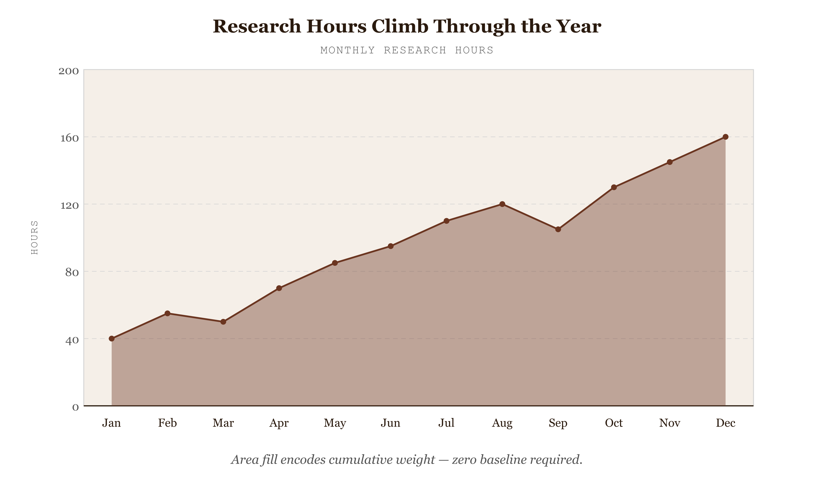

# Area Graph

*Research Hours Climb Through the Year — Fill Shows Cumulative Weight*


*Figure 19.1 — Research Hours Climb Through the Year*

## What this chart is

An area graph encodes a single continuous time series using two visual channels simultaneously: the line's position (height at any x) encodes the point value, and the filled area between the line and the zero baseline encodes cumulative mass. The perceptual mechanism exploited is area estimation — the human visual system integrates the filled region as a quantity, making the total volume beneath the curve legible without arithmetic. The gradient fill amplifies this: the colour is strongest at the line and fades toward the baseline, directing the eye upward to the peak and reinforcing the reading that high-valued periods are "heavier" than low-valued ones.

## Why it was chosen here

The dataset is a single continuous time series — monthly research hours — and the message is about the cumulative weight of effort across the year, not just whether any individual month is high or low. The area encoding makes that weight physically present on the page. A plain line chart would show the trajectory equally well but would lose the sense of total accumulation. A bar chart would show individual months discretely but fragment the continuity of the trend. The area graph's combination of line continuity and filled mass is the correct encoding for this data and message.

## What the alternative would break

A stacked area chart is the closest structural relative — it works when multiple series need to be shown simultaneously while preserving cumulative volume. But multiple overlapping unfilled area charts are the classic failure mode: when two series cross, the lower series disappears behind the upper one's fill. The area graph is therefore strictly appropriate for single-series data, or for cases where series are stacked rather than overlapped. A non-zero y-axis baseline is the other critical failure mode: if the area doesn't start at zero, the filled region misleads — its visual mass implies a total that doesn't correspond to the actual quantity.

## Framework reference

> // FRAMEWORK FT Visual Vocabulary category: Change Over Time — "Show change in a single variable across an ordered sequence, here emphasising total magnitude through area fill." Tufte principle: area fill adds a second data-ink channel without adding chart junk — every pixel of the filled region encodes real quantity. The one design decision worth knowing: the y-axis baseline is fixed at zero. Moving it to any positive value would make the filled area proportionally larger than the actual data range, creating a visual lie factor greater than one.

## Prompt

Paste this into Claude Code to generate a working version of this chart, plus its data file. The result will not be a perfect replica — the goal is that the reader can run the prompt, get a chart of this type, and read its source.

```
Generate a complete, self-contained area graph in D3 v7. Two files:

1. `area-graph.html` — a full HTML page with inline CSS and inline D3 v7 (loaded from `https://cdnjs.cloudflare.com/ajax/libs/d3/7.8.5/d3.min.js`). The chart should fill the viewport, be responsive on resize, support keyboard focus on interactive elements, and include a tooltip on hover. The page title is "Area Graph" and the slide subtitle is "Research Hours Climb Through the Year — Fill Shows Cumulative Weight".

2. `area-graph/data.json` — the data file the chart loads via `d3.json("./area-graph/data.json")`, with a fallback inline literal in the HTML if the fetch fails.

Decide a reasonable data shape for this chart type and invent themed sample values.

Encoding: use the perceptually honest channel for this chart type (area graph). Do not invent decorative encodings. Annotate the chart with a one-line in-chart subtitle that names what the chart shows. Include an accessibility `<title>` and `<desc>` inside the SVG.

Style: warm monochrome — black, dark walnut, blood-red accents only. Serif font for body text, JetBrains Mono for labels and controls. No drop shadows, no rounded corners, no gradients. Clean editorial register suitable for a print-ready textbook page.

Provide both files as separate code blocks. Do not explain — just produce the files.
```

> Reference implementation: `d3/19-area-graph.html`

The original code and data — copy-paste-ready — live at [bearbrown.co](https://www.bearbrown.co/).

---

## AI Wayback Machine

The ideas in this chapter didn't appear from nowhere. **Willard C. Brinton** published *Graphic Methods for Presenting Facts* in 1914 — the first American textbook on business graphics. Brinton catalogued every chart he had seen in twenty years of engineering reports, including filled-area charts that traced the rise and fall of production over time. He argued that the *area under the line* carried meaning the line alone could not: the accumulated total, the resource consumed, the share held.


*Willard C. Brinton, circa 1914. AI-generated portrait based on a public domain photograph (Wikimedia Commons).*

**Run this:**

```
Who was Willard C. Brinton, and how does his 1914 catalogue of area-based business graphics connect to the area-graph form we covered in this chapter? Keep it to three paragraphs. End with the single most surprising thing about his career or ideas.
```

→ Search **"Willard C. Brinton Graphic Methods"** on Wikipedia. See what the model got right, got wrong, or left out.

**Now make the prompt better.** Try one of these:

- Ask it to walk through one of Brinton's 1914 area charts and identify which design principles (zero baseline, sort order, layer ordering) it gets right and which it gets wrong by modern standards.
- Ask it to compare Brinton's pre-computer chart catalogue with the modern Financial Times Visual Vocabulary — what new forms emerged, what stayed the same.

What changes? What gets better? What gets worse?
