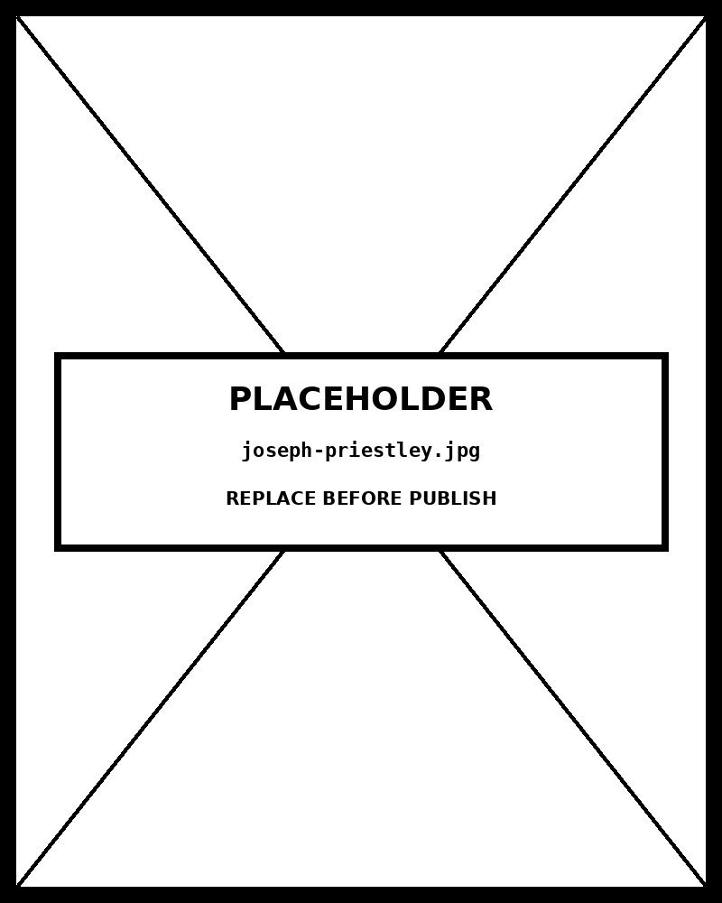

# Bar Chart

*AI tool adoption varies sharply by sector*


## What this chart is

A bar chart encodes quantitative values as the length of rectangular bars along a common baseline. Length along a shared axis is the most accurate perceptual channel available in static graphics — it outperforms area, angle, and color saturation in precision tasks. Each bar corresponds to a discrete category; the bars do not represent continuous data and cannot be meaningfully reordered to imply a trend over time.

The horizontal orientation here is deliberate. With twelve or more categories, vertical bars compress label space, forcing rotation or truncation. Horizontal orientation gives each sector label full left-aligned legibility while the bars extend rightward along the value axis — reading naturally in the direction of magnitude.

## Why it was chosen here

The message — "AI tool adoption varies sharply by sector" — is a comparison story across named categories. The viewer needs to rank and contrast, not trace a trend or examine a composition. The bar chart's position-along-axis encoding is purpose-built for this: it exploits the most precise perceptual channel and makes the gap between leading and lagging sectors immediately visible.

The data structure is categorical (sector name) with a single quantitative measure (adoption %). There are no temporal periods, no part-to-whole relationship, no correlation between two variables. All three alternative chart types would misrepresent this: a pie chart implies composition; a line chart implies sequence; a scatter plot implies relationship between two continuous dimensions.

## What the alternative would break

A grouped bar chart (showing multiple years or sub-categories) would split attention and obscure the sector-level ranking — the primary claim. A pie chart would require that the percentages sum to 100%, which they do not: these are independent adoption rates, not market share slices. Any attempt to represent this data as a pie would fabricate a compositional story that doesn't exist in the underlying numbers.

## Sort order is part of the argument

The bars are sorted descending by adoption rate by default. Sorted alphabetically, the chart answers "where is sector X?" — a lookup task. Sorted by value, it answers "which sectors lead and which lag?" — the actual message. Sort order is not decoration: it determines which question the viewer answers first. A toggle is provided so both tasks remain accessible.

## Framework reference

> // FRAMEWORK REFERENCE FT Visual Vocabulary — Ranking category. "Use where an item's position in an ordered list is more important than its absolute or relative value." Abela quadrant: Comparison (items, few periods). Tufte principle: the data-ink ratio here is near 1.0 — every pixel of bar encodes a value, axes carry the scale, labels carry the category identity. No grid lines are added unless they reduce ambiguity at the far end of the scale.

## Prompt

Paste this into Claude Code to generate a working version of this chart, plus its data file. The result will not be a perfect replica — the goal is that the reader can run the prompt, get a chart of this type, and read its source.

```
Generate a complete, self-contained bar chart in D3 v7. Two files:

1. `bar-chart.html` — a full HTML page with inline CSS and inline D3 v7 (loaded from `https://cdnjs.cloudflare.com/ajax/libs/d3/7.8.5/d3.min.js`). The chart should fill the viewport, be responsive on resize, support keyboard focus on interactive elements, and include a tooltip on hover. The page title is "Bar Chart" and the slide subtitle is "AI tool adoption varies sharply by sector".

2. `bar-chart/data.json` — the data file the chart loads via `d3.json("./bar-chart/data.json")`, with a fallback inline literal in the HTML if the fetch fails.

Data shape:
- AI tool adoption rates by industry sector. Each record represents one sector survey result.
  - `sector`: string — industry sector name (y-axis category label)
  - `adoption`: number — percentage (0–100) of organizations in this sector using at least one AI-powered tool
  - `note`: string — one-line contextual note for the tooltip; describes adoption drivers or barriers

Encoding: use the perceptually honest channel for this chart type (bar chart). Do not invent decorative encodings. Annotate the chart with a one-line in-chart subtitle that names what the chart shows. Include an accessibility `<title>` and `<desc>` inside the SVG.

Style: warm monochrome — black, dark walnut, blood-red accents only. Serif font for body text, JetBrains Mono for labels and controls. No drop shadows, no rounded corners, no gradients. Clean editorial register suitable for a print-ready textbook page.

Provide both files as separate code blocks. Do not explain — just produce the files.
```

The original code and data — copy-paste-ready — live at [bearbrown.co](https://www.bearbrown.co/).

---

## AI Wayback Machine

The ideas in this chapter didn't appear from nowhere. **Joseph Priestley** drew *A Chart of Biography* in 1765 — a horizontal bar chart spanning 1200 BC to 1750 AD, with each life as a line whose length encoded duration. It's one of the earliest published bar-style charts and the ancestor of every Gantt chart since.


*Joseph Priestley, circa 1790. AI-generated portrait based on a public domain engraving (Wikimedia Commons).*

**Run this:**

```
Who was Joseph Priestley, and how does his Chart of Biography connect to the bar chart we covered in this chapter? Keep it to three paragraphs. End with the single most surprising thing about his career or ideas.
```

→ Search **"Joseph Priestley"** on Wikipedia.

**Now make the prompt better.** Try one of these:

- Ask it to compare Priestley's 1765 horizontal bar chart with a modern stacked bar — what design conventions changed, what stayed?
- Ask it about Priestley's wider intellectual life as a chemist (he discovered oxygen) and dissenting theologian.

What changes? What gets better? What gets worse?
