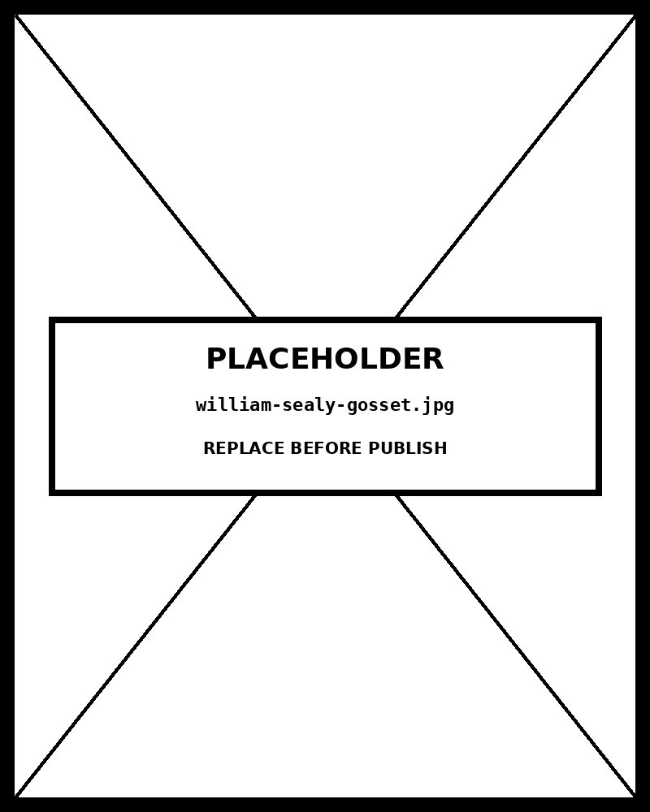

# Box Plot

*Five Groups, One Frame — Reading a Distribution at a Glance*


## What this chart is

A box and whisker plot encodes the five-number summary of a distribution in a single glyph: minimum whisker end, first quartile (Q1), median, third quartile (Q3), and maximum whisker end. The box spans the interquartile range (IQR = Q3 − Q1), containing the middle 50% of observations. The median line cuts across it — its position within the box reveals skew at a glance: a line pushed toward Q1 means positive skew; pushed toward Q3 means negative skew. Whiskers extend to the farthest point within 1.5×IQR of the box; anything beyond is plotted as an individual outlier dot. The perceptual mechanism exploited is position along a common scale — the most accurate quantitative encoding channel known from psychophysical research.

## Why it was chosen here

The data presents five groups with continuous measurements and the goal is comparing distributional shape, not just central tendency. A bar chart would show only the mean, hiding spread, skew, and outliers entirely. A dot plot shows all individual points but collapses into unreadable overplotting at sample sizes above ~40. The box plot occupies the productive middle ground: it summarises the full distribution without sacrificing comparability across groups. When the five groups are placed side-by-side on a shared axis, relative spread (IQR width), central tendency (median line), tail behaviour (whisker length), and anomalies (outlier dots) become simultaneously readable in a single pass.

## What the alternative would break

A grouped bar chart showing means and standard deviations — the most common naive substitute — fails because standard deviations assume symmetrical, approximately normal distributions. The moment a group is skewed or has outlier contamination, the error bars become misleading (extending below zero, or implying tails of equal length). The viewer walks away believing the groups differ primarily in average, when the real story might be in tail behaviour or bimodality entirely invisible to that encoding. A violin plot is the strongest alternative to the box plot, adding kernel density contours, but it requires larger sample sizes to be trustworthy and adds reading complexity for audiences not trained in density estimation.

## Framework reference

> // FRAMEWORK FT Visual Vocabulary category: Distribution — "Show the range of values in a dataset and how they are distributed." Tufte principle: the box plot is architecturally data-ink efficient — every pixel of ink encodes a statistical quantity. Abela quadrant: Distribution (single variable, multiple groups, comparison of shape). The one design decision worth knowing: the 1.5×IQR rule for whisker length was set by Tukey in 1977 as a robust fence — it flags roughly 0.7% of observations as potential outliers under a normal distribution. This rule is implemented here exactly; changing it to min/max would hide distributional tail information.

## Prompt

Paste this into Claude Code to generate a working version of this chart, plus its data file. The result will not be a perfect replica — the goal is that the reader can run the prompt, get a chart of this type, and read its source.

```
Generate a complete, self-contained box plot in D3 v7. Two files:

1. `box-plot.html` — a full HTML page with inline CSS and inline D3 v7 (loaded from `https://cdnjs.cloudflare.com/ajax/libs/d3/7.8.5/d3.min.js`). The chart should fill the viewport, be responsive on resize, support keyboard focus on interactive elements, and include a tooltip on hover. The page title is "Box Plot" and the slide subtitle is "Five Groups, One Frame — Reading a Distribution at a Glance".

2. `box-plot/data.json` — the data file the chart loads via `d3.json("./box-plot/data.json")`, with a fallback inline literal in the HTML if the fetch fails.

Data shape:
- Annual income (USD thousands) by residential zone. Five groups of n=80 each. Used to demonstrate box plot distribution comparison.
  - `group`: string — category label (band axis)
  - `values`: number[] — raw measurements; Q1/median/Q3/whiskers/outliers computed from these at render time

Encoding: use the perceptually honest channel for this chart type (box plot). Do not invent decorative encodings. Annotate the chart with a one-line in-chart subtitle that names what the chart shows. Include an accessibility `<title>` and `<desc>` inside the SVG.

Style: warm monochrome — black, dark walnut, blood-red accents only. Serif font for body text, JetBrains Mono for labels and controls. No drop shadows, no rounded corners, no gradients. Clean editorial register suitable for a print-ready textbook page.

Provide both files as separate code blocks. Do not explain — just produce the files.
```

The original code and data — copy-paste-ready — live at [bearbrown.co](https://www.bearbrown.co/).

---

## AI Wayback Machine

The ideas in this chapter didn't appear from nowhere. **William Sealy Gosset** — publishing under the pseudonym *Student* because his employer Guinness forbade staff from publishing under their own names — worked out in 1908 how small-sample distributions behaved differently from the normal. The t-distribution, the quartile, the inter-quartile range as the honest summary of a spread: these are the conceptual machinery the box plot puts on a page.


*William Sealy Gosset (Student), circa 1910. AI-generated portrait based on a public domain photograph (Wikimedia Commons).*

**Run this:**

```
Who was William Sealy Gosset (Student), and how does his statistical work on small-sample distributions connect to the box-plot form we covered in this chapter? Keep it to three paragraphs. End with the single most surprising thing about his career or ideas.
```

→ Search **"William Sealy Gosset Student t-distribution"** on Wikipedia. See what the model got right, got wrong, or left out.

**Now make the prompt better.** Try one of these:

- Ask it to compare Gosset's pseudonymous "Student" papers with the modern open-science norm of full author attribution — what changed about scientific accountability.
- Ask it to walk through how the inter-quartile range that Gosset's distribution work helped formalize shows up as the box of the box plot.

What changes? What gets better? What gets worse?
