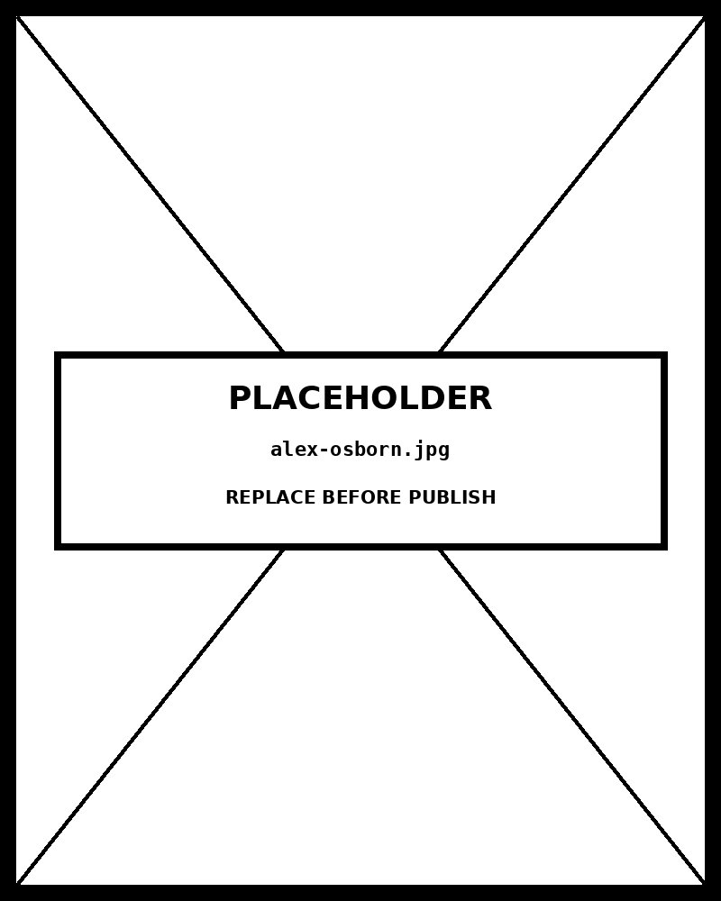

# Brainstorm

*The five supervisory capacities of the Irreducibly Human framework*


Also known as: Mind Map · Concept Map · Thought Web · Radial Diagram

## What this chart type is

A **Brainstorm** or **Mind Map** is a radial network diagram that externalises associative thinking. A central concept occupies the hub; related ideas radiate outward as branches; each branch can extend further into sub-concepts, creating a tree-like hierarchy that sprawls in two dimensions rather than descending top-to-bottom.

When rendered as a *force-directed graph* , the layout is computed by a physics simulation: nodes repel each other like charged particles while edges pull connected nodes together like springs. The simulation runs until kinetic energy dissipates and the graph reaches equilibrium. The result is not deterministic — the same data produces a different spatial arrangement on each run — but the *connectivity structure* is always preserved.

Node size and colour encode hierarchy level: the central node is largest and most saturated; primary branches are mid-sized; supporting concepts are smallest and most muted.

## How to read this chart

Start at the **central node** (dark red, largest). Follow any edge outward to reach a **primary branch** (brass/gold). Each primary branch connects to two **supporting concepts** (grey-green, smallest). The spatial positions are physics-determined — proximity does not necessarily mean conceptual closeness; only edges encode actual relationships.

**Drag any node** to reposition it manually; the simulation will adjust surrounding nodes in response. Click *restart simulation* to re-randomise the starting positions and observe how the physics converges to a new (but structurally equivalent) layout.

The chart is best read *locally* — follow one branch at a time — rather than globally. The force-directed layout makes global pattern recognition difficult compared to a strictly hierarchical layout (tree diagram, sunburst), but it handles cross-branch connections more naturally if they exist.

## Strengths of this form

**Spatial freedom** — nodes are not constrained to rows or columns, so the diagram can grow organically in any direction. **Immediate overview** — a viewer can see the full scope of a concept and all its associations in a single glance, even before reading individual labels. **Natural for ideation** — the radial structure mirrors how associative memory works: one idea triggers adjacent ideas, which trigger further associations.

**Cross-connections** — unlike a strict tree, a network mind map can show that a supporting concept connects to multiple branches (e.g. "Values" informing both Interpretive Judgment and Executive Integration), revealing shared underpinnings that a hierarchical layout would hide.

## Limitations and when not to use it

**Non-deterministic layout** — the force-directed positions change on each run, so a reader cannot reliably memorise where a node will appear. This makes mind maps unsuitable for reference use cases where spatial memory matters.

**Does not encode quantity** — this form communicates structure and association, not size, frequency, or change over time. Adding quantitative data (e.g. node size = importance score) is possible but must be done carefully to avoid misleading area comparisons.

**Clutters at scale** — beyond ~40–50 nodes, edge crossings and label overlap make the chart unreadable without interactive filtering. Large knowledge graphs require hierarchical clustering, node grouping, or a dedicated network layout algorithm.

## About this example — the Irreducibly Human framework

This mind map visualises the **Irreducibly Human** framework: a model of the supervisory and integrative capacities that remain distinctively human even as AI systems take over execution-layer tasks. The central node is the framework itself. Five primary branches represent the core supervisory capacities that the framework argues must remain under human judgment:

**Plausibility Auditing** (supported by Domain Knowledge and Intuition) — the ability to evaluate whether an AI output is coherent and credible given what the domain actually requires. **Problem Formulation** (Calibration and Framing) — defining what question to ask before any AI tool is invoked. **Tool Orchestration** (Ambiguity and Sequencing) — selecting, ordering, and configuring AI tools for a given task. **Interpretive Judgment** (Accountability and Context) — interpreting outputs in context and accepting responsibility for decisions. **Executive Integration** (Synthesis and Values) — combining AI-generated content with organisational goals, ethical constraints, and strategic intent.

The brass/gold colour of the primary branches signals that these five capacities are the active, load-bearing structure of the framework. The muted grey-green of the supporting concepts signals that these are contextual properties that inform each capacity rather than standing alone. To substitute your own brainstorm, replace the `nodes` and `links` arrays in `brainstorm/data.json` .

## Prompt

Paste this into Claude Code to generate a working version of this chart, plus its data file. The result will not be a perfect replica — the goal is that the reader can run the prompt, get a chart of this type, and read its source.

```
Generate a complete, self-contained brainstorm in D3 v7. Two files:

1. `brainstorm.html` — a full HTML page with inline CSS and inline D3 v7 (loaded from `https://cdnjs.cloudflare.com/ajax/libs/d3/7.8.5/d3.min.js`). The chart should fill the viewport, be responsive on resize, support keyboard focus on interactive elements, and include a tooltip on hover. The page title is "Brainstorm" and the slide subtitle is "The five supervisory capacities of the Irreducibly Human framework".

2. `brainstorm/data.json` — the data file the chart loads via `d3.json("./brainstorm/data.json")`, with a fallback inline literal in the HTML if the fetch fails.

Decide a reasonable data shape for this chart type and invent themed sample values.

Encoding: use the perceptually honest channel for this chart type (brainstorm). Do not invent decorative encodings. Annotate the chart with a one-line in-chart subtitle that names what the chart shows. Include an accessibility `<title>` and `<desc>` inside the SVG.

Style: warm monochrome — black, dark walnut, blood-red accents only. Serif font for body text, JetBrains Mono for labels and controls. No drop shadows, no rounded corners, no gradients. Clean editorial register suitable for a print-ready textbook page.

Provide both files as separate code blocks. Do not explain — just produce the files.
```

The original code and data — copy-paste-ready — live at [bearbrown.co](https://www.bearbrown.co/).

---

## AI Wayback Machine

The ideas in this chapter didn't appear from nowhere. **Alex Osborn** coined the word "brainstorming" in his 1953 book *Applied Imagination* — proposing the four rules (defer judgment, encourage wild ideas, build on others, go for quantity) that still drive most modern ideation workshops. He was a Madison Avenue ad executive.


*Alex Osborn, circa 1953. AI-generated portrait based on a public domain photograph (Wikimedia Commons).*

**Run this:**

```
Who was Alex Osborn, and how does his brainstorming method connect to the ideation chapter we covered? Keep it to three paragraphs. End with the single most surprising thing about his career or ideas.
```

→ Search **"Alex Faickney Osborn"** on Wikipedia.

**Now make the prompt better.** Try one of these:

- Ask it to apply Osborn's four rules to a brainstorming session with Claude — which rules apply, which break?
- Ask it about the modern research on group brainstorming — does it actually outperform individual idea generation?

What changes? What gets better? What gets worse?
