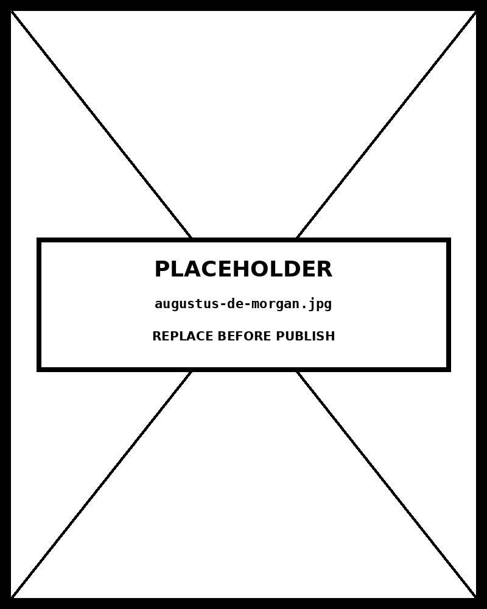

# Chord Diagram

*OCHA and UNHCR Are the Network's Densest Hubs —Chord Thickness Encodes Coordination Strength*


## What this chart is

A non-ribbon chord diagram is a **circular relationship graph** : nodes are arranged as arc segments on the perimeter of a circle, and connections are drawn as curved lines (chords) spanning the interior. The perceptual mechanism is **gestalt continuity** — the eye follows each curve from one arc to another, reading the connection as a single unit even when it crosses other chords. The circular layout implies no hierarchy (all nodes are equidistant from the center) and no direction (chords are symmetric). Connection strength is encoded by **stroke weight and opacity** , both redundant encodings of the same variable — accessible in both color-normal and color-deficient viewing.

## Non-ribbon vs. ribbon chord

A **full ribbon chord diagram** fills the space between two arcs with a shaped "ribbon," encoding directional flow volume: the width of the ribbon at each end represents how much flows *from* that node. This is appropriate when data has meaningful direction (migration, trade, financial flows) and when per-direction volumes are precisely known. A **non-ribbon chord diagram** strips the filled shape away, keeping only the connection lines. This is appropriate when relationships are undirected, when the connection pattern matters more than volumes, or when the filled ribbons would create false visual depth that obscures the underlying topology — which is the case in this coordination network.

## What the alternatives would break

A **force-directed network graph** would show the same relationships but allows nodes to move — the viewer cannot directly compare node positions across views. The circular layout here gives every node a *fixed, readable* position with a labeled arc. A **matrix view** (heatmap of all pairs) would be more precise for exact value comparison but requires the viewer to trace rows and columns mentally — the chord diagram makes the relationship pattern immediately visual without any matrix traversal. For dense networks (all 8 nodes connected to all 7 others), the chord layout handles the **28 simultaneous relationships** without the overlap chaos of a force-directed layout.

## Reading the hub pattern

A **hub node** in this chart is one whose arc is the starting point for many thick, dark chords. OCHA and UNHCR are visually dense because their arcs originate the strongest chords — thick walnut and obsidian lines radiate across the circle. Government Donors and Local NGOs show thinner chords, indicating weaker or fewer coordination relationships. This hub pattern is *impossible* to see in a table and requires significant computation to extract from a matrix view. The chord diagram makes it perceptually immediate: dense = hub, sparse = peripheral. Hover any node to isolate its connections and read the strength values in the tooltip.

## Prompt

Paste this into Claude Code to generate a working version of this chart, plus its data file. The result will not be a perfect replica — the goal is that the reader can run the prompt, get a chart of this type, and read its source.

```
Generate a complete, self-contained chord diagram in D3 v7. Two files:

1. `chord-diagram.html` — a full HTML page with inline CSS and inline D3 v7 (loaded from `https://cdnjs.cloudflare.com/ajax/libs/d3/7.8.5/d3.min.js`). The chart should fill the viewport, be responsive on resize, support keyboard focus on interactive elements, and include a tooltip on hover. The page title is "Chord Diagram" and the slide subtitle is "OCHA and UNHCR Are the Network's Densest Hubs —Chord Thickness Encodes Coordination Strength".

2. `chord-diagram/data.json` — the data file the chart loads via `d3.json("./chord-diagram/data.json")`, with a fallback inline literal in the HTML if the fetch fails.

Data shape:
- Humanitarian crisis response coordination network. Each link represents the frequency and depth of coordination between two organizations. Fictional placeholder with realistic relational structure. Proves the chord diagram renders before real data is substituted.
  - `nodes[].id`: string — unique node identifier, referenced in links
  - `nodes[].label`: string — short name displayed on chart (≤12 chars preferred)
  - `nodes[].sublabel`: string — secondary descriptor displayed beneath label
  - `nodes[].color`: string — hex color; derived from or harmonious with hai palette
  - `links[].source`: string — node id of first endpoint
  - `links[].target`: string — node id of second endpoint
  - `links[].value`: number — connection strength 0–100; drives stroke width and opacity

Encoding: use the perceptually honest channel for this chart type (chord diagram). Do not invent decorative encodings. Annotate the chart with a one-line in-chart subtitle that names what the chart shows. Include an accessibility `<title>` and `<desc>` inside the SVG.

Style: warm monochrome — black, dark walnut, blood-red accents only. Serif font for body text, JetBrains Mono for labels and controls. No drop shadows, no rounded corners, no gradients. Clean editorial register suitable for a print-ready textbook page.

Provide both files as separate code blocks. Do not explain — just produce the files.
```

The original code and data — copy-paste-ready — live at [bearbrown.co](https://www.bearbrown.co/).

---

## AI Wayback Machine

The ideas in this chapter didn't appear from nowhere. **Augustus De Morgan** drew circular relational diagrams in *Formal Logic* (1847) — points arranged around a ring, lines drawn between them whenever a logical relation held. He was reasoning about syllogisms, not about gene expression or trade flows, but the layout choice was the same one Circos would make 162 years later: a ring is the most legible way to show many-to-many connections between a fixed set of entities.


*Augustus De Morgan, circa 1860. AI-generated portrait based on a public domain photograph (Wikimedia Commons).*

**Run this:**

```
Who was Augustus De Morgan, and how do his circular logical-relation diagrams connect to the chord-diagram form we covered in this chapter? Keep it to three paragraphs. End with the single most surprising thing about his career or ideas.
```

→ Search **"Augustus De Morgan Formal Logic"** on Wikipedia. See what the model got right, got wrong, or left out.

**Now make the prompt better.** Try one of these:

- Ask it to walk through how De Morgan's circular syllogism diagrams differ from a modern Circos chord plot — and what stays the same.
- Ask it to compare De Morgan's laws (the algebraic ones taught in CS courses) with the diagrammatic reasoning he used in *Formal Logic* — which made it into modern visualization, which didn't.

What changes? What gets better? What gets worse?
