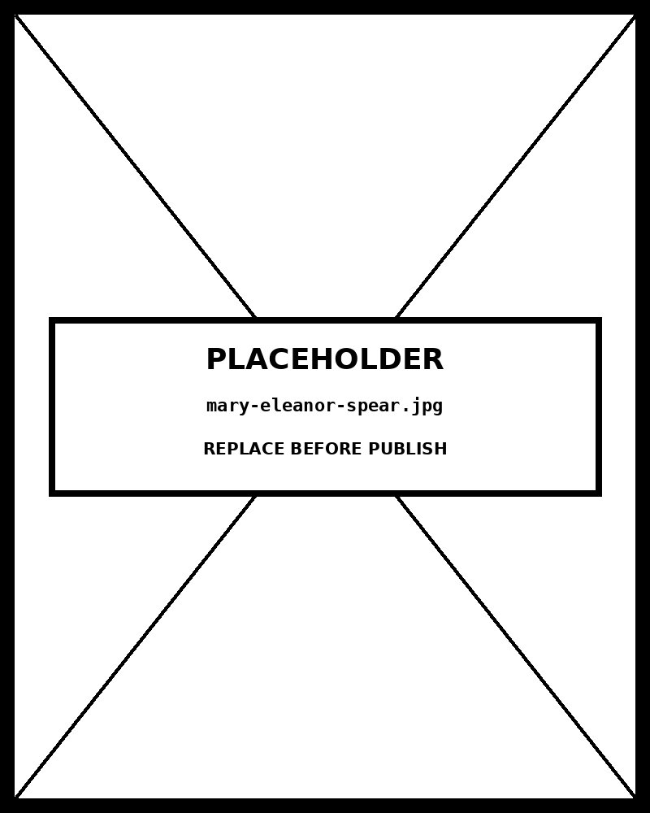

# Donut Chart

*Healthcare commands 34% — crisis response receives the smallest share*


## What this chart is

A Donut Chart is a Pie Chart with its center removed. The primary encoding is *arc length* — the angle each segment subtends — not area. This is a meaningful distinction: human perception ranks arc length as more accurate than area for quantitative comparison. The hollow center is not decorative; it creates a stable focal point for contextual annotation. Here it displays the portfolio total by default, and the hovered segment's value on interaction. That dual function would require a separate callout annotation in any other chart type.

## Why it was chosen here

The data tells a *composition story* : five mutually exclusive, exhaustive categories that together constitute total humanitarian AI investment. The categories **sum to a meaningful whole** — the $4.80B figure — which is the precondition for any part-to-whole chart. With five segments (the maximum recommended before an alternative becomes more readable), the donut renders without clutter. A horizontal bar chart would show values more precisely but would not communicate "these are parts of one thing" as immediately or as honestly.

## What a bar chart alternative would sacrifice

A bar chart encodes values as position on a common scale — the most accurate perceptual channel. For *comparison* tasks it would be strictly superior. But the message here is **composition** , not comparison. A bar chart implies "rank these" rather than "these are pieces of something." Viewers looking at bars do not naturally compute the total or perceive the parts as a unified whole. The donut's circular closure is not decorative — it is the visual argument that the dataset is *exhaustive* .

## Framework reference & the one decision worth knowing

**The one decision worth knowing:** segment order starts at 12 o'clock and runs clockwise by descending value. This is not default D3 behaviour — `pie.sort(null)` preserves data order, and the data is pre-sorted. Starting the largest segment at 12 o'clock anchors the viewer's reference point and makes the rank ordering immediately legible.

## Framework reference

> // FT Visual Vocabulary + Abela FT Visual Vocabulary: Part-to-whole .
            Abela quadrant: Composition — showing how
            individual parts make up the whole at a point in time.
            Tufte: the donut's removed center reduces non-data ink versus
            a filled pie while opening space for genuine data display.

## Prompt

Paste this into Claude Code to generate a working version of this chart, plus its data file. The result will not be a perfect replica — the goal is that the reader can run the prompt, get a chart of this type, and read its source.

```
Generate a complete, self-contained donut chart in D3 v7. Two files:

1. `donut-chart.html` — a full HTML page with inline CSS and inline D3 v7 (loaded from `https://cdnjs.cloudflare.com/ajax/libs/d3/7.8.5/d3.min.js`). The chart should fill the viewport, be responsive on resize, support keyboard focus on interactive elements, and include a tooltip on hover. The page title is "Donut Chart" and the slide subtitle is "Healthcare commands 34% — crisis response receives the smallest share".

2. `donut-chart/data.json` — the data file the chart loads via `d3.json("./donut-chart/data.json")`, with a fallback inline literal in the HTML if the fetch fails.

Data shape:
- Part-to-whole dataset. Each segment is a mutually exclusive, exhaustive category that sums to the stated total.
  - `title`: string — chart headline
  - `unit`: string — display unit for values
  - `total`: number — sum of all segment values (drives center display)
  - `segments[].id`: string — unique identifier
  - `segments[].label`: string — display name (keep concise for label lines)
  - `segments[].value`: number — absolute value in stated unit
  - `segments[].pct`: number — percentage of total (0–100, must sum to 100)

Encoding: use the perceptually honest channel for this chart type (donut chart). Do not invent decorative encodings. Annotate the chart with a one-line in-chart subtitle that names what the chart shows. Include an accessibility `<title>` and `<desc>` inside the SVG.

Style: warm monochrome — black, dark walnut, blood-red accents only. Serif font for body text, JetBrains Mono for labels and controls. No drop shadows, no rounded corners, no gradients. Clean editorial register suitable for a print-ready textbook page.

Provide both files as separate code blocks. Do not explain — just produce the files.
```

The original code and data — copy-paste-ready — live at [bearbrown.co](https://www.bearbrown.co/).

---

## AI Wayback Machine

The ideas in this chapter didn't appear from nowhere. **Mary Eleanor Spear** developed practical chart-making standards through the 1950s — including the bar chart conventions and box-plot precursors that became US government statistical practice. Her 1952 textbook *Charting Statistics* was a standard reference for two generations.


*Mary Eleanor Spear, circa 1950. AI-generated portrait based on a public domain photograph (Wikimedia Commons).*

**Run this:**

```
Who was Mary Eleanor Spear, and how does her early chart standardization work connect to the donut chart we covered in this chapter? Keep it to three paragraphs. End with the single most surprising thing about her career or ideas.
```

→ Search **"Mary Eleanor Spear"** on Wikipedia.

**Now make the prompt better.** Try one of these:

- Ask it to apply Spear's "design for clarity" approach to the donut chart — what would she keep, what would she cut?
- Ask it about how Spear's work prefigured the box plot Tukey is usually credited with.

What changes? What gets better? What gets worse?
