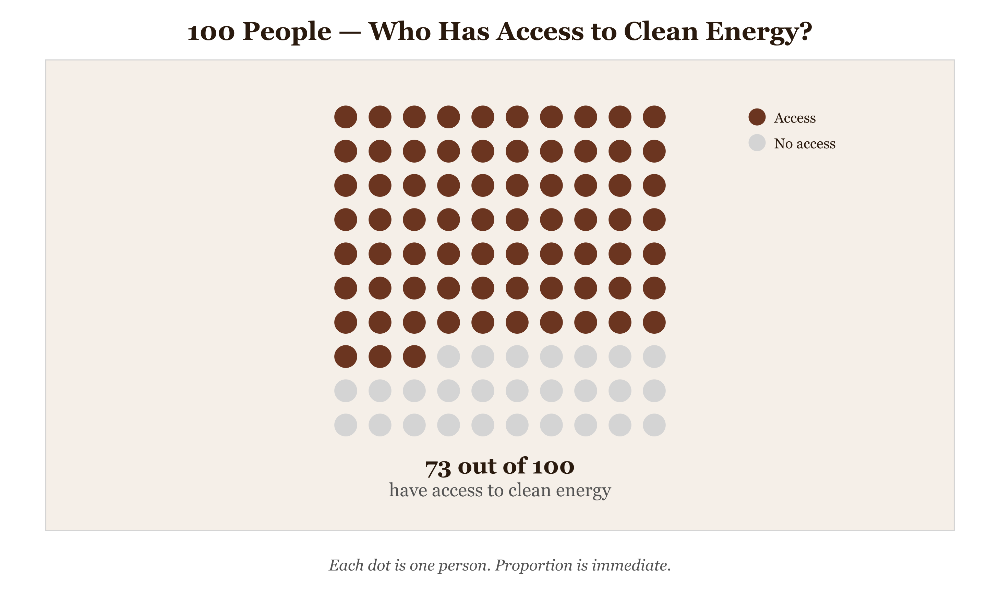
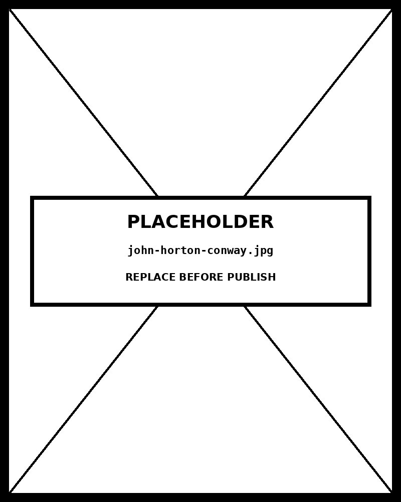

# Dot Matrix

*100 People — Who Has Access to Clean Energy?*


*Figure 35.1 — 100 People — Who Has Access to Clean Energy?*

## What this chart is

A dot matrix chart represents a population as a uniform grid of discrete marks, each dot encoding exactly one unit — here, one percent. Categories are distinguished by color, with the grid filled sequentially. The perceptual mechanism is two-fold: counting (the viewer tallies dots in a category by scanning clusters) and area estimation (larger clusters read as larger proportions without requiring arithmetic). Because the total is always fixed — 100 dots — the viewer can compare proportions across all categories against a known denominator. This is the critical advantage over a bar chart: the shared visual budget makes part-to-whole reasoning immediate, not inferential.

## Why it was chosen here

The dataset is a population divided into five discrete, mutually exclusive categories that sum to 100%. The message is about proportional distribution — not trend, not correlation, not ranking. A pie chart serves the same purpose but activates angle estimation, the least accurate quantitative perceptual channel. A stacked bar works for single-series but becomes unwieldy for comparison. The dot matrix exploits position and grouping simultaneously: the visual system pre-attentively detects clusters of same-colored dots, making the largest categories visible before any label is read. The fixed 10x10 grid anchors the denominator visually in a way no pie chart can.

## What the alternative would break

A standard pie chart fails in two ways. It encodes magnitude as arc angle — a channel where human perception is consistently less accurate than position judgments. And distinguishing five similarly-sized slices requires comparing non-adjacent arc lengths, introducing error. The dot matrix keeps all categories on the same spatial field. A treemap is the strongest alternative when the part-to-whole structure is hierarchical; for flat single-level proportions with a countable denominator the dot matrix is preferable because each unit is individually traceable — something treemaps sacrifice for space-efficiency.

## Framework reference

> // FRAMEWORK FT Visual Vocabulary category: Part-to-whole — "Show how a single entity is divided into its component parts." Abela quadrant: Composition (how individual parts make up the whole, static). Tufte principle: every dot is data — the grid is the axis, no ink is decorative. The one design decision worth knowing: filling the grid row-by-row in shuffled order (rather than sorted by category) preserves the sense of a real population sample rather than a deliberately arranged bar chart — the apparent randomness is not a flaw, it is the encoding.

## Prompt

Paste this into Claude Code to generate a working version of this chart, plus its data file. The result will not be a perfect replica — the goal is that the reader can run the prompt, get a chart of this type, and read its source.

```
Generate a complete, self-contained dot matrix in D3 v7. Two files:

1. `dot-matrix.html` — a full HTML page with inline CSS and inline D3 v7 (loaded from `https://cdnjs.cloudflare.com/ajax/libs/d3/7.8.5/d3.min.js`). The chart should fill the viewport, be responsive on resize, support keyboard focus on interactive elements, and include a tooltip on hover. The page title is "Dot Matrix" and the slide subtitle is "100 People — Who Has Access to Clean Energy?".

2. `dot-matrix/data.json` — the data file the chart loads via `d3.json("./dot-matrix/data.json")`, with a fallback inline literal in the HTML if the fetch fails.

Data shape:
- Population distribution across clean energy access categories. Each unit = 1% of population. All counts must sum to 100.
  - `label`: string — category name shown in legend and tooltip
  - `count`: number — integer from 1 to 100; all counts must sum to 100
  - `desc`: string — one-line description shown in tooltip

Encoding: use the perceptually honest channel for this chart type (dot matrix). Do not invent decorative encodings. Annotate the chart with a one-line in-chart subtitle that names what the chart shows. Include an accessibility `<title>` and `<desc>` inside the SVG.

Style: warm monochrome — black, dark walnut, blood-red accents only. Serif font for body text, JetBrains Mono for labels and controls. No drop shadows, no rounded corners, no gradients. Clean editorial register suitable for a print-ready textbook page.

Provide both files as separate code blocks. Do not explain — just produce the files.
```

> Reference implementation: `d3/35-dot-matrix.html`

The original code and data — copy-paste-ready — live at [bearbrown.co](https://www.bearbrown.co/).

---

## AI Wayback Machine

The ideas in this chapter didn't appear from nowhere. **John Horton Conway** invented the Game of Life in 1970 — a dot-matrix cellular automaton where each cell lives or dies by a few simple rules. The grid is the simplest possible dot matrix; the patterns that emerge are still studied as a model of complex systems.


*John Horton Conway, circa 1990. AI-generated portrait based on a public domain photograph (Wikimedia Commons).*

**Run this:**

```
Who was John Horton Conway, and how does the Game of Life connect to the dot matrix we covered in this chapter? Keep it to three paragraphs. End with the single most surprising thing about his career or ideas.
```

→ Search **"John Horton Conway"** on Wikipedia.

**Now make the prompt better.** Try one of these:

- Ask it to walk through one cycle of the Game of Life starting from a "glider" — what each cell does, and why.
- Ask it about Conway's wider mathematical career — surreal numbers, the Conway group, and the Look-and-say sequence.

What changes? What gets better? What gets worse?
