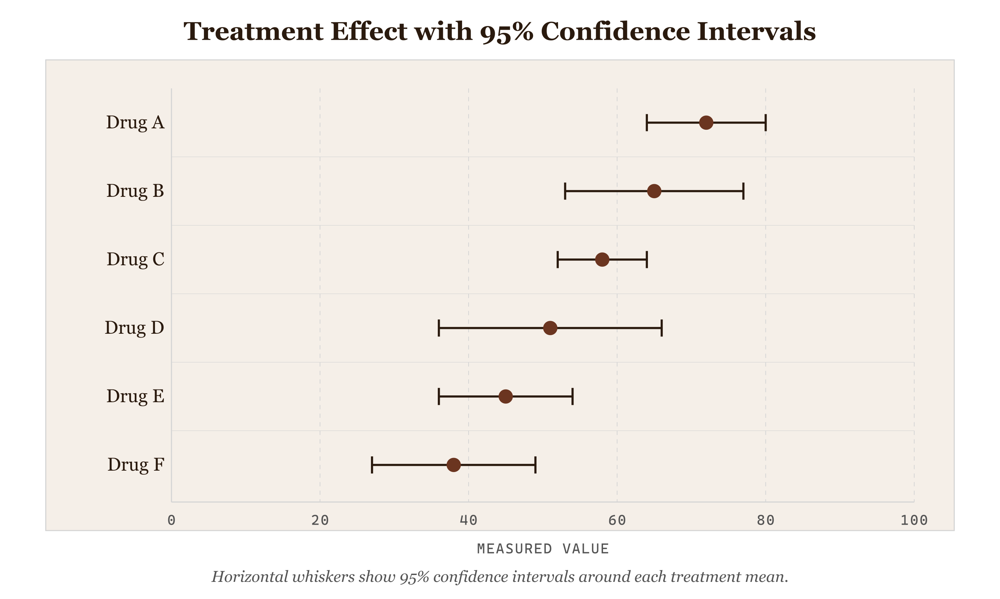

# Error Bars

*Error Bars — Uncertainty Overlay*


*Figure 36.1 — Error Bars — Uncertainty Overlay*

## The perceptual mechanism

Error bars are not a chart type — they are a **graphical enhancement** layered onto a Cartesian graph. They exploit the same channel as the primary encoding (position along a quantitative axis) to add a second layer of information: the **spread or uncertainty** around each plotted value. The cap-tipped line extending from a central point forces the eye to read a range rather than a single value, making it immediately visible whether groups have tight, reliable measurements or wide, unreliable ones.

The perceptual key: **length encodes uncertainty** . Short bar = concentrated values, high confidence in the mean. Long bar = dispersed values, lower confidence. This mapping is pre-attentive — viewers grasp it before conscious analysis.

## The four error modes and when to use each

**Standard deviation (SD)** describes the spread of the raw data around the mean. Use it when your message is about the distribution of individual observations — how variable the thing being measured actually is in the population.

**Standard error (SE)** describes the precision of the mean estimate itself (SE = SD ÷ √n). Use it when your message is about how reliably you estimated the mean — SE shrinks as sample size grows, SD does not. SE bars are always shorter than SD bars for the same data, which is why they are sometimes misused to make data look more precise than it is.

**95% confidence interval (CI)** is the most honest choice for most scientific communication. It conveys the range in which the true population mean would fall 95% of the time if the experiment were repeated. Unlike SD and SE, CI can be asymmetric for skewed data — this implementation supports distinct upper and lower bounds.

**Min–max range** shows the full observed span of the data. It is the most conservative encoding and the most sensitive to outliers. Use it when you need to show the reader the actual observed extremes, not a statistical estimate.

## Why error bars on a bar chart here

The data structure is **grouped categorical measurements with pre-computed statistics** . The message is comparison across groups with explicit uncertainty — not just "which group has the higher mean" but "how reliable is each group's mean, and do the uncertainty ranges overlap?" Overlapping confidence intervals are a rapid visual test for whether differences between groups are likely to be statistically significant. The bar chart provides the primary comparison channel (bar height = mean); the error bars provide the uncertainty channel as an additive overlay rather than a separate chart.

## What the alternative would break

A plain bar chart without error bars would answer "which group is highest" but not "is that difference real?" A box plot would show the full distribution more honestly (quartiles, median, outliers) but loses the direct mean-comparison that error bars preserve. Box plots are the better choice when the distribution shape matters; error bars are the better choice when the message is specifically about **mean reliability and group difference significance** .

A **critical error** flagged by the Data Visualisation Catalogue: never display error bars without labelling which measure they represent. SD, SE, and 95% CI bars on the same data have very different lengths — an unlabelled error bar is statistically meaningless.

## The one design decision worth knowing

The cap width is set to **60% of the bar width** — wide enough to be clearly readable as a range boundary, narrow enough not to be mistaken for an additional data series. The cap is the visual full stop that tells the eye "the range ends here." Without it, an error whisker reads as an arrow or an indefinite extension rather than a bounded interval.

## Framework reference

> // Framework — FT Visual Vocabulary FT Visual Vocabulary category: Distribution / Ranges — showing the spread of values within a group alongside the central tendency. Abela quadrant: Comparison (comparing means across categories with uncertainty context). Tufte principle applied: every mark on the chart earns its place — the error bar adds a full second data dimension (uncertainty) to each existing mark without adding ink that duplicates information already present.

## Prompt

Paste this into Claude Code to generate a working version of this chart, plus its data file. The result will not be a perfect replica — the goal is that the reader can run the prompt, get a chart of this type, and read its source.

```
Generate a complete, self-contained error bars in D3 v7. Two files:

1. `error-bars.html` — a full HTML page with inline CSS and inline D3 v7 (loaded from `https://cdnjs.cloudflare.com/ajax/libs/d3/7.8.5/d3.min.js`). The chart should fill the viewport, be responsive on resize, support keyboard focus on interactive elements, and include a tooltip on hover. The page title is "Error Bars" and the slide subtitle is "Error Bars — Uncertainty Overlay".

2. `error-bars/data.json` — the data file the chart loads via `d3.json("./error-bars/data.json")`, with a fallback inline literal in the HTML if the fetch fails.

Data shape:
- Grouped measurement data for error bar chart. Each record represents one experimental group or category. Provide mean and at least one uncertainty measure. Replace with your real aggregated data — error bars require pre-computed statistics, not raw observations.
  - `group`: string — category label (x-axis)
  - `mean`: number — central tendency value (y-axis)
  - `sd`: number — standard deviation (symmetric spread around mean)
  - `se`: number — standard error of the mean (sd / sqrt(n))
  - `ci95_lo`: number — lower bound of 95% confidence interval
  - `ci95_hi`: number — upper bound of 95% confidence interval
  - `min`: number — minimum observed value in group
  - `max`: number — maximum observed value in group
  - `n`: number — sample size

Encoding: use the perceptually honest channel for this chart type (error bars). Do not invent decorative encodings. Annotate the chart with a one-line in-chart subtitle that names what the chart shows. Include an accessibility `<title>` and `<desc>` inside the SVG.

Style: warm monochrome — black, dark walnut, blood-red accents only. Serif font for body text, JetBrains Mono for labels and controls. No drop shadows, no rounded corners, no gradients. Clean editorial register suitable for a print-ready textbook page.

Provide both files as separate code blocks. Do not explain — just produce the files.
```

> Reference implementation: `d3/36-error-bars.html`

The original code and data — copy-paste-ready — live at [bearbrown.co](https://www.bearbrown.co/).

---

## AI Wayback Machine

The ideas in this chapter didn't appear from nowhere. **Florence Nightingale David** was a 20th-century British statistician — Karl Pearson's protégée — whose work on combinatorial probability and statistical applications quietly shaped how we display uncertainty. She was named after Florence Nightingale, who was her godmother.


*Florence Nightingale David, circa 1970. AI-generated portrait based on a public domain photograph (Wikimedia Commons).*

**Run this:**

```
Who was Florence Nightingale David, and how does her statistical work connect to the error bars and uncertainty visualization we covered in this chapter? Keep it to three paragraphs. End with the single most surprising thing about her career or ideas.
```

→ Search **"Florence Nightingale David"** on Wikipedia.

**Now make the prompt better.** Try one of these:

- Ask it about the difference between standard-error and confidence-interval error bars, and when each is the honest choice.
- Ask it about David's wartime work — what statistical questions did she help solve during the Blitz?

What changes? What gets better? What gets worse?
