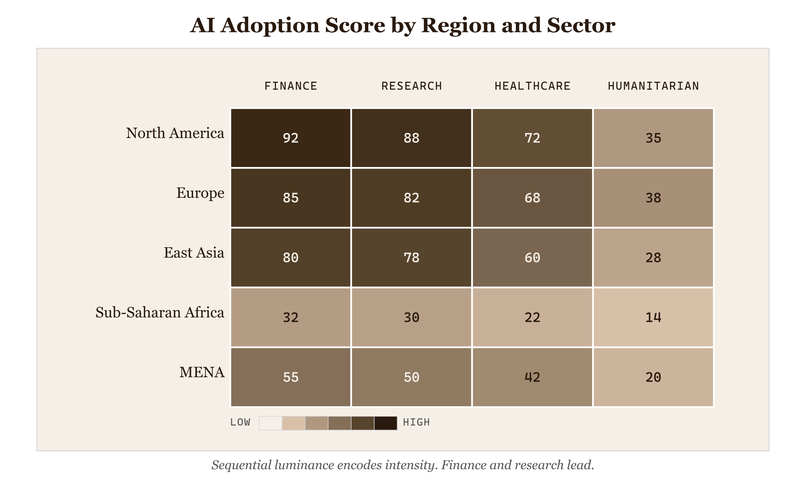
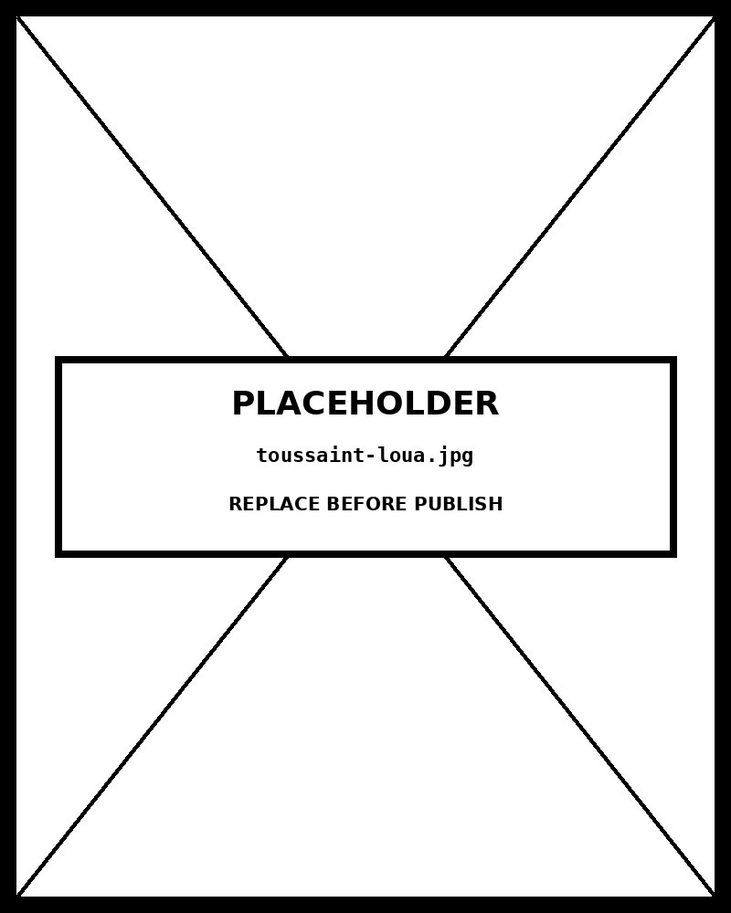

# Heatmap

*Finance and research lead — humanitarian AI lags in every region*


*Figure 39.1 — Finance and research lead — humanitarian AI lags in every region*

## What this chart is

A heatmap encodes numeric values as colour across a matrix of two categorical variables. The two axes are independent category sets; every cell at their intersection carries one value, encoded as colour lightness or saturation. The perceptual mechanism is *pre-attentive processing* — the eye detects clusters of similar colour before any deliberate comparison occurs. Regions of high value and low value, and columns or rows that diverge from the pattern, surface immediately without the viewer needing to read individual numbers. Adding the numeric value inside each cell restores precision that colour alone cannot provide.

## Why it was chosen here

The data has **two categorical dimensions** (region and sector) and one numeric measure (index score) — exactly the structure a heatmap is designed to handle. With 8 rows and 7 columns, there are 56 data points. Any alternative that uses position as the primary encoding — grouped bars, small multiples, scatter plots — would require 56 individual reads to see what the heatmap reveals at a glance: *the humanitarian column is consistently the dimmest* ; the finance and research columns are consistently the darkest; the gradient from top to bottom is steep and nearly monotonic.

## What a grouped bar chart would break

A grouped bar chart of this data requires either 8 groups of 7 bars or 7 groups of 8 bars — 56 bars in either case. At that density, the chart is illegible without zoom or scrolling, and the cross-dimension pattern (the humanitarian column's consistent underperformance) **cannot be seen** because bars are grouped by one axis, not both simultaneously. Small multiples would work but require 8 separate charts and active scanning to notice cross-chart patterns. The heatmap puts both axes in view at once, which is the only form that supports simultaneous row and column comparison.

## Framework reference & the one decision worth knowing

**The one decision worth knowing:** the colour scale domain is anchored at 0, not the data minimum (14). Anchoring to the data minimum would compress the scale and make Sub-Saharan Africa's 14-score read as *medium* . Anchoring to 0 makes it read as *genuinely low* — which is the true story. Scale anchoring is an editorial decision with real consequences for how viewers interpret gaps.

## Framework reference

> // FT Visual Vocabulary + Tufte FT Visual Vocabulary: Relationship — Distribution across two
            dimensions . Abela quadrant: Comparison (multiple variables, multiple categories). Tufte: heatmaps achieve
            high data density per unit of ink — all 56 values occupy the same
            space a grouped bar chart would need for 8.

## Prompt

Paste this into Claude Code to generate a working version of this chart, plus its data file. The result will not be a perfect replica — the goal is that the reader can run the prompt, get a chart of this type, and read its source.

```
Generate a complete, self-contained heatmap in D3 v7. Two files:

1. `heatmap.html` — a full HTML page with inline CSS and inline D3 v7 (loaded from `https://cdnjs.cloudflare.com/ajax/libs/d3/7.8.5/d3.min.js`). The chart should fill the viewport, be responsive on resize, support keyboard focus on interactive elements, and include a tooltip on hover. The page title is "Heatmap" and the slide subtitle is "Finance and research lead — humanitarian AI lags in every region".

2. `heatmap/data.json` — the data file the chart loads via `d3.json("./heatmap/data.json")`, with a fallback inline literal in the HTML if the fetch fails.

Data shape:
- Matrix dataset. rows[] and cols[] define the two categorical axes. values[][] is a 2D array indexed [row][col] in the same order as rows[] and cols[]. All values are on a 0–100 scale.
  - `title`: string — chart headline
  - `unit`: string — what each cell value represents
  - `colorDomain`: [number, number] — min and max of the color scale (usually [0, 100] or [dataMin, dataMax])
  - `rows[]`: string — row category labels (displayed on left axis)
  - `cols[]`: string — column category labels (displayed on top axis)
  - `values[][]`: number — 2D array, values[i][j] is the cell at row i, column j

Encoding: use the perceptually honest channel for this chart type (heatmap). Do not invent decorative encodings. Annotate the chart with a one-line in-chart subtitle that names what the chart shows. Include an accessibility `<title>` and `<desc>` inside the SVG.

Style: warm monochrome — black, dark walnut, blood-red accents only. Serif font for body text, JetBrains Mono for labels and controls. No drop shadows, no rounded corners, no gradients. Clean editorial register suitable for a print-ready textbook page.

Provide both files as separate code blocks. Do not explain — just produce the files.
```

> Reference implementation: `d3/39-heatmap.html`

The original code and data — copy-paste-ready — live at [bearbrown.co](https://www.bearbrown.co/).

---

## AI Wayback Machine

The ideas in this chapter didn't appear from nowhere. **Toussaint Loua** published the first known heatmap in 1873 — a shaded matrix of Paris neighborhood statistics — a century before computers made the form ubiquitous. The matrix layout he chose is essentially identical to a modern heatmap.


*Toussaint Loua, circa 1880. AI-generated portrait based on a public domain photograph (Wikimedia Commons).*

**Run this:**

```
Who was Toussaint Loua, and how does his 1873 shaded matrix connect to the heatmap we covered in this chapter? Keep it to three paragraphs. End with the single most surprising thing about his career or ideas.
```

→ Search **"Toussaint Loua"** on Wikipedia.

**Now make the prompt better.** Try one of these:

- Ask it to compare Loua's 1873 matrix with a modern computational heatmap — what aspects of the design have changed, what stayed the same?
- Ask it about the data Loua chose to encode (Parisian neighborhood demographics) and the social-statistics movement he was part of.

What changes? What gets better? What gets worse?
