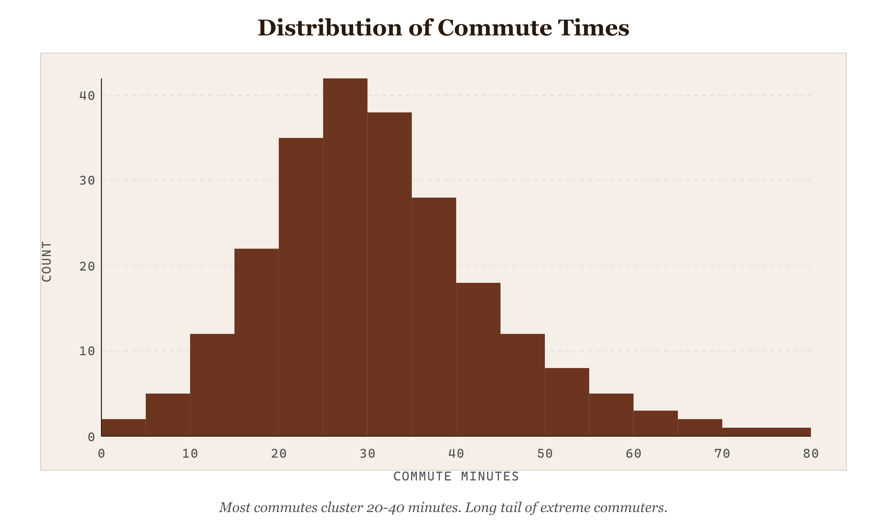
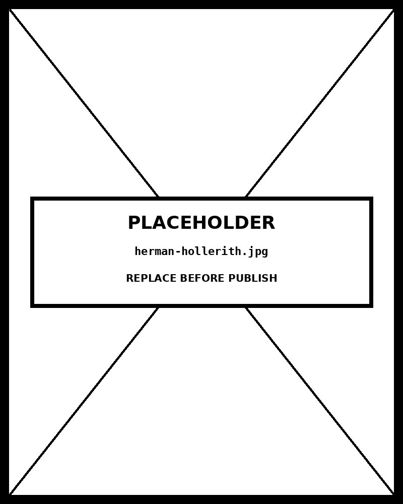

# Histogram

*Most commutes cluster between 20 and 40 minutes — a long tail of extreme commuters persists*


*Figure 40.1 — Most commutes cluster between 20 and 40 minutes*

## What this chart is

A Histogram visualises the frequency distribution of a single continuous variable by dividing its range into equal-width intervals (bins) and drawing a bar for each bin whose height encodes how many observations fall within that interval. Unlike a Bar Chart, the x-axis is a continuous numeric scale — the bars are adjacent, with no gaps, because the underlying data has no categorical gaps either.

The perceptual mechanism is area: each bar's area (width × height) is proportional to the count or relative frequency it represents. Because bin widths are equal, height alone carries the frequency signal. The shape of the envelope — the outline formed across all bars — is what the viewer reads: symmetric, skewed left, skewed right, uniform, bimodal, or multimodal.

## Why it was chosen here

The message requires knowing *where values concentrate* across a continuous range — not how categories compare, not how something changed over time. Commute time is continuous: 23.4 minutes and 23.6 minutes are neighbouring values on a scale, not separate categories. The histogram is the correct chart when the variable is continuous and the question is distributional.

The right skew in this data — mean pulled above median, long tail to the right — is the actual finding. A summary statistic (just the mean) would hide this completely. Only the distributional view reveals that most commuters cluster in the 20–40 minute band while a meaningful minority commutes 75+ minutes, distorting the mean upward.

## Bin width is an editorial decision

Bin width is the single most consequential design choice in a histogram. Too narrow: every bar contains one or two observations; the chart looks like noise and the shape is unreadable. Too wide: genuine structure (bimodality, gaps, secondary peaks) gets smoothed away. The right bin width reveals the distribution shape without overfitting to sample noise.

This implementation exposes the bin-width slider deliberately — it is a teaching tool. Slide from 2 minutes to 20 minutes and watch the same data tell different stories. The Freedman-Diaconis rule (bin width ≈ 2 × IQR × n^(−1/3)) is a principled starting point, but the analyst must verify the result makes distributional sense for the domain. A 5-minute bin for commute times is defensible; a 5-minute bin for geological strata would be absurd.

## What the rejected alternatives break

A **Bar Chart** requires discrete, named categories. Applying it to continuous data requires first binning the values and assigning labels — at which point you have rebuilt a histogram with gaps inserted for no reason. The gap signals a categorical break that doesn't exist in the data.

A **Box Plot** summarises the same distribution in five numbers (min, Q1, median, Q3, max). It is more compact and better for comparing distributions across groups. But it hides shape: a symmetric unimodal distribution and a bimodal distribution with the same quartiles produce identical box plots. When the shape itself is the message, the histogram is the honest choice.

## Prompt

Paste this into Claude Code to generate a working version of this chart, plus its data file. The result will not be a perfect replica — the goal is that the reader can run the prompt, get a chart of this type, and read its source.

```
Generate a complete, self-contained histogram in D3 v7. Two files:

1. `histogram.html` — a full HTML page with inline CSS and inline D3 v7 (loaded from `https://cdnjs.cloudflare.com/ajax/libs/d3/7.8.5/d3.min.js`). The chart should fill the viewport, be responsive on resize, support keyboard focus on interactive elements, and include a tooltip on hover. The page title is "Histogram" and the slide subtitle is "Most commutes cluster between 20 and 40 minutes — a long tail of extreme commuters persists".

2. `histogram/data.json` — the data file the chart loads via `d3.json("./histogram/data.json")`, with a fallback inline literal in the HTML if the fetch fails.

Data shape:
- 500 simulated daily one-way commute times in minutes.
  - `value`: number — one-way commute time in minutes (continuous, positive)

Encoding: use the perceptually honest channel for this chart type (histogram). Do not invent decorative encodings. Annotate the chart with a one-line in-chart subtitle that names what the chart shows. Include an accessibility `<title>` and `<desc>` inside the SVG.

Style: warm monochrome — black, dark walnut, blood-red accents only. Serif font for body text, JetBrains Mono for labels and controls. No drop shadows, no rounded corners, no gradients. Clean editorial register suitable for a print-ready textbook page.

Provide both files as separate code blocks. Do not explain — just produce the files.
```

> Reference implementation: `d3/40-histogram.html`

The original code and data — copy-paste-ready — live at [bearbrown.co](https://www.bearbrown.co/).

---

## AI Wayback Machine

The ideas in this chapter didn't appear from nowhere. **Herman Hollerith** developed the punch-card tabulating machine for the 1890 US Census — automating the production of frequency counts that became, when printed, the first machine-aided histograms. His company eventually became IBM.


*Herman Hollerith, circa 1890. AI-generated portrait based on a public domain photograph (Wikimedia Commons).*


*Puppet Art by [Nik Bear Brown](https://www.nikbearbrown.com/).*

**Run this:**

```
Who was Herman Hollerith, and how does his tabulating machine connect to the histogram we covered in this chapter? Keep it to three paragraphs. End with the single most surprising thing about his career or ideas.
```

→ Search **"Herman Hollerith"** on Wikipedia.

**Now make the prompt better.** Try one of these:

- Ask it to walk through how a 1890 census punch card was processed into a frequency table — and how that table became a printed histogram.
- Ask it about the lineage from Hollerith's company through IBM to modern data infrastructure.

What changes? What gets better? What gets worse?
