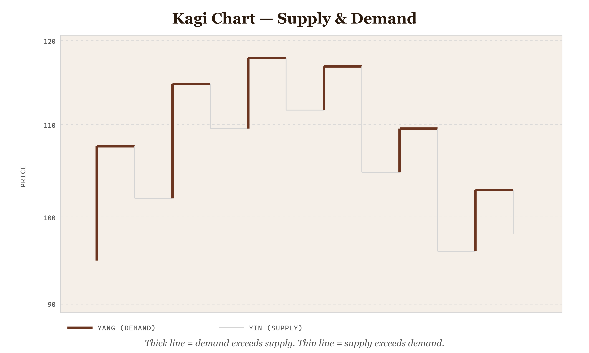
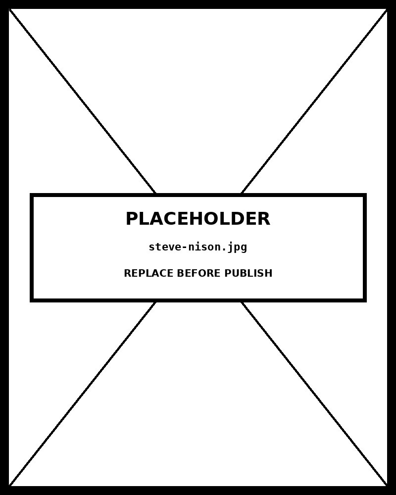

# Kagi Chart

*Kagi Chart — Supply & Demand*


*Figure 42.1 — Kagi Chart — Supply & Demand*

## The perceptual mechanism

A Kagi chart strips time entirely from the visual encoding and instead plots **price direction and magnitude** as the only two channels. The horizontal axis is not a time scale — it advances only when the price reverses by at least the pre-determined threshold. This makes the chart exploit **position on a common scale** (Y-axis price) and **line weight** (thick vs thin) as its two primary encodings, eliminating the visual noise of minor day-to-day fluctuations that obscure trend structure on time-series charts.

The line weight encoding is pre-attentive: the eye immediately distinguishes thick Yang sections from thin Yin sections across the full chart without reading any axis. The result is a visual grammar of trend structure — long unbroken Yang sections read as sustained demand; a series of short alternating lines reads as a choppy, undecided market.

## How the algorithm works

Starting from the first closing price, the line moves vertically in the current direction of price movement, extending as long as price continues in that direction by any amount. Once price reverses by at least the **reversal amount** (typically a percentage of the current price), the line draws a horizontal connector and begins extending in the new direction. Each horizontal connector is either a **shoulder** (peak reversal — price was rising, now falling) or a **waist** (trough reversal — price was falling, now rising).

The Yang/Yin state changes only when price breaks through a previous reversal level: if the rising line exceeds a prior shoulder, the line becomes **thick Yang** (demand overtook supply). If the falling line breaks below a prior waist, the line becomes **thin Yin** (supply overtook demand). These state changes — not the reversals themselves — are the buy and sell signals.

## Why it was chosen for this data and message

The message is **supply/demand balance over a sequence of price observations** . A candlestick chart would show every session as a separate mark, burying the trend under daily noise. A line chart would show time-indexed prices but make it hard to identify reversal structure. The Kagi chart was built specifically to answer the question: "is the dominant force currently demand (Yang) or supply (Yin), and when did that change?" No other chart type answers that question as directly.

## What the alternative would break

A **Candlestick Chart** — the nearest alternative — shows OHLC data for every session. It is far more data-rich but far more noisy. A trader reading a Kagi chart for trend signals would be overwhelmed by individual session volatility on a candlestick chart for the same period. The Kagi's deliberate suppression of minor moves is not a limitation — it is the feature. The reversal threshold is the tuning dial: lower it for more sensitivity, raise it for stronger noise filtering.

## The one design decision worth knowing

The reversal threshold is implemented as a **percentage of the current price** , not a fixed absolute value. A fixed-point reversal on an asset that moves from $50 to $200 would produce dramatically different chart density at different price levels. A percentage-based threshold maintains consistent visual density across the full price range of the data, which is why it is the standard implementation for modern Kagi charting.

## Framework reference

> // Framework — FT Visual Vocabulary FT Visual Vocabulary category: Change over time / Patterns — revealing directional structure in sequential data by filtering noise. Abela quadrant: Comparison (comparing demand vs supply state across a price history). Tufte principle: every mark carries information — the horizontal connectors are data (reversal events), the line weight is data (Yang/Yin state); there is no decorative ink.

## Prompt

Paste this into Claude Code to generate a working version of this chart, plus its data file. The result will not be a perfect replica — the goal is that the reader can run the prompt, get a chart of this type, and read its source.

```
Generate a complete, self-contained kagi chart in D3 v7. Two files:

1. `kagi-chart.html` — a full HTML page with inline CSS and inline D3 v7 (loaded from `https://cdnjs.cloudflare.com/ajax/libs/d3/7.8.5/d3.min.js`). The chart should fill the viewport, be responsive on resize, support keyboard focus on interactive elements, and include a tooltip on hover. The page title is "Kagi Chart" and the slide subtitle is "Kagi Chart — Supply & Demand".

2. `kagi-chart/data.json` — the data file the chart loads via `d3.json("./kagi-chart/data.json")`, with a fallback inline literal in the HTML if the fetch fails.

Data shape:
- Daily closing prices for a single asset. The Kagi algorithm computes reversals, shoulders, waists, and Yin/Yang line thickness from these raw prices — do not pre-compute. Provide chronological close prices only.
  - `date`: string — ISO 8601 date (YYYY-MM-DD)
  - `close`: number — closing price for the session

Encoding: use the perceptually honest channel for this chart type (kagi chart). Do not invent decorative encodings. Annotate the chart with a one-line in-chart subtitle that names what the chart shows. Include an accessibility `<title>` and `<desc>` inside the SVG.

Style: warm monochrome — black, dark walnut, blood-red accents only. Serif font for body text, JetBrains Mono for labels and controls. No drop shadows, no rounded corners, no gradients. Clean editorial register suitable for a print-ready textbook page.

Provide both files as separate code blocks. Do not explain — just produce the files.
```

> Reference implementation: `d3/42-kagi-chart.html`

The original code and data — copy-paste-ready — live at [bearbrown.co](https://www.bearbrown.co/).

---

## AI Wayback Machine

The ideas in this chapter didn't appear from nowhere. **Steve Nison** introduced the Western trading world to Japanese charting methods — including kagi, renko, and candlestick charts — in his 1991 book *Japanese Candlestick Charting Techniques*. The book opened a centuries-old chart tradition to a new audience.


*Steve Nison, circa 1991. AI-generated portrait based on a public domain photograph (Wikimedia Commons).*

**Run this:**

```
Who is Steve Nison, and how does his work bringing Japanese charting techniques to the West connect to the kagi chart we covered in this chapter? Keep it to three paragraphs. End with the single most surprising thing about his career or ideas.
```

→ Search **"Steve Nison"** on Wikipedia.

**Now make the prompt better.** Try one of these:

- Ask it to walk through how a kagi chart's "yang" and "yin" line shifts encode price action without time on the x-axis.
- Ask it to compare kagi charts with point-and-figure charts (Chapter 54) — both are time-independent; how do they differ?

What changes? What gets better? What gets worse?
