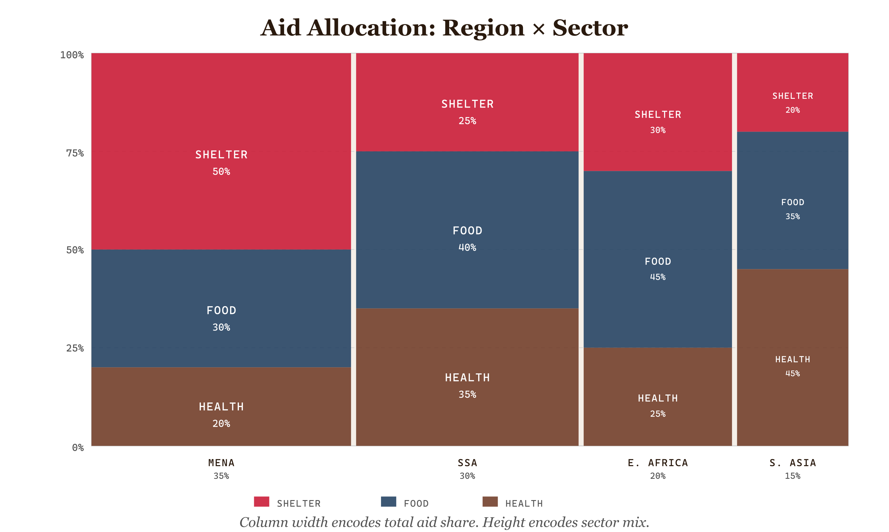
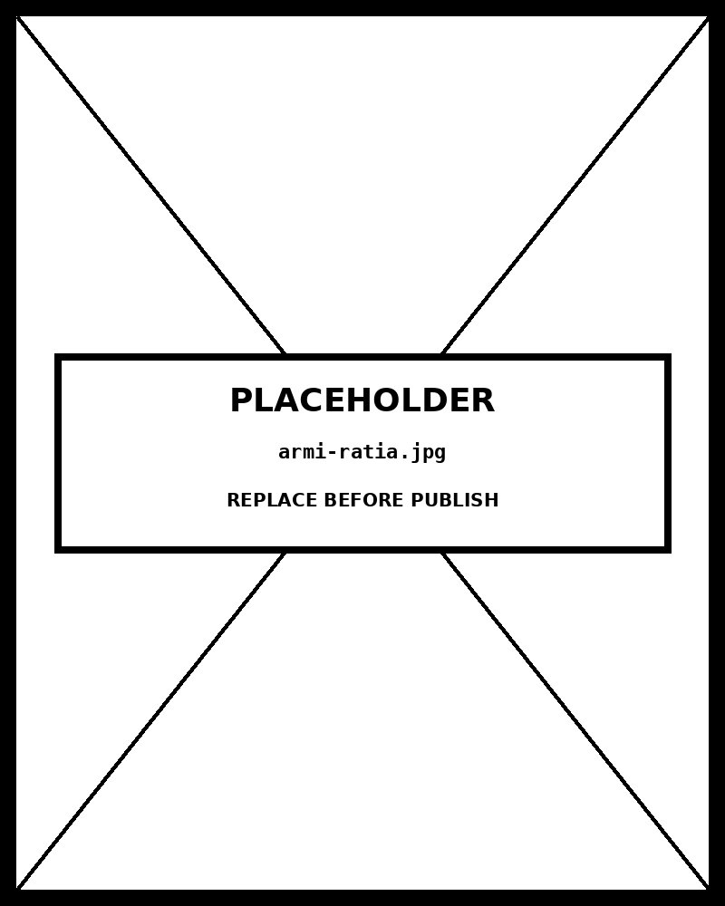

# Marimekko Chart

*MENA's Shelter Burden Is Double SSA's —Column Width Encodes Total Aid Share, Height Encodes Sector Mix*


*Figure 44.1 — MENA's Shelter Burden Is Double SSA's*

## What this chart is

A Marimekko chart (also called a Mosaic Plot) is a **two-variable 100% chart** : both axes run from 0% to 100%, and every segment in the chart simultaneously encodes its value on both axes. The x-axis encodes each group's share of the total (column width). The y-axis encodes the sub-category composition within each group (segment height). The result is a rectangle partitioned into cells where **cell area** directly encodes each category-group combination's share of the grand total. A cell whose column is 35% wide and whose segment is 42% tall occupies exactly **14.7% of the total chart area** — which equals 14.7% of the total data. This area-as-proportion property is the chart's defining characteristic and its primary cognitive demand.

## Two encodings, one rectangle

Every cell in a Marimekko simultaneously encodes four pieces of information: **group identity** (x-position), **group share of total** (column width), **sub-category identity** (fill color with redundant text label where space permits), and **sub-category share within the group** (segment height). The cell area synthesizes these into a fifth: the **share of the grand total** . No other single chart type encodes all five simultaneously without adding a fifth visual dimension (size, position, or annotation). This compression is Marimekko's strength — and the source of its notorious legibility ceiling at high cell counts.

## What the alternatives would break

A **100% stacked bar chart** shows the y-axis composition correctly but assigns equal column width to all groups — the viewer cannot see that Sub-Saharan Africa receives 35% of total aid while Other Regions receives 7%. The column-width variable disappears. A **treemap** encodes area as proportion-of-total and handles arbitrary nesting, but loses the aligned y-axis that makes within-column composition comparison possible — the viewer cannot scan horizontally to compare "how much of each region's aid goes to Health." Marimekko is the only chart that preserves *both* comparisons simultaneously.

## Reading order and cognitive load

Marimekko charts require a specific reading contract: the viewer must first understand that **column width ≠ data value** , but rather encodes a separate variable. This is counterintuitive — in a standard bar chart, width is decoration. Here it is data. The chart therefore requires more viewer calibration than a simple bar chart. The FT Visual Vocabulary lists Marimekko under **Part-to-whole** with a note: "suitable for a general overview rather than precise comparison." For precise segment comparison, a small-multiple of standard 100% bar charts is preferable. For revealing the relationship between the two variables simultaneously, Marimekko has no close substitute.

## Prompt

Paste this into Claude Code to generate a working version of this chart, plus its data file. The result will not be a perfect replica — the goal is that the reader can run the prompt, get a chart of this type, and read its source.

```
Generate a complete, self-contained marimekko chart in D3 v7. Two files:

1. `marimekko-chart.html` — a full HTML page with inline CSS and inline D3 v7 (loaded from `https://cdnjs.cloudflare.com/ajax/libs/d3/7.8.5/d3.min.js`). The chart should fill the viewport, be responsive on resize, support keyboard focus on interactive elements, and include a tooltip on hover. The page title is "Marimekko Chart" and the slide subtitle is "MENA's Shelter Burden Is Double SSA's —Column Width Encodes Total Aid Share, Height Encodes Sector Mix".

2. `marimekko-chart/data.json` — the data file the chart loads via `d3.json("./marimekko-chart/data.json")`, with a fallback inline literal in the HTML if the fetch fails.

Data shape:
- Global humanitarian aid allocation by region (x-axis column width) and sector (y-axis segment height). Fictional placeholder with realistic distributional shape. 2024 estimate. Proves the Marimekko renders before real data is substituted.
  - `columns[].id`: string — unique column identifier
  - `columns[].label`: string — full column label (used in tooltip)
  - `columns[].shortLabel`: string — abbreviated label (used in chart, ≤8 chars)
  - `columns[].xShare`: number — this column's share of the x-axis, 0–100. All columns must sum to 100.
  - `columns[].segments`: array — the y-axis breakdown within this column. Must sum to 100.
  - `columns[].segments[].category`: string — category id, must match a categories[].id
  - `columns[].segments[].value`: number — this segment's share within the column, 0–100
  - `categories[].id`: string — unique category identifier
  - `categories[].label`: string — category name for legend and tooltip
  - `categories[].fill`: string — hex color from hai palette
  - `xAxisLabel`: string — describes what column width encodes
  - `yAxisLabel`: string — describes what segment height encodes

Encoding: use the perceptually honest channel for this chart type (marimekko chart). Do not invent decorative encodings. Annotate the chart with a one-line in-chart subtitle that names what the chart shows. Include an accessibility `<title>` and `<desc>` inside the SVG.

Style: warm monochrome — black, dark walnut, blood-red accents only. Serif font for body text, JetBrains Mono for labels and controls. No drop shadows, no rounded corners, no gradients. Clean editorial register suitable for a print-ready textbook page.

Provide both files as separate code blocks. Do not explain — just produce the files.
```

> Reference implementation: `d3/44-marimekko-chart.html`

The original code and data — copy-paste-ready — live at [bearbrown.co](https://www.bearbrown.co/).

---

## AI Wayback Machine

The ideas in this chapter didn't appear from nowhere. **Armi Ratia** founded the Finnish textile company Marimekko in 1951 — whose bold geometric prints lent their name to the variable-width stacked bar chart now used to display two-way category proportions. The chart is named after the fabric pattern, not its designer.


*Armi Ratia, circa 1965. AI-generated portrait based on a public domain photograph (Wikimedia Commons).*

**Run this:**

```
Who was Armi Ratia, and how does her textile design at Marimekko connect to the Marimekko chart we covered in this chapter? Keep it to three paragraphs. End with the single most surprising thing about her career or ideas.
```

→ Search **"Armi Ratia"** on Wikipedia.

**Now make the prompt better.** Try one of these:

- Ask it to explain why a Marimekko chart works well for two-dimensional categorical data — and what fails when you try to use it for three dimensions.
- Ask it about Marimekko's place in postwar Finnish design culture — and how the brand came to be everywhere.

What changes? What gets better? What gets worse?
