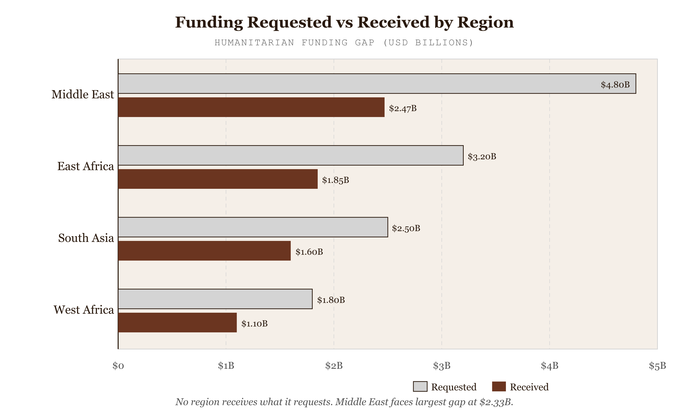
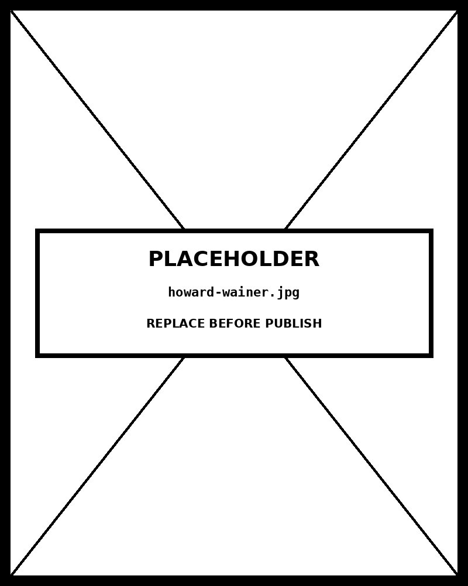

# Multiset Bar

*No Region Receives What It Requests — Middle East Faces the Largest Absolute Funding Gap at $2.33B*


*Figure 46.1 — No Region Receives What It Requests*

## What this chart is

A multi-set bar chart places multiple bars side-by-side within each category group. The viewer simultaneously reads two things: the length of individual bars (how large each series value is for that category) and the relative lengths of bars within the same group (how the series compare against each other at that category). The primary perceptual channel is **length along a common baseline** — the most accurate quantitative judgment available to the human visual system, according to Cleveland and McGill's hierarchy of perceptual tasks.

The structural signature is the nested scale: one scale governs the position of each group along the x-axis; a second, inner scale governs the position of each bar within its group. In D3, this is implemented as `d3.scaleBand()` nested inside another `d3.scaleBand()` — the outer band sets group widths, the inner band subdivides each group into individual series bars.

## Why it was chosen here

The data has a specific two-level comparison structure: the analyst needs to compare values *across regions* (is the Middle East gap larger than East Africa's?) and *within regions* (how does received compare to requested in the same region?). A multi-set bar chart handles both questions simultaneously. The within-group comparison is immediate — adjacent bars share a baseline and differ only in length. The across-group comparison is also readable because the same series appears in the same position in every group, so the eye tracks a single color band across all five groups.

The funding pipeline story has a natural left-to-right series order: Requested → Received → Expenditure follows the logical flow of money. Placing the series in this order inside each group encodes a mini-narrative — the viewer reads left to right and sees each step of the pipeline contracting. This ordering decision is carrying analytical weight, not just aesthetic preference.

## What the alternatives lose

A **stacked bar chart** would allow the total of all three series per region to be read directly — but the funding requested, received, and expenditure values do not sum to a meaningful whole. Stacking three pipeline stages would imply they are additive components of a total, which they are not. More critically, the within-group comparison between series would be degraded: only the bottom series has a common baseline; all others float and require the eye to judge floating bar lengths, which is less accurate than common-baseline judgment.

A **small multiples line chart** (one panel per region) would make the within-region trend across series easy to read but would make cross-region comparison of the same series harder — the eye has to jump between panels rather than tracking a single color. For five regions with three series, small multiples adds panels without adding information.

A **dot plot** would reduce the visual weight and show the same data more cleanly for audiences who resist bar charts — but dot plots sacrifice the strong visual encoding of area (bar height × width) that makes the magnitude difference between Middle East ($6.15B requested) and Latin America ($1.92B requested) immediately apparent.

// design decision — hatching on expenditure bars The expenditure bars carry a diagonal hatch pattern in addition to their dim-gray fill. This provides a redundant visual encoding that does not depend on color: a viewer with deuteranopia or protanopia who cannot reliably distinguish the three series colors can still identify expenditure bars by their texture. This is the WCAG 2.1 principle that color must never be the sole differentiator — shape, pattern, or position must carry the same information. The hatch was chosen (rather than a solid pattern) because it preserves the perceived bar height, which is the primary encoding channel. A solid tonal difference would change the perceived brightness and distort the length comparison.

## Framework reference

> // framework — FT Visual Vocabulary The FT Visual Vocabulary places grouped bar charts in its Comparison category alongside simple bar charts and dot plots. Its note: use a grouped bar chart when the subcategory comparison within groups is as important as the comparison between groups. The test — if you only need to compare totals across categories, a simple bar chart suffices. If you need to see the internal breakdown, group or stack. If the components are not additive, group rather than stack.

## Prompt

Paste this into Claude Code to generate a working version of this chart, plus its data file. The result will not be a perfect replica — the goal is that the reader can run the prompt, get a chart of this type, and read its source.

```
Generate a complete, self-contained multiset bar in D3 v7. Two files:

1. `multiset-bar.html` — a full HTML page with inline CSS and inline D3 v7 (loaded from `https://cdnjs.cloudflare.com/ajax/libs/d3/7.8.5/d3.min.js`). The chart should fill the viewport, be responsive on resize, support keyboard focus on interactive elements, and include a tooltip on hover. The page title is "Multiset Bar" and the slide subtitle is "No Region Receives What It Requests — Middle East Faces the Largest Absolute Funding Gap at $2.33B".

2. `multiset-bar/data.json` — the data file the chart loads via `d3.json("./multiset-bar/data.json")`, with a fallback inline literal in the HTML if the fetch fails.

Data shape:
- Humanitarian funding pipeline by geographic region, FY 2024 (simulated). Three series — Requested, Received, Expenditure — grouped by region. Illustrates the funding gap and spending efficiency across response contexts.
  - `series`: array of string, series keys in display order (left → right within each group)
  - `series_labels[key]`: string, human-readable label for each series key
  - `series_colors[key]`: string, hex color for each series — applied to bars and legend swatches
  - `data[].region`: string, parent category (x-axis group label)
  - `data[].requested_m`: number, funding requested in USD millions
  - `data[].received_m`: number, funding received in USD millions
  - `data[].expenditure_m`: number, actual expenditure in USD millions

Encoding: use the perceptually honest channel for this chart type (multiset bar). Do not invent decorative encodings. Annotate the chart with a one-line in-chart subtitle that names what the chart shows. Include an accessibility `<title>` and `<desc>` inside the SVG.

Style: warm monochrome — black, dark walnut, blood-red accents only. Serif font for body text, JetBrains Mono for labels and controls. No drop shadows, no rounded corners, no gradients. Clean editorial register suitable for a print-ready textbook page.

Provide both files as separate code blocks. Do not explain — just produce the files.
```

> Reference implementation: `d3/46-multiset-bar.html`

The original code and data — copy-paste-ready — live at [bearbrown.co](https://www.bearbrown.co/).

---

## AI Wayback Machine

The ideas in this chapter didn't appear from nowhere. **Howard Wainer** spent decades arguing — in *Visual Revelations* and in dozens of *Chance* magazine columns — that most published graphs commit the same handful of mistakes again and again. His careful redesigns of misleading charts taught a generation of statisticians to see them.


*Howard Wainer, circa 1997. AI-generated portrait based on a public domain photograph (Wikimedia Commons).*

**Run this:**

```
Who is Howard Wainer, and how does his work redesigning misleading graphs connect to the multiset bar chart we covered in this chapter? Keep it to three paragraphs. End with the single most surprising thing about his career or ideas.
```

→ Search **"Howard Wainer"** on Wikipedia.

**Now make the prompt better.** Try one of these:

- Ask it to apply Wainer's "twelve ways to make a bad graph" to a specific multiset bar chart you'd build — what's the worst design mistake to avoid?
- Ask it about his role in psychometrics and the SAT — and how that fits with the visualization work.

What changes? What gets better? What gets worse?
