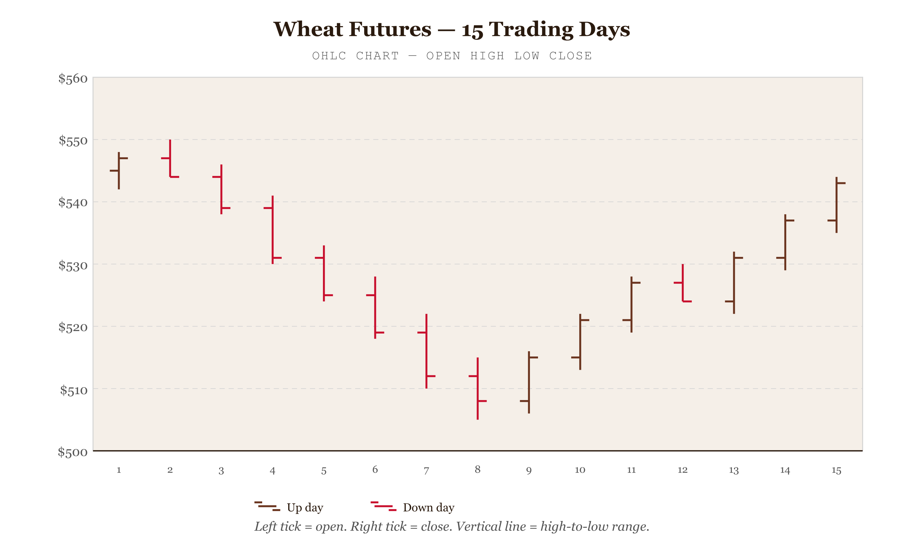

# OHLC Chart

*January Wheat Selloff Hit 9.6% Peak-to-Trough in Three Weeks — Futures Recovered Through February as Supply Concerns Eased*


*Figure 49.1 — January Wheat Selloff and Recovery*

## What this chart is

An OHLC chart encodes four price dimensions per time period with a single symbol. A vertical line spans the session's high and low — the full intraday range. Two horizontal ticks branch off this line: one on the left at the opening price, one on the right at the closing price. The viewer reads the symbol's length as volatility (tall = high-volatility session), the tick positions as the session's net direction (close tick above open = the market gained), and the color as a single binary judgment (bullish or bearish).

The perceptual contract is position along a common scale — the y-axis — applied to four values simultaneously through a single glyph. No other chart type encodes the full OHLC tuple per period in comparably compact form at high session counts. At 41 sessions, each OHLC bar takes about 14px of horizontal space. A grouped bar chart rendering the same four values per day would be unusable.

## Why it was chosen — and why not the candlestick

The candlestick chart encodes the same four values but uses a filled rectangle (the "body") for the open-to-close range, with thin wicks extending to the high and low. The body's fill distinguishes bullish from bearish. For sparse time series (weekly, monthly data, or fewer than ~20 sessions), candlestick bodies are immediately legible. For dense series — 40+ daily sessions — the filled bodies begin to occlude each other, and the chart reads as a mass of colored blocks rather than distinct symbols.

The OHLC format uses only lines. At 41 sessions in ~820px, the tick marks are roughly 6px wide and the stroke is 1.7px — enough to read individually without collision. At the same density with candlestick bodies, body widths would be 8–10px, and adjacent bullish/bearish bodies would visually merge. OHLC was chosen because the session count sits in the density range where tick-mark symbols outperform filled rectangles.

Redundant encoding compensates for the thinner visual weight: the close tick's vertical position relative to the open tick encodes direction without color. A bullish session always has the close tick above the open tick; a bearish session always has it below. A viewer who cannot distinguish the walnut (bullish) from blood-red (bearish) can still read the chart correctly through tick position alone.

## What a line chart loses

A line chart of closing prices would show the January peak and trough clearly, but would erase all intraday information. The session of Jan 18 — in which the price opened at 608.6 and fell 16 cents to close at 599.4, with an intraday low of 596.8 — is analytically significant for food security analysis. The low of 596.8 means that at some point during that session, wheat was accessible at a price not seen since mid-December. A line chart at the closing price of 599.4 would miss this. The high-low range is not noise; it is information about the market's indecision, its volatility, and its potential support and resistance levels.

## Y-axis truncation — why it is correct here

Unlike bar charts, the OHLC y-axis does not start at zero. For bar charts, a zero baseline is mandatory because bar length encodes absolute magnitude — a bar twice as long should represent twice the value, which only holds when the baseline is zero. The OHLC chart encodes change, not absolute magnitude. The viewer's question is "how much did the price move?" not "how large is the price?" A wheat price of zero has no meaning — the commodity would not exist. Starting the y-axis at the lowest low (approximately 578) and ending at the highest high (approximately 642) maximises the visual resolution of the price movements that constitute the actual data story.

// design decision — walnut for bullish, not conventional green Financial charts conventionally use green for bullish and red for bearish. The hai palette has no green — the palette was designed for earthy gravitas, not traffic-light signaling. Walnut (p2, #5C3317) is used for bullish sessions and blood-red (p3, #B52C2C) for bearish. The positive/negative distinction is preserved: walnut is darker, warmer, and associated with stability; blood-red is a clear danger signal. More importantly, the redundant positional encoding (close tick above/below open tick) means the color choice does not compromise readability. On black-and-white output, the chart remains fully interpretable through tick position alone — which is the WCAG-correct design.

## Framework reference

> // framework — FT Visual Vocabulary The FT Visual Vocabulary places OHLC charts in the Change Over Time category alongside line charts and area charts, with an additional Ranges quality for the high-low dimension. Its guidance on axis truncation for time-series charts: truncation is acceptable when the analyst's goal is to show change rather than absolute quantity. The OHLC chart's entire purpose is change — this is the one chart type where a zero baseline would be actively misleading.

## Prompt

Paste this into Claude Code to generate a working version of this chart, plus its data file. The result will not be a perfect replica — the goal is that the reader can run the prompt, get a chart of this type, and read its source.

```
Generate a complete, self-contained ohlc chart in D3 v7. Two files:

1. `ohlc-chart.html` — a full HTML page with inline CSS and inline D3 v7 (loaded from `https://cdnjs.cloudflare.com/ajax/libs/d3/7.8.5/d3.min.js`). The chart should fill the viewport, be responsive on resize, support keyboard focus on interactive elements, and include a tooltip on hover. The page title is "OHLC Chart" and the slide subtitle is "January Wheat Selloff Hit 9.6% Peak-to-Trough in Three Weeks — Futures Recovered Through February as Supply Concerns Eased".

2. `ohlc-chart/data.json` — the data file the chart loads via `d3.json("./ohlc-chart/data.json")`, with a fallback inline literal in the HTML if the fetch fails.

Data shape:
- Chicago Soft Red Winter Wheat Futures (ZW) — daily OHLC prices, Jan 2 – Feb 29 2024 (simulated). 41 trading sessions. Replace with any financial or price time-series dataset.
  - `commodity`: string, display name for the instrument
  - `unit`: string, price unit label shown on y-axis
  - `sma_period`: number, period for the simple moving average overlay line
  - `data[].date`: string, ISO date YYYY-MM-DD — weekends excluded
  - `data[].open`: number, opening price for the session
  - `data[].high`: number, intraday high
  - `data[].low`: number, intraday low
  - `data[].close`: number, closing price — determines bullish (close ≥ open) or bearish (close < open) color

Encoding: use the perceptually honest channel for this chart type (ohlc chart). Do not invent decorative encodings. Annotate the chart with a one-line in-chart subtitle that names what the chart shows. Include an accessibility `<title>` and `<desc>` inside the SVG.

Style: warm monochrome — black, dark walnut, blood-red accents only. Serif font for body text, JetBrains Mono for labels and controls. No drop shadows, no rounded corners, no gradients. Clean editorial register suitable for a print-ready textbook page.

Provide both files as separate code blocks. Do not explain — just produce the files.
```

> Reference implementation: `d3/49-ohlc-chart.html`

The original code and data — copy-paste-ready — live at [bearbrown.co](https://www.bearbrown.co/).

---

## AI Wayback Machine

The ideas in this chapter didn't appear from nowhere. **Ralph Nelson Elliott** developed Elliott Wave Theory in the 1930s — a system of reading OHLC price charts as nested fractal patterns of impulse waves and corrections. The theory is contested but the chart-reading discipline it produced is widespread.


*Ralph Nelson Elliott, circa 1935. AI-generated portrait based on a public domain photograph (Wikimedia Commons).*

**Run this:**

```
Who was Ralph Nelson Elliott, and how does Elliott Wave Theory connect to the OHLC chart we covered in this chapter? Keep it to three paragraphs. End with the single most surprising thing about his career or ideas.
```

→ Search **"Ralph Nelson Elliott"** on Wikipedia.

**Now make the prompt better.** Try one of these:

- Ask it to walk through how Elliott's 5-3 wave pattern is identified on a daily OHLC chart.
- Ask it to discuss the empirical evidence — or lack of it — that Elliott Wave Theory predicts price action.

What changes? What gets better? What gets worse?
