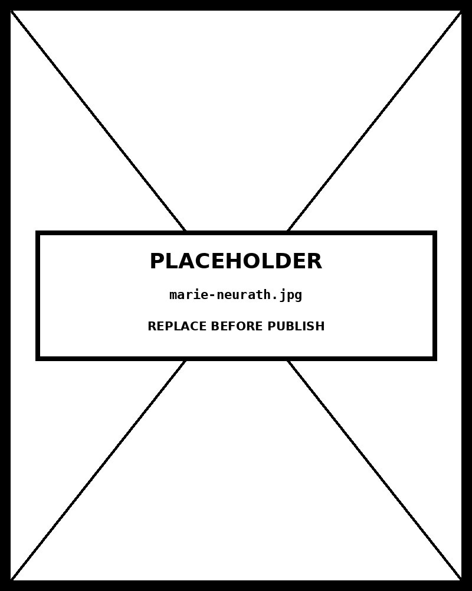

# Pictogram Chart

*Energy Mix by Region — Each Icon = 2% of Portfolio*


## What this chart is

A pictogram chart represents discrete quantities as rows or columns of icons, where each icon encodes a fixed unit count. The perceptual mechanism is counting and grouping: the viewer scans a row of icons the same way they scan a shelf of objects, building a concrete intuition for quantity that abstract bar lengths cannot match. When icons represent the subject of the data — energy symbols for energy data, people silhouettes for population data — the chart exploits associative memory, reducing the cognitive distance between the number and what it means. Color encodes category, but the icon shape provides a fully redundant second encoding, satisfying WCAG's requirement that color never be the sole differentiator.

## Why it was chosen here

The dataset is a small set of discrete categorical proportions (five energy sources, five regions, all summing to 50 icons per region at 2% each) with a message about relative mix and regional comparison. The data is explicitly appropriate for pictograms: small counts, meaningful units, a comparison story. A bar chart would convey the same totals but strip the iconographic context that makes the energy mix legible without axis reading. A dot matrix would work for a single region but loses the side-by-side comparison that reveals which regions lead on renewables. The pictogram occupies the productive overlap between engaging infographic and honest statistical display.

## What the alternative would break

A grouped bar chart would be the statistically rigorous alternative, and it is superior when precision matters more than engagement. The pictogram's failure mode is the partial icon problem: showing 3.7 icons is misleading because fractions of an icon imply fractional units. This implementation avoids partial icons entirely — all counts are rounded to whole icon multiples of the unit value before rendering. The dot matrix is the closest structural relative; the pictogram is preferred when the icon shape carries semantic meaning that helps the audience without a data-literacy background understand the subject immediately, as is common in policy briefings, annual reports, and journalism.

## Framework reference

> // FRAMEWORK FT Visual Vocabulary category: Part-to-whole / Comparisons — "Show how discrete parts compare across categories when the subject can be represented iconographically." Tufte caution: pictograms are at risk of the lie factor when icons are scaled in two dimensions (area grows as the square of height). This implementation avoids that: every icon is the same size, and quantity is encoded only by count, never by scale. The one design decision worth knowing: icon unit value (here, 2%) was chosen so that no region requires more than 50 icons per row — beyond 50 discrete marks, counting becomes error-prone and the advantage over a bar chart disappears.

## Prompt

Paste this into Claude Code to generate a working version of this chart, plus its data file. The result will not be a perfect replica — the goal is that the reader can run the prompt, get a chart of this type, and read its source.

```
Generate a complete, self-contained pictogram chart in D3 v7. Two files:

1. `pictogram-chart.html` — a full HTML page with inline CSS and inline D3 v7 (loaded from `https://cdnjs.cloudflare.com/ajax/libs/d3/7.8.5/d3.min.js`). The chart should fill the viewport, be responsive on resize, support keyboard focus on interactive elements, and include a tooltip on hover. The page title is "Pictogram Chart" and the slide subtitle is "Energy Mix by Region — Each Icon = 2% of Portfolio".

2. `pictogram-chart/data.json` — the data file the chart loads via `d3.json("./pictogram-chart/data.json")`, with a fallback inline literal in the HTML if the fetch fails.

Data shape:
- Energy mix by region. Each source value is a percentage. All source values per region must sum to 100. UNIT_PCT controls how many percent one icon represents — keep it so that value / UNIT_PCT is always a whole integer for every cell.
  - `UNIT_PCT`: number — percent represented by one icon. All values must be divisible by this.
  - `sources[].id`: string — key matching the ICONS and COLORS lookups in the JS
  - `sources[].label`: string — display name shown in legend and tooltip
  - `regions[].name`: string — row/column label
  - `regions[].values`: object — keys matching source ids, values in percent (integers divisible by UNIT_PCT)

Encoding: use the perceptually honest channel for this chart type (pictogram chart). Do not invent decorative encodings. Annotate the chart with a one-line in-chart subtitle that names what the chart shows. Include an accessibility `<title>` and `<desc>` inside the SVG.

Style: warm monochrome — black, dark walnut, blood-red accents only. Serif font for body text, JetBrains Mono for labels and controls. No drop shadows, no rounded corners, no gradients. Clean editorial register suitable for a print-ready textbook page.

Provide both files as separate code blocks. Do not explain — just produce the files.
```

The original code and data — copy-paste-ready — live at [bearbrown.co](https://www.bearbrown.co/).

---

## AI Wayback Machine

The ideas in this chapter didn't appear from nowhere. **Marie Neurath** co-created the Isotype pictogram system with her husband Otto, and continued the work alone after his death in 1945 — translating science, history, and statistics into pictograms for working-class and child audiences. She produced more than 80 illustrated books.


*Marie Neurath, circa 1948. AI-generated portrait based on a public domain photograph (Wikimedia Commons).*

**Run this:**

```
Who was Marie Neurath, and how does her work continuing Isotype connect to the pictogram chart we covered in this chapter? Keep it to three paragraphs. End with the single most surprising thing about her career or ideas.
```

→ Search **"Marie Neurath"** on Wikipedia.

**Now make the prompt better.** Try one of these:

- Ask it to design an Isotype-style pictogram chart for one specific demographic statistic — what icon, what scale?
- Ask it about Marie Neurath's *Wonders of the Modern World* book series, and how it taught science visually to a generation of children.

What changes? What gets better? What gets worse?
