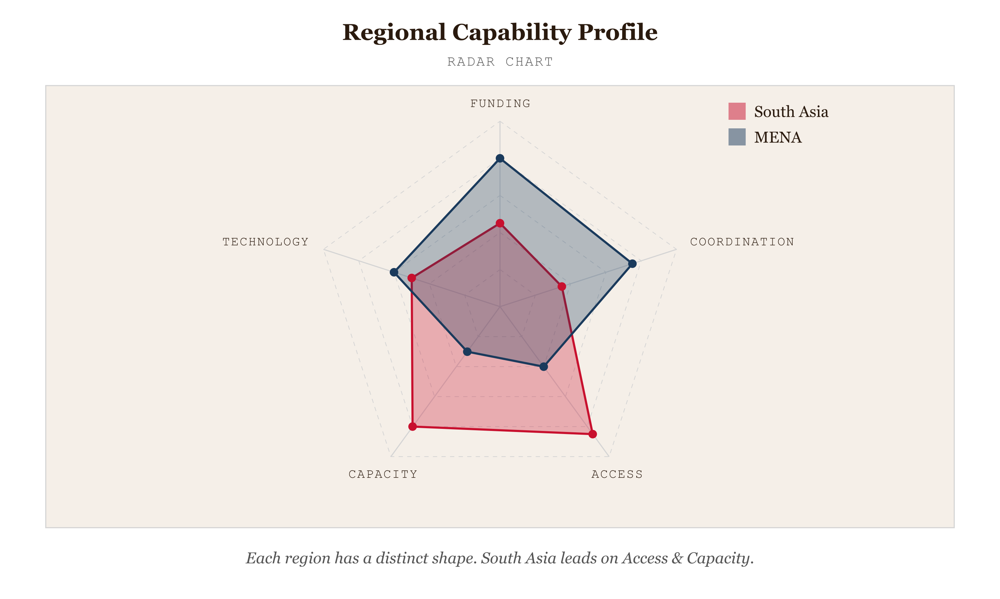
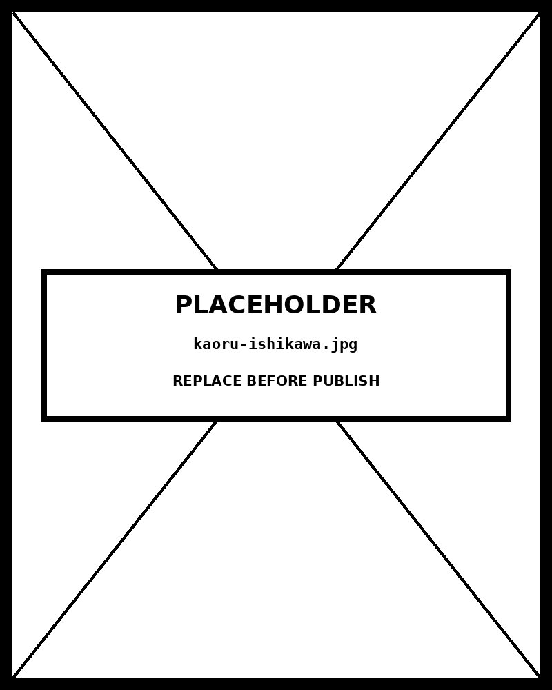

# Radar Chart

*Each Region Has a Distinct Capability Profile —South Asia Leads on Access & Capacity, MENA on Funding & Coordination*


*Figure 57.1 — Each Region Has a Distinct Capability Profile*

## What this chart is

A radar chart (also spider, web, polar, or star chart) maps multiple quantitative variables onto equally-spaced radial axes, all sharing a single origin and scale. A data series is drawn as a polygon connecting its value on each axis. The perceptual mechanism is **polygon shape comparison** : the viewer compares overall outlines holistically, noticing which polygon is larger (higher average performance), where one extends further than another on a specific axis (strength in that dimension), and whether shapes are pointy (uneven profile) or rounded (balanced across dimensions). This holistic shape recognition is the chart's primary strength — and it requires no arithmetic from the viewer.

## Why it was chosen

The data contains three series across six dimensions where the **overall performance profile** — not any single variable — is the message. South Asia has the most area in the upper-right quadrant (access, capacity); MENA is skewed toward the upper-left (funding, coordination). These *profile shapes* are immediately visible in the polygon outlines and would require six separate charts to convey with bar charts. The radar chart is appropriate here because: (a) all axes share the same 0–100 scale, making cross-axis comparison valid; (b) there are exactly 6 variables (within the 4–8 recommended range); and (c) there are only 3 series (within the 2–4 overlap-legibility limit).

## Limitation 1: axis order is arbitrary

The area of a radar polygon changes depending on the order of axes — placing two high-scoring variables adjacent produces a larger polygon area than placing them opposite each other, even with identical values. There is **no canonical correct axis order** . This implementation places axes starting at 12 o'clock and proceeds clockwise, but any rotation produces a legitimately different-looking polygon from the same data. Viewers who focus on area as the primary signal are vulnerable to this distortion. Always accompany a radar chart with the explicit values — this implementation provides them via the tooltip on hover.

## Limitation 2: imprecise cross-axis comparison

Comparing values *across different axes* — "is MENA's funding (80) better than South Asia's access (75)?" — requires the viewer to mentally locate two points on two non-parallel scales and compare their radial distances from center. This is significantly harder than comparing two bars on a common baseline. The Catalogue states this clearly: "comparing values all on a single straight axis is much easier." Radar charts are for **within-series profile reading** and **between-series shape comparison** , not for precise cross-axis value comparisons. For the latter, use a parallel coordinates plot or small-multiple bar charts.

## Prompt

Paste this into Claude Code to generate a working version of this chart, plus its data file. The result will not be a perfect replica — the goal is that the reader can run the prompt, get a chart of this type, and read its source.

```
Generate a complete, self-contained radar chart in D3 v7. Two files:

1. `radar-chart.html` — a full HTML page with inline CSS and inline D3 v7 (loaded from `https://cdnjs.cloudflare.com/ajax/libs/d3/7.8.5/d3.min.js`). The chart should fill the viewport, be responsive on resize, support keyboard focus on interactive elements, and include a tooltip on hover. The page title is "Radar Chart" and the slide subtitle is "Each Region Has a Distinct Capability Profile —South Asia Leads on Access & Capacity, MENA on Funding & Coordination".

2. `radar-chart/data.json` — the data file the chart loads via `d3.json("./radar-chart/data.json")`, with a fallback inline literal in the HTML if the fetch fails.

Data shape:
- Humanitarian response capability scores across six variables for three regions. Fictional placeholder with realistic distributional shape — designed to produce distinct polygon profiles that illustrate the chart's strength. Proves the radar renders before real data is substituted.
  - `variables[].key`: string — field key referenced in series[].values
  - `variables[].label`: string — axis label displayed on chart (≤14 chars)
  - `variables[].description`: string — fuller definition used in tooltip
  - `scale.min`: number — minimum value across all axes (always 0 for radar)
  - `scale.max`: number — maximum value across all axes (axes share one scale)
  - `series[].id`: string — unique series identifier
  - `series[].label`: string — series name for legend
  - `series[].color`: string — hex color from/derived from hai palette
  - `series[].values`: object — keys must match variables[].key; values 0–scale.max

Encoding: use the perceptually honest channel for this chart type (radar chart). Do not invent decorative encodings. Annotate the chart with a one-line in-chart subtitle that names what the chart shows. Include an accessibility `<title>` and `<desc>` inside the SVG.

Style: warm monochrome — black, dark walnut, blood-red accents only. Serif font for body text, JetBrains Mono for labels and controls. No drop shadows, no rounded corners, no gradients. Clean editorial register suitable for a print-ready textbook page.

Provide both files as separate code blocks. Do not explain — just produce the files.
```

> Reference implementation: `d3/57-radar-chart.html`

The original code and data — copy-paste-ready — live at [bearbrown.co](https://www.bearbrown.co/).


---

## AI Wayback Machine

The ideas in this chapter didn't appear from nowhere. **Kaoru Ishikawa** built statistical quality control into the foundation of postwar Japanese manufacturing — and his quality-improvement toolkit included radar/spider charts as a standard way to display multi-attribute supplier or process scorecards. The "fishbone diagram" he is most famous for is just one of his methods.


*Kaoru Ishikawa, circa 1970. AI-generated portrait based on a public domain photograph (Wikimedia Commons).*

**Run this:**

```
Who was Kaoru Ishikawa, and how does his quality control methodology connect to the radar chart we covered in this chapter? Keep it to three paragraphs. End with the single most surprising thing about his career or ideas.
```

→ Search **"Kaoru Ishikawa"** on Wikipedia.

**Now make the prompt better.** Try one of these:

- Ask it to design a radar chart for a specific multi-attribute decision (laptop choice, supplier comparison, fitness benchmark) — and discuss when the form misleads.
- Ask it to compare Ishikawa's full "seven basic tools of quality" with the modern data-science workflow.

What changes? What gets better? What gets worse?
