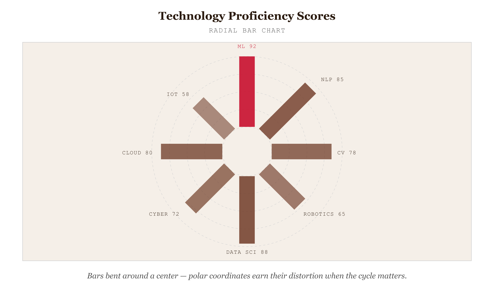
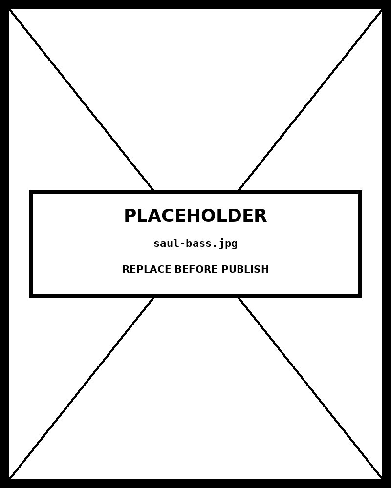

# Radial Bar Chart

*Bars Bent Around a Center — When Polar Coordinates Earn Their Distortion*


*Figure 59.1 — Bars Bent Around a Center — When Polar Coordinates Earn Their Distortion*

## What this chart is

A radial bar chart is a bar chart drawn on a polar coordinate system. Each category is assigned an angular position; the bar extends from a fixed inner radius outward along that angle, and the bar's radial length encodes the quantitative value. A standard bar chart and a radial bar chart represent the same information using the same encoding (bar length), but the geometry is different: the standard chart shares a common baseline, the radial chart shares a common center.

The chart is built from three D3 primitives. An angular scale (`d3.scaleBand` with range `[0, 2π]`) places each category at an angle. A radial scale (`d3.scaleLinear`) maps each value to a radius from inner to outer. Each bar is rendered as a `d3.arc` with a fixed `innerRadius`, a data-driven `outerRadius`, and a small `padAngle` between bars. Concentric grid rings, drawn at value intervals on the radial scale, give the reader a way to estimate values without a separate axis.

## The distortion — why this chart misleads

The honest account begins with the mechanism. In polar coordinates, **arc length equals radius times angle**. Two bars with the same angular width but different radial lengths have outer arcs of different physical lengths in pixels. A bar twice as long radially has an outer arc twice as long — but the *area* the bar covers on the page scales as the square of the radius. A bar at value 100 has roughly four times the visual footprint of a bar at value 50, not twice. The viewer reads area before reading length; area is the more attention-grabbing channel; the chart amplifies the visual prominence of large values beyond their proportional truth.

Stephen Few has been direct about this: a standard bar chart compares values along a shared baseline, which is the most accurate quantitative perceptual channel known. The radial form trades that accuracy for visual interest. That trade is real, and the reader should be told before they buy in.

## When the trade is worth it — and when it is not

The radial form earns its distortion in one situation only: when the underlying data has genuine cyclical structure. Months of the year, hours of the day, days of the week, compass directions, lunar phases — categories whose first and last entries are adjacent in the world, not adjacent only in the chart. A radial bar chart of monthly aid deliveries shows the December–January wrap-around as continuous; a standard bar chart splits it into the two ends of the x-axis with eleven months in between. For cyclical data, the polar layout is informationally more honest than the linear one, and the perceptual cost of arc-length distortion is worth paying.

The form does not earn its distortion in any of these cases: ranking non-cyclical categories (use a standard bar chart), comparing values where precise reading is the task (standard bar chart), more than ~12 categories (the angular bands compress and labels collide), or any context where the reader will use the chart to make a decision rather than form an impression. In those cases the radial form is purely decorative and the bar chart is the right answer.

## What the alternative does better

A horizontal bar chart of the same data, sorted by value, gives the reader length-along-a-shared-baseline — Cleveland and McGill ranked this as the most accurate quantitative encoding humans can read in a static graphic. The viewer can compare any two bars by aligning their endpoints against the value axis, no arc-length distortion to correct for. For ranking, magnitude comparison, and precise value retrieval, the bar chart wins on every perceptual axis. The radial form is justified only when the cyclic structure of the data is a genuine property of the world, and only when communication context (slide deck, dashboard, infographic) values pattern recognition over precise reading.

## Framework reference

> // FRAMEWORK FT Visual Vocabulary: **Comparison — Categorical (cyclical variant)**. Data Visualisation Catalogue: aesthetic-first; the Catalogue's own statement is that "since our visual systems are better at interpreting straight lines, a regular Bar Chart is a better choice for comparing values. The main reason to use a Radial Bar Chart instead is aesthetic." Tufte principle: the polar coordinate system introduces non-data ink (the radial axis distortion). The chart violates the data-ink ratio principle — but if the data is genuinely cyclical, the polar form encodes a property the linear form cannot.

## Prompt

Paste this into Claude Code to generate a working version of this chart, plus its data file. The result will not be a perfect replica — the goal is that the reader can run the prompt, get a chart of this type, and read its source.

```
Generate a complete, self-contained radial bar chart in D3 v7. Two files:

1. `radial-bar-chart.html` — a full HTML page with inline CSS and inline D3 v7 (loaded from `https://cdnjs.cloudflare.com/ajax/libs/d3/7.8.5/d3.min.js`). The chart should fill the viewport, be responsive on resize, support keyboard focus on bars, and include a tooltip on hover that shows the exact value. The page title is "Radial Bar Chart" and the slide subtitle is "Bars Bent Around a Center — When Polar Coordinates Earn Their Distortion".

2. `radial-bar-chart/data.json` — the data file the chart loads via `d3.json("./radial-bar-chart/data.json")`, with a fallback inline literal in the HTML if the fetch fails.

Data shape:
- 8–12 categories with cyclical structure (months, hours, compass directions, days of week). Each entry has a category label and one quantitative value.
  - `category`: string — angular position label
  - `value`: number — radial length

Encoding: angular position by category; radial length by value. Inner radius held constant; outer radius driven by the value scale. Concentric grid rings at sensible value intervals. Use `d3.arc` for each bar, not radial lines. Annotate the chart with a one-line in-chart subtitle that names what the chart shows. Acknowledge the polar distortion in the page subtitle or near the legend if the layout permits.

Style: warm monochrome — black, dark walnut, blood-red accents only. Serif font for body text, JetBrains Mono for labels and controls. No drop shadows, no rounded corners, no gradients. Clean editorial register suitable for a print-ready textbook page.

Provide both files as separate code blocks. Do not explain — just produce the files.
```

> Reference implementation: `d3/59-radial-bar-chart.html`

The original code and data — copy-paste-ready — live at [bearbrown.co](https://www.bearbrown.co/).

---

## AI Wayback Machine

The ideas in this chapter didn't appear from nowhere. **Saul Bass** was a graphic designer best known for film title sequences (*Vertigo*, *Anatomy of a Murder*, *Psycho*) — but his work spanned corporate identity, infographics, and the kind of clean radial layouts that influence chart design to this day. He believed every design choice should carry weight.


*Saul Bass, circa 1965. AI-generated portrait based on a public domain photograph (Wikimedia Commons).*


*Puppet Art by [Nik Bear Brown](https://www.nikbearbrown.com/).*

**Run this:**

```
Who was Saul Bass, and how does his design sensibility connect to the radial bar chart we covered in this chapter? Keep it to three paragraphs. End with the single most surprising thing about his career or ideas.
```

→ Search **"Saul Bass"** on Wikipedia.

**Now make the prompt better.** Try one of these:

- Ask it to apply Bass's reductionist design approach to one specific radial bar chart — what gets cut?
- Ask it about Bass's corporate-identity work for AT&T, United Airlines, and Quaker Oats — and the discipline of designing something that has to scale from billboard to business card.

What changes? What gets better? What gets worse?
