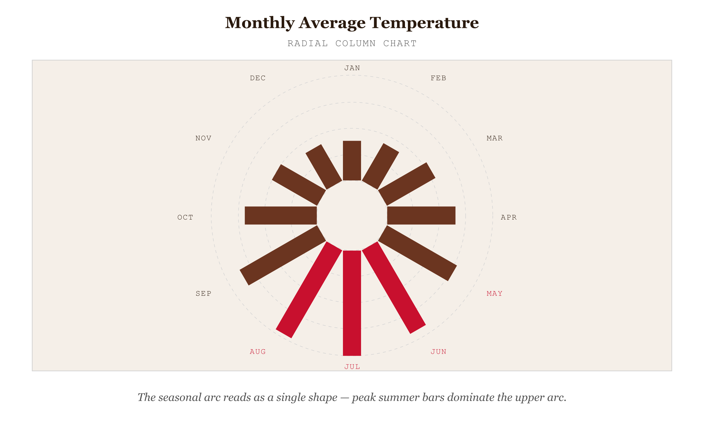
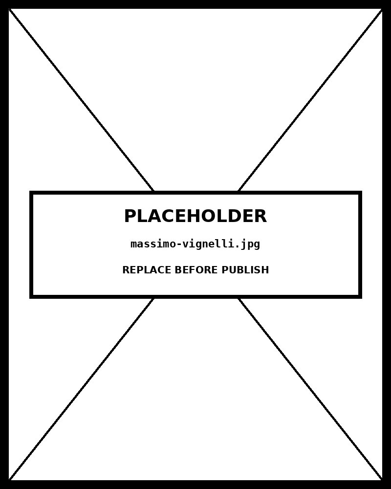

# Radial Column

*The seasonal arc of temperature reads as a single shape — peak summer bars dominate the upper arc*


*Figure 60.1 — The seasonal arc of temperature reads as a single shape*

## What this chart is

A Radial Column Chart maps a standard bar chart onto a polar coordinate system. Each category is assigned an angular position (a radial divider), and its bar extends outward from a central baseline along that angle. The value scale is encoded by concentric circles: the innermost circle represents the lowest scale value (often zero), and each successive circle outward represents a higher value. Bar length — measured radially from the baseline to the bar's outer edge — encodes the quantitative value.

The result is that all bars share a common centre rather than a common baseline. The overall silhouette of the chart — the shape formed by the bar tips — becomes a gestalt encoding of the data's distribution. A symmetric silhouette indicates uniform values; a spiky silhouette reveals outliers; a smooth arc reveals cyclical progression.

## Why it was chosen here

The data has 12 categories (months) with an inherent cyclical order — January follows December, the data wraps. The radial column chart honours this cyclicality: the last bar and first bar are visually adjacent, so the viewer perceives the year as a continuous loop rather than a sequence with an arbitrary start and end.

The seasonal pattern produces a recognisable shape — a broad arc of tall summer bars, a compressed arc of short winter bars — that the viewer reads as a gestalt before reading individual values. This whole-shape perception is only possible because the bars share a common centre rather than a common baseline. For data that genuinely cycles, the radial form earns its coordinate distortion.

## The perceptual cost — and when to pay it

Radial columns suffer a well-documented perceptual distortion: bars further from the centre appear longer than equally-valued bars closer to it, because their outer arc is physically larger. This is the same distortion that makes pie slices and donut segments hard to compare precisely. The viewer's eye misjudges bar length when bars are at different angular positions, because length-along-a-radius is harder to compare than length-along-a-shared-baseline.

This cost is worth paying only when two conditions hold: (1) the data is genuinely cyclical — it wraps, and the adjacency of first and last categories is meaningful; (2) the message is about the overall shape, not precise value comparison between categories. If the message is "July is 18.3°F warmer than February," a standard bar chart delivers that comparison with far less cognitive effort. If the message is "the year forms a smooth temperature arc," the radial chart delivers it in a single glance.

## What the rejected alternative breaks

A standard **Bar Chart** — the direct equivalent — plots the same 12 months as horizontal or vertical bars on a linear axis. It is more precise for value retrieval and supports direct comparison between any two bars. What it loses is the cyclical wrap: December and January appear at opposite ends of the chart, breaking the visual continuity of the seasonal loop. For non-cyclical categorical data, the bar chart is always preferable. The radial form is justified only by the calendar's circularity.

A **Radial Bar Chart** (the close relative) uses concentric arcs rather than radial bars — each category is assigned a ring, and its arc length encodes the value. The Radial Column Chart uses radial bars on shared rings. The distinction: Radial Bar compares categories by arc length (angle), which is harder to read than length; Radial Column uses bar length (radius), which is more legible but still inferior to a linear baseline.

## Prompt

Paste this into Claude Code to generate a working version of this chart, plus its data file. The result will not be a perfect replica — the goal is that the reader can run the prompt, get a chart of this type, and read its source.

```
Generate a complete, self-contained radial column in D3 v7. Two files:

1. `radial-column.html` — a full HTML page with inline CSS and inline D3 v7 (loaded from `https://cdnjs.cloudflare.com/ajax/libs/d3/7.8.5/d3.min.js`). The chart should fill the viewport, be responsive on resize, support keyboard focus on interactive elements, and include a tooltip on hover. The page title is "Radial Column" and the slide subtitle is "The seasonal arc of temperature reads as a single shape — peak summer bars dominate the upper arc".

2. `radial-column/data.json` — the data file the chart loads via `d3.json("./radial-column/data.json")`, with a fallback inline literal in the HTML if the fetch fails.

Data shape:
- Average monthly temperatures (°F) for a fictional mid-latitude northern hemisphere city. 12 categories forming a complete annual cycle. The seasonal arc — low winter values, peak summer values — produces the characteristic radial column silhouette.
  - `label`: string — category label displayed as the radial axis tick and tooltip header. For calendar data: month abbreviation. For any cyclical data: the category name.
  - `value`: number — quantitative value encoded as bar length (radial distance from inner baseline to bar tip). Must be non-negative for standard display.
  - `note`: string — one-line contextual annotation shown in the tooltip. Optional but recommended.

Encoding: use the perceptually honest channel for this chart type (radial column). Do not invent decorative encodings. Annotate the chart with a one-line in-chart subtitle that names what the chart shows. Include an accessibility `<title>` and `<desc>` inside the SVG.

Style: warm monochrome — black, dark walnut, blood-red accents only. Serif font for body text, JetBrains Mono for labels and controls. No drop shadows, no rounded corners, no gradients. Clean editorial register suitable for a print-ready textbook page.

Provide both files as separate code blocks. Do not explain — just produce the files.
```

> Reference implementation: `d3/60-radial-column.html`

The original code and data — copy-paste-ready — live at [bearbrown.co](https://www.bearbrown.co/).

---

## AI Wayback Machine

The ideas in this chapter didn't appear from nowhere. **Massimo Vignelli** designed the 1972 New York City subway map — a strict, geometric, topologically simplified diagram in the lineage of Harry Beck's London Underground map. His radial and grid-aware design philosophy shapes how circular and column-based charts are still composed.


*Massimo Vignelli, circa 1972. AI-generated portrait based on a public domain photograph (Wikimedia Commons).*

**Run this:**

```
Who was Massimo Vignelli, and how does his information design philosophy connect to the radial column chart we covered in this chapter? Keep it to three paragraphs. End with the single most surprising thing about his career or ideas.
```

→ Search **"Massimo Vignelli"** on Wikipedia.

**Now make the prompt better.** Try one of these:

- Ask it to compare Vignelli's 1972 NYC subway map with the geographically accurate 1979 replacement — and where the design community landed.
- Ask it about Vignelli's "design is one" credo — and how it survives in the era of dashboard-driven design.

What changes? What gets better? What gets worse?
