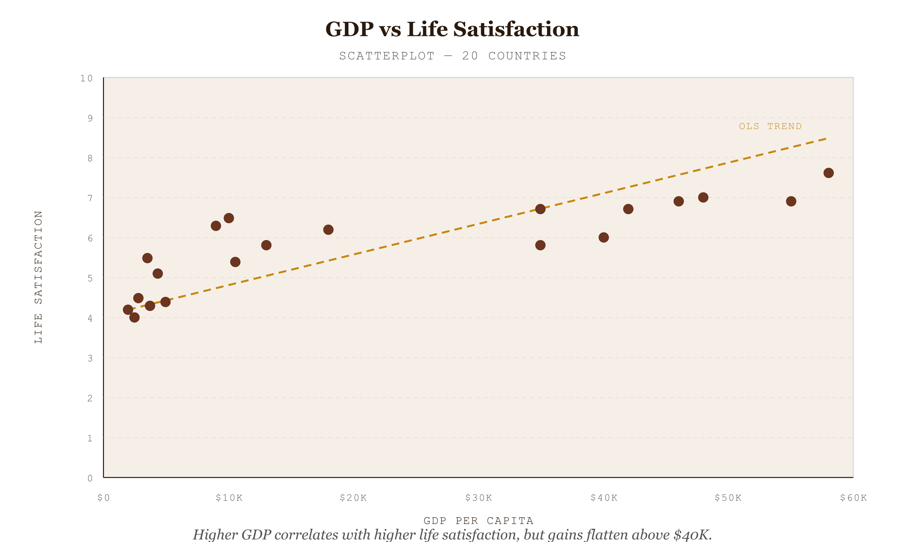
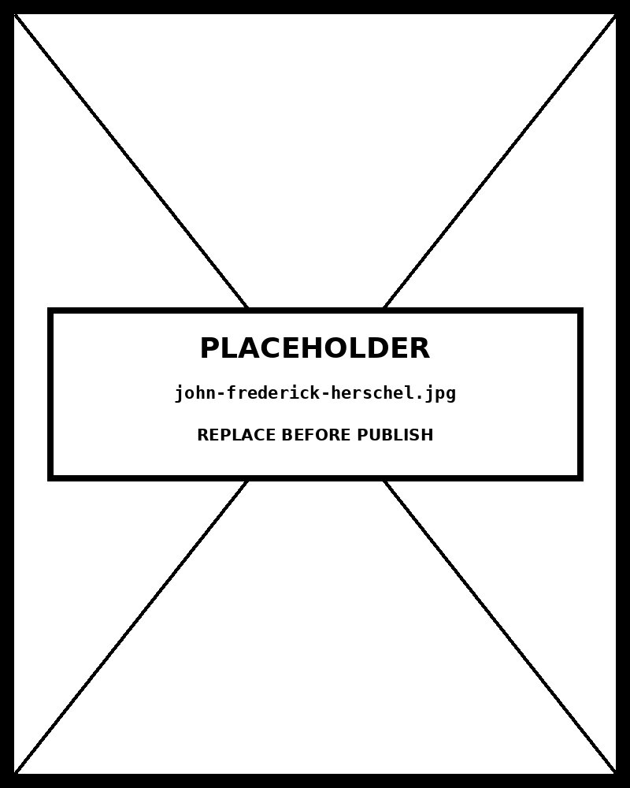

# Scatterplot

*Scatterplot*


*Figure 63.1 — Scatterplot*

## The perceptual mechanism

A scatterplot encodes two quantitative variables simultaneously as **position on two orthogonal axes** — the most accurate perceptual channel available for quantitative data. Each observation becomes a point whose X coordinate encodes one variable and Y coordinate encodes the other. The spatial distribution of the point cloud reveals the **relationship between the two variables** : the viewer's visual system detects the overall slope, clustering, spread, and outliers pre-attentively, before any conscious analysis.

No other chart type answers the question "do these two variables move together?" as directly. A bar chart can show both variables, but not their relationship. A line chart can show one variable over time, but not its relationship to a second. The scatterplot is the only chart built specifically for this task.

## Reading correlation from a scatterplot

**Direction:** a cloud sloping up-right is a positive correlation (both variables increase together); down-right is negative (one rises as the other falls); horizontal or circular is null (no relationship). **Shape:** a straight diagonal band is linear; a curved band may be exponential, logarithmic, or U-shaped — each requiring a different model. **Strength:** a narrow, tight band indicates strong correlation; a wide dispersed cloud indicates weak correlation. **Outliers:** points far from the main cloud are worth naming — they often carry the most analytical value.

This chart computes and displays the **Pearson correlation coefficient (r)** and **R²** live. Pearson r ranges from −1 (perfect negative) to +1 (perfect positive); 0 = no linear relationship. R² is the proportion of variance in Y explained by X under the linear model.

## The trend line and its limits

The dashed trend line is an **Ordinary Least Squares (OLS) linear regression line** — it minimises the sum of squared vertical distances from each point to the line. It is the correct summary of a linear relationship and can be used for interpolation within the observed range. Three things it cannot do: extrapolate reliably beyond the data range; detect non-linear relationships (a curved trend would require a polynomial or log model); or prove causation.

⚠ Correlation is not causation. A strong Pearson r means the two variables move together — it does not mean one causes the other. A third unobserved variable (a *confounder* ) may be driving both. This is not a limitation of the chart type; it is a fundamental principle of statistical inference that must be stated whenever correlation is presented.

## Why it was chosen for this data

The dataset is **paired numerical observations across named entities** (countries), where the message is a bivariate relationship — does economic wealth predict longevity? The scatterplot is the only correct chart for this question. A bar chart of GDP and a separate bar chart of life expectancy would show both variables but hide their relationship entirely. The scatterplot shows the positive correlation, the logarithmic saturation at high GDP, and the outliers (USA: high GDP, lower life expectancy than peers; Nigeria: low on both) all at once.

## The one design decision worth knowing

The **brush selection** (drag on the chart) isolates a rectangular region of the point cloud and recomputes Pearson r and R² for only the selected points. This is not a decoration — it is the correct way to investigate whether correlation holds within a sub-range, or whether a different relationship structure operates in one part of the space (e.g., among high-income countries only). Local correlation analysis is how scatterplots graduate from presentation to analysis.

## Framework reference

> // Framework — FT Visual Vocabulary FT Visual Vocabulary category: Correlation — "Showing the relationship between two or more variables." Abela quadrant: Relationship (variables against each other). Tufte principle applied: the point cloud is all data; the trend line summarises it; the axis labels name it. No legend is needed for the primary encoding — position is self-explaining. Colour is added only for secondary grouping, always with a redundant text label.

## Prompt

Paste this into Claude Code to generate a working version of this chart, plus its data file. The result will not be a perfect replica — the goal is that the reader can run the prompt, get a chart of this type, and read its source.

```
Generate a complete, self-contained scatterplot in D3 v7. Two files:

1. `scatterplot.html` — a full HTML page with inline CSS and inline D3 v7 (loaded from `https://cdnjs.cloudflare.com/ajax/libs/d3/7.8.5/d3.min.js`). The chart should fill the viewport, be responsive on resize, support keyboard focus on interactive elements, and include a tooltip on hover. The page title is "Scatterplot" and the slide subtitle is "Scatterplot".

2. `scatterplot/data.json` — the data file the chart loads via `d3.json("./scatterplot/data.json")`, with a fallback inline literal in the HTML if the fetch fails.

Data shape:
- Paired numerical data for scatterplot. Each record has two quantitative variables (x, y), an optional size variable for bubble encoding, and an optional group for colour coding. The chart computes the linear regression trend line from the data — do not pre-compute it.
  - `label`: string — point label shown in tooltip and optionally on hover
  - `x`: number — horizontal axis variable
  - `y`: number — vertical axis variable
  - `group`: string (optional) — colour category
  - `note`: string (optional) — additional tooltip context

Encoding: use the perceptually honest channel for this chart type (scatterplot). Do not invent decorative encodings. Annotate the chart with a one-line in-chart subtitle that names what the chart shows. Include an accessibility `<title>` and `<desc>` inside the SVG.

Style: warm monochrome — black, dark walnut, blood-red accents only. Serif font for body text, JetBrains Mono for labels and controls. No drop shadows, no rounded corners, no gradients. Clean editorial register suitable for a print-ready textbook page.

Provide both files as separate code blocks. Do not explain — just produce the files.
```

> Reference implementation: `d3/63-scatterplot.html`

The original code and data — copy-paste-ready — live at [bearbrown.co](https://www.bearbrown.co/).

---

## AI Wayback Machine

The ideas in this chapter didn't appear from nowhere. **John Frederick Herschel** drew what is generally credited as the first scatter plot, in 1833, plotting orbits of double stars — predating Galton's well-known parents-and-children height scatter by half a century.


*John Frederick Herschel, circa 1860. AI-generated portrait based on a public domain photograph (Wikimedia Commons).*

**Run this:**

```
Who was John Frederick Herschel, and how does his early scatter plot connect to the chart we covered in this chapter? Keep it to three paragraphs. End with the single most surprising thing about his career or ideas.
```

→ Search **"John Herschel"** on Wikipedia.

**Now make the prompt better.** Try one of these:

- Ask it to describe Herschel's 1833 double-star scatter — what each axis encoded, and what insight it revealed.
- Ask it about Herschel's wider career — coining "photography," "positive" and "negative" for images, and his work on chemistry of light.

What changes? What gets better? What gets worse?
