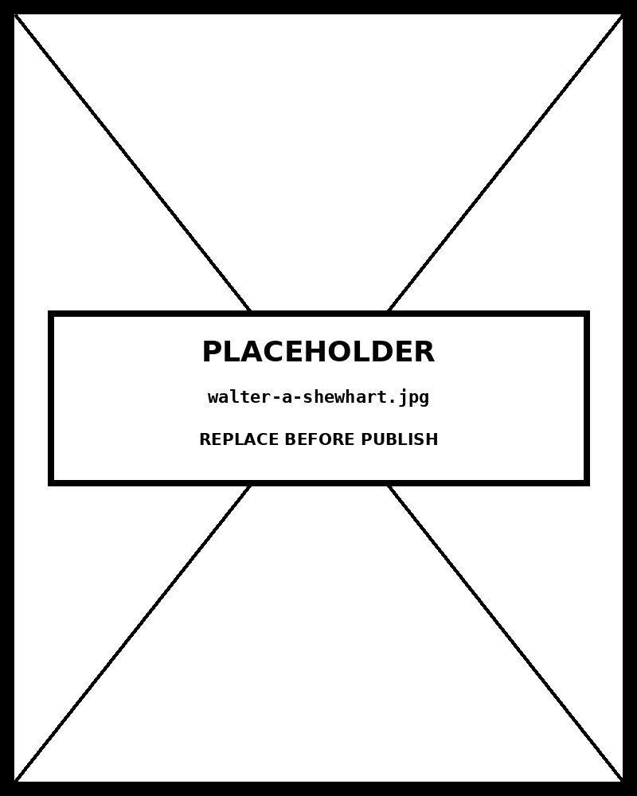

# Span Chart

*Crisis domains span the threshold — best models clear it, worst miss by 30+ points*


## What this chart is

A Span Chart (also Range Bar, Floating Bar, High-Low Graph) draws a bar that floats between a minimum and maximum value for each category. Unlike a bar chart, *there is no zero baseline* — the left edge of each bar is the minimum, and the right edge is the maximum. Both values, their difference (the span), and the bar's position on the axis carry information simultaneously. The viewer can read: **where does this range sit?** (bar position) and **how wide is the range?** (bar length). A reference line cuts through all bars, allowing the reader to see which ranges straddle a threshold and which sit entirely above or below it.

## Why it was chosen here

The data describes performance variation across AI models — a story that requires showing *both extremes and their relationship* to a deployment threshold. A standard bar chart can only show one value per category (the max, or the mean) and would conceal the worst-case performance entirely. A dot plot with two dots per category would work but loses the immediate visual reading of span width. The span chart makes both the *level* of performance and the *consistency* of performance readable simultaneously — which is exactly the analytical question a deployment decision requires.

## What this chart hides

Span charts show only the two extreme values. They give **no information about the distribution between min and max** : whether most models cluster near the top, near the bottom, or scatter evenly. A wide span could mean all models are mediocre except one outlier at each end, or it could mean models genuinely vary across the full range. Without that context, the span chart can mislead — a single *outlier* at the minimum drags the bar left without representing typical performance. When distribution matters, a Box & Whisker Plot is the correct upgrade: it adds the median and quartiles while preserving the min-max span.

## Framework reference & the one decision worth knowing

**The one decision worth knowing:** bars animate from the *midpoint outward* , not from the left edge rightward. This is not cosmetic. Animating from zero or the left would imply a start-to-end directionality the data does not have. Expanding symmetrically from the centre makes the visual argument: uncertainty (range) grows around a central estimate — which is the correct mental model for a min-max range.

## Framework reference

> // FT Visual Vocabulary + Abela FT Visual Vocabulary: Distribution — Range .
            Abela quadrant: Comparison — comparing ranges across
            categories. Tufte: the floating bar is honest about its baseline
            absence — it would be wrong to extend bars to zero, which would imply
            that zero is the lower bound when the data's minimum is 33.

## Prompt

Paste this into Claude Code to generate a working version of this chart, plus its data file. The result will not be a perfect replica — the goal is that the reader can run the prompt, get a chart of this type, and read its source.

```
Generate a complete, self-contained span chart in D3 v7. Two files:

1. `span-chart.html` — a full HTML page with inline CSS and inline D3 v7 (loaded from `https://cdnjs.cloudflare.com/ajax/libs/d3/7.8.5/d3.min.js`). The chart should fill the viewport, be responsive on resize, support keyboard focus on interactive elements, and include a tooltip on hover. The page title is "Span Chart" and the slide subtitle is "Crisis domains span the threshold — best models clear it, worst miss by 30+ points".

2. `span-chart/data.json` — the data file the chart loads via `d3.json("./span-chart/data.json")`, with a fallback inline literal in the HTML if the fetch fails.

Data shape:
- Range dataset. Each item has a min and max — the span chart draws a floating bar between them. Zero is not the baseline. Items are sorted by midpoint descending by default.
  - `title`: string — chart headline
  - `unit`: string — x-axis label
  - `xDomain`: [number, number] — explicit x-axis extent (do not truncate; choose a range that gives context to the floating bars)
  - `referenceLines[].value`: number — x-axis position of a vertical reference marker
  - `referenceLines[].label`: string — annotation text for the reference line
  - `items[].id`: string — unique identifier
  - `items[].label`: string — category label (displayed on y-axis)
  - `items[].min`: number — lower bound of the range
  - `items[].max`: number — upper bound of the range

Encoding: use the perceptually honest channel for this chart type (span chart). Do not invent decorative encodings. Annotate the chart with a one-line in-chart subtitle that names what the chart shows. Include an accessibility `<title>` and `<desc>` inside the SVG.

Style: warm monochrome — black, dark walnut, blood-red accents only. Serif font for body text, JetBrains Mono for labels and controls. No drop shadows, no rounded corners, no gradients. Clean editorial register suitable for a print-ready textbook page.

Provide both files as separate code blocks. Do not explain — just produce the files.
```

The original code and data — copy-paste-ready — live at [bearbrown.co](https://www.bearbrown.co/).

---

## AI Wayback Machine

The ideas in this chapter didn't appear from nowhere. **Walter A. Shewhart** invented the control chart at Bell Labs in 1924 — a span-style chart with mean lines and tolerance bands that turned statistical quality control into a discipline. The chart family includes the span chart you're learning here.


*Walter A. Shewhart, circa 1935. AI-generated portrait based on a public domain photograph (Wikimedia Commons).*

**Run this:**

```
Who was Walter A. Shewhart, and how does his control chart connect to the span chart we covered in this chapter? Keep it to three paragraphs. End with the single most surprising thing about his career or ideas.
```

→ Search **"Walter A. Shewhart"** on Wikipedia.

**Now make the prompt better.** Try one of these:

- Ask it to walk through how Shewhart's 1924 control chart distinguished common-cause variation from special-cause variation.
- Ask it about Shewhart's influence on W. Edwards Deming and on postwar Japanese manufacturing.

What changes? What gets better? What gets worse?
