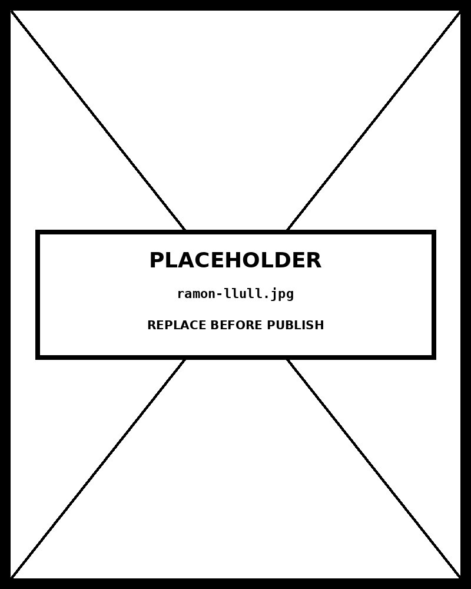

# Spiral Plot

*Q4 Peak, Q2 Trough — The Seasonal Pattern Intensifies Year-Over-YearInner arm = 2021  ·  Outer arm = 2024  ·  Bars colored by month*


## What this chart is

A spiral plot maps time-series data along an **Archimedean spiral** : a curve defined by `r = a + bθ` , where r is the radius from center and θ is the angle. Each period (month) occupies an equal angular increment ( `2π ÷ periodsPerCycle` ), and the spiral grows outward with each complete revolution. The perceptual mechanism is **angular alignment** : because each cycle occupies exactly one revolution, the same period in different cycles appears at the *same angle* in every arm. The viewer scans radially outward and sees whether April (right side) is always short — confirming a seasonal trough — without mentally aligning separate lines from different years.

## Why it cannot be a line chart

A standard time-series line chart over 48 months shows the trend clearly — but to confirm periodicity, the viewer must mentally fold the line back on itself every 12 months and check whether peaks align. That is a **non-trivial cognitive task** performed entirely in working memory. The spiral performs that folding physically: the chart is already organized so that the same month in 2021, 2022, 2023, and 2024 occupies the same angular position. The periodic structure is *encoded in the layout* , not left as an inference task for the viewer. The cost: radial distance from center is harder to compare precisely than bar length along a common baseline. The spiral trades **precise value reading for structural pattern visibility** .

## The Archimedean choice

The spiral used here is **Archimedean** (equidistant spacing between arms), not logarithmic or Fermat's. Equidistant arm spacing means each year's ring has the same radial depth — the same maximum bar height is available for every year. A logarithmic spiral would compress inner years and expand outer years, visually underweighting early data. An equidistant spiral is the **honest geometric choice** when all cycles contain equally important data. The implementation uses `r_i = innerR + (i ÷ periodsPerCycle) × armSpacing` , giving each year exactly `armSpacing` pixels of radial depth, regardless of absolute data magnitude.

## Seasonal pattern vs. trend

The spiral simultaneously shows two temporal signals: the **within-cycle seasonal pattern** (which months peak, which trough) and the **across-cycle trend** (do bars at the same angle grow larger in each successive arm?). In this dataset, both are visible. The Q4 cluster (Oct–Dec, top-left quadrant) grows taller arm by arm — the seasonal peak intensifies. April bars (right side) also grow but remain the shortest at each arm — the seasonal trough persists. A line chart with a 12-month moving average would show the trend but flatten the seasonality. A seasonal decomposition chart would separate both signals but destroy their geometric relationship.

## Prompt

Paste this into Claude Code to generate a working version of this chart, plus its data file. The result will not be a perfect replica — the goal is that the reader can run the prompt, get a chart of this type, and read its source.

```
Generate a complete, self-contained spiral plot in D3 v7. Two files:

1. `spiral-plot.html` — a full HTML page with inline CSS and inline D3 v7 (loaded from `https://cdnjs.cloudflare.com/ajax/libs/d3/7.8.5/d3.min.js`). The chart should fill the viewport, be responsive on resize, support keyboard focus on interactive elements, and include a tooltip on hover. The page title is "Spiral Plot" and the slide subtitle is "Q4 Peak, Q2 Trough — The Seasonal Pattern Intensifies Year-Over-YearInner arm = 2021  ·  Outer arm = 2024  ·  Bars colored by month".

2. `spiral-plot/data.json` — the data file the chart loads via `d3.json("./spiral-plot/data.json")`, with a fallback inline literal in the HTML if the fetch fails.

Data shape:
- Monthly humanitarian aid disbursements (USD millions), 2021–2024. 48 data points: 4 cycles × 12 periods. Fictional placeholder with realistic seasonal pattern and year-over-year growth. Q4 peaks and Q2 troughs produce aligned radial features across spiral arms — the pattern the chart is designed to reveal.
  - `periodsPerCycle`: integer — number of periods per revolution (12 = monthly)
  - `periodLabels`: array of strings — short label for each period (Jan–Dec)
  - `cycleLabels`: array of strings — label for each cycle/revolution (years)
  - `periodColors`: array of 12 hex strings — color per period, must match periodLabels length
  - `valueLabel`: string — y-axis / value description for tooltip
  - `records[].cycle`: integer — 0-based cycle index (0=2021, 1=2022, ...)
  - `records[].period`: integer — 0-based period index within cycle (0=Jan, ...)
  - `records[].label`: string — human-readable label for tooltip
  - `records[].value`: number — the value to plot as bar height

Encoding: use the perceptually honest channel for this chart type (spiral plot). Do not invent decorative encodings. Annotate the chart with a one-line in-chart subtitle that names what the chart shows. Include an accessibility `<title>` and `<desc>` inside the SVG.

Style: warm monochrome — black, dark walnut, blood-red accents only. Serif font for body text, JetBrains Mono for labels and controls. No drop shadows, no rounded corners, no gradients. Clean editorial register suitable for a print-ready textbook page.

Provide both files as separate code blocks. Do not explain — just produce the files.
```

The original code and data — copy-paste-ready — live at [bearbrown.co](https://www.bearbrown.co/).

---

## AI Wayback Machine

The ideas in this chapter didn't appear from nowhere. **Ramon Llull**, a 13th-century Catalan philosopher, built rotating concentric paper wheels that combined attributes by spinning the inner disk against the outer. Each rotation produced a new conjunction of categories. His *Ars Magna* (c. 1305) is the oldest known mechanical combinatorial visualization — and the conceptual ancestor of every spiral plot that wraps a time series around a center to make cycles visible.


*Ramon Llull, 13th century. AI-generated illustration based on a public domain painting (Wikimedia Commons).*

**Run this:**

```
Who was Ramon Llull, and how do his combinatorial wheels connect to the spiral-plot form we covered in this chapter? Keep it to three paragraphs. End with the single most surprising thing about his career or ideas.
```

→ Search **"Ramon Llull Ars Magna combinatorial wheels"** on Wikipedia. See what the model got right, got wrong, or left out.

**Now make the prompt better.** Try one of these:

- Ask it to walk through how Llull's rotating wheels (one rotation = one new combination) map onto a spiral plot's rotation-per-period rule.
- Ask it to compare Llull's medieval combinatorial machine with a modern spiral plot of monthly electricity consumption — what reading task each supports.

What changes? What gets better? What gets worse?
