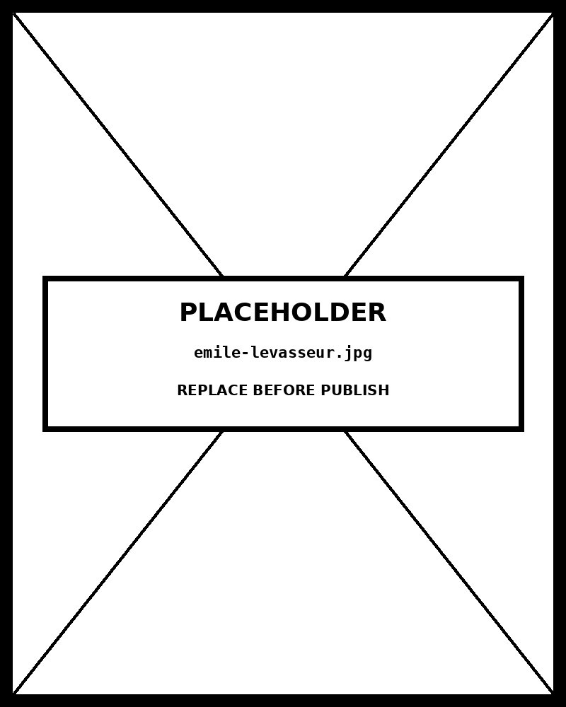

# Stacked Area

*Food Security Anchors 47% of All Funding — Shelter Surged in Mid-2022 Then Normalised as Ukraine Emergency Peaked*


## What this chart is

A stacked area chart renders multiple time series as filled regions stacked vertically. Each series begins where the previous one ends — not at zero. The result is that the total height of all layers at any point in time equals the sum of all series values. The viewer simultaneously reads two quantities: the total (the height of the uppermost boundary) and the composition (the relative thickness of each layer). This dual encoding is the defining capability of the stacked area form.

In D3, the stacking is computed by `d3.stack()` , which takes an array of data objects and a set of keys and returns a layered structure where each element contains `[y0, y1]` values — the bottom and top of each bar at each time step. The `d3.area()` generator then maps these to SVG path data, using `y0` as the area floor and `y1` as the ceiling. The `d3.stackOffsetExpand` offset normalizes all values to sum to 1, enabling the 100% stacked view.

## Why it was chosen here

The message has two simultaneous parts: total humanitarian funding grew from ~$880M/month to a peak of ~$1.14B/month, and within that growing total, the composition shifted — Shelter & NFI surged sharply in mid-2022 (Ukraine emergency) then contracted, while WASH grew modestly and steadily, and Food Security maintained its dominant share throughout. A line chart can show either the total trend or individual sector trends, but not both simultaneously at the same scale. A bar chart can show composition at individual months but loses the continuous flow. The stacked area encodes both stories in one mark.

The 100% view toggle adds a second reading mode: stripping out the total trend to focus purely on composition shifts over time. When normalized, the question changes from "how much?" to "what share?" — and the Shelter spike in mid-2022 becomes dramatically visible as a proportional shift, not just an absolute one.

## The core limitation — and what it cannot show

Only the bottom series (Food Security) has a common baseline of zero. Every other series floats — its bottom edge is not zero but the accumulated total of all layers below it. This means precise comparison of an upper series across time requires the viewer to estimate two values (the y position of the floor and ceiling) and subtract them, which is less accurate than reading a single position on a common scale. A WASH funding drop from October 2022 to November 2022 would be much easier to read in a line chart or small-multiples view, where the WASH line would have its own baseline.

The stacked form also cannot handle negative values. If any series had negative funding (a deficit, a withdrawal), the stacking would break down geometrically. For datasets with negative components, a grouped bar chart or diverging stacked bar chart is required.

## What the alternatives lose

A **stream graph** (the same chart with `d3.stackOffsetWiggle` ) would center the stack on a baseline that shifts over time, creating an organic, flowing shape. Stream graphs reduce the visual dominance of large series at the cost of making it impossible to read any absolute values or the total. They are optimised for pattern and shape recognition, not for reading specific quantities. For a funding dataset where the total and individual sector values need to be communicated, a stream graph would be the wrong choice.

A **small-multiples line chart** (one panel per sector) would allow precise reading of each sector's trend independently, with each line on its own baseline. It would lose the total and lose the compositional relationship between sectors — the viewer cannot easily see that Shelter's surge came at the expense of other sectors' share. When the relationship between parts is the story, not just each part individually, the stacked form is the correct tool.

// design decision — Food Security at the bottom of the stack The series ordering in a stacked area chart determines which series has the most legible baseline. The bottom series rests on zero — a common, fixed anchor — making its values directly readable from the x-axis. All other series float. The decision to place Food Security (the largest, most analytically important sector) at the bottom ensures that the most critical data occupies the most accurately readable position. Protection (smallest, least precisely read) is placed at the top where its floating baseline causes the least analytical damage. This is the correct ordering strategy for any stacked area chart: put the most important series at the bottom where it has a zero baseline, and the least critical series at the top.

## Framework reference

> // framework — FT Visual Vocabulary The FT Visual Vocabulary places stacked area charts at the intersection of Change Over Time and Part-to-Whole . Its decision rule: use a stacked area when the total is meaningful and you want both total trend and composition over time. Use a line chart when precise individual series comparison is the priority and the total is secondary. Use a stream graph when pattern and aesthetic flow matter more than readable quantities.

## Prompt

Paste this into Claude Code to generate a working version of this chart, plus its data file. The result will not be a perfect replica — the goal is that the reader can run the prompt, get a chart of this type, and read its source.

```
Generate a complete, self-contained stacked area in D3 v7. Two files:

1. `stacked-area.html` — a full HTML page with inline CSS and inline D3 v7 (loaded from `https://cdnjs.cloudflare.com/ajax/libs/d3/7.8.5/d3.min.js`). The chart should fill the viewport, be responsive on resize, support keyboard focus on interactive elements, and include a tooltip on hover. The page title is "Stacked Area" and the slide subtitle is "Food Security Anchors 47% of All Funding — Shelter Surged in Mid-2022 Then Normalised as Ukraine Emergency Peaked".

2. `stacked-area/data.json` — the data file the chart loads via `d3.json("./stacked-area/data.json")`, with a fallback inline literal in the HTML if the fetch fails.

Data shape:
- Monthly humanitarian funding by sector, Jan 2022–Dec 2024 (simulated). Five series stacked to show both sectoral composition and total trend. Replace with any multi-series time data where components are additive and non-negative.
  - `series`: array of string keys — defines stack order (bottom to top) and legend order
  - `series_labels[key]`: string, human-readable label shown in legend and right-edge annotation
  - `series_colors[key]`: string, hex fill color for each series area
  - `data[].date`: string, ISO month YYYY-MM — parsed as d3.timeParse('%Y-%m')
  - `data[].[key]`: number, funding in USD millions for that sector in that month

Encoding: use the perceptually honest channel for this chart type (stacked area). Do not invent decorative encodings. Annotate the chart with a one-line in-chart subtitle that names what the chart shows. Include an accessibility `<title>` and `<desc>` inside the SVG.

Style: warm monochrome — black, dark walnut, blood-red accents only. Serif font for body text, JetBrains Mono for labels and controls. No drop shadows, no rounded corners, no gradients. Clean editorial register suitable for a print-ready textbook page.

Provide both files as separate code blocks. Do not explain — just produce the files.
```

The original code and data — copy-paste-ready — live at [bearbrown.co](https://www.bearbrown.co/).

---

## AI Wayback Machine

The ideas in this chapter didn't appear from nowhere. **Émile Levasseur** was a 19th-century French economic geographer who produced some of the first stacked-area charts of national production and trade — building the form that would later become the streamgraph and the modern stacked area chart.


*Émile Levasseur, circa 1880. AI-generated portrait based on a public domain photograph (Wikimedia Commons).*

**Run this:**

```
Who was Émile Levasseur, and how does his stacked-area work connect to the chart we covered in this chapter? Keep it to three paragraphs. End with the single most surprising thing about his career or ideas.
```

→ Search **"Émile Levasseur"** on Wikipedia.

**Now make the prompt better.** Try one of these:

- Ask it to walk through how a stacked-area chart can mislead about category trends — and what design choices reduce that risk.
- Ask it about Levasseur's role in the early statistical-atlas tradition that produced the US Census atlases of the 1870s.

What changes? What gets better? What gets worse?
