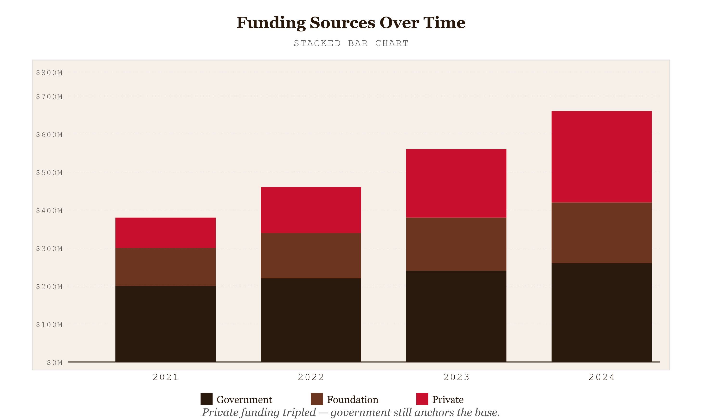
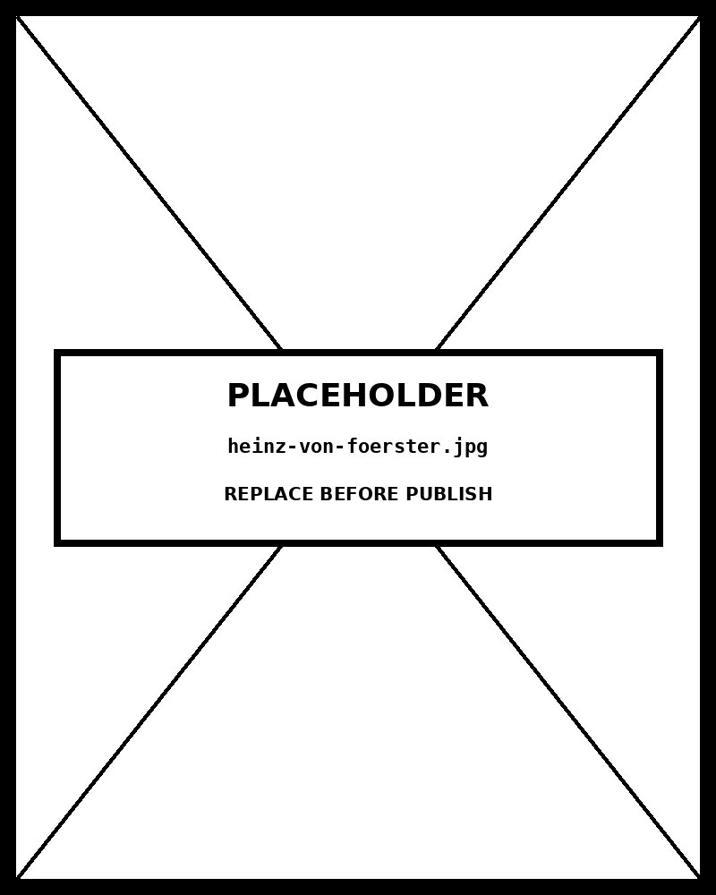

# Stacked Bar

*Private funding tripled in two years —but government still anchors the base*

*Figure 67.1 — Private funding tripled — government still anchors the base*



## What this chart is

A stacked bar chart divides each bar into sequential segments representing subcategories of a total. Each bar's full height encodes the total value; each segment's height encodes its contribution. Unlike a grouped bar chart — which places subcategory bars side-by-side — stacking preserves the total while showing composition.

The two variants serve different analytical goals. The **absolute stacked chart** (default) answers "how much, and how is it made up?" The **100% stacked chart** (toggle above) answers "what is the proportional composition, independent of size?" They use identical data but answer different questions.

## The baseline problem

The stacked chart's structural flaw is that only the bottom segment sits on a common zero baseline. Every other segment has a different starting point in every bar, making direct comparison of non-bottom segments perceptually unreliable. The eye cannot accurately judge if the "Private Foundation" segment in 2022 is larger or smaller than in 2023 without reading the tooltip.

This is why segment order matters: put the category most important to compare at the bottom. Here, Government anchors the base — it's the largest and most stable, so its trend is easy to read. Private Foundation is second because its dramatic growth is the key story.

## When to use absolute vs 100%

Use the **absolute view** when the total matters — when the viewer needs to know that overall investment tripled, not just that composition shifted. The total bar height carries real information that the 100% view discards.

Use the **100% view** when you want to isolate compositional change from volume change. In the 100% view, Government's declining share is visible even though its absolute dollar value grew every year. Both facts are true; the chart choice determines which fact is foregrounded.

## When to use alternatives

If comparing subcategory values across bars is the primary task, a stacked bar chart will always underperform. The correct alternatives: a **grouped bar chart** (each subcategory gets its own bar, enabling direct comparison), a **small multiples line chart** (one panel per category showing its trend), or a **slope chart** (comparing start and end points without intermediate clutter).

The stacked bar earns its place specifically when *both* the total and the composition matter simultaneously — which is exactly the case here, where the tripling of total investment and the structural shift in who provides it are both the story.

## Prompt

Paste this into Claude Code to generate a working version of this chart, plus its data file. The result will not be a perfect replica — the goal is that the reader can run the prompt, get a chart of this type, and read its source.

```
Generate a complete, self-contained stacked bar in D3 v7. Two files:

1. `stacked-bar.html` — a full HTML page with inline CSS and inline D3 v7 (loaded from `https://cdnjs.cloudflare.com/ajax/libs/d3/7.8.5/d3.min.js`). The chart should fill the viewport, be responsive on resize, support keyboard focus on interactive elements, and include a tooltip on hover. The page title is "Stacked Bar" and the slide subtitle is "Private funding tripled in two years —but government still anchors the base".

2. `stacked-bar/data.json` — the data file the chart loads via `d3.json("./stacked-bar/data.json")`, with a fallback inline literal in the HTML if the fetch fails.

Data shape:
- Humanitarian AI program funding by source, 2020–2024. Each record is one bar (one year). Each category field is a numeric segment value. The chart supports both absolute stacking (total investment) and 100% stacking (proportional composition).
  - `categories[].id`: string — key matching data record fields
  - `categories[].label`: string — legend and tooltip label
  - `categories[].color`: string — hex fill color for this segment
  - `categories[].desc`: string — shown in tooltip
  - `data[].year`: string — bar label on x-axis
  - `data[].{categoryId}`: number — funding value for this category in this year
  - `data[].note`: string — optional annotation shown in bar tooltip

Encoding: use the perceptually honest channel for this chart type (stacked bar). Do not invent decorative encodings. Annotate the chart with a one-line in-chart subtitle that names what the chart shows. Include an accessibility `<title>` and `<desc>` inside the SVG.

Style: warm monochrome — black, dark walnut, blood-red accents only. Serif font for body text, JetBrains Mono for labels and controls. No drop shadows, no rounded corners, no gradients. Clean editorial register suitable for a print-ready textbook page.

Provide both files as separate code blocks. Do not explain — just produce the files.
```

Reference implementation: [`d3/67-stacked-bar.html`](../d3/67-stacked-bar.html)

The original code and data — copy-paste-ready — live at [bearbrown.co](https://www.bearbrown.co/).

---

## AI Wayback Machine

The ideas in this chapter didn't appear from nowhere. **Heinz von Foerster** was a cyberneticist who pushed information visualization into circular and stacked forms during the 1960s — and led the Biological Computer Laboratory at Illinois, an early home of second-order cybernetics and visual reasoning about complex systems.


*Heinz von Foerster, circa 1970. AI-generated portrait based on a public domain photograph (Wikimedia Commons).*

**Run this:**

```
Who was Heinz von Foerster, and how does his cybernetics work connect to the stacked bar chart we covered in this chapter? Keep it to three paragraphs. End with the single most surprising thing about his career or ideas.
```

→ Search **"Heinz von Foerster"** on Wikipedia.

**Now make the prompt better.** Try one of these:

- Ask it to apply von Foerster's "second-order" framing — observers in the system — to the design of a stacked bar chart.
- Ask it about the Biological Computer Lab — what it set out to do, why it shut down, and what survived.

What changes? What gets better? What gets worse?
