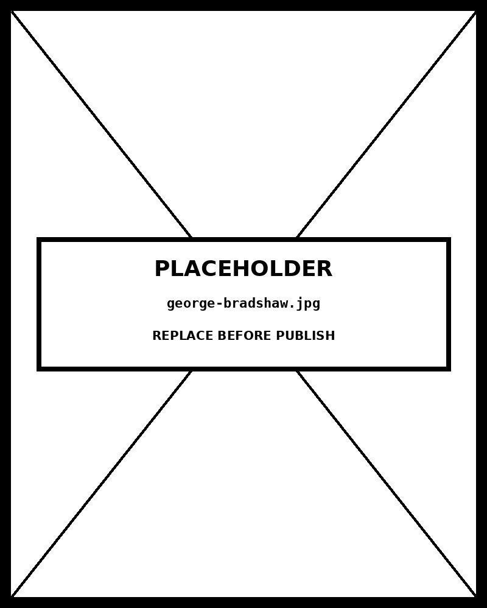

# Timetable

*Monday: Garissa–Mandera Convoy Delayed, Western Corridor Cancelled — Northeast Services Run Concurrent Requiring Coordination*


## What this chart is

A timetable organises scheduled events along a time axis and a categorical axis (routes, rooms, people, vehicles). The Data Visualisation Catalogue describes it as a reference and management tool — its primary function is lookup, not pattern discovery. This visual form is a specific interpretation: a Gantt-style timetable where bars encode duration as width rather than simply listing departure and arrival times in text cells.

In D3, the time axis is a `d3.scaleTime()` with a synthetic date domain — all events are normalised to the same calendar date (2024-01-01) so only the hour and minute matter. Each row is a `d3.scaleBand()` slot. Convoy bars are `<rect>` elements positioned at `xScale(parseTime(departure))` with width `xScale(arrival) - xScale(departure)` . This pixel-precise mapping is what standard spreadsheet timetables cannot provide: a 4h15m convoy bar is visually 15 minutes wider than a 4h00m bar.

## Visual timetable vs. text timetable — what each is for

A text timetable (the form used for train schedules in printed books) is superior when users need to look up a specific departure time. Scan to the route row, scan to the time column, read the cell. The lookup is O(1) with a trained eye. A visual timetable is superior when users need to see *patterns across routes* : which routes overlap in ways that create vehicle conflicts; where the morning window is underused; how long each route takes relative to its neighbours. Monday's timetable makes it immediately visible that routes r2 and r3 both operate through the 07:00–14:00 window — potential competition for the same relay vehicles — which would be invisible in a text table.

The two forms answer different questions. "When does the next Garissa convoy leave?" is a text-table question. "Is there a gap in Northeast coverage between 14:00 and 17:00?" is a visual-timetable question. The chart here was built for the second question — an operations planner scanning for gaps, overlaps, and cancellation patterns — not for passengers checking departure boards.

## What D3 enables that standard tools cannot

Google Docs, Excel, and Apple Numbers render timetables as fixed-cell grids. A 1-hour convoy and a 6-hour convoy both occupy one cell. D3's continuous time scale maps duration to pixels precisely — the Northwest Lodwar convoy (12 hours, 06:00–18:00) takes up 85% of the row width, and this is immediately legible as a full-day commitment without reading any numbers. Status encoding (opacity for completed, amber border for delayed, dashed border for cancelled) layers operational intelligence onto the schedule without adding columns. Hover tooltips surface detailed notes. Day and type filters reduce noise to the relevant slice. None of this is available in standard table tools.

## The baseline question for timetables

Unlike bar charts, timetable bars should not start at zero — they start at the departure time. The axis baseline is the opening of the operational window (06:00 here), not zero. This is the correct approach: a bar starting at 06:00 means the convoy leaves at 06:00; starting at 00:00 would mean the entire time between midnight and departure is visually wasted space. The left edge of each bar is its scheduled departure; the right edge is its estimated arrival. Length = duration. This is semantically correct and visually efficient.

// design decision — time-of-day scale, not calendar date scale The x-axis uses d3.scaleTime() with domain [new Date(2024,0,1,6,0), new Date(2024,0,1,20,0)] — an arbitrary single date where only hours and minutes carry information. All convoy departure and arrival strings are parsed by prepending this same date. The day selector swaps which subset of convoys is drawn, but the time axis never changes. This separation of day from time-of-day is the correct abstraction for operational timetables: the axis represents the rhythm of a day, and the day selector represents which calendar day's data is displayed. Using a multi-day time scale would make the chart a timeline rather than a timetable.

## Framework reference

> // framework — FT Visual Vocabulary The FT Visual Vocabulary places timetables and Gantt charts in its Change Over Time category as a reference subtype. Its guidance on the table vs. visual distinction: use a text table when precise value lookup is the primary task; use a visual form when relative duration, overlap, or pattern across multiple entities is the analytical goal. The timetable is the only major chart type in the FT Visual Vocabulary that is explicitly described as a reference tool rather than an insight tool — the distinction matters for design decisions about density, precision, and interaction.

## Prompt

Paste this into Claude Code to generate a working version of this chart, plus its data file. The result will not be a perfect replica — the goal is that the reader can run the prompt, get a chart of this type, and read its source.

```
Generate a complete, self-contained timetable in D3 v7. Two files:

1. `timetable.html` — a full HTML page with inline CSS and inline D3 v7 (loaded from `https://cdnjs.cloudflare.com/ajax/libs/d3/7.8.5/d3.min.js`). The chart should fill the viewport, be responsive on resize, support keyboard focus on interactive elements, and include a tooltip on hover. The page title is "Timetable" and the slide subtitle is "Monday: Garissa–Mandera Convoy Delayed, Western Corridor Cancelled — Northeast Services Run Concurrent Requiring Coordination".

2. `timetable/data.json` — the data file the chart loads via `d3.json("./timetable/data.json")`, with a fallback inline literal in the HTML if the fetch fails.

Data shape:
- Humanitarian convoy timetable, Kenya operations week of 2024-01-08 (simulated). Seven routes, five days, 48 convoy records. Replace with any time-of-day scheduling data — transport, staff shifts, distribution windows.
  - `routes[].id`: string, unique route identifier
  - `routes[].name`: string, origin → destination display label
  - `routes[].corridor`: string, regional corridor grouping
  - `routes[].distance_km`: number, route distance in kilometres
  - `convoys[].id`: string, unique convoy identifier
  - `convoys[].day`: string, day abbreviation Mon|Tue|Wed|Thu|Fri
  - `convoys[].route_id`: string, references routes[].id
  - `convoys[].departure`: string, 24-hour departure time HH:MM
  - `convoys[].arrival`: string, 24-hour estimated arrival time HH:MM
  - `convoys[].type`: string, food_aid|medical|shelter|wash
  - `convoys[].vehicles`: number, vehicle count
  - `convoys[].status`: string, confirmed|in_transit|completed|delayed|cancelled
  - `convoys[].lead`: string, lead agency abbreviation
  - `convoys[].note`: string, operational note or delay reason

Encoding: use the perceptually honest channel for this chart type (timetable). Do not invent decorative encodings. Annotate the chart with a one-line in-chart subtitle that names what the chart shows. Include an accessibility `<title>` and `<desc>` inside the SVG.

Style: warm monochrome — black, dark walnut, blood-red accents only. Serif font for body text, JetBrains Mono for labels and controls. No drop shadows, no rounded corners, no gradients. Clean editorial register suitable for a print-ready textbook page.

Provide both files as separate code blocks. Do not explain — just produce the files.
```

The original code and data — copy-paste-ready — live at [bearbrown.co](https://www.bearbrown.co/).

---

## AI Wayback Machine

The ideas in this chapter didn't appear from nowhere. **George Bradshaw** published the first national railway timetable in 1839 — *Bradshaw's Railway Guide* — and the format he developed (origins × destinations × times in a tabular matrix) became the universal timetable layout for trains, buses, and ferries worldwide.


*George Bradshaw, circa 1850. AI-generated portrait based on a public domain engraving (Wikimedia Commons).*

**Run this:**

```
Who was George Bradshaw, and how does his railway timetable connect to the timetable visualization we covered in this chapter? Keep it to three paragraphs. End with the single most surprising thing about his career or ideas.
```

→ Search **"George Bradshaw"** on Wikipedia.

**Now make the prompt better.** Try one of these:

- Ask it to compare a 19th-century *Bradshaw's* page with a modern airline schedule — what conventions held, what changed?
- Ask it about Bradshaw's other innovation — the printed canal map of England — and why it mattered for industrial logistics.

What changes? What gets better? What gets worse?
