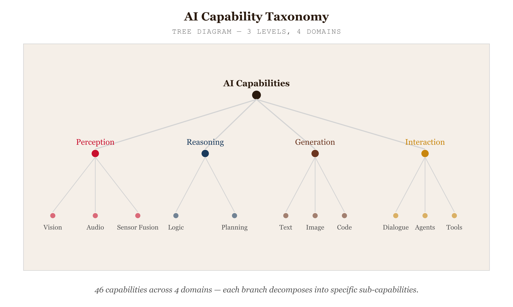
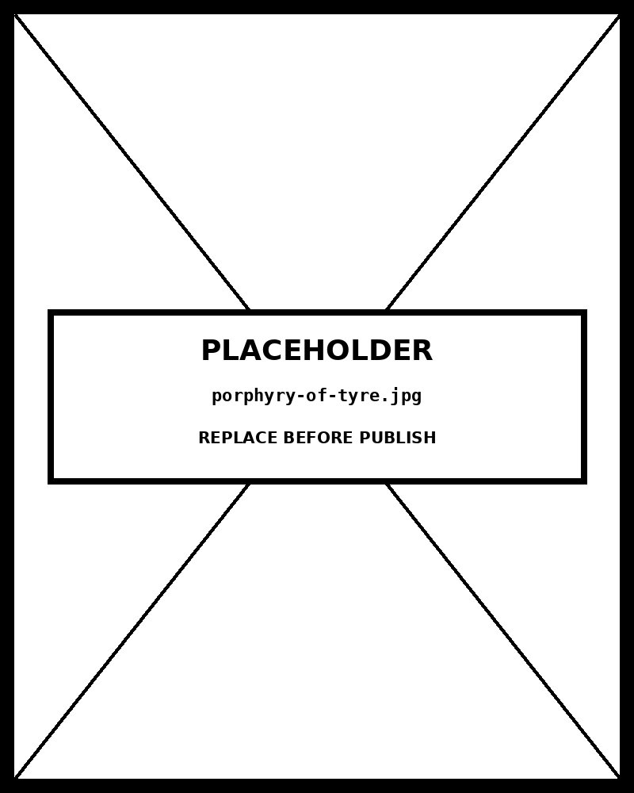

# Tree Diagram

*46 capabilities across 4 domains —click any node to expand its branch*


*Figure 74.1 — 46 capabilities across 4 domains*

## What this chart is

A tree diagram visualises a strictly hierarchical structure — a root node, internal nodes (branches), and leaf nodes — connected by edges that represent parent-child relationships. The perceptual mechanism is spatial containment implied by path-following: the viewer traces branches from the root outward to understand how a whole decomposes into its parts.

Unlike a network diagram, a tree has exactly one parent per node and no cycles. Unlike a treemap, the tree diagram preserves explicit parent-child structure in the layout — which path a node occupies encodes its lineage, not just its membership in a category.

## What it cannot show

A tree diagram fails the moment a node has more than one parent. In this taxonomy, "Machine Translation" could plausibly belong to both NLP and Coordination Platforms — but placing it in two locations would create a DAG, not a tree, and would require a network diagram or a Venn diagram instead. The tree structure is always a simplification of a reality that is rarely so clean.

The tree also carries no quantitative information. Node size does not encode any data variable — nodes are sized by depth only. If the quantity of capabilities per domain mattered (it does), a treemap would show it; this chart does not.

## Why collapsibility is load-bearing

This taxonomy has 46 nodes. Fully expanded, a static tree at this scale becomes illegible — branches overlap, labels truncate, and the viewer cannot orient themselves in the structure. Collapsibility solves the scale problem by letting the viewer navigate the hierarchy incrementally, expanding only the branches they need to explore.

Collapsibility also changes the reading mode from "overview" to "exploration" — the viewer constructs the mental model of the hierarchy through interaction, which produces deeper comprehension than a static overview. This is the primary reason to choose D3 over a static tree tool when the hierarchy is deep.

## When to use alternatives

Use a **treemap** when node size encodes a value (budget, headcount, coverage) and you need to fill a rectangular space efficiently. Use **circle packing** when hierarchical containment is more important than space efficiency. Use a **dendrogram** when the tree is produced by clustering algorithm output — the node positions carry statistical meaning (similarity distance), not just parent-child structure.

Use a **network diagram** when relationships are non-hierarchical — when nodes can have multiple parents or when the graph has cycles. The tree diagram is the simplest member of the hierarchy family, and therefore the right choice when the data is actually a tree.

## Prompt

Paste this into Claude Code to generate a working version of this chart, plus its data file. The result will not be a perfect replica — the goal is that the reader can run the prompt, get a chart of this type, and read its source.

```
Generate a complete, self-contained tree diagram in D3 v7. Two files:

1. `tree-diagram.html` — a full HTML page with inline CSS and inline D3 v7 (loaded from `https://cdnjs.cloudflare.com/ajax/libs/d3/7.8.5/d3.min.js`). The chart should fill the viewport, be responsive on resize, support keyboard focus on interactive elements, and include a tooltip on hover. The page title is "Tree Diagram" and the slide subtitle is "46 capabilities across 4 domains —click any node to expand its branch".

2. `tree-diagram/data.json` — the data file the chart loads via `d3.json("./tree-diagram/data.json")`, with a fallback inline literal in the HTML if the fetch fails.

Data shape:
- Hierarchical taxonomy for a collapsible tree diagram. Root node has 'children'; leaf nodes omit 'children'. Depth 2+ nodes are collapsed on load — click to expand. Maximum recommended depth is 4 for legibility.
  - `name`: string — label shown on the node
  - `desc`: string — description shown in the tooltip
  - `children`: array — child nodes. Omit on leaf nodes.
  - `note`: string (optional) — secondary annotation in tooltip
  - `flag`: string (optional) — 'warn' colours node blood-red regardless of depth, for highlighting ethically sensitive capabilities

Encoding: use the perceptually honest channel for this chart type (tree diagram). Do not invent decorative encodings. Annotate the chart with a one-line in-chart subtitle that names what the chart shows. Include an accessibility `<title>` and `<desc>` inside the SVG.

Style: warm monochrome — black, dark walnut, blood-red accents only. Serif font for body text, JetBrains Mono for labels and controls. No drop shadows, no rounded corners, no gradients. Clean editorial register suitable for a print-ready textbook page.

Provide both files as separate code blocks. Do not explain — just produce the files.
```

> Reference implementation: `d3/74-tree-diagram.html`

The original code and data — copy-paste-ready — live at [bearbrown.co](https://www.bearbrown.co/).

---

## AI Wayback Machine

The ideas in this chapter didn't appear from nowhere. **Porphyry of Tyre** was a 3rd-century Phoenician philosopher whose *Isagoge* introduced the "Porphyrian tree" — a hierarchical branching diagram of categories — that became the standard tree visualization in medieval logic and the ancestor of every modern taxonomy diagram.


*Porphyry of Tyre, 3rd century. AI-generated illustration based on a public domain painting (Wikimedia Commons).*

**Run this:**

```
Who was Porphyry of Tyre, and how does the Porphyrian tree connect to the tree diagram we covered in this chapter? Keep it to three paragraphs. End with the single most surprising thing about his career or ideas.
```

→ Search **"Porphyry (philosopher)"** on Wikipedia.

**Now make the prompt better.** Try one of these:

- Ask it to walk through how the Porphyrian tree organized Aristotelian categories — substance, body, animal, human — and where it failed.
- Ask it about the bridge from Porphyry's 3rd-century tree to Linnaean taxonomy to modern cladistic phylogeny.

What changes? What gets better? What gets worse?
