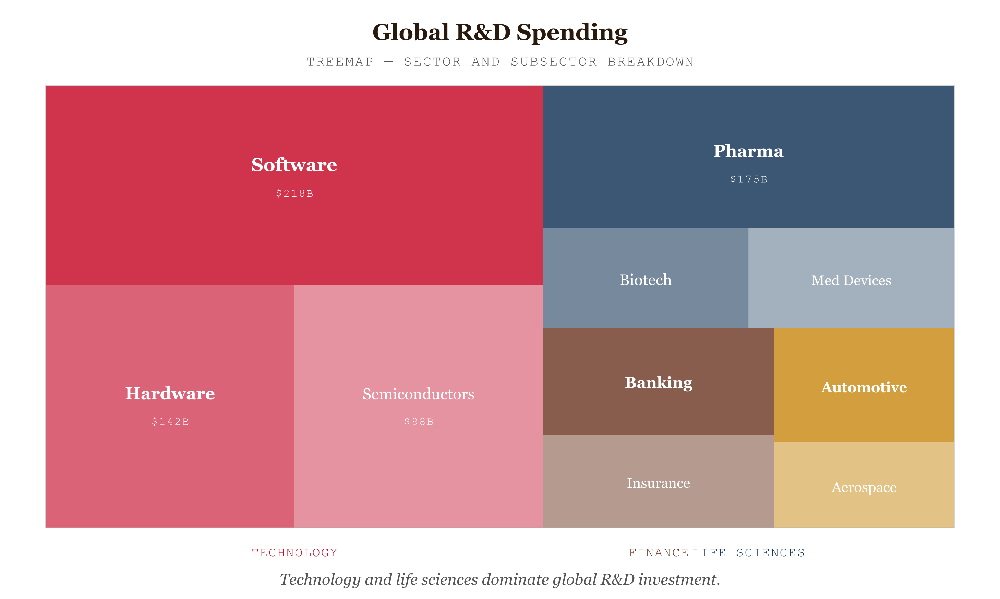

# Treemap

*Technology and life sciences dominate global R&D — but the subcategory breakdown reveals where the real concentration lies*


*Figure 75.1 — Technology and life sciences dominate*

## What this chart is

A Treemap encodes a hierarchical dataset as nested rectangles. At the top level, each parent category receives a rectangle whose area is proportional to its total value. Within each parent rectangle, child categories are drawn as smaller nested rectangles, again with area proportional to value. The entire chart area is divided exactly — there is no wasted space, and every pixel of area represents real data.

The perceptual mechanism is *area comparison* . Viewers can rapidly identify which cells are largest and which are smallest, even when the hierarchy has dozens of nodes. Unlike a bar chart (which encodes value as length) or a pie chart (which encodes value as angle), the treemap encodes value as the most holistic visual channel available: two-dimensional area. A cell that is twice as large occupies visually twice as much space — the comparison is immediate and preattentive.

## Why the squarified algorithm

Early treemap algorithms used simple recursive slicing: divide the remaining area horizontally, then vertically, alternating on each level. This produces cells with extreme aspect ratios — thin slivers many times longer than they are wide. Perceptually, a 200×4 pixel rectangle and a 40×20 pixel rectangle of equal area are extremely difficult to compare because the viewer's eye reads length, not area, when shapes are highly elongated.

The **squarified algorithm** (Bruls, Huizing, van Wijk, 1999) specifically minimises the aspect ratio of each cell, keeping them as close to square as possible. This maximises the accuracy of area comparisons — squares and near-squares are the shapes for which human area perception is most reliable. D3's `d3.treemap().tile(d3.treemapSquarify)` implements this directly.

## Why it was chosen here

The message is about relative proportions within a two-level hierarchy: how much does each sector spend, and within each sector, how is that spend distributed across subcategories? A bar chart could show one level at a time but would require two separate charts and lose the nested relationship. A Sunburst Diagram encodes the same hierarchy as concentric arcs but suffers the angle-comparison problem — arcs in different radial rings have different physical lengths for the same proportional value, introducing a systematic perceptual distortion.

The treemap encodes both levels simultaneously in a single view, with area as the encoding channel at both levels. The dominant sector claims the most screen space — the viewer sees this immediately, before reading any label. The dominant subcategory within each sector similarly claims proportional space within its parent rectangle.

## What the treemap cannot do clearly

Treemaps do not convey hierarchical depth clearly. In a two-level treemap the nesting is obvious; in a three-or-more-level treemap, the visual boundaries between parent and grandparent become ambiguous. A Tree Diagram or Sunburst Diagram shows the hierarchical structure more explicitly, at the cost of space efficiency and area-comparison accuracy.

Treemaps also struggle with values of very different magnitudes: a cell representing 0.1% of the total may be too small to label or even see. The interactive zoom-into-branch approach used here addresses this: clicking a parent expands it to fill the full chart area, giving its smaller subcategories enough space to be individually readable.

## Prompt

Paste this into Claude Code to generate a working version of this chart, plus its data file. The result will not be a perfect replica — the goal is that the reader can run the prompt, get a chart of this type, and read its source.

```
Generate a complete, self-contained treemap in D3 v7. Two files:

1. `treemap.html` — a full HTML page with inline CSS and inline D3 v7 (loaded from `https://cdnjs.cloudflare.com/ajax/libs/d3/7.8.5/d3.min.js`). The chart should fill the viewport, be responsive on resize, support keyboard focus on interactive elements, and include a tooltip on hover. The page title is "Treemap" and the slide subtitle is "Technology and life sciences dominate global R&D — but the subcategory breakdown reveals where the real concentration lies".

2. `treemap/data.json` — the data file the chart loads via `d3.json("./treemap/data.json")`, with a fallback inline literal in the HTML if the fetch fails.

Data shape:
- Two-level hierarchical dataset: global R&D spending (billions USD) by sector and subcategory. 6 parent sectors, 28 leaf subcategories. Values represent approximate annual spend. Designed to produce a visually interesting squarified treemap with one clearly dominant sector (Technology) and meaningful subcategory variation within each.

Encoding: use the perceptually honest channel for this chart type (treemap). Do not invent decorative encodings. Annotate the chart with a one-line in-chart subtitle that names what the chart shows. Include an accessibility `<title>` and `<desc>` inside the SVG.

Style: warm monochrome — black, dark walnut, blood-red accents only. Serif font for body text, JetBrains Mono for labels and controls. No drop shadows, no rounded corners, no gradients. Clean editorial register suitable for a print-ready textbook page.

Provide both files as separate code blocks. Do not explain — just produce the files.
```

> Reference implementation: `d3/75-treemap.html`

The original code and data — copy-paste-ready — live at [bearbrown.co](https://www.bearbrown.co/).


---

## AI Wayback Machine

The ideas in this chapter didn't appear from nowhere. **Brian Johnson** co-invented the rectangular treemap with Ben Shneiderman at the University of Maryland in 1991 — collaborating on the recursive slice-and-dice algorithm that turns a hierarchical tree into a space-filling rectangle. The chart became one of the most-cited tools in information visualization.


*Brian Johnson, circa 1991. AI-generated portrait based on a public domain photograph (Wikimedia Commons).*

**Run this:**

```
Who is Brian Johnson, and how does his work co-inventing the treemap connect to the chart we covered in this chapter? Keep it to three paragraphs. End with the single most surprising thing about his career or ideas.
```

→ Search **"Treemapping"** on Wikipedia.

**Now make the prompt better.** Try one of these:

- Ask it to walk through the slice-and-dice algorithm — and explain why "squarified" treemaps were a major improvement.
- Ask it about the original 1991 use case: visualizing disk usage so a user could find what was eating the hard drive.

What changes? What gets better? What gets worse?
