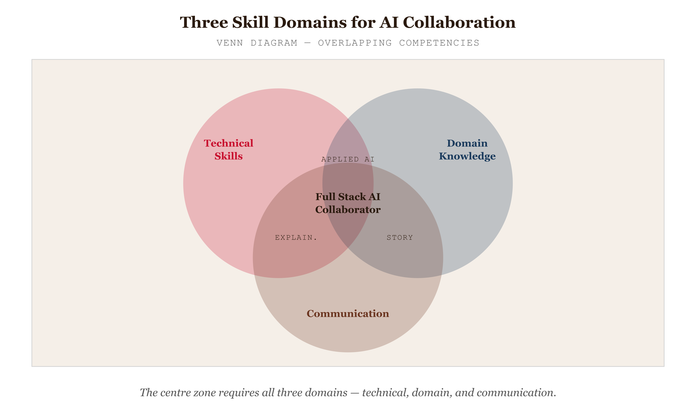
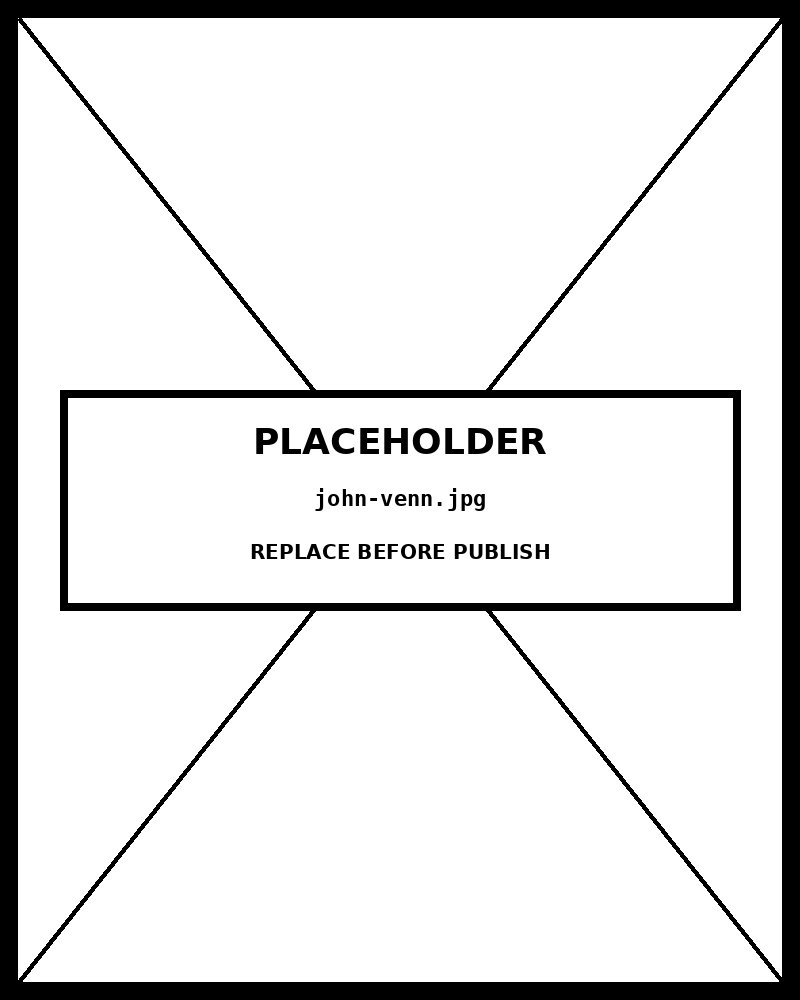

# Venn Diagram

*The Three Skill Domains for Effective AI Collaboration*


*Figure 76.1 — The Three Skill Domains*

## What this chart is

A Venn diagram displays all possible logical relationships between a collection of sets using overlapping circles. Every possible combination of set membership is assigned a distinct region: for three sets A, B, C, there are seven regions — three exclusive zones (A only, B only, C only), three pairwise intersections (A∩B, A∩C, B∩C), and one triple intersection (A∩B∩C). The perceptual mechanism is spatial containment and overlap: membership in a set is encoded by position within a circle, and shared membership by position in the overlap area. This exploits the viewer's pre-attentive ability to perceive bounded regions — the eye groups elements inside a closed shape automatically, without deliberate attention. Unlike most charts, the Venn diagram encodes logical structure rather than quantitative magnitude.

## Why it was chosen here

The subject — skill domains for AI collaboration — has genuine set-theoretic structure: the three domains are meaningful in isolation, in every pairwise combination, and in full intersection. The triple intersection (AI Collaborator) is the chart's thesis, and the Venn diagram makes it structurally unavoidable — the viewer's eye is drawn to the centre by the geometry. No other chart type communicates the message "you need all three to occupy the ideal position" with the same directness. A bar chart could show proficiency scores; a radar chart could show skill profiles; but neither encodes the combinatorial relationship that defines the centre zone. The Venn diagram is the correct tool when the categories are defined by logical conjunction, not by quantity.

## What the alternative would break

An Euler diagram is the closest structural relative and is often the more honest choice: Euler diagrams only draw circles that have actual members, and size circles proportionally to set cardinality, while Venn diagrams draw all possible intersections regardless of whether they are populated. For conceptual diagrams where all seven regions are meaningful (as here), the Venn diagram is appropriate. For data-driven diagrams where some intersections are empty, the Euler diagram avoids implying relationships that don't exist. The catalogue lists this as a variation precisely because the distinction matters: a Venn diagram with an empty intersection region visually suggests shared membership that isn't there.

## Framework reference

> // FRAMEWORK FT Visual Vocabulary category: Relationships / Concepts — "Show logical membership and overlap between defined categories." The one design decision worth knowing: in a three-set Venn diagram, all seven regions must be geometrically accessible — each intersection zone must be large enough to label and click. The standard equilateral arrangement (three circles at 120° offsets, each pair overlapping by ~30% of the radius) achieves this and is used here exactly. Deviating from this geometry — such as using ovals or asymmetric placement — risks producing regions that are geometrically correct but too small to interact with or read.

## Prompt

Paste this into Claude Code to generate a working version of this chart, plus its data file. The result will not be a perfect replica — the goal is that the reader can run the prompt, get a chart of this type, and read its source.

```
Generate a complete, self-contained venn diagram in D3 v7. Two files:

1. `venn-diagram.html` — a full HTML page with inline CSS and inline D3 v7 (loaded from `https://cdnjs.cloudflare.com/ajax/libs/d3/7.8.5/d3.min.js`). The chart should fill the viewport, be responsive on resize, support keyboard focus on interactive elements, and include a tooltip on hover. The page title is "Venn Diagram" and the slide subtitle is "The Three Skill Domains for Effective AI Collaboration".

2. `venn-diagram/data.json` — the data file the chart loads via `d3.json("./venn-diagram/data.json")`, with a fallback inline literal in the HTML if the fetch fails.

Data shape:
- Three-set Venn diagram data. Seven regions covering all combinations of membership in sets A, B, C. Replace sets and regions with real content.
  - `sets[].id`: string — single uppercase letter: A, B, or C
  - `sets[].label`: string — set name (\n for two-line label)
  - `sets[].color`: string — hex color for this set circle and label
  - `regions[].id`: string — combination key: A, B, C, AB, AC, BC, or ABC
  - `regions[].title`: string — name of this intersection shown in info panel
  - `regions[].desc`: string — one or two sentence description of what this region means
  - `regions[].items`: string[] — examples or members belonging to this region
  - `regions[].count`: number — size of this region (shown in count mode)

Encoding: use the perceptually honest channel for this chart type (venn diagram). Do not invent decorative encodings. Annotate the chart with a one-line in-chart subtitle that names what the chart shows. Include an accessibility `<title>` and `<desc>` inside the SVG.

Style: warm monochrome — black, dark walnut, blood-red accents only. Serif font for body text, JetBrains Mono for labels and controls. No drop shadows, no rounded corners, no gradients. Clean editorial register suitable for a print-ready textbook page.

Provide both files as separate code blocks. Do not explain — just produce the files.
```

> Reference implementation: `d3/76-venn-diagram.html`

The original code and data — copy-paste-ready — live at [bearbrown.co](https://www.bearbrown.co/).

---

## AI Wayback Machine

The ideas in this chapter didn't appear from nowhere. **John Venn** introduced the diagram bearing his name in 1880 — though he was extending earlier work by Euler — by drawing overlapping circles to represent logical relationships among sets. He was an English logician and Anglican priest.


*John Venn, circa 1880. AI-generated portrait based on a public domain photograph (Wikimedia Commons).*


*Puppet Art by [Nik Bear Brown](https://www.nikbearbrown.com/).*

**Run this:**

```
Who was John Venn, and how does the Venn diagram connect to the chart we covered in this chapter? Keep it to three paragraphs. End with the single most surprising thing about his career or ideas.
```

→ Search **"John Venn"** on Wikipedia.

**Now make the prompt better.** Try one of these:

- Ask it to compare a Venn diagram with an Euler diagram — when does each form work better for set relationships?
- Ask it about the difficulty of drawing a true Venn diagram for four or more sets — and the geometric solutions for higher dimensions.

What changes? What gets better? What gets worse?
