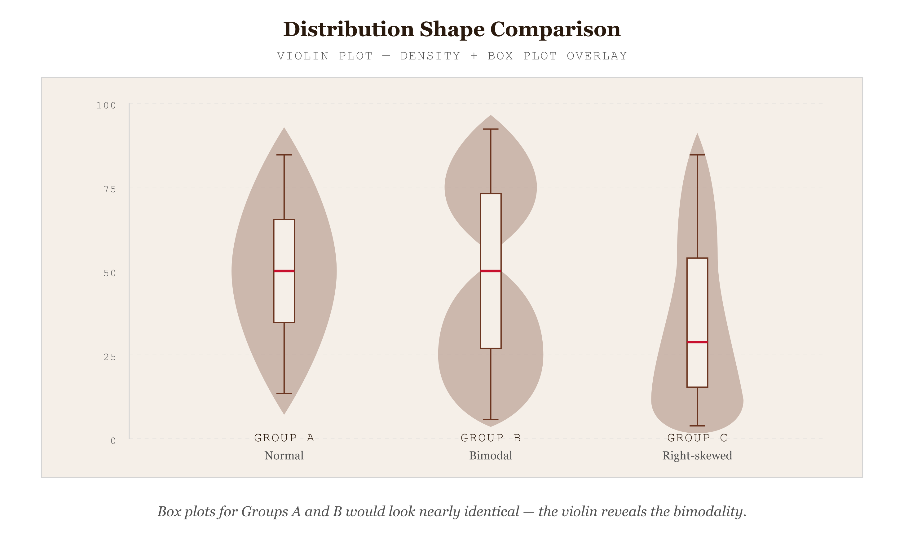

# Violin Plot

*When Box Plots Hide Bimodality — Add Density to See Shape*


*Figure 77.1 — When Box Plots Hide Bimodality*

## What this chart is

A violin plot combines a box plot with a kernel density estimate (KDE). Each "violin" is a vertical (or horizontal) shape whose width at any point along the value axis encodes the estimated probability density of observations at that value. The shape is symmetric — the KDE is mirrored around a central spine — so the silhouette reads like a violin or a leaf. A box plot's box and whiskers are usually overlaid down the spine, giving the reader the five-number summary in addition to the density curve.

The chart was introduced by Jerry Hintze and Ray Nelson in 1998 as a replacement for the box plot in cases where the box plot's five-number summary hides distributional shape. The box plot tells the viewer where the quartiles are; it cannot tell the viewer that the distribution has two peaks, or a long shoulder, or a sharp cliff at one end. The violin plot adds that shape information back in, at the cost of reading complexity.

## What the violin reveals that the box plot hides

Bimodality is the strongest case. Two distributions — one with a single peak around the median, one with two peaks far from the median — can produce identical box plots. The five-number summary is identical. The reader sees no difference. The violin plot pulls them apart immediately: the unimodal distribution is a single bulge; the bimodal distribution is a figure-eight or a peanut shape. This is information that genuinely matters: a bimodal salary distribution within a single job title means there is structure (junior vs. senior, two-tier pay band) the box plot has erased.

Skew that the box plot summarises as "median offset within the box" becomes a literal shape in the violin: a left-skewed distribution leans left, a right-skewed distribution leans right, and the asymmetry is preattentively obvious. Tail behavior — fat tails, thin tails, gaps — appears as the silhouette's behavior at the extremes, not as a single whisker length and a few outlier dots.

## How to read this chart

Read the silhouette shape. The width at any height encodes density at that value: where the violin is widest, observations cluster; where it pinches, observations are scarce. The full vertical extent shows the data range. The overlaid box plot, drawn down the spine, gives Q1, median, Q3, and outlier points exactly as a standalone box plot would.

Compare violins by reading their shapes side by side. Two violins of equal vertical extent but different widths represent distributions with the same range but different concentrations. Two violins of equal width but different heights represent distributions with similar concentration but different ranges. A violin that is wide and short is a tightly-concentrated distribution; a violin that is narrow and tall is a spread-out distribution.

## The bandwidth problem

The KDE that draws the violin's shape depends on a bandwidth parameter — a smoothing window that determines how rough or how smooth the resulting curve is. Too narrow a bandwidth and the violin becomes a noisy series of bumps that overfit the sample; too wide a bandwidth and genuine multimodality smooths into a single bulge. The chart looks definitive but is parameter-dependent in a way the box plot is not.

Sensible defaults exist. Silverman's rule (`1.06 × σ × n^(-1/5)`) and Scott's rule are both commonly used; D3's `d3-array.bin` and several plotting libraries pick one for you. The honest practice is to disclose the bandwidth choice in the chart caption and, if the chart is for analytical use rather than presentation, expose a slider so the reader can see the violin's shape change with bandwidth and form their own judgment about what features are robust and what features are noise.

## What the alternative would break

A box plot alone — the most common alternative — hides multimodality, hides shoulders, and erases sharp cliffs in the tail. For sample sizes large enough to support a violin (n ≳ 50), the box plot's compactness comes at the cost of information the reader needs to know.

A histogram for each group — the alternative that most directly shows shape — works for one or two groups but does not scale to side-by-side comparison across many groups; the visual real estate per group becomes too small to read. A violin plot is histograms per group, mirrored and stacked sideways, in a form that scales to ten or more groups in a single chart.

A strip plot or beeswarm plot of all individual points is the most honest alternative: it shows every observation. For sample sizes above ~150 per group, jittering and overplotting limit its readability; the violin plot summarises the same information at any scale.

## Framework reference

> // FRAMEWORK FT Visual Vocabulary: **Distribution** — "Show the range of values in a dataset and how they are distributed." Abela quadrant: Distribution (single variable, multiple groups, comparison of shape). Tufte principle: the violin's shape encodes density, the box plot's overlay encodes quartiles — every pixel does work, but the chart relies on KDE bandwidth as a parameter the reader cannot see in the chart itself. The one design decision worth knowing: bandwidth choice. Disclose it in the caption; expose it as a slider when the chart is for analysis rather than presentation; pick a sensible default (Silverman's rule) when the chart is for publication.

## Prompt

Paste this into Claude Code to generate a working version of this chart, plus its data file. The result will not be a perfect replica — the goal is that the reader can run the prompt, get a chart of this type, and read its source.

```
Generate a complete, self-contained violin plot in D3 v7. Two files:

1. `violin-plot.html` — a full HTML page with inline CSS and inline D3 v7 (loaded from `https://cdnjs.cloudflare.com/ajax/libs/d3/7.8.5/d3.min.js`). The chart should fill the viewport, be responsive on resize, support keyboard focus on each violin, and include a tooltip on hover that shows the value at the cursor's vertical position and the local density. The page title is "Violin Plot" and the slide subtitle is "When Box Plots Hide Bimodality — Add Density to See Shape".

2. `violin-plot/data.json` — the data file the chart loads via `d3.json("./violin-plot/data.json")`, with a fallback inline literal in the HTML if the fetch fails.

Data shape:
- 3–6 groups of continuous measurements, n=80–200 each, with at least one group exhibiting bimodality so the violin shape clearly differs from a unimodal sibling. Examples: salaries by job family, response times by region, test scores by class section.
  - `group`: string — category label (band axis)
  - `values`: number[] — raw measurements; KDE computed at render time

Encoding: each violin is a kernel density estimate mirrored around a central spine, with overlaid box plot (Q1, median, Q3, whiskers at 1.5 × IQR, outlier points). Use `d3.line()` with curved interpolation to draw the KDE outline. Bandwidth: Silverman's rule (`1.06 × σ × n^(-1/5)`); expose a slider so the reader can adjust ±2× and see the shape's stability. Annotate the chart with a one-line in-chart subtitle. Include an accessibility `<title>` and `<desc>` inside the SVG.

Style: warm monochrome — black, dark walnut, blood-red accents only. Serif font for body text, JetBrains Mono for labels and controls. No drop shadows, no rounded corners, no gradients. Clean editorial register suitable for a print-ready textbook page.

Provide both files as separate code blocks. Do not explain — just produce the files.
```

> Reference implementation: `d3/77-violin-plot.html`

The original code and data — copy-paste-ready — live at [bearbrown.co](https://www.bearbrown.co/).

---

## AI Wayback Machine

The ideas in this chapter didn't appear from nowhere. **George E. P. Box** built much of modern applied statistics — including the Box-Jenkins time-series methods and the Box-Cox transformation — and famously said "all models are wrong, but some are useful." His framework taught generations how to handle distributions with shapes a box plot couldn't capture, which is exactly what the violin plot solves.


*George E. P. Box, circa 1980. AI-generated portrait based on a public domain photograph (Wikimedia Commons).*

**Run this:**

```
Who was George E. P. Box, and how does his work on statistical distributions and transformations connect to the violin plot we covered in this chapter? Keep it to three paragraphs. End with the single most surprising thing about his career or ideas.
```

→ Search **"George E. P. Box"** on Wikipedia.

**Now make the prompt better.** Try one of these:

- Ask it to walk through when a violin plot tells you something a box plot hides — using one specific distribution shape (bimodal, heavily skewed).
- Ask it about Box's "all models are wrong" quote and what it means for the practice of statistical visualization.

What changes? What gets better? What gets worse?
