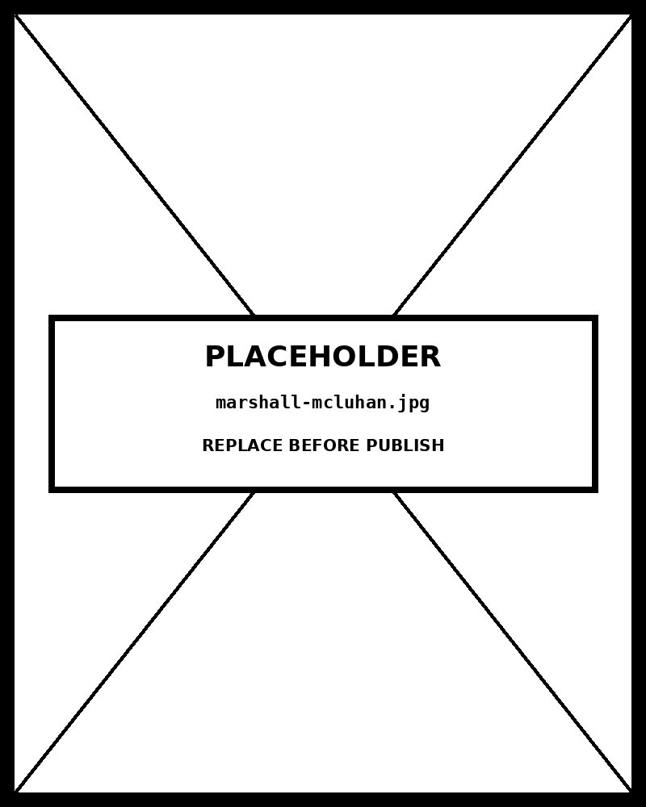

# Word Cloud

*Visually Engaging, Analytically Poor — Use With Eyes Open*


## What this chart is

A word cloud — sometimes called a tag cloud or weighted list — is a text visualization in which words from a corpus are positioned within a bounded shape and sized in proportion to their frequency or importance. Larger words appear more frequently in the source text; smaller words appear less often. The most common implementations use a packing algorithm (Jonathan Feinberg's "Wordle" layout, which D3-cloud reimplements) to fit words into a rectangle or shape without overlap.

The chart is genuinely useful for one purpose: forming a quick visual impression of which terms dominate a corpus before any quantitative analysis begins. It is not useful for any task that requires precise comparison.

## What the chart actually encodes

Word size encodes frequency. That much is honest. Almost everything else in the chart is decoration:

- **Position is meaningless.** Words are placed by an algorithm that prioritises packing density, not data relationships. Two words next to each other in the cloud are not more related than two words at opposite ends. Readers who infer proximity-as-relatedness are reading information the chart did not encode.
- **Color is meaningless** in most implementations. Color is chosen to make the cloud visually appealing, not to encode a second variable. When color does encode a variable, it is rarely labeled.
- **Word length confounds frequency.** A long word at frequency 50 occupies more pixels than a short word at frequency 50, and a short word at frequency 100 may occupy fewer pixels than a long word at frequency 50. The visual prominence of a word in the cloud is a function of word length × frequency, not frequency alone. The reader cannot disentangle the two.
- **Orientation is decoration.** Many word clouds rotate words 90 degrees to fit the packing. The reader's eye reads horizontal text faster than vertical; the rotated words are de-emphasized for no data-driven reason.

## Why the chart misleads

Stephen Few has been direct about word clouds in print: they are "amongst the most useless and absurd visualizations ever devised." Jacob Harris at *The New York Times* called them "the mullets of the Internet." The criticism is not aesthetic — it is mechanical. The chart's central encoding (size = frequency) is corrupted by the chart's own layout decisions (word length, orientation, packing position) in ways the reader cannot correct for.

The reader looks at a word cloud and reaches three intuitions: which word is largest (frequency rank #1), which words cluster together (none — clustering is fictional), and which terms dominate the discourse (the visual answer is biased by word length). Two of those three intuitions are wrong. The chart succeeds at the first task and fails at the other two.

## When to use it anyway

Word clouds are appropriate in two contexts. The first is presentation theatre — a slide showing audience-submitted words after a brainstorming session, where the goal is engagement rather than analysis. The second is preliminary corpus exploration — a glance at a thousand reviews to see whether the dominant terms are about price, quality, or service before committing to a more rigorous frequency analysis.

In both contexts, the word cloud should be paired with the underlying frequency table. The cloud handles the visceral impression; the table handles the comparison the cloud cannot.

## What the alternative does better

A horizontal bar chart of the top 20 (or top 50) terms by frequency, sorted descending, gives the reader length-along-a-shared-baseline — the most accurate quantitative encoding humans can read. The reader can compare any two terms directly. Word length does not confound the encoding because all bar lengths are measured the same way. There is no wasted real estate, no decorative position, no rotational confusion. Cleveland and McGill's perceptual ranking puts bar length above area; word clouds use area; the bar chart wins.

A treemap of term frequencies gives the same area-encoding word clouds use but with rectangles rather than text glyphs, removing the word-length confounding. Treemaps are a defensible compromise when the visual goal is "see the dominant terms at a glance" but the analyst recognizes that bar charts are more accurate.

A frequency table — words and counts in two columns — is the most honest representation of the data and the one professional analysts use to compute anything downstream from frequency. It is also less visually engaging, which is why word clouds persist despite their problems.

## Framework reference

> // FRAMEWORK FT Visual Vocabulary: not classified — word clouds sit outside the FT's chart taxonomy because the encoding is too unreliable to defend. Tufte principle violated: the chart's data-ink ratio is poor; word length, orientation, and position all consume ink without encoding data. Few's position: the chart is "useless and absurd" for analytical work and acceptable only as decorative orientation. The one design decision worth knowing: if a word cloud is being used, pair it with a sorted bar chart or frequency table of the same data so the reader has a way to verify what the cloud's geometry suggests.

## Prompt

Paste this into Claude Code to generate a working version of this chart, plus its data file. The result will not be a perfect replica — the goal is that the reader can run the prompt, get a chart of this type, and read its source.

```
Generate a complete, self-contained word cloud in D3 v7 using the d3-cloud layout. Two files:

1. `word-cloud.html` — a full HTML page with inline CSS, inline D3 v7 (loaded from `https://cdnjs.cloudflare.com/ajax/libs/d3/7.8.5/d3.min.js`), and inline d3-cloud (loaded from `https://cdnjs.cloudflare.com/ajax/libs/d3-cloud/1.2.7/d3.layout.cloud.min.js`). The chart should fill the viewport, be responsive on resize, support keyboard focus on each word, and include a tooltip on hover that shows the exact frequency. Pair the cloud with a small horizontal bar chart of the top 10 words sorted by frequency, in the same view, so the reader has an accurate reading alongside the decorative one. The page title is "Word Cloud" and the slide subtitle is "Visually Engaging, Analytically Poor — Use With Eyes Open".

2. `word-cloud/data.json` — the data file the chart loads via `d3.json("./word-cloud/data.json")`, with a fallback inline literal in the HTML if the fetch fails.

Data shape:
- A weighted term list. 80–150 entries with realistic frequencies (long-tailed; a few high-frequency terms, many low-frequency).
  - `text`: string — the word or term to render
  - `weight`: number — frequency or importance, drives font size

Encoding: word size by weight (square-root scaled to limit dominance of the largest terms). Position by d3-cloud packing algorithm. Allow up to 90° rotation for ~30% of words. Color by a single hue (warm walnut palette) modulated for legibility. Annotate the chart with a one-line in-chart subtitle.

Style: warm monochrome — black, dark walnut, blood-red accents only. Serif font for body text, JetBrains Mono for labels and the tooltip. No drop shadows, no rounded corners, no gradients. Clean editorial register suitable for a print-ready textbook page.

Provide both files as separate code blocks. Do not explain — just produce the files.
```

The original code and data — copy-paste-ready — live at [bearbrown.co](https://www.bearbrown.co/).

---

## AI Wayback Machine

The ideas in this chapter didn't appear from nowhere. **Marshall McLuhan** argued in *The Gutenberg Galaxy* (1962) and *Understanding Media* (1964) that typography itself is a medium — that the size, the weight, the spacing of letters carry meaning independent of the words they spell. The word cloud is McLuhan's claim made literal. The frequency of a term is encoded in its visual prominence. The medium is the message, rendered as a chart.


*Marshall McLuhan, circa 1965. AI-generated portrait based on a public domain photograph (Wikimedia Commons).*

**Run this:**

```
Who was Marshall McLuhan, and how does his media theory connect to the word-cloud form we covered in this chapter? Keep it to three paragraphs. End with the single most surprising thing about his career or ideas.
```

→ Search **"Marshall McLuhan Gutenberg Galaxy"** on Wikipedia. See what the model got right, got wrong, or left out.

**Now make the prompt better.** Try one of these:

- Ask it to walk through one of McLuhan's typographic experiments (e.g., the visual layouts in *The Medium is the Massage*, 1967) and identify which of his rules a word cloud follows and which it breaks.
- Ask it to compare McLuhan's pre-computer claim that "the medium is the message" with a modern word cloud's choice of font, color, and arrangement — what stays controllable, what doesn't.

What changes? What gets better? What gets worse?
