# Brutalist d3 x Claude — Wayback Sections

> Extracted from `chapters/`. Each entry corresponds to one chapter file.
> Sections are instructor-authored. Missing sections show a placeholder only.
> Do not edit this file directly — edit the source chapter file, then re-run extraction.

---

## Chapter 00: Brutalist d3 x Claude
*Source: `chapters/00-frontmatter.md`*

> **Section not yet authored.** No `## AI Wayback Machine` block found in this chapter file.
> To add this section, edit the source chapter file directly.

---

## Chapter 00: Introduction
*Source: `chapters/00-introduction.md`*

> **Section not yet authored.** No `## AI Wayback Machine` block found in this chapter file.
> To add this section, edit the source chapter file directly.

---

## Chapter 02: Chapter 02 — Claude Basics for D3 Visualization
*Source: `chapters/02-claude-basics-for-d3-visualization.md`*

## AI Wayback Machine

The ideas in this chapter didn't appear from nowhere. **Margaret Hamilton** led the team that wrote the Apollo Guidance Computer software in the 1960s — coining the term "software engineering" along the way. Her stack of program listings stood taller than she did. The discipline of "talk to your software carefully and you will get something you didn't expect" was hers.


*Margaret Hamilton, circa 1969. AI-generated portrait based on a public domain photograph (Wikimedia Commons).*


*Puppet Art by [Nik Bear Brown](https://www.nikbearbrown.com/).*

**Run this:**

```
Who was Margaret Hamilton, and how does her work on the Apollo Guidance Computer software connect to the practice of working with code-generating tools like Claude? Keep it to three paragraphs. End with the single most surprising thing about her career or ideas.
```

→ Search **"Margaret Hamilton (software engineer)"** on Wikipedia. See what the model got right, got wrong, or left out.

**Now make the prompt better.** Try one of these:

- Ask it to compare Hamilton's priority-display approach for handling Apollo's alarm system with the way Claude reports errors and warnings while writing D3 code.
- Add a constraint: "Answer as Hamilton's 1969 internal memo on why robust error handling matters in life-critical software."

What changes? What gets better? What gets worse?

---

## Chapter 03: Chapter 3 — Marks and Channels
*Source: `chapters/03-marks-and-channels.md`*

## AI Wayback Machine

The ideas in this chapter didn't appear from nowhere. **Jock Mackinlay** ranked visual channels by perceptual accuracy in his 1986 dissertation — showing that position beats length beats angle beats color, in roughly that order. The ranking still drives every decision about which channel to use for the most important variable.


*Jock Mackinlay, circa 1986. AI-generated portrait based on a public domain photograph (Wikimedia Commons).*

**Run this:**

```
Who is Jock Mackinlay, and how does his ranking of visual encoding channels connect to the marks-and-channels framework we covered in this chapter? Keep it to three paragraphs. End with the single most surprising thing about his career or ideas.
```

→ Search **"Jock D. Mackinlay"** on Wikipedia. See what the model got right, got wrong, or left out.

**Now make the prompt better.** Try one of these:

- Ask it to walk through one example where Mackinlay's ranking explains why a chart redesign improved (or worsened) readability.
- Ask it to compare Mackinlay's APT system from 1986 with modern automated chart-recommendation tools.

What changes? What gets better? What gets worse?

---

## Chapter 04: Chapter 4 — Chart Selection as Design Decision
*Source: `chapters/04-chart-selection-as-design-decision.md`*

## AI Wayback Machine

The ideas in this chapter didn't appear from nowhere. **Calvin F. Schmid** was an American sociologist and statistician who wrote *Handbook of Graphic Presentation* (1954) — the first practical manual that walked the reader through *which chart to use for which question*. Before Schmid's book, chart selection was mostly inherited from whatever the previous author had done. After it, the question "key message → data structure → functional category → specific form" had a textbook answer.


*Calvin F. Schmid, circa 1955. AI-generated portrait based on a public domain photograph (Wikimedia Commons).*

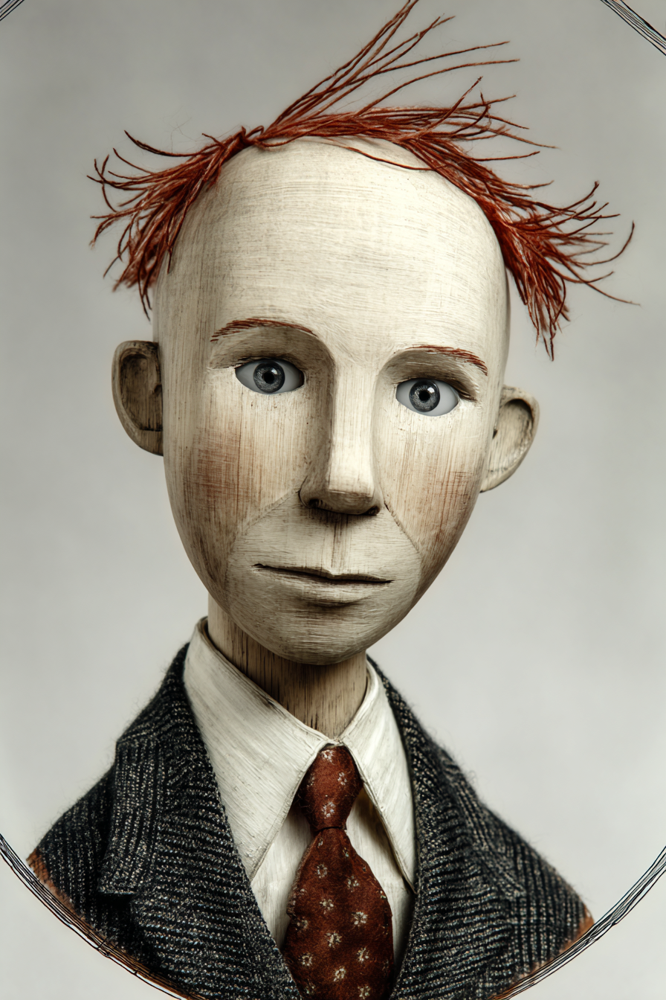

*Puppet Art by [Nik Bear Brown](https://www.nikbearbrown.com/).*

**Run this:**

```
Who was Calvin F. Schmid, and how does his chart-selection framework connect to the four-step Cairo workflow we covered in this chapter? Keep it to three paragraphs. End with the single most surprising thing about his career or ideas.
```

→ Search **"Calvin F. Schmid statistician"** on Wikipedia. See what the model got right, got wrong, or left out.

**Now make the prompt better.** Try one of these:

- Ask it to walk through how Schmid's 1954 chart-selection rules would handle the 14-category humanitarian funding dataset from the opening case.
- Ask it to compare Schmid's pre-computer chart-selection guide with Andy Kirk's *Data Visualisation* (2016) — what changed, what didn't.

What changes? What gets better? What gets worse?

---

## Chapter 05: Chapter 05 — Reading a Dataset
*Source: `chapters/05-reading-a-dataset.md`*

## AI Wayback Machine

The ideas in this chapter didn't appear from nowhere. **John Tukey** invented exploratory data analysis (EDA) in the 1960s and 70s — arguing that the right first move with a dataset is to *look* at it, not test it. He also coined the words "bit" and "software."


*John Tukey, circa 1970. AI-generated portrait based on a public domain photograph (Wikimedia Commons).*

**Run this:**

```
Who was John Tukey, and how does his exploratory data analysis approach connect to the way we read a dataset in this chapter? Keep it to three paragraphs. End with the single most surprising thing about his career or ideas.
```

→ Search **"John Tukey"** on Wikipedia. See what the model got right, got wrong, or left out.

**Now make the prompt better.** Try one of these:

- Ask it to walk through Tukey's "five-number summary" on one specific small dataset — what does it reveal that mean and standard deviation hide?
- Ask it to compare Tukey's pencil-and-paper EDA with the modern dataframe-and-plotting workflow you'd use with Claude.

What changes? What gets better? What gets worse?

---

## Chapter 06: Chapter 6 — Working with Claude Code
*Source: `chapters/06-working-with-claude-code.md`*

## AI Wayback Machine

The ideas in this chapter didn't appear from nowhere. **Grace Hopper** wrote the first compiler in 1952 — A-0 — arguing that programmers should not write in machine code if a machine could translate from something more human. The chain that runs from her work to "tell Claude what you want" is short.


*Grace Hopper, circa 1960. AI-generated portrait based on a public domain photograph (Wikimedia Commons).*

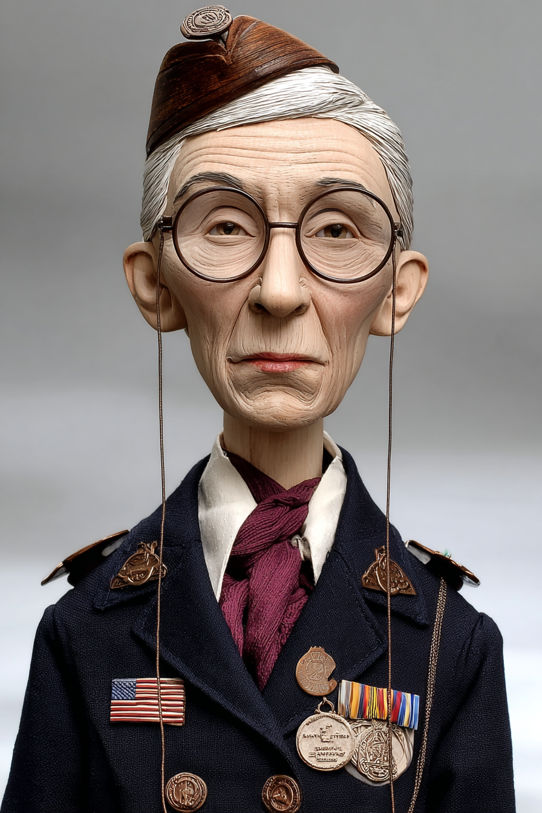

*Puppet Art by [Nik Bear Brown](https://www.nikbearbrown.com/).*

**Run this:**

```
Who was Grace Hopper, and how does her work on compilers and high-level languages connect to working with code-generating tools like Claude? Keep it to three paragraphs. End with the single most surprising thing about her career or ideas.
```

→ Search **"Grace Hopper"** on Wikipedia.

**Now make the prompt better.** Try one of these:

- Ask it to trace the lineage from A-0 to FLOW-MATIC to COBOL to natural-language prompting.
- Ask it about the actual moth Hopper taped into a logbook — was it really the origin of "debugging"?

What changes? What gets better? What gets worse?

---

## Chapter 07: Chapter 07 — Comparison Charts
*Source: `chapters/07-comparison-charts.md`*

## AI Wayback Machine

The ideas in this chapter didn't appear from nowhere. **William Playfair** invented the bar chart, line graph, and pie chart in his 1786 *Commercial and Political Atlas* — and used them to make political arguments about British trade. Most of the chart vocabulary you use today is his.


*William Playfair, circa 1800. AI-generated portrait based on a public domain engraving (Wikimedia Commons).*

**Run this:**

```
Who was William Playfair, and how do his 1786 chart inventions connect to the comparison charts we covered in this chapter? Keep it to three paragraphs. End with the single most surprising thing about his career or ideas.
```

→ Search **"William Playfair"** on Wikipedia.

**Now make the prompt better.** Try one of these:

- Ask it to redraw Playfair's bar chart of Scottish imports in modern D3 conventions — what changes about the message?
- Ask it about Playfair's side career as a banker, fraudster, and rumored spy.

What changes? What gets better? What gets worse?

---

## Chapter 08: Chapter 8 — Time Series and Temporal Charts
*Source: `chapters/08-time-series-and-temporal-charts.md`*

## AI Wayback Machine

The ideas in this chapter didn't appear from nowhere. **Étienne-Jules Marey** was a 19th-century French physiologist who developed the "graphical method" — recording heartbeats, gait, and bird flight as continuous time-series traces on paper. He believed the trace was a more honest record than the human eye.


*Étienne-Jules Marey, circa 1885. AI-generated portrait based on a public domain photograph (Wikimedia Commons).*

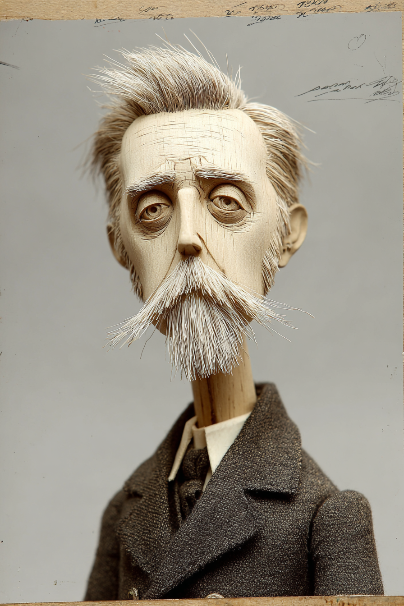

*Puppet Art by [Nik Bear Brown](https://www.nikbearbrown.com/).*

**Run this:**

```
Who was Étienne-Jules Marey, and how does his graphical method connect to the time-series and temporal charts we covered in this chapter? Keep it to three paragraphs. End with the single most surprising thing about his career or ideas.
```

→ Search **"Étienne-Jules Marey"** on Wikipedia.

**Now make the prompt better.** Try one of these:

- Ask it to compare Marey's chronophotographs of horses in motion with the modern small-multiples approach to time-series.
- Ask it to describe Marey's sphygmograph — what physiological signal it captured, and how.

What changes? What gets better? What gets worse?

---

## Chapter 09: Chapter 09 — Distribution Charts
*Source: `chapters/09-distribution-charts.md`*

## AI Wayback Machine

The ideas in this chapter didn't appear from nowhere. **Adolphe Quetelet** coined "the average man" in 1835 — proposing that human traits (height, chest circumference, criminal tendency) follow normal distributions. He gave statistics the conceptual tools to think about populations as distributions, not lists.


*Adolphe Quetelet, circa 1860. AI-generated portrait based on a public domain photograph (Wikimedia Commons).*

**Run this:**

```
Who was Adolphe Quetelet, and how does his "average man" framework connect to the distribution charts we covered in this chapter? Keep it to three paragraphs. End with the single most surprising thing about his career or ideas.
```

→ Search **"Adolphe Quetelet"** on Wikipedia.

**Now make the prompt better.** Try one of these:

- Ask it to walk through Quetelet's 1846 fit of Scottish soldier chest measurements to a normal curve — and what made it convincing at the time.
- Ask it about the eugenics-adjacent reception of Quetelet's ideas in the late 19th century — what survived and what was discarded.

What changes? What gets better? What gets worse?

---

## Chapter 10: Chapter 10 — Relationship and Correlation Charts
*Source: `chapters/10-relationship-and-correlation-charts.md`*

## AI Wayback Machine

The ideas in this chapter didn't appear from nowhere. **Francis Galton** drew the first scatter plot in 1885 to compare parents' and children's heights — and named the resulting downward-sloping pattern "regression toward the mean." His statistical instincts were brilliant; his applications of them (founding eugenics) were catastrophic.


*Francis Galton, circa 1890. AI-generated portrait based on a public domain photograph (Wikimedia Commons).*


*Puppet Art by [Nik Bear Brown](https://www.nikbearbrown.com/).*

**Run this:**

```
Who was Francis Galton, and how does his invention of the scatter plot connect to the relationship and correlation charts we covered in this chapter? Keep it to three paragraphs. End with the single most surprising thing about his career or ideas.
```

→ Search **"Francis Galton"** on Wikipedia.

**Now make the prompt better.** Try one of these:

- Ask it to walk through Galton's height-and-regression experiment, and explain what "regression to the mean" actually does and doesn't say.
- Ask it to confront the entanglement of Galton's statistical innovations with his founding role in eugenics.

What changes? What gets better? What gets worse?

---

## Chapter 11: Chapter 11 — Part-to-Whole Charts
*Source: `chapters/11-part-to-whole-charts.md`*

## AI Wayback Machine

The ideas in this chapter didn't appear from nowhere. **Georg von Mayr** was a 19th-century German statistician who built systematic part-to-whole charts (pie variants, stacked bars, area diagrams) to display the components of state and demographic data — and helped move statistics from text tables to visual reasoning.


*Georg von Mayr, circa 1900. AI-generated portrait based on a public domain photograph (Wikimedia Commons).*

**Run this:**

```
Who was Georg von Mayr, and how does his early statistical graphics work connect to the part-to-whole charts we covered in this chapter? Keep it to three paragraphs. End with the single most surprising thing about his career or ideas.
```

→ Search **"Georg von Mayr"** on Wikipedia.

**Now make the prompt better.** Try one of these:

- Ask it to recreate one of von Mayr's 1870s demographic part-to-whole charts in modern D3 — what changes about the message?
- Ask it to compare his approach with Playfair's a century earlier — what did each contribute?

What changes? What gets better? What gets worse?

---

## Chapter 12: Chapter 12 — Hierarchy Charts
*Source: `chapters/12-hierarchy-charts.md`*

## AI Wayback Machine

The ideas in this chapter didn't appear from nowhere. **Ben Shneiderman** invented the treemap in 1990 — to display hierarchical disk usage on his hard drive without wasted screen space. The algorithm now displays everything from stock-market sectors to government budgets to file-system contents.


*Ben Shneiderman, circa 1991. AI-generated portrait based on a public domain photograph (Wikimedia Commons).*

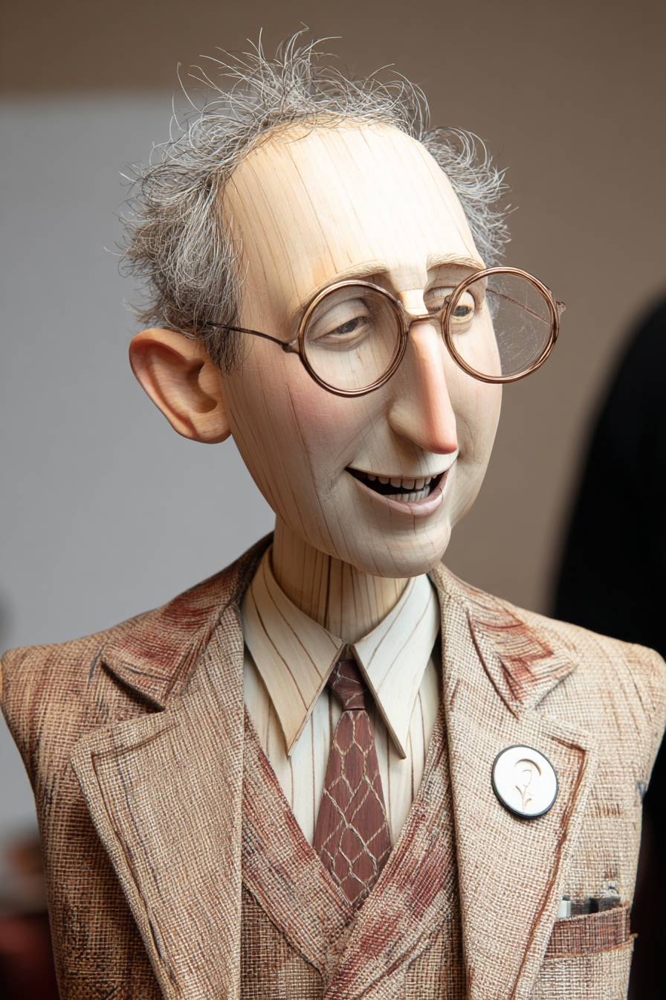

*Puppet Art by [Nik Bear Brown](https://www.nikbearbrown.com/).*

**Run this:**

```
Who is Ben Shneiderman, and how does his invention of the treemap connect to the hierarchy charts we covered in this chapter? Keep it to three paragraphs. End with the single most surprising thing about his career or ideas.
```

→ Search **"Ben Shneiderman"** on Wikipedia.

**Now make the prompt better.** Try one of these:

- Ask it to walk through the original "slice-and-dice" treemap algorithm — what it does well, and what later "squarified" treemaps improved.
- Ask it about Shneiderman's "visual information seeking mantra" — overview, zoom, filter, details on demand.

What changes? What gets better? What gets worse?

---

## Chapter 13: Chapter 13 — Flow and Network Charts
*Source: `chapters/13-flow-and-network-charts.md`*

## AI Wayback Machine

The ideas in this chapter didn't appear from nowhere. **Charles Joseph Minard** drew the 1869 flow map of Napoleon's Russian campaign — combining six variables (army size, location, direction, temperature, distance, time) in a single image. Tufte called it possibly "the best statistical graphic ever drawn."


*Charles Joseph Minard, circa 1860. AI-generated portrait based on a public domain engraving (Wikimedia Commons).*

**Run this:**

```
Who was Charles Joseph Minard, and how does his Napoleon's-march flow map connect to the flow and network charts we covered in this chapter? Keep it to three paragraphs. End with the single most surprising thing about his career or ideas.
```

→ Search **"Charles Joseph Minard"** on Wikipedia.

**Now make the prompt better.** Try one of these:

- Ask it to enumerate the six variables in Minard's map and explain how each was visually encoded.
- Ask it to compare Minard's flow map with the modern Sankey diagram (Chapter 62) — what's shared, what's different?

What changes? What gets better? What gets worse?

---

## Chapter 14: Chapter 14 — Spatial and Geographic Charts
*Source: `chapters/14-spatial-and-geographic-charts.md`*

## AI Wayback Machine

The ideas in this chapter didn't appear from nowhere. **John Snow** mapped the 1854 Broad Street cholera outbreak in London — using a dot map of deaths to identify a single contaminated pump. The map became the founding case for spatial epidemiology and one of the most influential pieces of data visualization ever made.


*John Snow, circa 1856. AI-generated portrait based on a public domain photograph (Wikimedia Commons).*


*Puppet Art by [Nik Bear Brown](https://www.nikbearbrown.com/).*

**Run this:**

```
Who was John Snow, and how does his Broad Street cholera map connect to the spatial and geographic charts we covered in this chapter? Keep it to three paragraphs. End with the single most surprising thing about his career or ideas.
```

→ Search **"John Snow"** on Wikipedia.

**Now make the prompt better.** Try one of these:

- Ask it to walk through how Snow's dot map, combined with the Voronoi-like analysis he sketched, isolated the pump as the cause.
- Ask it to compare Snow's 1854 mapping with modern outbreak surveillance dashboards.

What changes? What gets better? What gets worse?

---

## Chapter 15: Chapter 15 — Specialized and Financial Charts
*Source: `chapters/15-specialized-and-financial-charts.md`*

## AI Wayback Machine

The ideas in this chapter didn't appear from nowhere. **Munehisa Homma** was an 18th-century Japanese rice trader who developed the candlestick charting technique to track price action in the Osaka rice futures market — the earliest organized derivatives exchange. His method reached the West only in the 1990s.


*Munehisa Homma, 18th century. AI-generated illustration based on a public domain painting (Wikimedia Commons).*

**Run this:**

```
Who was Munehisa Homma, and how does his rice-trading candlestick technique connect to the specialized financial charts we covered in this chapter? Keep it to three paragraphs. End with the single most surprising thing about his career or ideas.
```

→ Search **"Munehisa Homma"** on Wikipedia.

**Now make the prompt better.** Try one of these:

- Ask it to read one candlestick (open, high, low, close, body, wicks) the way Homma would have.
- Ask it about the structure of the Dōjima Rice Exchange — what made it the first true futures market.

What changes? What gets better? What gets worse?

---

## Chapter 16: Chapter 16 — Design Principles in Practice
*Source: `chapters/16-design-principles-in-practice.md`*

## AI Wayback Machine

The ideas in this chapter didn't appear from nowhere. **Edward Tufte** published *The Visual Display of Quantitative Information* in 1983 — and coined the terms "chartjunk," "data-ink ratio," and "sparklines." His insistence on stripping decoration from charts continues to shape how serious data graphics get made.


*Edward Tufte, circa 1983. AI-generated portrait based on a public domain photograph (Wikimedia Commons).*

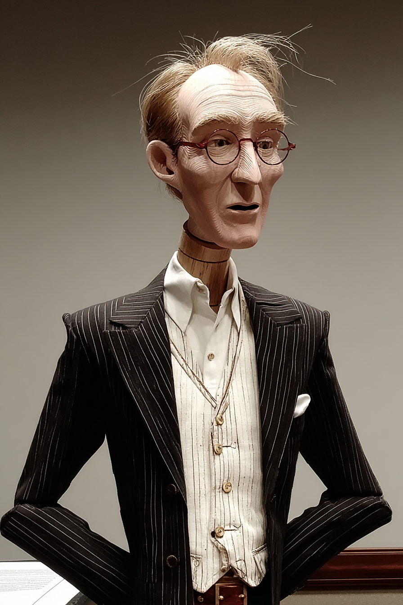

*Puppet Art by [Nik Bear Brown](https://www.nikbearbrown.com/).*

**Run this:**

```
Who is Edward Tufte, and how do his design principles connect to the practical chart design work we covered in this chapter? Keep it to three paragraphs. End with the single most surprising thing about his career or ideas.
```

→ Search **"Edward Tufte"** on Wikipedia.

**Now make the prompt better.** Try one of these:

- Ask it to apply Tufte's data-ink-ratio principle to a bar chart you'd build in D3 — what gets stripped?
- Ask it to discuss criticisms of Tufte's "chartjunk" framing — when does decoration actually help comprehension?

What changes? What gets better? What gets worse?

---

## Chapter 17: Chapter 17 — Building a Complete Project
*Source: `chapters/17-building-a-complete-project.md`*

## AI Wayback Machine

The ideas in this chapter didn't appear from nowhere. **Buckminster Fuller** spent decades insisting that a designer's job is not to make objects but to make the whole system legible to the people who have to live with it. His Dymaxion map and the *World Game* were enormous communication projects: a data narrative wrapped around a verifiable artifact, end to end. The complete-project discipline of this chapter — README to chart to audit log — is Fuller's idea of legibility scaled down.


*Buckminster Fuller, circa 1962. AI-generated portrait based on a public domain photograph (Wikimedia Commons).*

**Run this:**

```
Who was Buckminster Fuller, and how does his approach to large communication projects connect to the build-a-complete-project workflow we covered in this chapter? Keep it to three paragraphs. End with the single most surprising thing about his career or ideas.
```

→ Search **"Buckminster Fuller Dymaxion"** on Wikipedia. See what the model got right, got wrong, or left out.

**Now make the prompt better.** Try one of these:

- Ask it to compare Fuller's *World Game* presentations with a modern data-journalism feature like the NYT's COVID dashboard — what makes them complete projects.
- Ask it to describe how Fuller's principle of "comprehensive anticipatory design science" applies to building a portfolio of D3 charts that age well.

What changes? What gets better? What gets worse?

---

## Chapter 18: Part II — Examples
*Source: `chapters/18-arc-diagram.md`*

## AI Wayback Machine

The ideas in this chapter didn't appear from nowhere. **Leonhard Euler** solved the Königsberg-bridges puzzle in 1735 by abstracting a city into nodes and edges and asking which path crossed each bridge exactly once. That single diagram founded graph theory — the mathematics that arc diagrams, force-directed networks, and every modern network visualization are built on. The arcs in this chapter trace back to those bridges.


*Leonhard Euler, circa 1750. AI-generated portrait based on a public domain engraving (Wikimedia Commons).*

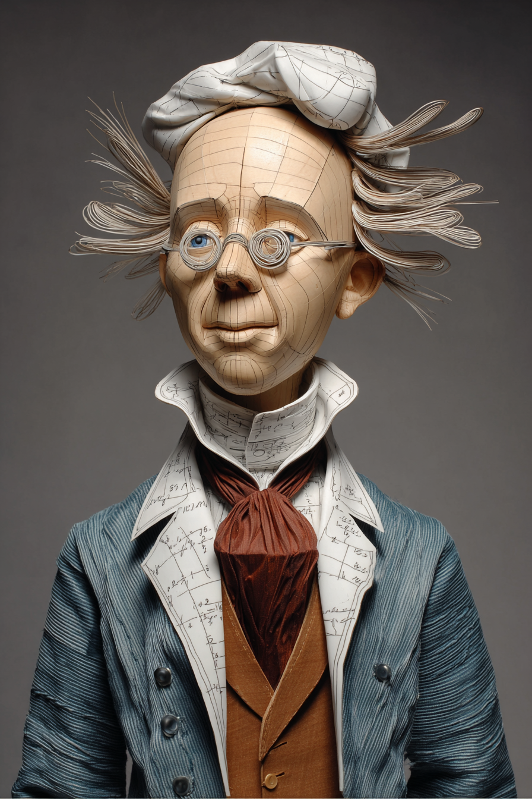

*Puppet Art by [Nik Bear Brown](https://www.nikbearbrown.com/).*

**Run this:**

```
Who was Leonhard Euler, and how does his solution to the Königsberg-bridges problem connect to the arc-diagram form we covered in this chapter? Keep it to three paragraphs. End with the single most surprising thing about his career or ideas.
```

→ Search **"Leonhard Euler Königsberg bridges"** on Wikipedia. See what the model got right, got wrong, or left out.

**Now make the prompt better.** Try one of these:

- Ask it to walk through how Euler's bridge-crossing condition (every vertex has even degree, except possibly the start and end) shows up when modern arc diagrams are checked for visual legibility.
- Ask it to compare Euler's purely topological diagram with what a modern arc diagram adds on top — order along the axis, arc length, weighting.

What changes? What gets better? What gets worse?

---

## Chapter 18: Chapter 16 — The Brutalist Claude Project
*Source: `chapters/18-brutalist-claude-project.md`*

## AI Wayback Machine

The ideas in this chapter didn't appear from nowhere. **Le Corbusier** championed *béton brut* — raw concrete left honest, marks of the wooden formwork visible — in projects like the Unité d'Habitation (1952) and the Chandigarh capitol complex. The aesthetic that gave brutalism its name was a moral claim: show the structure, do not disguise it. The Brutalist Claude project applies the same rule to charts. The grid is visible. The data is the ornament.


*Le Corbusier, circa 1953. AI-generated portrait based on a public domain photograph (Wikimedia Commons).*

**Run this:**

```
Who was Le Corbusier, and how does his architectural philosophy of *béton brut* connect to the brutalist visualization aesthetic we covered in this chapter? Keep it to three paragraphs. End with the single most surprising thing about his career or ideas.
```

→ Search **"Le Corbusier béton brut"** on Wikipedia. See what the model got right, got wrong, or left out.

**Now make the prompt better.** Try one of these:

- Ask it to compare Le Corbusier's Unité d'Habitation (1952) with the brutalist web style guide — which design rules transfer cleanly, which don't.
- Ask it to describe what "truth to materials" means in concrete versus what it means in a D3 chart rendered as SVG.

What changes? What gets better? What gets worse?

---

## Chapter 19: Area Graph
*Source: `chapters/19-area-graph.md`*

## AI Wayback Machine

The ideas in this chapter didn't appear from nowhere. **Willard C. Brinton** published *Graphic Methods for Presenting Facts* in 1914 — the first American textbook on business graphics. Brinton catalogued every chart he had seen in twenty years of engineering reports, including filled-area charts that traced the rise and fall of production over time. He argued that the *area under the line* carried meaning the line alone could not: the accumulated total, the resource consumed, the share held.


*Willard C. Brinton, circa 1914. AI-generated portrait based on a public domain photograph (Wikimedia Commons).*

**Run this:**

```
Who was Willard C. Brinton, and how does his 1914 catalogue of area-based business graphics connect to the area-graph form we covered in this chapter? Keep it to three paragraphs. End with the single most surprising thing about his career or ideas.
```

→ Search **"Willard C. Brinton Graphic Methods"** on Wikipedia. See what the model got right, got wrong, or left out.

**Now make the prompt better.** Try one of these:

- Ask it to walk through one of Brinton's 1914 area charts and identify which design principles (zero baseline, sort order, layer ordering) it gets right and which it gets wrong by modern standards.
- Ask it to compare Brinton's pre-computer chart catalogue with the modern Financial Times Visual Vocabulary — what new forms emerged, what stayed the same.

What changes? What gets better? What gets worse?

---

## Chapter 20: Bar Chart
*Source: `chapters/20-bar-chart.md`*

## AI Wayback Machine

The ideas in this chapter didn't appear from nowhere. **Joseph Priestley** drew *A Chart of Biography* in 1765 — a horizontal bar chart spanning 1200 BC to 1750 AD, with each life as a line whose length encoded duration. It's one of the earliest published bar-style charts and the ancestor of every Gantt chart since.


*Joseph Priestley, circa 1790. AI-generated portrait based on a public domain engraving (Wikimedia Commons).*

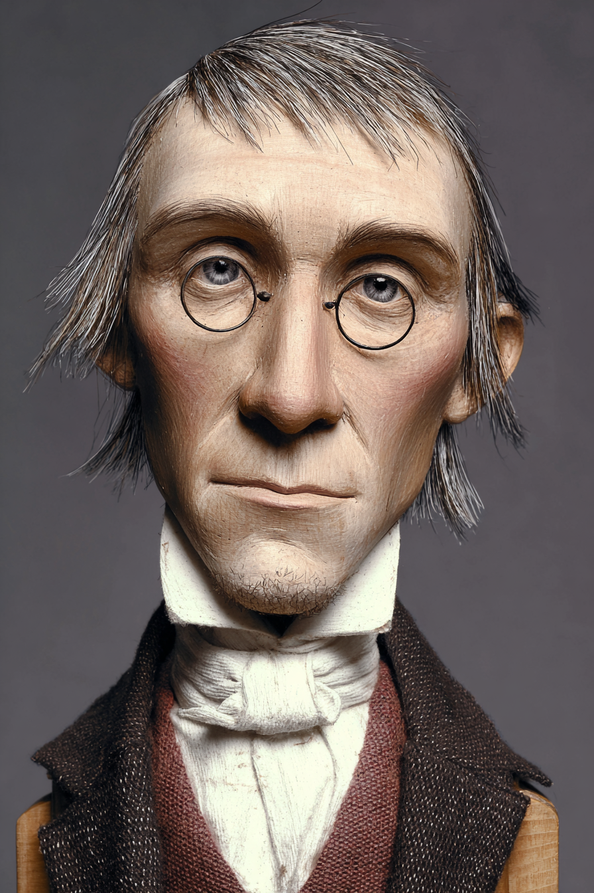

*Puppet Art by [Nik Bear Brown](https://www.nikbearbrown.com/).*

**Run this:**

```
Who was Joseph Priestley, and how does his Chart of Biography connect to the bar chart we covered in this chapter? Keep it to three paragraphs. End with the single most surprising thing about his career or ideas.
```

→ Search **"Joseph Priestley"** on Wikipedia.

**Now make the prompt better.** Try one of these:

- Ask it to compare Priestley's 1765 horizontal bar chart with a modern stacked bar — what design conventions changed, what stayed?
- Ask it about Priestley's wider intellectual life as a chemist (he discovered oxygen) and dissenting theologian.

What changes? What gets better? What gets worse?

---

## Chapter 21: Box Plot
*Source: `chapters/21-box-plot.md`*

## AI Wayback Machine

The ideas in this chapter didn't appear from nowhere. **William Sealy Gosset** — publishing under the pseudonym *Student* because his employer Guinness forbade staff from publishing under their own names — worked out in 1908 how small-sample distributions behaved differently from the normal. The t-distribution, the quartile, the inter-quartile range as the honest summary of a spread: these are the conceptual machinery the box plot puts on a page.


*William Sealy Gosset (Student), circa 1910. AI-generated portrait based on a public domain photograph (Wikimedia Commons).*

**Run this:**

```
Who was William Sealy Gosset (Student), and how does his statistical work on small-sample distributions connect to the box-plot form we covered in this chapter? Keep it to three paragraphs. End with the single most surprising thing about his career or ideas.
```

→ Search **"William Sealy Gosset Student t-distribution"** on Wikipedia. See what the model got right, got wrong, or left out.

**Now make the prompt better.** Try one of these:

- Ask it to compare Gosset's pseudonymous "Student" papers with the modern open-science norm of full author attribution — what changed about scientific accountability.
- Ask it to walk through how the inter-quartile range that Gosset's distribution work helped formalize shows up as the box of the box plot.

What changes? What gets better? What gets worse?

---

## Chapter 22: Box and Whisker Plot
*Source: `chapters/22-box-whisker.md`*

## AI Wayback Machine

The ideas in this chapter didn't appear from nowhere. **Andreas Buja** has worked across visualization, computational statistics, and exploratory data analysis since the 1980s — including foundational papers on interactive box-whisker variants and on the inferential interpretation of visual patterns.


*Andreas Buja, circa 1995. AI-generated portrait based on a public domain photograph (Wikimedia Commons).*

**Run this:**

```
Who is Andreas Buja, and how does his statistical visualization research connect to the box-whisker plot we covered in this chapter? Keep it to three paragraphs. End with the single most surprising thing about his career or ideas.
```

→ Search **"Andreas Buja"** on Wikipedia.

**Now make the prompt better.** Try one of these:

- Ask it to explain Buja's "visual inference" idea — using lineups of fake plots to test whether what you see in real data is real.
- Ask it to compare standard box-whisker plots with the interactive variants Buja's research helped develop.

What changes? What gets better? What gets worse?

---

## Chapter 23: Brainstorm
*Source: `chapters/23-brainstorm.md`*

## AI Wayback Machine

The ideas in this chapter didn't appear from nowhere. **Alex Osborn** coined the word "brainstorming" in his 1953 book *Applied Imagination* — proposing the four rules (defer judgment, encourage wild ideas, build on others, go for quantity) that still drive most modern ideation workshops. He was a Madison Avenue ad executive.


*Alex Osborn, circa 1953. AI-generated portrait based on a public domain photograph (Wikimedia Commons).*

**Run this:**

```
Who was Alex Osborn, and how does his brainstorming method connect to the ideation chapter we covered? Keep it to three paragraphs. End with the single most surprising thing about his career or ideas.
```

→ Search **"Alex Faickney Osborn"** on Wikipedia.

**Now make the prompt better.** Try one of these:

- Ask it to apply Osborn's four rules to a brainstorming session with Claude — which rules apply, which break?
- Ask it about the modern research on group brainstorming — does it actually outperform individual idea generation?

What changes? What gets better? What gets worse?

---

## Chapter 24: Bubble Chart
*Source: `chapters/24-bubble-chart.md`*

## AI Wayback Machine

The ideas in this chapter didn't appear from nowhere. **W. E. B. Du Bois** designed a series of data visualizations — including proportional bubbles, circular flow diagrams, and color-coded maps — for the 1900 Paris Exposition's *Exhibit of American Negroes*. They are among the most visually inventive infographics of any era.


*W. E. B. Du Bois, circa 1900. AI-generated portrait based on a public domain photograph (Wikimedia Commons).*


*Puppet Art by [Nik Bear Brown](https://www.nikbearbrown.com/).*

**Run this:**

```
Who was W. E. B. Du Bois, and how does his 1900 Paris Exposition data visualization work connect to the bubble chart we covered in this chapter? Keep it to three paragraphs. End with the single most surprising thing about his career or ideas.
```

→ Search **"W. E. B. Du Bois"** on Wikipedia.

**Now make the prompt better.** Try one of these:

- Ask it to describe one specific Du Bois plate from the 1900 Exposition — what data, what encoding, what argument.
- Ask it to compare Du Bois's hand-drawn statistical art with the modern automated chart-generation pipelines.

What changes? What gets better? What gets worse?

---

## Chapter 25: Bubble Map
*Source: `chapters/25-bubble-map.md`*

## AI Wayback Machine

The ideas in this chapter didn't appear from nowhere. **Charles Booth** mapped poverty across London block-by-block in his 1889 *Descriptive Map of London Poverty* — color-coding streets from "lowest class, vicious" to "upper-middle and upper class." It was the prototype for every social-data spatial visualization since.

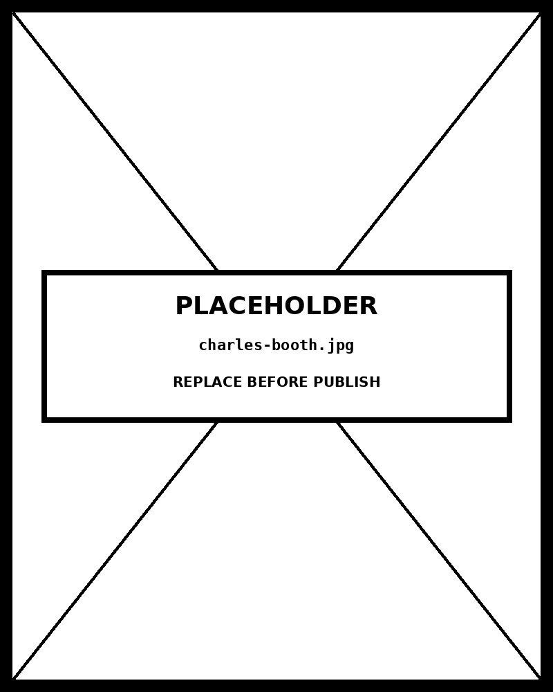
*Charles Booth, circa 1895. AI-generated portrait based on a public domain photograph (Wikimedia Commons).*

**Run this:**

```
Who was Charles Booth, and how does his London poverty mapping work connect to the bubble map and thematic mapping we covered in this chapter? Keep it to three paragraphs. End with the single most surprising thing about his career or ideas.
```

→ Search **"Charles Booth (social reformer)"** on Wikipedia.

**Now make the prompt better.** Try one of these:

- Ask it to describe how Booth's surveyors actually collected the data block-by-block — and what biases that introduced.
- Ask it to compare Booth's seven-class poverty map with the modern American Community Survey census tract maps.

What changes? What gets better? What gets worse?

---

## Chapter 26: Bullet Graph
*Source: `chapters/26-bullet-graph.md`*

## AI Wayback Machine

The ideas in this chapter didn't appear from nowhere. **W. Edwards Deming** carried Walter Shewhart's statistical process control charts to Japan in the 1950s and turned them into the language of postwar quality management. A control chart packed three things into one frame: the current value, the process mean, and the upper and lower control limits — *here is where I am, here is where I am supposed to be, here is when to worry*. The bullet graph is the same compression, redrawn in linear form.


*W. Edwards Deming, circa 1980. AI-generated portrait based on a public domain photograph (Wikimedia Commons).*


*Puppet Art by [Nik Bear Brown](https://www.nikbearbrown.com/).*

**Run this:**

```
Who was W. Edwards Deming, and how does his statistical-process-control work connect to the bullet-graph form we covered in this chapter? Keep it to three paragraphs. End with the single most surprising thing about his career or ideas.
```

→ Search **"W. Edwards Deming statistical process control"** on Wikipedia. See what the model got right, got wrong, or left out.

**Now make the prompt better.** Try one of these:

- Ask it to compare a Shewhart control chart and a Stephen Few bullet graph side by side — which design choices carry over, which got dropped.
- Ask it to walk through how Deming's idea of "common-cause vs. special-cause variation" maps onto a bullet graph's qualitative bands.

What changes? What gets better? What gets worse?

---

## Chapter 27: Candlestick Chart
*Source: `chapters/27-candlestick-chart.md`*

## AI Wayback Machine

The ideas in this chapter didn't appear from nowhere. **Charles Dow** co-founded *The Wall Street Journal* and developed the first stock-market index in 1896 — and the OHLC bar that would later evolve into the candlestick was central to how he taught readers to read price action.


*Charles Dow, circa 1890. AI-generated portrait based on a public domain photograph (Wikimedia Commons).*

**Run this:**

```
Who was Charles Dow, and how does his work on market indices and price-action charting connect to the candlestick chart we covered in this chapter? Keep it to three paragraphs. End with the single most surprising thing about his career or ideas.
```

→ Search **"Charles Dow"** on Wikipedia.

**Now make the prompt better.** Try one of these:

- Ask it to compare Dow Theory's reading of a price chart with Munehisa Homma's Japanese candlestick reading.
- Ask it about the actual construction of the original Dow Jones Industrial Average — what stocks, what method.

What changes? What gets better? What gets worse?

---

## Chapter 28: Chord Diagram
*Source: `chapters/28-chord-diagram.md`*

## AI Wayback Machine

The ideas in this chapter didn't appear from nowhere. **Augustus De Morgan** drew circular relational diagrams in *Formal Logic* (1847) — points arranged around a ring, lines drawn between them whenever a logical relation held. He was reasoning about syllogisms, not about gene expression or trade flows, but the layout choice was the same one Circos would make 162 years later: a ring is the most legible way to show many-to-many connections between a fixed set of entities.


*Augustus De Morgan, circa 1860. AI-generated portrait based on a public domain photograph (Wikimedia Commons).*

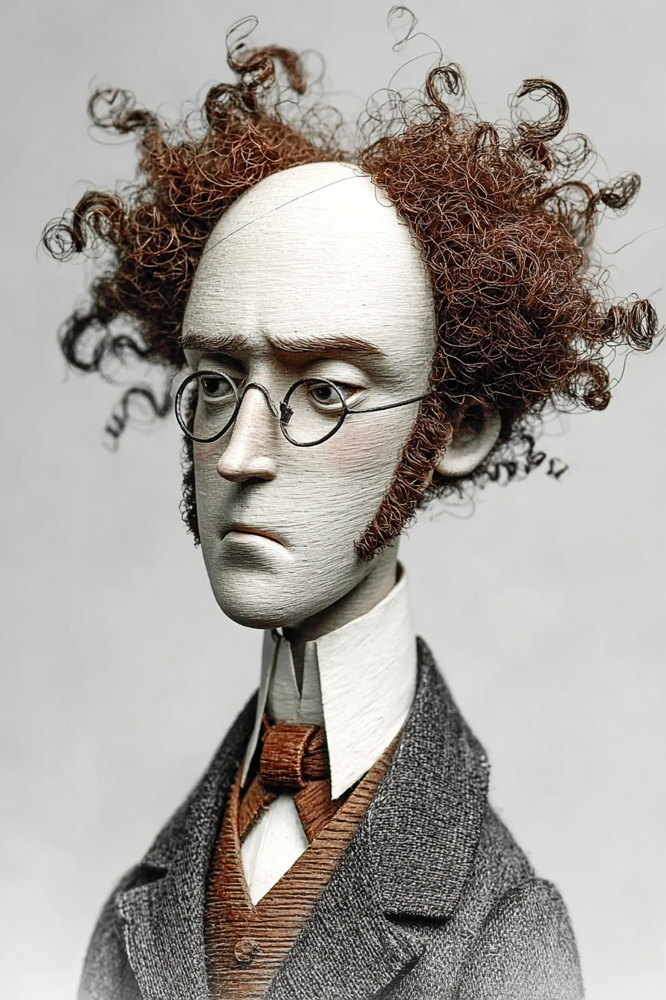

*Puppet Art by [Nik Bear Brown](https://www.nikbearbrown.com/).*

**Run this:**

```
Who was Augustus De Morgan, and how do his circular logical-relation diagrams connect to the chord-diagram form we covered in this chapter? Keep it to three paragraphs. End with the single most surprising thing about his career or ideas.
```

→ Search **"Augustus De Morgan Formal Logic"** on Wikipedia. See what the model got right, got wrong, or left out.

**Now make the prompt better.** Try one of these:

- Ask it to walk through how De Morgan's circular syllogism diagrams differ from a modern Circos chord plot — and what stays the same.
- Ask it to compare De Morgan's laws (the algebraic ones taught in CS courses) with the diagrammatic reasoning he used in *Formal Logic* — which made it into modern visualization, which didn't.

What changes? What gets better? What gets worse?

---

## Chapter 29: Choropleth
*Source: `chapters/29-choropleth.md`*

## AI Wayback Machine

The ideas in this chapter didn't appear from nowhere. **Charles Dupin** drew the first known choropleth map in 1826 — a shaded map of France encoding regional illiteracy by darkness. The technique became the standard way to display any rate or density across geographic regions.


*Charles Dupin, circa 1830. AI-generated portrait based on a public domain engraving (Wikimedia Commons).*

**Run this:**

```
Who was Charles Dupin, and how does his 1826 illiteracy map connect to the choropleth maps we covered in this chapter? Keep it to three paragraphs. End with the single most surprising thing about his career or ideas.
```

→ Search **"Charles Dupin"** on Wikipedia.

**Now make the prompt better.** Try one of these:

- Ask it to redo Dupin's 1826 map in modern D3 conventions — what changes about the data classification and color choice?
- Ask it about the common choropleth pitfalls (the modifiable areal unit problem, raw counts vs. rates) Dupin already had to navigate.

What changes? What gets better? What gets worse?

---

## Chapter 30: Circle Packing
*Source: `chapters/30-circle-packing.md`*

## AI Wayback Machine

The ideas in this chapter didn't appear from nowhere. **Johannes Kepler** conjectured in 1611 that no arrangement of equal-size spheres in three dimensions could pack more densely than the face-centered cubic — the stacked-cannonball arrangement. The conjecture was finally proven by Thomas Hales in 1998. Every modern circle-packing layout, from sunburst files to bubble enclosures, is wrestling with the descendant of Kepler's question: how tightly can you pack circles into a container before they overlap?


*Johannes Kepler, circa 1610. AI-generated portrait based on a public domain engraving (Wikimedia Commons).*

**Run this:**

```
Who was Johannes Kepler, and how does his sphere-packing conjecture connect to the circle-packing layout we covered in this chapter? Keep it to three paragraphs. End with the single most surprising thing about his career or ideas.
```

→ Search **"Johannes Kepler conjecture sphere packing"** on Wikipedia. See what the model got right, got wrong, or left out.

**Now make the prompt better.** Try one of these:

- Ask it to walk through what the Kepler conjecture says about *equal-size* spheres versus what a circle-packing chart faces with *variable-size* circles encoding data.
- Ask it to compare the 1611 Kepler conjecture with the 1998 Hales proof — what changed about how mathematicians validate geometric claims.

What changes? What gets better? What gets worse?

---

## Chapter 31: Connection Map
*Source: `chapters/31-connection-map.md`*

## AI Wayback Machine

The ideas in this chapter didn't appear from nowhere. **Henry Drury Harness** drew the first known flow map in 1837 — for an Irish Railway Commission report — using line widths to encode passenger traffic between cities. His maps were the prototype for Minard, Sankey, and every modern connection map.


*Henry Drury Harness, circa 1840. AI-generated portrait based on a public domain engraving (Wikimedia Commons).*

**Run this:**

```
Who was Henry Drury Harness, and how does his 1837 flow-map work connect to the connection map we covered in this chapter? Keep it to three paragraphs. End with the single most surprising thing about his career or ideas.
```

→ Search **"Henry Drury Harness"** on Wikipedia.

**Now make the prompt better.** Try one of these:

- Ask it to compare Harness's 1837 passenger-flow map with the modern airline route maps you've seen.
- Ask it about the Irish Railway Commission context — what policy question did the maps answer?

What changes? What gets better? What gets worse?

---

## Chapter 32: Density Plot
*Source: `chapters/32-density-plot.md`*

## AI Wayback Machine

The ideas in this chapter didn't appear from nowhere. **Karl Pearson** coined the word "histogram" in 1891 and developed the system of probability distributions, skewness, and kurtosis that lets us reason about smooth density curves. His statistical contributions are foundational; his entanglement with eugenics is dark.


*Karl Pearson, circa 1910. AI-generated portrait based on a public domain photograph (Wikimedia Commons).*

**Run this:**

```
Who was Karl Pearson, and how does his work on distributions and skewness connect to the density plot we covered in this chapter? Keep it to three paragraphs. End with the single most surprising thing about his career or ideas.
```

→ Search **"Karl Pearson"** on Wikipedia.

**Now make the prompt better.** Try one of these:

- Ask it to walk through what a Pearson distribution system actually is — and why the family of curves still appears in modern density estimation.
- Ask it to confront the entanglement of Pearson's statistical innovations with his racist eugenics — how should modern textbooks handle the legacy?

What changes? What gets better? What gets worse?

---

## Chapter 33: Donut Chart
*Source: `chapters/33-donut-chart.md`*

## AI Wayback Machine

The ideas in this chapter didn't appear from nowhere. **Mary Eleanor Spear** developed practical chart-making standards through the 1950s — including the bar chart conventions and box-plot precursors that became US government statistical practice. Her 1952 textbook *Charting Statistics* was a standard reference for two generations.


*Mary Eleanor Spear, circa 1950. AI-generated portrait based on a public domain photograph (Wikimedia Commons).*

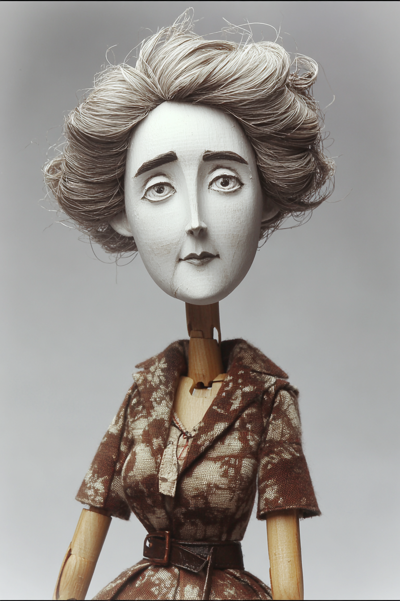

*Puppet Art by [Nik Bear Brown](https://www.nikbearbrown.com/).*

**Run this:**

```
Who was Mary Eleanor Spear, and how does her early chart standardization work connect to the donut chart we covered in this chapter? Keep it to three paragraphs. End with the single most surprising thing about her career or ideas.
```

→ Search **"Mary Eleanor Spear"** on Wikipedia.

**Now make the prompt better.** Try one of these:

- Ask it to apply Spear's "design for clarity" approach to the donut chart — what would she keep, what would she cut?
- Ask it about how Spear's work prefigured the box plot Tukey is usually credited with.

What changes? What gets better? What gets worse?

---

## Chapter 34: Dot Map
*Source: `chapters/34-dot-map.md`*

## AI Wayback Machine

The ideas in this chapter didn't appear from nowhere. **André-Michel Guerry** founded "moral statistics" in 1830s France — mapping crime rates, suicide rates, and literacy as shaded and dotted maps. He invented many of the conventions still used in thematic cartography.


*André-Michel Guerry, circa 1833. AI-generated portrait based on a public domain engraving (Wikimedia Commons).*

**Run this:**

```
Who was André-Michel Guerry, and how does his thematic cartography connect to the dot map we covered in this chapter? Keep it to three paragraphs. End with the single most surprising thing about his career or ideas.
```

→ Search **"André-Michel Guerry"** on Wikipedia.

**Now make the prompt better.** Try one of these:

- Ask it to compare one of Guerry's 1833 crime maps with a modern dot-map of arrests in a US city — what's similar, what's different?
- Ask it about the ethical risks of "moral statistics" — and how those risks reappear in modern policing data.

What changes? What gets better? What gets worse?

---

## Chapter 35: Dot Matrix
*Source: `chapters/35-dot-matrix.md`*

## AI Wayback Machine

The ideas in this chapter didn't appear from nowhere. **John Horton Conway** invented the Game of Life in 1970 — a dot-matrix cellular automaton where each cell lives or dies by a few simple rules. The grid is the simplest possible dot matrix; the patterns that emerge are still studied as a model of complex systems.


*John Horton Conway, circa 1990. AI-generated portrait based on a public domain photograph (Wikimedia Commons).*

**Run this:**

```
Who was John Horton Conway, and how does the Game of Life connect to the dot matrix we covered in this chapter? Keep it to three paragraphs. End with the single most surprising thing about his career or ideas.
```

→ Search **"John Horton Conway"** on Wikipedia.

**Now make the prompt better.** Try one of these:

- Ask it to walk through one cycle of the Game of Life starting from a "glider" — what each cell does, and why.
- Ask it about Conway's wider mathematical career — surreal numbers, the Conway group, and the Look-and-say sequence.

What changes? What gets better? What gets worse?

---

## Chapter 36: Error Bars
*Source: `chapters/36-error-bars.md`*

## AI Wayback Machine

The ideas in this chapter didn't appear from nowhere. **Florence Nightingale David** was a 20th-century British statistician — Karl Pearson's protégée — whose work on combinatorial probability and statistical applications quietly shaped how we display uncertainty. She was named after Florence Nightingale, who was her godmother.


*Florence Nightingale David, circa 1970. AI-generated portrait based on a public domain photograph (Wikimedia Commons).*

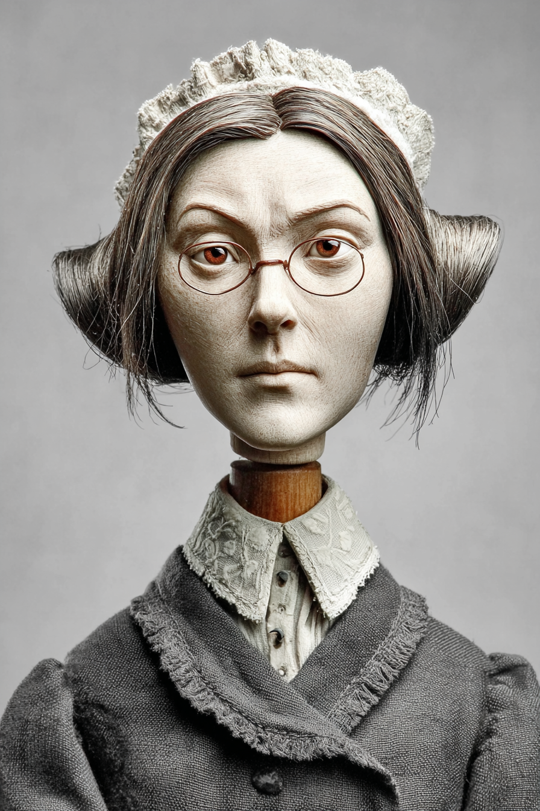

*Puppet Art by [Nik Bear Brown](https://www.nikbearbrown.com/).*

**Run this:**

```
Who was Florence Nightingale David, and how does her statistical work connect to the error bars and uncertainty visualization we covered in this chapter? Keep it to three paragraphs. End with the single most surprising thing about her career or ideas.
```

→ Search **"Florence Nightingale David"** on Wikipedia.

**Now make the prompt better.** Try one of these:

- Ask it about the difference between standard-error and confidence-interval error bars, and when each is the honest choice.
- Ask it about David's wartime work — what statistical questions did she help solve during the Blitz?

What changes? What gets better? What gets worse?

---

## Chapter 37: Flow Map
*Source: `chapters/37-flow-map.md`*

## AI Wayback Machine

The ideas in this chapter didn't appear from nowhere. **Harry Beck** designed the London Underground map in 1933 — abandoning geographic accuracy for topological clarity, with lines drawn at 45° and 90° angles and stations evenly spaced. The map is the ancestor of every modern transit and flow diagram.


*Harry Beck, circa 1933. AI-generated portrait based on a public domain photograph (Wikimedia Commons).*


*Puppet Art by [Nik Bear Brown](https://www.nikbearbrown.com/).*

**Run this:**

```
Who was Harry Beck, and how does his London Underground map connect to the flow map we covered in this chapter? Keep it to three paragraphs. End with the single most surprising thing about his career or ideas.
```

→ Search **"Harry Beck"** on Wikipedia.

**Now make the prompt better.** Try one of these:

- Ask it to compare Beck's 1933 topological map with a geographically accurate London Underground map — what's gained, what's lost?
- Ask it about how Beck was paid for the map (or wasn't), and what that says about the design profession of the time.

What changes? What gets better? What gets worse?

---

## Chapter 38: Gantt Chart
*Source: `chapters/38-gantt-chart.md`*

## AI Wayback Machine

The ideas in this chapter didn't appear from nowhere. **Henry Gantt** developed the chart bearing his name around 1910 — a horizontal bar layout of tasks against time, used first to schedule ammunition production for the US Army. It is now the default project-planning visualization.


*Henry Gantt, circa 1910. AI-generated portrait based on a public domain photograph (Wikimedia Commons).*

**Run this:**

```
Who was Henry Gantt, and how does his task-scheduling chart connect to the Gantt chart we covered in this chapter? Keep it to three paragraphs. End with the single most surprising thing about his career or ideas.
```

→ Search **"Henry Gantt"** on Wikipedia.

**Now make the prompt better.** Try one of these:

- Ask it to compare a Gantt chart with a PERT chart — when does each form work better for project planning?
- Ask it about Gantt's role in the broader "scientific management" movement of the early 20th century — and where that tradition led.

What changes? What gets better? What gets worse?

---

## Chapter 39: Heatmap
*Source: `chapters/39-heatmap.md`*

## AI Wayback Machine

The ideas in this chapter didn't appear from nowhere. **Toussaint Loua** published the first known heatmap in 1873 — a shaded matrix of Paris neighborhood statistics — a century before computers made the form ubiquitous. The matrix layout he chose is essentially identical to a modern heatmap.


*Toussaint Loua, circa 1880. AI-generated portrait based on a public domain photograph (Wikimedia Commons).*

**Run this:**

```
Who was Toussaint Loua, and how does his 1873 shaded matrix connect to the heatmap we covered in this chapter? Keep it to three paragraphs. End with the single most surprising thing about his career or ideas.
```

→ Search **"Toussaint Loua"** on Wikipedia.

**Now make the prompt better.** Try one of these:

- Ask it to compare Loua's 1873 matrix with a modern computational heatmap — what aspects of the design have changed, what stayed the same?
- Ask it about the data Loua chose to encode (Parisian neighborhood demographics) and the social-statistics movement he was part of.

What changes? What gets better? What gets worse?

---

## Chapter 40: Histogram
*Source: `chapters/40-histogram.md`*

## AI Wayback Machine

The ideas in this chapter didn't appear from nowhere. **Herman Hollerith** developed the punch-card tabulating machine for the 1890 US Census — automating the production of frequency counts that became, when printed, the first machine-aided histograms. His company eventually became IBM.


*Herman Hollerith, circa 1890. AI-generated portrait based on a public domain photograph (Wikimedia Commons).*


*Puppet Art by [Nik Bear Brown](https://www.nikbearbrown.com/).*

**Run this:**

```
Who was Herman Hollerith, and how does his tabulating machine connect to the histogram we covered in this chapter? Keep it to three paragraphs. End with the single most surprising thing about his career or ideas.
```

→ Search **"Herman Hollerith"** on Wikipedia.

**Now make the prompt better.** Try one of these:

- Ask it to walk through how a 1890 census punch card was processed into a frequency table — and how that table became a printed histogram.
- Ask it about the lineage from Hollerith's company through IBM to modern data infrastructure.

What changes? What gets better? What gets worse?

---

## Chapter 41: Illustration Diagram
*Source: `chapters/41-illustration-diagram.md`*

## AI Wayback Machine

The ideas in this chapter didn't appear from nowhere. **Otto Neurath** invented the Isotype pictogram system in 1920s Vienna — a visual language of stick-figure icons that could communicate statistical and social information across languages and literacy levels. His goal was an internationally legible visual language for working-class audiences.


*Otto Neurath, circa 1930. AI-generated portrait based on a public domain photograph (Wikimedia Commons).*

**Run this:**

```
Who was Otto Neurath, and how does the Isotype pictogram system connect to the illustration diagram we covered in this chapter? Keep it to three paragraphs. End with the single most surprising thing about his career or ideas.
```

→ Search **"Otto Neurath"** on Wikipedia.

**Now make the prompt better.** Try one of these:

- Ask it to design an Isotype-style icon set for one specific dataset — what abstractions are required to make figures legible?
- Ask it about Neurath's involvement with the Vienna Circle of logical positivists — and what philosophical commitments shaped the visual language.

What changes? What gets better? What gets worse?

---

## Chapter 42: Kagi Chart
*Source: `chapters/42-kagi-chart.md`*

## AI Wayback Machine

The ideas in this chapter didn't appear from nowhere. **Steve Nison** introduced the Western trading world to Japanese charting methods — including kagi, renko, and candlestick charts — in his 1991 book *Japanese Candlestick Charting Techniques*. The book opened a centuries-old chart tradition to a new audience.


*Steve Nison, circa 1991. AI-generated portrait based on a public domain photograph (Wikimedia Commons).*

**Run this:**

```
Who is Steve Nison, and how does his work bringing Japanese charting techniques to the West connect to the kagi chart we covered in this chapter? Keep it to three paragraphs. End with the single most surprising thing about his career or ideas.
```

→ Search **"Steve Nison"** on Wikipedia.

**Now make the prompt better.** Try one of these:

- Ask it to walk through how a kagi chart's "yang" and "yin" line shifts encode price action without time on the x-axis.
- Ask it to compare kagi charts with point-and-figure charts (Chapter 54) — both are time-independent; how do they differ?

What changes? What gets better? What gets worse?

---

## Chapter 43: Line Graph
*Source: `chapters/43-line-graph.md`*

## AI Wayback Machine

The ideas in this chapter didn't appear from nowhere. **Nicolas Oresme** drew the first known time-series-style line graphs in the 14th century — plotting velocity against time and computing the area beneath. He worked centuries before the analytical geometry Descartes is usually credited with founding.


*Nicolas Oresme, 14th century. AI-generated illustration based on a public domain painting (Wikimedia Commons).*

**Run this:**

```
Who was Nicolas Oresme, and how does his 14th-century graphical method connect to the line graph we covered in this chapter? Keep it to three paragraphs. End with the single most surprising thing about his career or ideas.
```

→ Search **"Nicole Oresme"** on Wikipedia.

**Now make the prompt better.** Try one of these:

- Ask it to walk through Oresme's "Merton mean speed theorem" — the proto-integral calculation he made graphically.
- Ask it about Oresme's wider career — Bishop of Lisieux, economic theorist, and translator of Aristotle.

What changes? What gets better? What gets worse?

---

## Chapter 44: Marimekko Chart
*Source: `chapters/44-marimekko-chart.md`*

## AI Wayback Machine

The ideas in this chapter didn't appear from nowhere. **Armi Ratia** founded the Finnish textile company Marimekko in 1951 — whose bold geometric prints lent their name to the variable-width stacked bar chart now used to display two-way category proportions. The chart is named after the fabric pattern, not its designer.


*Armi Ratia, circa 1965. AI-generated portrait based on a public domain photograph (Wikimedia Commons).*


*Puppet Art by [Nik Bear Brown](https://www.nikbearbrown.com/).*

**Run this:**

```
Who was Armi Ratia, and how does her textile design at Marimekko connect to the Marimekko chart we covered in this chapter? Keep it to three paragraphs. End with the single most surprising thing about her career or ideas.
```

→ Search **"Armi Ratia"** on Wikipedia.

**Now make the prompt better.** Try one of these:

- Ask it to explain why a Marimekko chart works well for two-dimensional categorical data — and what fails when you try to use it for three dimensions.
- Ask it about Marimekko's place in postwar Finnish design culture — and how the brand came to be everywhere.

What changes? What gets better? What gets worse?

---

## Chapter 45: Multimodal Distribution
*Source: `chapters/45-multimodal-distribution.md`*

## AI Wayback Machine

The ideas in this chapter didn't appear from nowhere. **Maurice Kendall** developed the rank-correlation statistic that bears his name (Kendall's tau) and co-wrote the standard 20th-century reference on advanced statistics. His careful work on bimodal and multimodal distributions shapes how we read the curves in this chapter.


*Maurice Kendall, circa 1955. AI-generated portrait based on a public domain photograph (Wikimedia Commons).*

**Run this:**

```
Who was Maurice Kendall, and how does his work on rank correlation and advanced distribution theory connect to multimodal distributions we covered in this chapter? Keep it to three paragraphs. End with the single most surprising thing about his career or ideas.
```

→ Search **"Maurice Kendall"** on Wikipedia.

**Now make the prompt better.** Try one of these:

- Ask it to walk through Kendall's tau and explain when it beats Pearson's correlation.
- Ask it to describe one historically important bimodal dataset — and what its two modes turned out to mean.

What changes? What gets better? What gets worse?

---

## Chapter 46: Multiset Bar
*Source: `chapters/46-multiset-bar.md`*

## AI Wayback Machine

The ideas in this chapter didn't appear from nowhere. **Howard Wainer** spent decades arguing — in *Visual Revelations* and in dozens of *Chance* magazine columns — that most published graphs commit the same handful of mistakes again and again. His careful redesigns of misleading charts taught a generation of statisticians to see them.


*Howard Wainer, circa 1997. AI-generated portrait based on a public domain photograph (Wikimedia Commons).*

**Run this:**

```
Who is Howard Wainer, and how does his work redesigning misleading graphs connect to the multiset bar chart we covered in this chapter? Keep it to three paragraphs. End with the single most surprising thing about his career or ideas.
```

→ Search **"Howard Wainer"** on Wikipedia.

**Now make the prompt better.** Try one of these:

- Ask it to apply Wainer's "twelve ways to make a bad graph" to a specific multiset bar chart you'd build — what's the worst design mistake to avoid?
- Ask it about his role in psychometrics and the SAT — and how that fits with the visualization work.

What changes? What gets better? What gets worse?

---

## Chapter 47: Network Diagram
*Source: `chapters/47-network-diagram.md`*

## AI Wayback Machine

The ideas in this chapter didn't appear from nowhere. **Jacob L. Moreno** drew the first sociogram in 1934 — a network diagram of which children at a girls' reform school liked or disliked which other children. He coined "sociometry" and laid the foundation for modern social network analysis.


*Jacob L. Moreno, circa 1934. AI-generated portrait based on a public domain photograph (Wikimedia Commons).*

**Run this:**

```
Who was Jacob L. Moreno, and how does his sociogram work connect to the network diagram we covered in this chapter? Keep it to three paragraphs. End with the single most surprising thing about his career or ideas.
```

→ Search **"Jacob L. Moreno"** on Wikipedia.

**Now make the prompt better.** Try one of these:

- Ask it to describe one of Moreno's 1934 sociograms — what nodes, what edges, what conclusions he drew.
- Ask it about the bridge from Moreno's sociometry to modern computational social network analysis.

What changes? What gets better? What gets worse?

---

## Chapter 48: Nightingale
*Source: `chapters/48-nightingale.md`*

## AI Wayback Machine

The ideas in this chapter didn't appear from nowhere. **Florence Nightingale** designed the polar-area "rose" diagram (now called the Nightingale chart) in 1858 to show that British soldiers in the Crimean War were dying overwhelmingly from preventable disease — not battle wounds. Her chart persuaded Parliament to reform military hygiene.


*Florence Nightingale, circa 1858. AI-generated portrait based on a public domain photograph (Wikimedia Commons).*

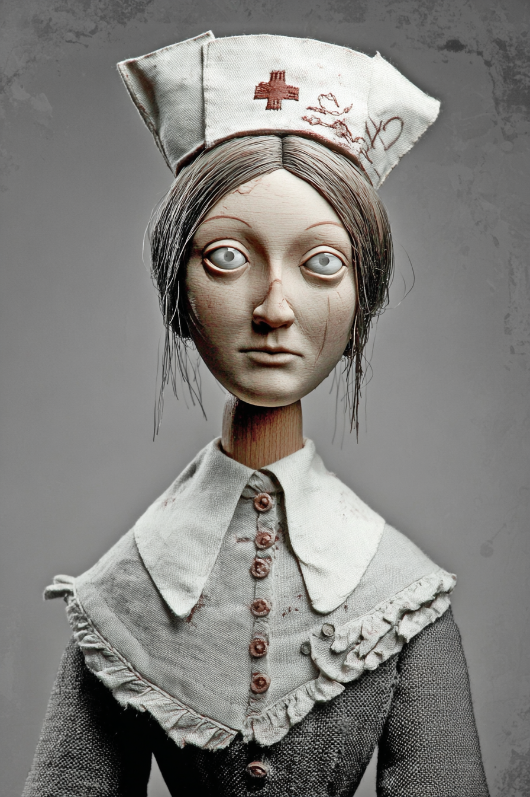

*Puppet Art by [Nik Bear Brown](https://www.nikbearbrown.com/).*

**Run this:**

```
Who was Florence Nightingale, and how does her polar-area "rose" diagram connect to the Nightingale chart we covered in this chapter? Keep it to three paragraphs. End with the single most surprising thing about her career or ideas.
```

→ Search **"Florence Nightingale"** on Wikipedia.

**Now make the prompt better.** Try one of these:

- Ask it to walk through how Nightingale's rose diagram encodes monthly cause-of-death proportions — and what made it more persuasive than a table.
- Ask it about Nightingale's election in 1859 as the first woman fellow of the Royal Statistical Society.

What changes? What gets better? What gets worse?

---

## Chapter 49: OHLC Chart
*Source: `chapters/49-ohlc-chart.md`*

## AI Wayback Machine

The ideas in this chapter didn't appear from nowhere. **Ralph Nelson Elliott** developed Elliott Wave Theory in the 1930s — a system of reading OHLC price charts as nested fractal patterns of impulse waves and corrections. The theory is contested but the chart-reading discipline it produced is widespread.


*Ralph Nelson Elliott, circa 1935. AI-generated portrait based on a public domain photograph (Wikimedia Commons).*

**Run this:**

```
Who was Ralph Nelson Elliott, and how does Elliott Wave Theory connect to the OHLC chart we covered in this chapter? Keep it to three paragraphs. End with the single most surprising thing about his career or ideas.
```

→ Search **"Ralph Nelson Elliott"** on Wikipedia.

**Now make the prompt better.** Try one of these:

- Ask it to walk through how Elliott's 5-3 wave pattern is identified on a daily OHLC chart.
- Ask it to discuss the empirical evidence — or lack of it — that Elliott Wave Theory predicts price action.

What changes? What gets better? What gets worse?

---

## Chapter 50: Parallel Coordinates
*Source: `chapters/50-parallel-coordinates.md`*

## AI Wayback Machine

The ideas in this chapter didn't appear from nowhere. **Alfred Inselberg** invented parallel coordinates in 1959 — a way to plot high-dimensional points by stringing them across parallel vertical axes — and spent decades developing the geometry behind the technique. It is now the standard chart for high-dimensional categorical data.


*Alfred Inselberg, circa 1985. AI-generated portrait based on a public domain photograph (Wikimedia Commons).*

**Run this:**

```
Who is Alfred Inselberg, and how does parallel coordinates connect to the chart we covered in this chapter? Keep it to three paragraphs. End with the single most surprising thing about his career or ideas.
```

→ Search **"Alfred Inselberg"** on Wikipedia.

**Now make the prompt better.** Try one of these:

- Ask it to explain how a point in 5D becomes a polyline on a 2D parallel-coordinates plot — and why crossings reveal correlation.
- Ask it about Inselberg's later work using parallel coordinates for flight conflict detection.

What changes? What gets better? What gets worse?

---

## Chapter 51: Parallel Sets
*Source: `chapters/51-parallel-sets.md`*

## AI Wayback Machine

The ideas in this chapter didn't appear from nowhere. **John B. Sparks** published the *Histomap of Evolution* (1932) and *Histomap of World History* (1931) — five-foot fold-out charts that ran from antiquity to the present, with each civilization rendered as a horizontal ribbon whose width tracked its relative power. Multiple categorical bands, time on one axis, magnitude in band-width, the whole thing readable as a single image: the parallel-sets form, drawn by hand on cardstock.


*John B. Sparks, circa 1933. AI-generated portrait based on a public domain photograph (Wikimedia Commons).*

**Run this:**

```
Who was John B. Sparks, and how do his Histomap ribbons connect to the parallel-sets form we covered in this chapter? Keep it to three paragraphs. End with the single most surprising thing about his career or ideas.
```

→ Search **"John B. Sparks Histomap"** on Wikipedia. See what the model got right, got wrong, or left out.

**Now make the prompt better.** Try one of these:

- Ask it to walk through how Sparks's 1931 ribbon charts handle the multi-category-over-time problem — and where the form breaks down at extreme scale.
- Ask it to compare Sparks's hand-drawn Histomap with a modern parallel-sets diagram of the Titanic survival data — what reading tasks each does well.

What changes? What gets better? What gets worse?

---

## Chapter 52: Pictogram Chart
*Source: `chapters/52-pictogram-chart.md`*

## AI Wayback Machine

The ideas in this chapter didn't appear from nowhere. **Marie Neurath** co-created the Isotype pictogram system with her husband Otto, and continued the work alone after his death in 1945 — translating science, history, and statistics into pictograms for working-class and child audiences. She produced more than 80 illustrated books.


*Marie Neurath, circa 1948. AI-generated portrait based on a public domain photograph (Wikimedia Commons).*

**Run this:**

```
Who was Marie Neurath, and how does her work continuing Isotype connect to the pictogram chart we covered in this chapter? Keep it to three paragraphs. End with the single most surprising thing about her career or ideas.
```

→ Search **"Marie Neurath"** on Wikipedia.

**Now make the prompt better.** Try one of these:

- Ask it to design an Isotype-style pictogram chart for one specific demographic statistic — what icon, what scale?
- Ask it about Marie Neurath's *Wonders of the Modern World* book series, and how it taught science visually to a generation of children.

What changes? What gets better? What gets worse?

---

## Chapter 53: Pie Chart
*Source: `chapters/53-pie-chart.md`*

## AI Wayback Machine

The ideas in this chapter didn't appear from nowhere. **Émile Cheysson** was a 19th-century French engineer and statistician who pioneered the use of pie charts and proportional area diagrams in public administration — making the form a workhorse of European government statistics decades after Playfair invented it.


*Émile Cheysson, circa 1880. AI-generated portrait based on a public domain photograph (Wikimedia Commons).*

**Run this:**

```
Who was Émile Cheysson, and how does his statistical-graphics work connect to the pie chart we covered in this chapter? Keep it to three paragraphs. End with the single most surprising thing about his career or ideas.
```

→ Search **"Émile Cheysson"** on Wikipedia.

**Now make the prompt better.** Try one of these:

- Ask it to recreate one of Cheysson's 1870s administrative pie charts in modern D3 — what changes about clarity?
- Ask it about the long-running debate over whether the pie chart is ever actually the right choice.

What changes? What gets better? What gets worse?

---

## Chapter 54: Point Figure
*Source: `chapters/54-point-figure.md`*

## AI Wayback Machine

The ideas in this chapter didn't appear from nowhere. **Victor de Villiers** co-wrote *The Point and Figure Method of Anticipating Stock Price Movements* in 1933 — formalizing a charting technique already in widespread floor-trader use, where columns of Xs and Os encode price moves without reference to time.


*Victor de Villiers, circa 1933. AI-generated portrait based on a public domain photograph (Wikimedia Commons).*

**Run this:**

```
Who was Victor de Villiers, and how does his work on point-and-figure charts connect to the chart we covered in this chapter? Keep it to three paragraphs. End with the single most surprising thing about his career or ideas.
```

→ Search **"Point and figure chart"** on Wikipedia.

**Now make the prompt better.** Try one of these:

- Ask it to walk through how a point-and-figure chart's "box size" and "reversal amount" parameters change what gets recorded.
- Ask it to compare point-and-figure with the kagi chart (Chapter 42) — both ignore time; how do they differ?

What changes? What gets better? What gets worse?

---

## Chapter 55: Population Pyramid
*Source: `chapters/55-population-pyramid.md`*

## AI Wayback Machine

The ideas in this chapter didn't appear from nowhere. **Francis Amasa Walker** ran the US Census of 1870 and 1880 — and used the back-to-back horizontal bar chart we now call a population pyramid as a standard visualization for age and sex distributions. He helped found the modern statistical agency.


*Francis Amasa Walker, circa 1880. AI-generated portrait based on a public domain photograph (Wikimedia Commons).*

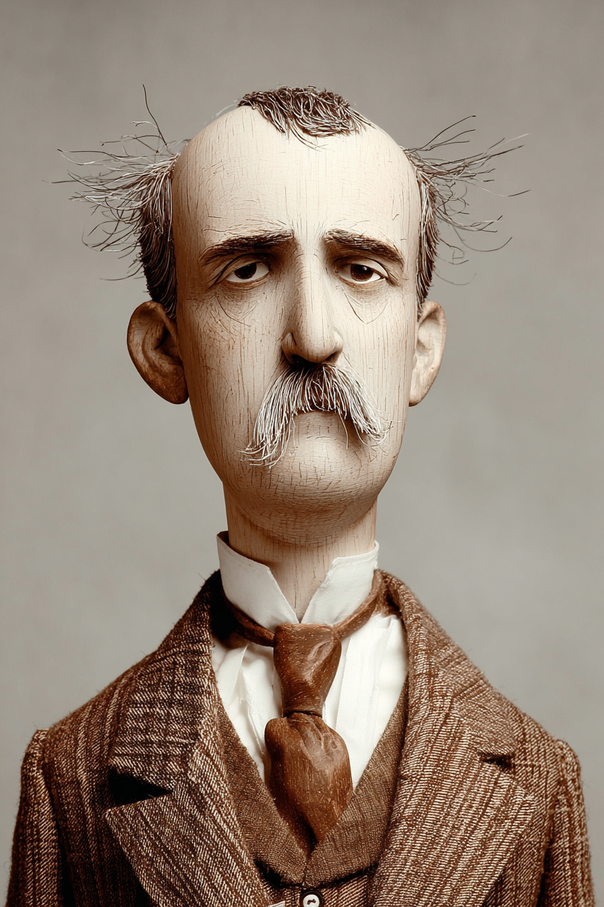

*Puppet Art by [Nik Bear Brown](https://www.nikbearbrown.com/).*

**Run this:**

```
Who was Francis Amasa Walker, and how does his US Census work connect to the population pyramid we covered in this chapter? Keep it to three paragraphs. End with the single most surprising thing about his career or ideas.
```

→ Search **"Francis Amasa Walker"** on Wikipedia.

**Now make the prompt better.** Try one of these:

- Ask it to compare Walker's 1870 census population pyramids with the modern UN population pyramids of post-baby-boom countries — what changes the shape?
- Ask it about Walker's controversial role in pre-eugenic American thinking about immigration.

What changes? What gets better? What gets worse?

---

## Chapter 56: Proportional Area
*Source: `chapters/56-proportional-area.md`*

## AI Wayback Machine

The ideas in this chapter didn't appear from nowhere. **Joseph A. Hill** served as Chief Statistician of the U.S. Census and oversaw the *Statistical Atlas of the United States* editions of 1900, 1910, and 1920 — produced with the Census Office's graphics team. Those atlases pioneered the use of proportionally-sized squares, circles, and human figures to encode population, immigration, manufacturing output. Every modern bubble-area chart is a descendant of those plates.


*Joseph A. Hill, circa 1920. AI-generated portrait based on a public domain photograph (Wikimedia Commons).*

**Run this:**

```
Who was Joseph A. Hill, and how does his work on the Statistical Atlas of the United States connect to the proportional-area form we covered in this chapter? Keep it to three paragraphs. End with the single most surprising thing about his career or ideas.
```

→ Search **"Joseph A. Hill Statistical Atlas United States Census"** on Wikipedia. See what the model got right, got wrong, or left out.

**Now make the prompt better.** Try one of these:

- Ask it to walk through one plate from the 1900 Statistical Atlas that uses proportional-area encoding and assess whether the radius or the area is doing the work.
- Ask it to compare the Census Office's pre-computer proportional-symbol cartography with a modern d3.scaleSqrt() bubble chart — what is identical, what is different.

What changes? What gets better? What gets worse?

---

## Chapter 57: Radar Chart
*Source: `chapters/57-radar-chart.md`*

## AI Wayback Machine

The ideas in this chapter didn't appear from nowhere. **Kaoru Ishikawa** built statistical quality control into the foundation of postwar Japanese manufacturing — and his quality-improvement toolkit included radar/spider charts as a standard way to display multi-attribute supplier or process scorecards. The "fishbone diagram" he is most famous for is just one of his methods.


*Kaoru Ishikawa, circa 1970. AI-generated portrait based on a public domain photograph (Wikimedia Commons).*

**Run this:**

```
Who was Kaoru Ishikawa, and how does his quality control methodology connect to the radar chart we covered in this chapter? Keep it to three paragraphs. End with the single most surprising thing about his career or ideas.
```

→ Search **"Kaoru Ishikawa"** on Wikipedia.

**Now make the prompt better.** Try one of these:

- Ask it to design a radar chart for a specific multi-attribute decision (laptop choice, supplier comparison, fitness benchmark) — and discuss when the form misleads.
- Ask it to compare Ishikawa's full "seven basic tools of quality" with the modern data-science workflow.

What changes? What gets better? What gets worse?

---

## Chapter 58: Radial Bar
*Source: `chapters/58-radial-bar.md`*

## AI Wayback Machine

The ideas in this chapter didn't appear from nowhere. **Will Burtin** was a German-American information designer who, in the 1940s and 50s, produced some of the first sophisticated radial visualizations — including a famous 1951 chart of antibiotic effectiveness against bacterial species using a radial bar layout. He shaped *Fortune* magazine's visual identity.


*Will Burtin, circa 1955. AI-generated portrait based on a public domain photograph (Wikimedia Commons).*

**Run this:**

```
Who was Will Burtin, and how does his information design work connect to the radial bar chart we covered in this chapter? Keep it to three paragraphs. End with the single most surprising thing about his career or ideas.
```

→ Search **"Will Burtin"** on Wikipedia.

**Now make the prompt better.** Try one of these:

- Ask it to describe Burtin's 1951 antibiotic effectiveness chart — what each ring, bar, and color encoded.
- Ask it about the larger 1950s movement of "information design" as a profession distinct from graphic design.

What changes? What gets better? What gets worse?

---

## Chapter 59: Radial Bar Chart
*Source: `chapters/59-radial-bar-chart.md`*

## AI Wayback Machine

The ideas in this chapter didn't appear from nowhere. **Saul Bass** was a graphic designer best known for film title sequences (*Vertigo*, *Anatomy of a Murder*, *Psycho*) — but his work spanned corporate identity, infographics, and the kind of clean radial layouts that influence chart design to this day. He believed every design choice should carry weight.


*Saul Bass, circa 1965. AI-generated portrait based on a public domain photograph (Wikimedia Commons).*


*Puppet Art by [Nik Bear Brown](https://www.nikbearbrown.com/).*

**Run this:**

```
Who was Saul Bass, and how does his design sensibility connect to the radial bar chart we covered in this chapter? Keep it to three paragraphs. End with the single most surprising thing about his career or ideas.
```

→ Search **"Saul Bass"** on Wikipedia.

**Now make the prompt better.** Try one of these:

- Ask it to apply Bass's reductionist design approach to one specific radial bar chart — what gets cut?
- Ask it about Bass's corporate-identity work for AT&T, United Airlines, and Quaker Oats — and the discipline of designing something that has to scale from billboard to business card.

What changes? What gets better? What gets worse?

---

## Chapter 60: Radial Column
*Source: `chapters/60-radial-column.md`*

## AI Wayback Machine

The ideas in this chapter didn't appear from nowhere. **Massimo Vignelli** designed the 1972 New York City subway map — a strict, geometric, topologically simplified diagram in the lineage of Harry Beck's London Underground map. His radial and grid-aware design philosophy shapes how circular and column-based charts are still composed.


*Massimo Vignelli, circa 1972. AI-generated portrait based on a public domain photograph (Wikimedia Commons).*

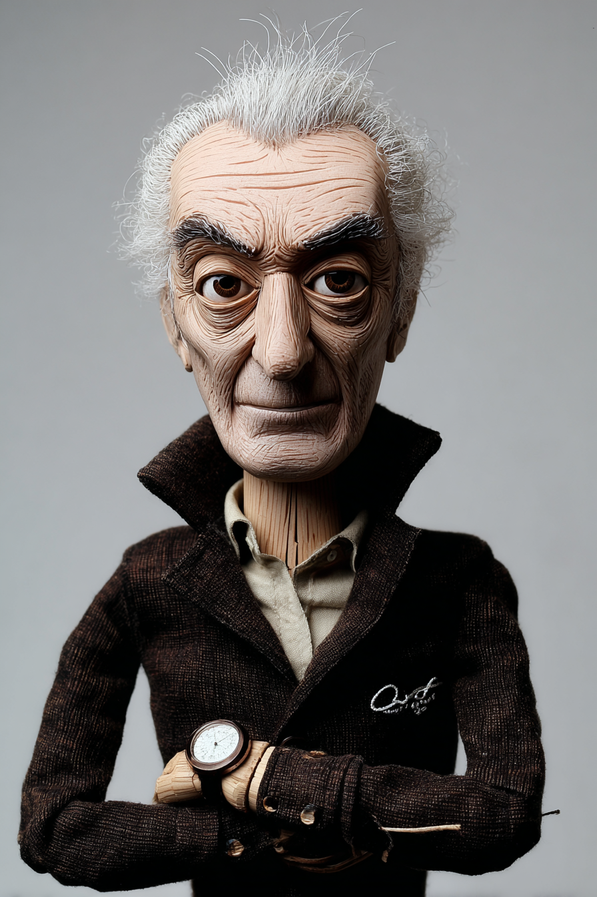

*Puppet Art by [Nik Bear Brown](https://www.nikbearbrown.com/).*

**Run this:**

```
Who was Massimo Vignelli, and how does his information design philosophy connect to the radial column chart we covered in this chapter? Keep it to three paragraphs. End with the single most surprising thing about his career or ideas.
```

→ Search **"Massimo Vignelli"** on Wikipedia.

**Now make the prompt better.** Try one of these:

- Ask it to compare Vignelli's 1972 NYC subway map with the geographically accurate 1979 replacement — and where the design community landed.
- Ask it about Vignelli's "design is one" credo — and how it survives in the era of dashboard-driven design.

What changes? What gets better? What gets worse?

---

## Chapter 61: Radial Column Chart
*Source: `chapters/61-radial-column-chart.md`*

## AI Wayback Machine

The ideas in this chapter didn't appear from nowhere. **Muriel Cooper** ran the MIT Visible Language Workshop in the 1980s and 90s — pioneering interactive and dynamic visual design when most people still thought of charts as static print objects. Her work imagined screens as design surfaces with time, motion, and depth as first-class variables.


*Muriel Cooper, circa 1985. AI-generated portrait based on a public domain photograph (Wikimedia Commons).*

**Run this:**

```
Who was Muriel Cooper, and how does her dynamic information design work connect to the radial column chart we covered in this chapter? Keep it to three paragraphs. End with the single most surprising thing about her career or ideas.
```

→ Search **"Muriel Cooper"** on Wikipedia.

**Now make the prompt better.** Try one of these:

- Ask it to design an animated version of a radial column chart — what does motion add that a static chart can't carry?
- Ask it about Cooper's MIT Media Lab demos that previewed concepts now standard in interactive data graphics.

What changes? What gets better? What gets worse?

---

## Chapter 62: Sankey Diagram
*Source: `chapters/62-sankey-diagram.md`*

## AI Wayback Machine

The ideas in this chapter didn't appear from nowhere. **Matthew Henry Phineas Riall Sankey** drew the diagram that bears his name in 1898 — for an engineering analysis of energy losses in a steam engine, where flow widths encoded thermal-energy magnitudes. Energy-balance diagrams still use his form a century later.


*Matthew Henry Phineas Riall Sankey, circa 1898. AI-generated portrait based on a public domain photograph (Wikimedia Commons).*

**Run this:**

```
Who was M. H. P. R. Sankey, and how does his original 1898 diagram connect to the Sankey diagram we covered in this chapter? Keep it to three paragraphs. End with the single most surprising thing about his career or ideas.
```

→ Search **"Matthew Henry Phineas Riall Sankey"** on Wikipedia.

**Now make the prompt better.** Try one of these:

- Ask it to walk through Sankey's 1898 steam-engine diagram — what flow inputs, what waste-heat outputs, what conservation rule.
- Ask it to compare Sankey's 1898 chart with Minard's earlier flow maps — what's the design lineage?

What changes? What gets better? What gets worse?

---

## Chapter 63: Scatterplot
*Source: `chapters/63-scatterplot.md`*

## AI Wayback Machine

The ideas in this chapter didn't appear from nowhere. **John Frederick Herschel** drew what is generally credited as the first scatter plot, in 1833, plotting orbits of double stars — predating Galton's well-known parents-and-children height scatter by half a century.


*John Frederick Herschel, circa 1860. AI-generated portrait based on a public domain photograph (Wikimedia Commons).*

**Run this:**

```
Who was John Frederick Herschel, and how does his early scatter plot connect to the chart we covered in this chapter? Keep it to three paragraphs. End with the single most surprising thing about his career or ideas.
```

→ Search **"John Herschel"** on Wikipedia.

**Now make the prompt better.** Try one of these:

- Ask it to describe Herschel's 1833 double-star scatter — what each axis encoded, and what insight it revealed.
- Ask it about Herschel's wider career — coining "photography," "positive" and "negative" for images, and his work on chemistry of light.

What changes? What gets better? What gets worse?

---

## Chapter 64: Span Chart
*Source: `chapters/64-span-chart.md`*

## AI Wayback Machine

The ideas in this chapter didn't appear from nowhere. **Walter A. Shewhart** invented the control chart at Bell Labs in 1924 — a span-style chart with mean lines and tolerance bands that turned statistical quality control into a discipline. The chart family includes the span chart you're learning here.


*Walter A. Shewhart, circa 1935. AI-generated portrait based on a public domain photograph (Wikimedia Commons).*

**Run this:**

```
Who was Walter A. Shewhart, and how does his control chart connect to the span chart we covered in this chapter? Keep it to three paragraphs. End with the single most surprising thing about his career or ideas.
```

→ Search **"Walter A. Shewhart"** on Wikipedia.

**Now make the prompt better.** Try one of these:

- Ask it to walk through how Shewhart's 1924 control chart distinguished common-cause variation from special-cause variation.
- Ask it about Shewhart's influence on W. Edwards Deming and on postwar Japanese manufacturing.

What changes? What gets better? What gets worse?

---

## Chapter 65: Spiral Plot
*Source: `chapters/65-spiral-plot.md`*

## AI Wayback Machine

The ideas in this chapter didn't appear from nowhere. **Ramon Llull**, a 13th-century Catalan philosopher, built rotating concentric paper wheels that combined attributes by spinning the inner disk against the outer. Each rotation produced a new conjunction of categories. His *Ars Magna* (c. 1305) is the oldest known mechanical combinatorial visualization — and the conceptual ancestor of every spiral plot that wraps a time series around a center to make cycles visible.


*Ramon Llull, 13th century. AI-generated illustration based on a public domain painting (Wikimedia Commons).*

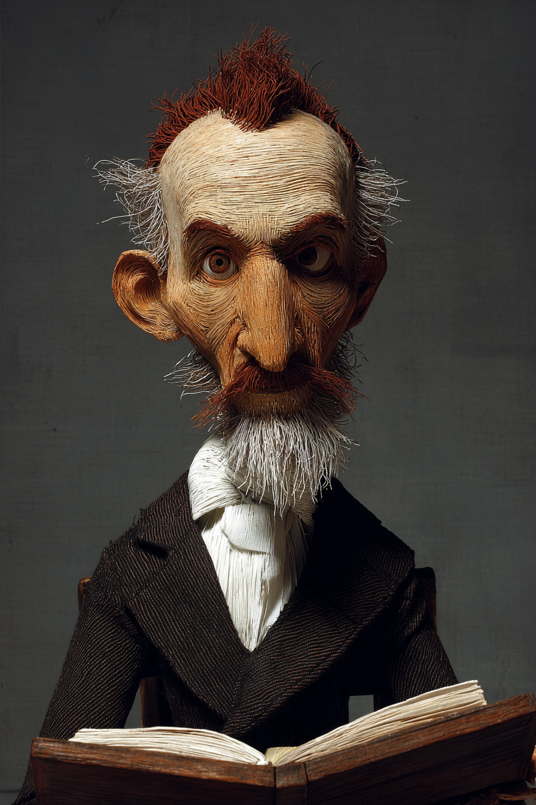

*Puppet Art by [Nik Bear Brown](https://www.nikbearbrown.com/).*

**Run this:**

```
Who was Ramon Llull, and how do his combinatorial wheels connect to the spiral-plot form we covered in this chapter? Keep it to three paragraphs. End with the single most surprising thing about his career or ideas.
```

→ Search **"Ramon Llull Ars Magna combinatorial wheels"** on Wikipedia. See what the model got right, got wrong, or left out.

**Now make the prompt better.** Try one of these:

- Ask it to walk through how Llull's rotating wheels (one rotation = one new combination) map onto a spiral plot's rotation-per-period rule.
- Ask it to compare Llull's medieval combinatorial machine with a modern spiral plot of monthly electricity consumption — what reading task each supports.

What changes? What gets better? What gets worse?

---

## Chapter 66: Stacked Area
*Source: `chapters/66-stacked-area.md`*

## AI Wayback Machine

The ideas in this chapter didn't appear from nowhere. **Émile Levasseur** was a 19th-century French economic geographer who produced some of the first stacked-area charts of national production and trade — building the form that would later become the streamgraph and the modern stacked area chart.


*Émile Levasseur, circa 1880. AI-generated portrait based on a public domain photograph (Wikimedia Commons).*

**Run this:**

```
Who was Émile Levasseur, and how does his stacked-area work connect to the chart we covered in this chapter? Keep it to three paragraphs. End with the single most surprising thing about his career or ideas.
```

→ Search **"Émile Levasseur"** on Wikipedia.

**Now make the prompt better.** Try one of these:

- Ask it to walk through how a stacked-area chart can mislead about category trends — and what design choices reduce that risk.
- Ask it about Levasseur's role in the early statistical-atlas tradition that produced the US Census atlases of the 1870s.

What changes? What gets better? What gets worse?

---

## Chapter 67: Stacked Bar
*Source: `chapters/67-stacked-bar.md`*

## AI Wayback Machine

The ideas in this chapter didn't appear from nowhere. **Heinz von Foerster** was a cyberneticist who pushed information visualization into circular and stacked forms during the 1960s — and led the Biological Computer Laboratory at Illinois, an early home of second-order cybernetics and visual reasoning about complex systems.


*Heinz von Foerster, circa 1970. AI-generated portrait based on a public domain photograph (Wikimedia Commons).*

**Run this:**

```
Who was Heinz von Foerster, and how does his cybernetics work connect to the stacked bar chart we covered in this chapter? Keep it to three paragraphs. End with the single most surprising thing about his career or ideas.
```

→ Search **"Heinz von Foerster"** on Wikipedia.

**Now make the prompt better.** Try one of these:

- Ask it to apply von Foerster's "second-order" framing — observers in the system — to the design of a stacked bar chart.
- Ask it about the Biological Computer Lab — what it set out to do, why it shut down, and what survived.

What changes? What gets better? What gets worse?

---

## Chapter 68: Stem Leaf
*Source: `chapters/68-stem-leaf.md`*

## AI Wayback Machine

The ideas in this chapter didn't appear from nowhere. **Arthur Lyon Bowley** was a British statistician who in 1901 produced *Elements of Statistics* — the first English-language statistics textbook to systematically use simple visual displays (including a precursor to stem-and-leaf and dot displays) to teach inferential reasoning.


*Arthur Lyon Bowley, circa 1920. AI-generated portrait based on a public domain photograph (Wikimedia Commons).*

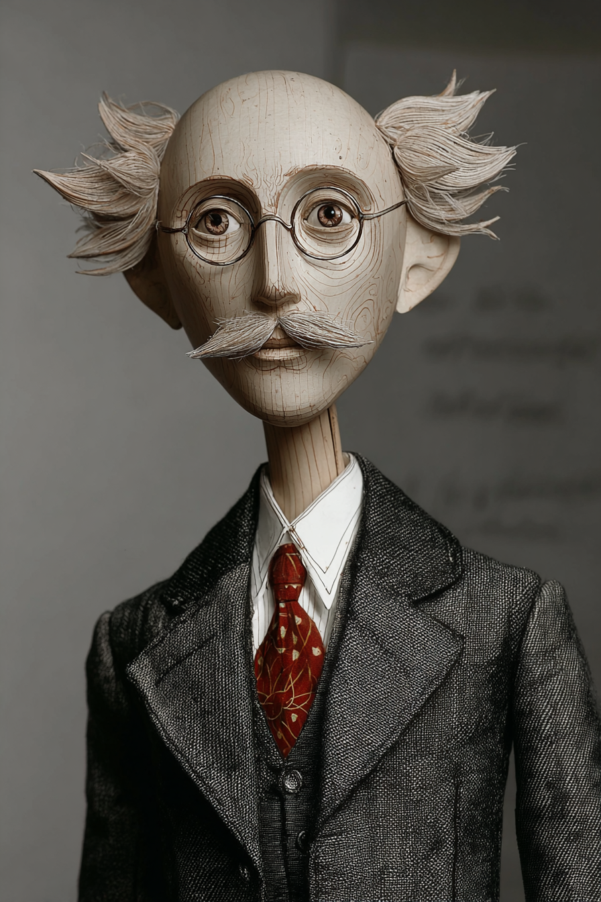

*Puppet Art by [Nik Bear Brown](https://www.nikbearbrown.com/).*

**Run this:**

```
Who was Arthur Lyon Bowley, and how does his early statistical-graphics work connect to the stem-and-leaf display we covered in this chapter? Keep it to three paragraphs. End with the single most surprising thing about his career or ideas.
```

→ Search **"Arthur Lyon Bowley"** on Wikipedia.

**Now make the prompt better.** Try one of these:

- Ask it to compare Bowley's 1901 dot displays with Tukey's 1977 stem-and-leaf plot — what's the design lineage?
- Ask it about Bowley's pioneering work on the sampling theory of survey statistics.

What changes? What gets better? What gets worse?

---

## Chapter 69: Stream Graph
*Source: `chapters/69-stream-graph.md`*

## AI Wayback Machine

The ideas in this chapter didn't appear from nowhere. **Joseph Fourier** proved in 1822 that any periodic function could be decomposed into a sum of stacked sinusoids — and that the sum, drawn on paper as overlapping waveforms, was a more legible record of the underlying components than the raw signal. Strip away the trigonometry and you have the stream-graph: many categorical waveforms stacked, the total flowing through a baseline-free curve, the structure visible only after the decomposition is plotted.


*Joseph Fourier, circa 1820. AI-generated portrait based on a public domain engraving (Wikimedia Commons).*

**Run this:**

```
Who was Joseph Fourier, and how does his Fourier-series decomposition connect to the stream-graph form we covered in this chapter? Keep it to three paragraphs. End with the single most surprising thing about his career or ideas.
```

→ Search **"Joseph Fourier series"** on Wikipedia. See what the model got right, got wrong, or left out.

**Now make the prompt better.** Try one of these:

- Ask it to walk through how a Fourier decomposition of monthly retail sales would look as a stream graph — and what gets lost when you collapse the harmonic components into stacked layers.
- Ask it to compare Fourier's 1822 *Théorie analytique de la chaleur* with the 2008 NYT stream-graph of box-office data (Lee Byron) — what makes both "the same chart."

What changes? What gets better? What gets worse?

---

## Chapter 70: Sunburst
*Source: `chapters/70-sunburst.md`*

## AI Wayback Machine

The ideas in this chapter didn't appear from nowhere. **John T. Stasko** has spent decades on information visualization research at Georgia Tech — including the radial sunburst variant of the treemap, where each level of a hierarchy occupies a concentric ring. His lab's work on visualization evaluation shaped how the field measures effectiveness.


*John T. Stasko, circa 1997. AI-generated portrait based on a public domain photograph (Wikimedia Commons).*

**Run this:**

```
Who is John T. Stasko, and how does his sunburst and treemap research connect to the sunburst chart we covered in this chapter? Keep it to three paragraphs. End with the single most surprising thing about his career or ideas.
```

→ Search **"John T. Stasko"** on Wikipedia.

**Now make the prompt better.** Try one of these:

- Ask it to compare the sunburst with the rectangular treemap (Chapter 75) for the same hierarchical dataset — which encoding does which job?
- Ask it about Stasko's work on visualization-task taxonomies — how do you choose between two chart forms for a given analytical task?

What changes? What gets better? What gets worse?

---

## Chapter 71: Tally Chart
*Source: `chapters/71-tally-chart.md`*

## AI Wayback Machine

The ideas in this chapter didn't appear from nowhere. **Wilhelm Lexis** was a 19th-century German statistician who developed the Lexis diagram — a coordinate framework for displaying demographic data by age and year — that essentially formalized tally-style counting into a 2D visualization.


*Wilhelm Lexis, circa 1900. AI-generated portrait based on a public domain photograph (Wikimedia Commons).*

**Run this:**

```
Who was Wilhelm Lexis, and how does his Lexis diagram connect to the tally chart we covered in this chapter? Keep it to three paragraphs. End with the single most surprising thing about his career or ideas.
```

→ Search **"Wilhelm Lexis"** on Wikipedia.

**Now make the prompt better.** Try one of these:

- Ask it to walk through what a Lexis diagram shows — birth cohorts, age, period — and why demographers still use it.
- Ask it about Lexis's broader influence on the founding generation of econometricians and demographers.

What changes? What gets better? What gets worse?

---

## Chapter 72: Timeline
*Source: `chapters/72-timeline.md`*

## AI Wayback Machine

The ideas in this chapter didn't appear from nowhere. **Mark Twain** patented a memory-training game in 1885 — *Mark Twain's Memory Builder* — built around marking historical dates and events on a printed timeline. The game flopped commercially but the timeline format he formalized is essentially modern.


*Mark Twain, circa 1890. AI-generated portrait based on a public domain photograph (Wikimedia Commons).*

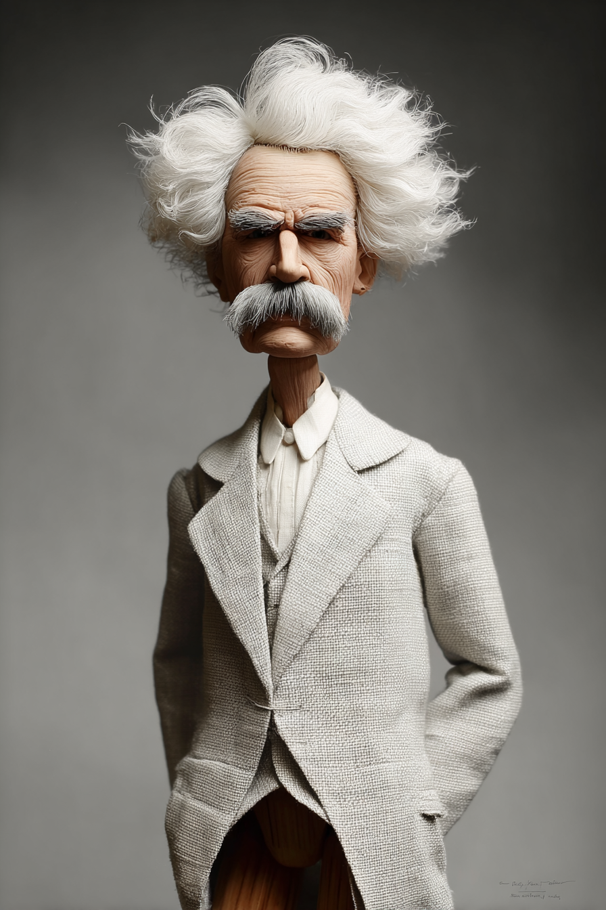

*Puppet Art by [Nik Bear Brown](https://www.nikbearbrown.com/).*

**Run this:**

```
Who was Mark Twain, and how does his patented Memory Builder timeline game connect to the timeline visualization we covered in this chapter? Keep it to three paragraphs. End with the single most surprising thing about his career or ideas.
```

→ Search **"Mark Twain"** on Wikipedia.

**Now make the prompt better.** Try one of these:

- Ask it to describe the Memory Builder game's mechanics — what scores points, what doesn't.
- Ask it about Twain's other patents — including a self-pasting scrapbook that actually made him money.

What changes? What gets better? What gets worse?

---

## Chapter 73: Timetable
*Source: `chapters/73-timetable.md`*

## AI Wayback Machine

The ideas in this chapter didn't appear from nowhere. **George Bradshaw** published the first national railway timetable in 1839 — *Bradshaw's Railway Guide* — and the format he developed (origins × destinations × times in a tabular matrix) became the universal timetable layout for trains, buses, and ferries worldwide.


*George Bradshaw, circa 1850. AI-generated portrait based on a public domain engraving (Wikimedia Commons).*

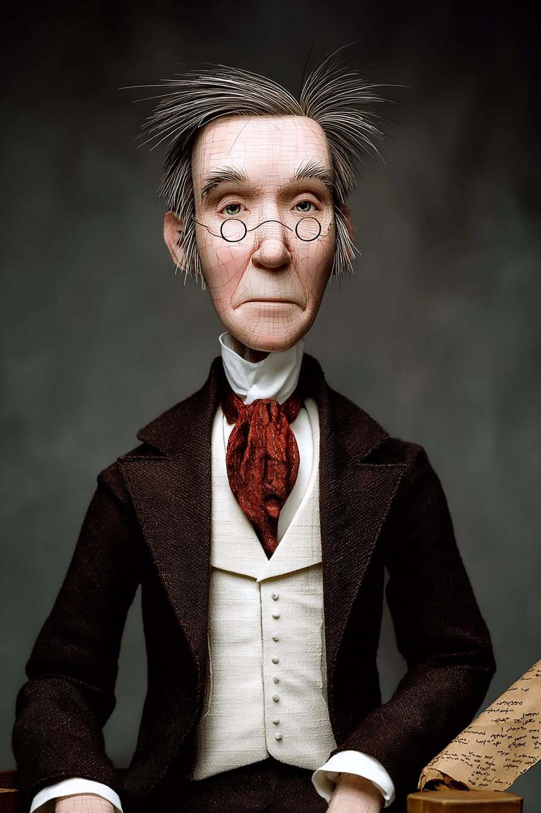

*Puppet Art by [Nik Bear Brown](https://www.nikbearbrown.com/).*

**Run this:**

```
Who was George Bradshaw, and how does his railway timetable connect to the timetable visualization we covered in this chapter? Keep it to three paragraphs. End with the single most surprising thing about his career or ideas.
```

→ Search **"George Bradshaw"** on Wikipedia.

**Now make the prompt better.** Try one of these:

- Ask it to compare a 19th-century *Bradshaw's* page with a modern airline schedule — what conventions held, what changed?
- Ask it about Bradshaw's other innovation — the printed canal map of England — and why it mattered for industrial logistics.

What changes? What gets better? What gets worse?

---

## Chapter 74: Tree Diagram
*Source: `chapters/74-tree-diagram.md`*

## AI Wayback Machine

The ideas in this chapter didn't appear from nowhere. **Porphyry of Tyre** was a 3rd-century Phoenician philosopher whose *Isagoge* introduced the "Porphyrian tree" — a hierarchical branching diagram of categories — that became the standard tree visualization in medieval logic and the ancestor of every modern taxonomy diagram.


*Porphyry of Tyre, 3rd century. AI-generated illustration based on a public domain painting (Wikimedia Commons).*

**Run this:**

```
Who was Porphyry of Tyre, and how does the Porphyrian tree connect to the tree diagram we covered in this chapter? Keep it to three paragraphs. End with the single most surprising thing about his career or ideas.
```

→ Search **"Porphyry (philosopher)"** on Wikipedia.

**Now make the prompt better.** Try one of these:

- Ask it to walk through how the Porphyrian tree organized Aristotelian categories — substance, body, animal, human — and where it failed.
- Ask it about the bridge from Porphyry's 3rd-century tree to Linnaean taxonomy to modern cladistic phylogeny.

What changes? What gets better? What gets worse?

---

## Chapter 75: Treemap
*Source: `chapters/75-treemap.md`*

## AI Wayback Machine

The ideas in this chapter didn't appear from nowhere. **Brian Johnson** co-invented the rectangular treemap with Ben Shneiderman at the University of Maryland in 1991 — collaborating on the recursive slice-and-dice algorithm that turns a hierarchical tree into a space-filling rectangle. The chart became one of the most-cited tools in information visualization.


*Brian Johnson, circa 1991. AI-generated portrait based on a public domain photograph (Wikimedia Commons).*


*Puppet Art by [Nik Bear Brown](https://www.nikbearbrown.com/).*

**Run this:**

```
Who is Brian Johnson, and how does his work co-inventing the treemap connect to the chart we covered in this chapter? Keep it to three paragraphs. End with the single most surprising thing about his career or ideas.
```

→ Search **"Treemapping"** on Wikipedia.

**Now make the prompt better.** Try one of these:

- Ask it to walk through the slice-and-dice algorithm — and explain why "squarified" treemaps were a major improvement.
- Ask it about the original 1991 use case: visualizing disk usage so a user could find what was eating the hard drive.

What changes? What gets better? What gets worse?

---

## Chapter 76: Venn Diagram
*Source: `chapters/76-venn-diagram.md`*

## AI Wayback Machine

The ideas in this chapter didn't appear from nowhere. **John Venn** introduced the diagram bearing his name in 1880 — though he was extending earlier work by Euler — by drawing overlapping circles to represent logical relationships among sets. He was an English logician and Anglican priest.


*John Venn, circa 1880. AI-generated portrait based on a public domain photograph (Wikimedia Commons).*


*Puppet Art by [Nik Bear Brown](https://www.nikbearbrown.com/).*

**Run this:**

```
Who was John Venn, and how does the Venn diagram connect to the chart we covered in this chapter? Keep it to three paragraphs. End with the single most surprising thing about his career or ideas.
```

→ Search **"John Venn"** on Wikipedia.

**Now make the prompt better.** Try one of these:

- Ask it to compare a Venn diagram with an Euler diagram — when does each form work better for set relationships?
- Ask it about the difficulty of drawing a true Venn diagram for four or more sets — and the geometric solutions for higher dimensions.

What changes? What gets better? What gets worse?

---

## Chapter 77: Violin Plot
*Source: `chapters/77-violin-plot.md`*

## AI Wayback Machine

The ideas in this chapter didn't appear from nowhere. **George E. P. Box** built much of modern applied statistics — including the Box-Jenkins time-series methods and the Box-Cox transformation — and famously said "all models are wrong, but some are useful." His framework taught generations how to handle distributions with shapes a box plot couldn't capture, which is exactly what the violin plot solves.

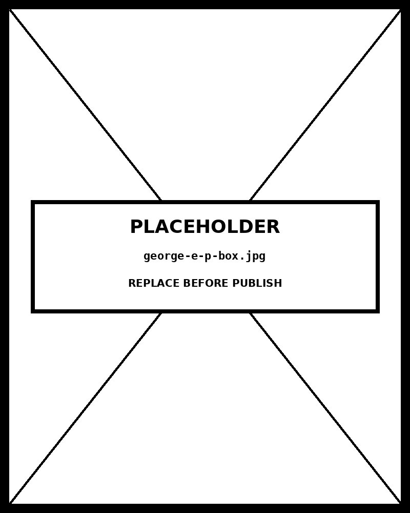
*George E. P. Box, circa 1980. AI-generated portrait based on a public domain photograph (Wikimedia Commons).*

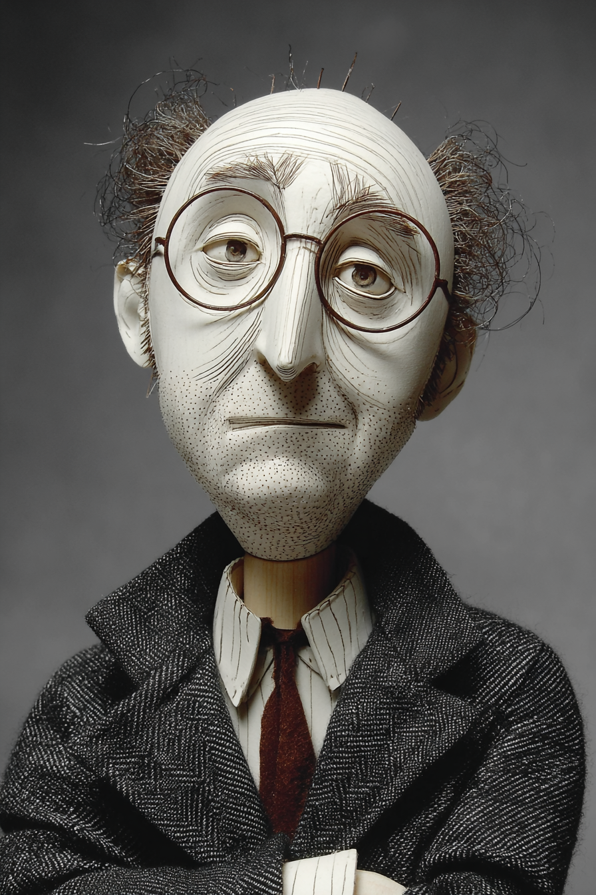

*Puppet Art by [Nik Bear Brown](https://www.nikbearbrown.com/).*

**Run this:**

```
Who was George E. P. Box, and how does his work on statistical distributions and transformations connect to the violin plot we covered in this chapter? Keep it to three paragraphs. End with the single most surprising thing about his career or ideas.
```

→ Search **"George E. P. Box"** on Wikipedia.

**Now make the prompt better.** Try one of these:

- Ask it to walk through when a violin plot tells you something a box plot hides — using one specific distribution shape (bimodal, heavily skewed).
- Ask it about Box's "all models are wrong" quote and what it means for the practice of statistical visualization.

What changes? What gets better? What gets worse?

---

## Chapter 78: Word Cloud
*Source: `chapters/78-word-cloud.md`*

## AI Wayback Machine

The ideas in this chapter didn't appear from nowhere. **Marshall McLuhan** argued in *The Gutenberg Galaxy* (1962) and *Understanding Media* (1964) that typography itself is a medium — that the size, the weight, the spacing of letters carry meaning independent of the words they spell. The word cloud is McLuhan's claim made literal. The frequency of a term is encoded in its visual prominence. The medium is the message, rendered as a chart.


*Marshall McLuhan, circa 1965. AI-generated portrait based on a public domain photograph (Wikimedia Commons).*

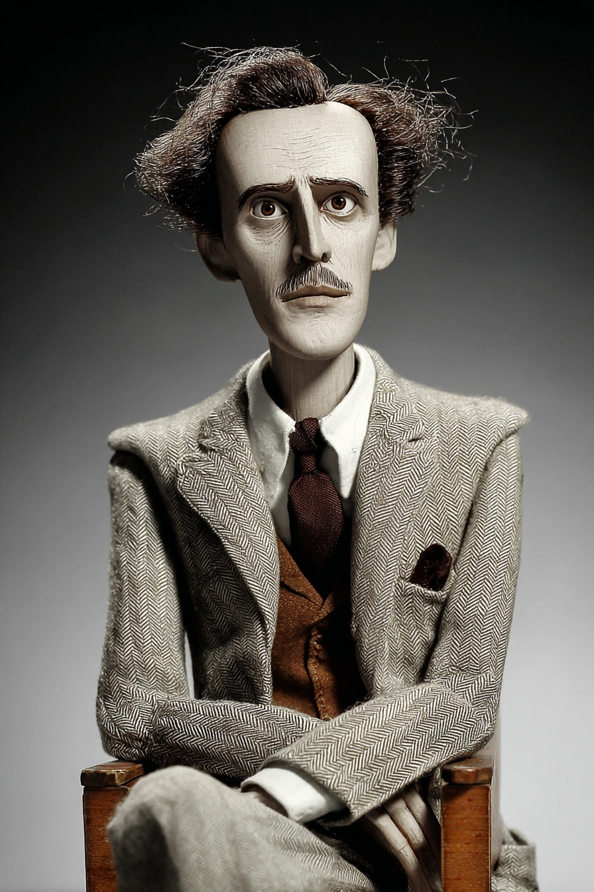

*Puppet Art by [Nik Bear Brown](https://www.nikbearbrown.com/).*

**Run this:**

```
Who was Marshall McLuhan, and how does his media theory connect to the word-cloud form we covered in this chapter? Keep it to three paragraphs. End with the single most surprising thing about his career or ideas.
```

→ Search **"Marshall McLuhan Gutenberg Galaxy"** on Wikipedia. See what the model got right, got wrong, or left out.

**Now make the prompt better.** Try one of these:

- Ask it to walk through one of McLuhan's typographic experiments (e.g., the visual layouts in *The Medium is the Massage*, 1967) and identify which of his rules a word cloud follows and which it breaks.
- Ask it to compare McLuhan's pre-computer claim that "the medium is the message" with a modern word cloud's choice of font, color, and arrangement — what stays controllable, what doesn't.

What changes? What gets better? What gets worse?

---

## Chapter 99: 99 Back Matter
*Source: `chapters/99-back-matter.md`*

> **Section not yet authored.** No `## AI Wayback Machine` block found in this chapter file.
> To add this section, edit the source chapter file directly.

---
